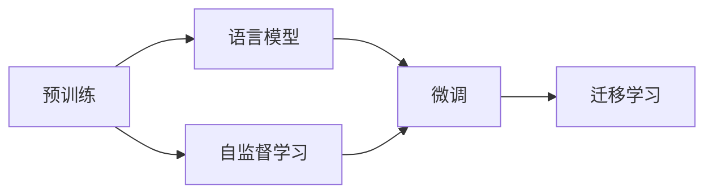

# 大规模语言模型从理论到实践 大语言模型预训练数据

## 1. 背景介绍
近年来,随着深度学习技术的快速发展,自然语言处理(NLP)领域取得了长足的进步。其中,大规模语言模型(Large Language Model,LLM)的出现,更是掀起了 NLP 领域的一场革命。LLM 通过在海量文本数据上进行无监督预训练,可以学习到丰富的语言知识和通用语言表示,进而在下游 NLP 任务上取得优异表现。

### 1.1 大规模语言模型的兴起
2018年,Google 发布了 BERT(Bidirectional Encoder Representations from Transformers)模型,该模型在多个 NLP 任务上取得了 SOTA 的结果,展现了预训练语言模型的强大能力。此后,各大科技公司和研究机构纷纷投入大规模语言模型的研究,推出了一系列里程碑式的模型,如 OpenAI 的 GPT 系列、Google 的 T5、Microsoft 的 Megatron-Turing NLG 等。这些模型参数量动辄上百亿甚至上千亿,展现了 LLM 的巨大潜力。

### 1.2 预训练数据的重要性
LLM 的成功很大程度上归功于其所使用的大规模高质量预训练数据。预训练数据不仅决定了模型学习到的语言知识的广度和深度,也影响着模型在下游任务上的泛化能力。因此,构建高质量的预训练数据集成为 LLM 研究的关键。

### 1.3 本文的主要内容
本文将围绕大规模语言模型预训练数据这一主题展开讨论。首先介绍 LLM 预训练的核心概念和原理,然后重点阐述构建预训练数据集需要考虑的各种因素,包括数据来源、数据清洗、数据格式等。接着通过实践案例演示如何构建 LLM 预训练数据集。最后总结 LLM 预训练数据的发展趋势与挑战,为相关研究提供参考。

## 2. 核心概念与联系
在深入探讨 LLM 预训练数据之前,我们有必要先了解一些相关的核心概念。

### 2.1 预训练(Pre-training)
预训练是指在大规模无标注数据上对模型进行训练的过程。与传统的有监督学习不同,预训练不需要人工标注的数据,而是让模型从海量文本中自主学习语言知识。预训练一般采用自监督学习的范式,即通过定义恰当的预训练任务,让模型在完成这些任务的过程中习得通用语言表示。

### 2.2 语言模型(Language Model)
语言模型是一种根据上下文预测下一个词的概率模型。给定一个词序列 $w_1, w_2, ..., w_n$,语言模型的目标是估计条件概率 $P(w_n|w_1, w_2, ..., w_{n-1})$。传统的语言模型如 N-gram、RNN 等,而 LLM 则基于 Transformer 架构,具有更强大的建模能力。

### 2.3 自监督学习(Self-supervised Learning)  
自监督学习是一种不需要人工标注数据的学习范式。其核心思想是从输入数据中自动构建监督信号,从而实现模型的自我训练。在 NLP 中,常见的自监督学习任务包括语言模型、掩码语言模型、次句预测、文本纠错等。通过这些任务,模型可以学习到语言的内在规律和表示。

### 2.4 微调(Fine-tuning)
微调是指在预训练模型的基础上,使用少量标注数据对模型进行进一步训练,以适应特定的下游任务。微调一般只需要较少的计算资源和训练时间,即可在目标任务上取得不错的效果。这体现了预训练模型的迁移学习能力。

### 2.5 迁移学习(Transfer Learning)
迁移学习是指将在源任务上学习到的知识迁移到目标任务,从而提升目标任务的性能。LLM 的预训练-微调范式就是典型的迁移学习应用。预训练阶段模型学习到的通用语言知识,可以迁移到各种下游 NLP 任务,产生良好的迁移效果。

### 2.6 各概念之间的联系
下图展示了预训练、语言模型、自监督学习、微调、迁移学习这些概念之间的关系:

预训练利用自监督学习和语言模型等任务,在大规模无标注数据上训练出通用的语言表示。这些语言表示可以进一步用于下游任务的微调,最终实现知识的迁移学习。可以看出,这些概念环环相扣,共同构成了 LLM 的核心范式。

## 3. 核心算法原理具体操作步骤
LLM 的预训练涉及多个核心算法和步骤,下面我们对其进行详细阐述。

### 3.1 数据预处理
数据预处理是构建预训练语料库的第一步,主要包括以下几个步骤:

1. 数据清洗:去除语料中的噪声,如 HTML 标签、特殊字符、重复内容等。 
2. 文本规范化:将文本转换为统一的格式,如全半角转换、大小写统一、标点规范化等。
3. 文本分词:将文本切分为基本的语言单元,如单词、子词、字符等。常用的分词工具有 NLTK、Stanford CoreNLP、Jieba等。
4. 文本编码:将分词后的文本转换为数字化的向量表示,常用的编码方式有 One-hot、Word2vec、GloVe 等。

### 3.2 数据增强
为了提高模型的鲁棒性和泛化能力,我们可以对预训练语料进行数据增强。常见的数据增强技术包括:

1. 回译(Back Translation):将文本翻译到另一种语言,再翻译回原语言,可以生成语义相近但表达不同的文本。
2. 同义词替换(Synonym Replacement):使用同义词替换文本中的部分词汇,可以增加语言表达的多样性。
3. 随机插入(Random Insertion):在文本中随机插入一些词汇,可以增加文本的长度和复杂度。
4. 随机交换(Random Swap):随机交换文本中的部分词汇的位置,可以打乱语序,增加语言理解的难度。

### 3.3 预训练任务设计
预训练任务的设计直接影响模型学习到的语言知识的质量。常见的预训练任务包括:

1. 语言模型:预测下一个词。给定前 $n-1$ 个词 $w_1, w_2, ..., w_{n-1}$,预测第 $n$ 个词 $w_n$。目标是最大化条件概率 $P(w_n|w_1, w_2, ..., w_{n-1})$。
2. 掩码语言模型(Masked Language Model,MLM):随机掩盖文本中的部分词汇,预测被掩盖的词。这可以帮助模型学习上下文信息和词汇之间的关系。BERT 采用的就是这种预训练任务。
3. 置换语言模型(Permuted Language Model,PLM):随机打乱文本中词汇的顺序,预测原始的词序。这可以帮助模型学习语言的顺序特性。XLNet 采用的就是这种预训练任务。
4. 次句预测(Next Sentence Prediction,NSP):判断两个句子在原文中是否相邻。这可以帮助模型学习语篇连贯性和长距离依赖关系。BERT 同时使用了 MLM 和 NSP 两种预训练任务。

### 3.4 模型训练
确定预训练任务后,就可以开始模型训练了。LLM 一般采用 Transformer 的 Encoder 结构,如 BERT。训练的具体步骤如下:

1. 输入表示:将文本输入转换为向量表示,包括词嵌入(Word Embedding)和位置嵌入(Position Embedding)。
2. 多头自注意力(Multi-head Self-attention):通过自注意力机制,计算文本不同位置之间的相关性,捕捉长距离依赖关系。
3. 前馈神经网络(Feed-forward Neural Network):对自注意力的输出进行非线性变换,增加模型的表达能力。 
4. Layer Normalization 和残差连接(Residual Connection):对每一层的输出进行归一化和残差连接,有助于模型的优化和收敛。
5. 输出层:根据预训练任务的不同,设计相应的输出层。如 MLM 任务需要输出每个位置的词表概率分布。

模型训练采用大规模分布式训练的方式,利用多个 GPU 或 TPU 并行计算。优化算法一般采用 AdamW,并使用学习率预热(Learning Rate Warmup)和线性衰减(Linear Decay)的策略。

## 4. 数学模型和公式详细讲解举例说明
LLM 的预训练涉及多个数学模型和公式,下面我们对其进行详细讲解并给出示例。

### 4.1 语言模型
语言模型的目标是估计一个句子 $W=(w_1, w_2, ..., w_n)$ 的概率 $P(W)$。根据链式法则,可以将联合概率分解为一系列条件概率的乘积:

$$
P(W) = P(w_1, w_2, ..., w_n) = P(w_1)P(w_2|w_1)P(w_3|w_1,w_2)...P(w_n|w_1,w_2,...,w_{n-1})
$$

其中,$P(w_i|w_1,w_2,...,w_{i-1})$ 表示在给定前 $i-1$ 个词的条件下,第 $i$ 个词为 $w_i$ 的条件概率。

以 "I love natural language processing" 这个句子为例,其概率可以分解为:

$$
\begin{aligned}
P(W) &= P(\text{I})P(\text{love}|\text{I})P(\text{natural}|\text{I love})P(\text{language}|\text{I love natural}) \\
&P(\text{processing}|\text{I love natural language})
\end{aligned}
$$

语言模型的任务就是估计这些条件概率。传统的 N-gram 语言模型通过统计词频来估计,而神经语言模型则使用神经网络来建模。

### 4.2 Transformer 的自注意力机制
Transformer 的核心是自注意力机制,它可以计算文本不同位置之间的相关性。假设输入文本的向量表示为 $X=(x_1, x_2, ..., x_n)$,自注意力的计算过程如下:

1. 计算查询矩阵 $Q$、键矩阵 $K$ 和值矩阵 $V$:

$$
Q = XW_Q, K = XW_K, V = XW_V
$$

其中,$W_Q, W_K, W_V$ 是可学习的参数矩阵。

2. 计算注意力分数矩阵 $A$:

$$
A = \text{softmax}(\frac{QK^T}{\sqrt{d_k}})
$$

其中,$d_k$ 是 $K$ 的维度,用于缩放点积结果。softmax 函数用于归一化注意力分数。

3. 计算自注意力输出 $Z$:

$$
Z = AV
$$

直观地说,自注意力机制通过查询矩阵 $Q$ 和键矩阵 $K$ 的相似度来计算注意力分数,然后用注意力分数对值矩阵 $V$ 进行加权求和,得到最终的输出表示。

以 "I love natural language processing" 为例,假设每个词的向量维度为4,则 $X$ 为 $5\times4$ 的矩阵。经过自注意力计算后,可以得到一个新的 $5\times4$ 的矩阵 $Z$,其中每一行都融合了其他位置的信息。

### 4.3 掩码语言模型
掩码语言模型的目标是预测被掩盖的词。假设文本中的第 $i$ 个词 $w_i$ 被掩盖,用特殊符号 [MASK] 表示,则 MLM 的任务是最大化如下条件概率:

$$
P(w_i|w_1, ..., w_{i-1}, \text{[MASK]}, w_{i+1}, ..., w_n)
$$

以 "I love natural [MASK] processing" 为例,MLM 需