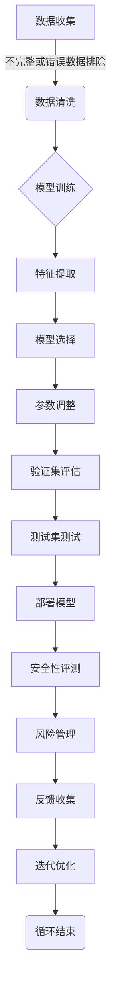

## 1.背景介绍

随着人工智能技术的不断发展，大型语言模型（Large Language Models, 简称LLMs）已经成为自然语言处理领域的热点。它们能够生成、理解和回应人类语言，并在多个行业中展现出巨大的应用潜力。然而，这些强大的模型也带来了安全性问题，包括隐私泄露、误导性信息的传播以及恶意使用等。因此，对大型语言模型进行安全性评测变得至关重要。

## 2.核心概念与联系

在深入探讨之前，我们需要明确几个核心概念：

- **大型语言模型（LLM）**：是一种基于大量文本数据训练的机器学习模型，能够预测给定上下文中的下一个词或句子。
- **安全性评测**：是对系统进行的一系列测试和分析，以识别并缓解潜在的安全风险。

大型语言模型的安全性和隐私性直接关系到用户数据的保护以及模型的负责任使用。因此，安全性评测不仅包括技术层面的评估，还涉及伦理和社会层面。

## 3.核心算法原理具体操作步骤

### Mermaid 流程图


## 4.数学模型和公式详细讲解举例说明

在大型语言模型的训练过程中，最常用的算法之一是Transformer架构。它通过自注意力（Self-Attention）机制来捕捉输入序列中的重要信息，并通过多层堆叠的编码器和解码器来逐步传递这些信息。以下是一个简化的Transformer模型中自注意力机制的数学表达式：

$$
\\text{Attention}(Q, K, V) = \\text{softmax}(\\frac{QK^T}{\\sqrt{d_k}})V
$$

其中，$Q$、$K$和$V$分别代表查询（Query）、键（Key）和值（Value）矩阵，$d_k$是键向量的维数。这个公式计算了每个查询向量与所有键向量之间的相似度，并通过这些相似度加权平均得到最终的注意力输出。

## 5.项目实践：代码实例和详细解释说明

以下是一个简化的Python示例，展示了如何使用PyTorch框架实现一个简单的自注意力机制：

```python
import torch
import torch.nn as nn

class Attention(nn.Module):
    def __init__(self, embed_size, heads):
        super(Attention, self).__init__()
        self.embed_size = embed_size
        self.heads = heads
        self.head_dim = embed_size // heads

        assert (self.head_dim * heads == self.embed_size), \"Embedding size needs to be divisible by the number of heads\"

        self.values = nn.Linear(self.head_dim, self.head_dim, bias=False)
        self.keys = nn.Linear(self.head_dim, self.head_dim, bias=False)
        self.queries = nn.Linear(self.head_dim, self.head_dim, bias=False)
        self.out = nn.Linear(heads * self.head_dim, embed_size)

    def forward(self, hidden_state):
        # Reshape the hidden state to be [batch_size, len_hidden, heads, head_dim]
        hidden_reshaped = hidden_state.view(-1, self.heads, self.head_dim)

        queries = self.queries(hidden_reshaped).squeeze(2)  # [batch_size, heads, head_dim]
        keys = self.keys(hidden_reshaped).transpose(1, 2)  # [batch_size, heads, head_dim]
        values = self.values(hidden_reshaped)  # [batch_size, heads, head_dim]

        energy = torch.matmul(queries, keys.transpose(-1, -2)) / \\
                  torch.sqrt(torch.tensor(self.head_dim).type_as(queries))

        attention = torch.softmax(energy, dim=-1)  # [batch_size, heads, len_hidden]

        out = self.out(torch.matmul(attention, values))  # [batch_size, heads * head_dim]

        return out
```

## 6.实际应用场景

大型语言模型在多个领域中有着广泛的应用，包括但不限于：

- **自然语言处理**：文本生成、机器翻译、问答系统等。
- **信息检索**：搜索引擎、推荐系统等。
- **教育技术**：自动评分、个性化学习路径推荐等。
- **客户服务**：聊天机器人、虚拟助手等。

在这些应用中，安全性评测尤为重要，以确保数据的安全和模型的负责任使用。

## 7.工具和资源推荐

以下是一些有用的工具和资源，可以帮助进行大型语言模型安全性的研究和实践：

- **Transformers库**：由Hugging Face提供的一个Python库，包含了多种预训练的LLM模型和相关的工具函数。
- **SecureML库**：一个用于实现安全机器学习算法的开源库。
- **Google AI Principles**：谷歌发布的一系列人工智能使用的伦理原则和最佳实践指南。

## 8.总结：未来发展趋势与挑战

随着技术的不断进步，大型语言模型的安全性评测也将面临新的挑战和机遇。未来的发展趋势可能包括：

- **更加严格的法规和标准**：随着数据隐私和安全问题的日益突出，预计将有更多的法律和行业标准来指导LLM的安全性评测。
- **自动化工具的发展**：为了应对复杂性和规模问题，自动化工具将在安全评测中扮演越来越重要的角色。
- **跨学科合作**：安全性评测需要计算机科学、法律、伦理学等多个领域的专家共同参与，以确保全面而深入的评估。

## 9.附录：常见问题与解答

### 常见问题1：如何确保大型语言模型不泄露用户隐私？

**解答**：可以通过以下几个步骤来保护用户隐私：

1. **数据脱敏**：在训练之前对敏感数据进行清洗和脱敏处理。
2. **差分隐私**：在输入数据中添加噪声，以保护个体数据的隐私性。
3. **联邦学习**：在客户端设备上训练模型，仅将模型的更新发送到服务器，而不是原始数据。
4. **同态加密**：使用加密技术来保护数据在传输和存储过程中的安全。

### 常见问题2：如何检测大型语言模型中的偏见？

**解答**：

1. **偏差检测工具**：使用专门的偏差检测工具对模型进行评估，如IBM的AIDE（AI Decisions for Everyone）。
2. **多样化的训练数据**：确保训练数据的多样性，以减少特定群体或观点的偏见。
3. **多方参与**：邀请来自不同背景和领域的专家来共同审查模型的输出。

作者：禅与计算机程序设计艺术 / Zen and the Art of Computer Programming

---

请注意，本文档是一个示例文档，实际内容需要根据实际情况进行调整和完善。在实际撰写时，应深入研究每个部分，提供详细的技术信息和实践案例，以确保文章的深度和实用性。同时，应确保所有数学公式和代码示例的准确性，以及遵循所有格式和要求。