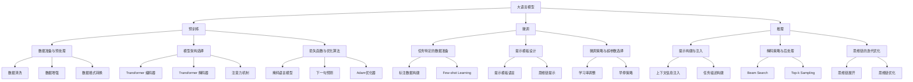

# 大语言模型原理与工程实践：思维链提示

## 1. 背景介绍
### 1.1 大语言模型的发展历程
#### 1.1.1 早期的语言模型
#### 1.1.2 神经网络语言模型的兴起
#### 1.1.3 Transformer 架构的突破
### 1.2 提示学习的概念与意义
#### 1.2.1 提示学习的定义
#### 1.2.2 提示学习的优势
#### 1.2.3 提示学习在大语言模型中的应用

## 2. 核心概念与联系
### 2.1 大语言模型
#### 2.1.1 定义与特点
#### 2.1.2 训练数据与预训练任务
#### 2.1.3 评估指标与挑战
### 2.2 提示学习
#### 2.2.1 Few-shot Learning
#### 2.2.2 In-context Learning
#### 2.2.3 Prompt Engineering
### 2.3 思维链
#### 2.3.1 思维链的概念
#### 2.3.2 思维链在提示学习中的作用
#### 2.3.3 构建高效思维链的原则

## 3. 核心算法原理具体操作步骤
### 3.1 预训练阶段
#### 3.1.1 数据准备与预处理
#### 3.1.2 模型架构选择
#### 3.1.3 损失函数与优化算法
### 3.2 微调阶段
#### 3.2.1 任务特定的数据准备
#### 3.2.2 提示模板设计
#### 3.2.3 微调策略与超参数选择
### 3.3 推理阶段
#### 3.3.1 提示构建与注入
#### 3.3.2 解码策略与后处理
#### 3.3.3 思维链的迭代优化

## 4. 数学模型和公式详细讲解举例说明
### 4.1 Transformer 架构
#### 4.1.1 自注意力机制
#### 4.1.2 多头注意力
#### 4.1.3 残差连接与层归一化
### 4.2 语言模型的概率公式
#### 4.2.1 联合概率分解
#### 4.2.2 条件概率计算
#### 4.2.3 交叉熵损失函数
### 4.3 提示学习的数学表示
#### 4.3.1 Few-shot Learning 的数学描述
#### 4.3.2 In-context Learning 的数学表示
#### 4.3.3 提示模板的数学形式化

## 5. 项目实践：代码实例和详细解释说明
### 5.1 数据准备
#### 5.1.1 数据集选择与下载
#### 5.1.2 数据清洗与预处理
#### 5.1.3 数据集划分与格式转换
### 5.2 模型训练
#### 5.2.1 模型构建与初始化
#### 5.2.2 训练循环与梯度更新
#### 5.2.3 模型保存与加载
### 5.3 提示构建与应用
#### 5.3.1 提示模板设计与实现
#### 5.3.2 思维链的构建与优化
#### 5.3.3 模型推理与结果解析

## 6. 实际应用场景
### 6.1 自然语言理解
#### 6.1.1 文本分类
#### 6.1.2 命名实体识别
#### 6.1.3 关系抽取
### 6.2 自然语言生成
#### 6.2.1 文本摘要
#### 6.2.2 对话生成
#### 6.2.3 故事创作
### 6.3 知识问答
#### 6.3.1 开放域问答
#### 6.3.2 常识推理
#### 6.3.3 多跳问答

## 7. 工具和资源推荐
### 7.1 开源工具包
#### 7.1.1 Hugging Face Transformers
#### 7.1.2 OpenAI GPT-3 API
#### 7.1.3 Google T5
### 7.2 预训练模型
#### 7.2.1 BERT
#### 7.2.2 GPT 系列模型
#### 7.2.3 BART 与 T5
### 7.3 数据集资源
#### 7.3.1 GLUE 基准测试
#### 7.3.2 SuperGLUE 基准测试
#### 7.3.3 SQuAD 与 CoQA

## 8. 总结：未来发展趋势与挑战
### 8.1 大语言模型的发展趋势
#### 8.1.1 模型规模的持续增长
#### 8.1.2 多模态语言模型的兴起
#### 8.1.3 语言模型的通用化
### 8.2 提示学习的研究方向
#### 8.2.1 提示模板的自动生成
#### 8.2.2 思维链的自动构建
#### 8.2.3 提示学习的理论基础
### 8.3 面临的挑战与机遇
#### 8.3.1 计算资源与训练成本
#### 8.3.2 数据隐私与安全
#### 8.3.3 模型的可解释性与可控性

## 9. 附录：常见问题与解答
### 9.1 大语言模型的局限性
### 9.2 提示学习的适用场景
### 9.3 思维链构建的注意事项
### 9.4 模型微调的技巧与策略
### 9.5 大语言模型的部署与应用

大语言模型（Large Language Models, LLMs）是自然语言处理领域的重要里程碑，它们以海量文本数据为基础，通过无监督学习的方式，构建了强大的语言理解和生成能力。近年来，随着计算能力的提升和训练数据的增长，大语言模型的性能不断刷新记录，展现出了广泛的应用前景。

然而，大语言模型在实际应用中仍然面临着诸多挑战，如何将预训练得到的语言知识有效地迁移到下游任务中，是一个亟待解决的问题。传统的微调方法需要大量的标注数据，且难以充分利用大语言模型的潜力。为了应对这一挑战，提示学习（Prompt Learning）应运而生，它通过设计合适的提示模板，将下游任务转化为与预训练任务相似的形式，从而实现了更加高效、灵活的知识迁移。

在提示学习的框架下，如何构建高质量的提示模板至关重要。一个好的提示模板应当能够准确地描述任务目标，并为模型提供必要的上下文信息和推理线索。然而，设计提示模板需要深入理解任务本身和大语言模型的特性，这对于非专业人士来说往往是一个挑战。

为了进一步提升提示学习的效果，研究者们提出了思维链（Chain-of-Thought）的概念。思维链是一种基于提示学习的推理方法，它通过将复杂任务分解为一系列简单的推理步骤，引导模型进行逐步推理，从而得出最终答案。思维链的核心在于构建合理的推理链条，每一步的输出都为下一步提供必要的线索，使得模型能够进行有效的多步推理。

思维链提示在许多任务上取得了显著的性能提升，如常识推理、数学问题求解等。然而，构建高效的思维链同样需要深入理解任务领域知识和推理逻辑，这对于提示设计者来说是一个挑战。此外，思维链的推理过程往往缺乏可解释性，这限制了其在某些应用场景下的使用。

为了进一步发挥大语言模型的潜力，研究者们正在探索更加高效、自动化的提示生成方法。一个有前景的方向是利用强化学习等技术，通过反复试错和优化，自动生成适合特定任务的提示模板和思维链。这一方向的研究有望降低提示设计的门槛，使得非专业人士也能够轻松地应用大语言模型解决实际问题。

另一个值得关注的研究方向是提示学习的理论基础。目前，提示学习更多地依赖于经验和直觉，缺乏严谨的理论支撑。深入理解提示学习的工作机制，建立完善的理论框架，将有助于指导提示设计，提升提示学习的效果和可解释性。

总的来说，大语言模型和提示学习的结合，为自然语言处理领域带来了新的突破。思维链提示作为一种有前景的提示学习方法，有望进一步提升大语言模型在复杂推理任务上的表现。然而，实现思维链提示的自动化构建，提升其可解释性和可控性，仍然是一个亟待解决的挑战。未来的研究方向可能包括提示生成的自动化、提示学习的理论基础、大语言模型的通用化等。随着这些挑战的逐步解决，大语言模型和提示学习必将在更广泛的应用领域发挥重要作用，推动自然语言处理技术的进一步发展。

作者：禅与计算机程序设计艺术 / Zen and the Art of Computer Programming