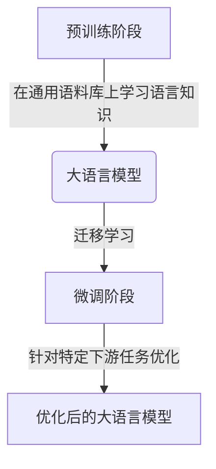
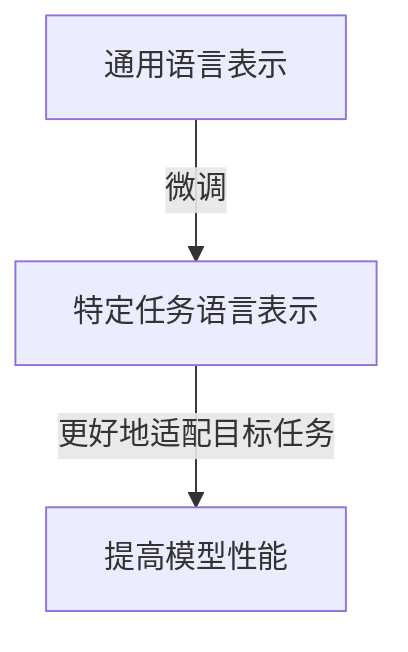
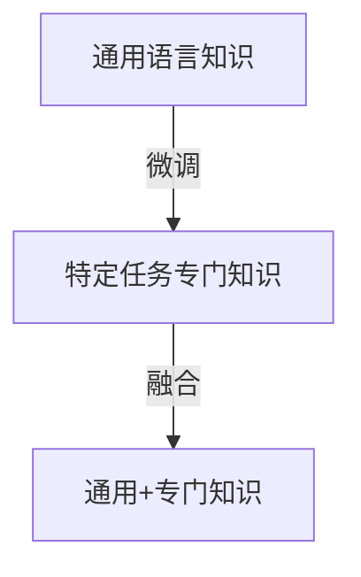

# 大语言模型原理与工程实践：揭开有监督微调的面纱

## 1.背景介绍

### 1.1 人工智能的新时代

人工智能(AI)的发展已经进入了一个新的里程碑时代。近年来,大型语言模型(Large Language Models, LLMs)的出现,彻底改变了人工智能的格局。这些模型通过在大量文本数据上进行预训练,学习了丰富的语言知识和世界知识,展现出令人惊叹的自然语言理解和生成能力。

### 1.2 大语言模型的兴起

代表性的大语言模型包括 GPT (Generative Pre-trained Transformer)、BERT (Bidirectional Encoder Representations from Transformers)、XLNet、RoBERTa、ALBERT等。它们在自然语言处理(NLP)任务上取得了突破性的进展,如机器翻译、问答系统、文本摘要、情感分析等,极大推动了人工智能的发展。

### 1.3 有监督微调的重要性

尽管大语言模型在预训练阶段学习了丰富的知识,但要将它们应用于特定的下游任务,仍需要进行针对性的调整和优化。这就是所谓的"有监督微调"(Supervised Fine-tuning)。通过在标注的任务数据上进行微调,可以使大语言模型针对特定任务进行专门优化,从而获得更好的性能表现。

## 2.核心概念与联系

### 2.1 迁移学习

有监督微调实际上是一种迁移学习(Transfer Learning)的范例。迁移学习的核心思想是利用在源域(source domain)学习到的知识,来帮助目标域(target domain)的学习。在大语言模型中,预训练阶段相当于在通用语料库(源域)上学习语言知识,而微调阶段则是将这些知识迁移并适配到特定的下游任务(目标域)上。



### 2.2 模型精细化

有监督微调可以看作是一种模型精细化(Model Fine-tuning)的过程。在预训练阶段,大语言模型学习到了通用的语言表示,但这些表示可能与特定任务的需求还存在一定差距。通过微调,模型可以进一步优化其参数,使其更好地适配目标任务的特征和要求。



### 2.3 层次化知识传递

有监督微调过程实现了从通用知识到特定知识的层次化传递。预训练阶段学习到的是广泛的语言知识,而微调阶段则是在此基础上,进一步学习特定任务所需的专门知识。这种层次化的知识传递使得模型能够在保留通用语言能力的同时,也具备了处理特定任务所需的专门能力。



## 3.核心算法原理具体操作步骤

### 3.1 数据准备

有监督微调的第一步是准备高质量的任务数据集。这些数据集应当包含足够多的标注样本,覆盖目标任务的各种情况和特征。数据集的质量直接影响微调的效果,因此需要投入大量的人力和时间进行数据收集、清洗和标注。

### 3.2 模型选择

接下来需要选择合适的大语言模型作为基础模型。不同的模型在预训练语料、模型架构和参数规模上存在差异,因此需要根据具体任务的需求进行选择。一般来说,参数规模越大的模型通常具有更强的表现能力,但也需要更多的计算资源。

### 3.3 微调策略

微调策略决定了如何在任务数据上优化模型参数。常见的策略包括:

1. **全模型微调(Full Model Fine-tuning)**: 对整个模型的所有参数进行微调,包括编码器(Encoder)和解码器(Decoder)。这种策略计算开销较大,但可以充分利用任务数据对模型进行优化。

2. **编码器微调(Encoder Fine-tuning)**: 只对编码器部分进行微调,解码器部分保持不变。这种策略计算开销较小,适用于生成类任务。

3. **层级微调(Layer-wise Fine-tuning)**: 对模型的不同层进行不同程度的微调,例如只微调高层,或者对不同层使用不同的学习率。这种策略可以更好地利用模型的层次结构特性。

4. **discriminative微调(Discriminative Fine-tuning)**: 在微调过程中,同时优化判别式(discriminative)损失函数和生成式(generative)损失函数,以平衡模型的判别能力和生成能力。

### 3.4 超参数调优

微调过程中需要调优多个超参数,如学习率、批量大小、训练轮数等,以获得最佳性能。常见的调优方法包括网格搜索(Grid Search)、随机搜索(Random Search)和贝叶斯优化(Bayesian Optimization)等。

### 3.5 模型评估

在微调完成后,需要在保留数据集(Hold-out Dataset)上对模型进行评估,以衡量其在目标任务上的实际表现。评估指标因任务而异,如分类任务通常使用准确率(Accuracy)、F1分数等,生成任务则可使用BLEU、ROUGE等指标。

### 3.6 模型部署

一旦模型达到预期性能,就可以将其部署到生产环境中,为下游应用提供服务。在部署过程中,需要注意模型的在线推理效率、资源占用等实际运行时的考虑因素。

## 4.数学模型和公式详细讲解举例说明

### 4.1 自注意力机制(Self-Attention)

大语言模型中广泛采用了自注意力机制,用于捕捉输入序列中元素之间的长程依赖关系。给定一个查询向量(Query) $\mathbf{q}$、键向量(Key) $\mathbf{K}$和值向量(Value) $\mathbf{V}$,自注意力的计算公式如下:

$$\mathrm{Attention}(\mathbf{Q}, \mathbf{K}, \mathbf{V}) = \mathrm{softmax}\left(\frac{\mathbf{Q}\mathbf{K}^\top}{\sqrt{d_k}}\right)\mathbf{V}$$

其中,$ \sqrt{d_k} $是一个缩放因子,用于防止点积过大导致软最大值函数的梯度较小。

自注意力机制使得每个位置的表示都能够融合全局信息,极大增强了模型的表示能力。在微调过程中,自注意力层的参数也会进行相应的调整和优化,使其更好地捕捉任务相关的依赖关系。

### 4.2 交叉熵损失函数

对于分类任务,常用的损失函数是交叉熵损失(Cross-Entropy Loss)。给定一个样本 $\mathbf{x}$ 和其真实标签 $y$,以及模型预测的概率分布 $\mathbf{p}(y|\mathbf{x})$,交叉熵损失定义为:

$$\mathcal{L}(\mathbf{x}, y) = -\log p(y|\mathbf{x})$$

在微调过程中,模型参数的更新目标是最小化训练数据集上的总体损失:

$$\min_\theta \frac{1}{N}\sum_{i=1}^N \mathcal{L}(\mathbf{x}_i, y_i)$$

其中,$ \theta $表示模型参数,$ N $是训练样本数量。

通过梯度下降等优化算法,可以逐步调整模型参数,使得预测概率分布 $\mathbf{p}(y|\mathbf{x})$ 越来越接近真实标签的分布,从而最小化损失函数。

### 4.3 生成式微调

对于生成式任务(如机器翻译、文本摘要等),常采用最大似然估计(Maximum Likelihood Estimation, MLE)的方式进行微调。给定一个输入序列 $\mathbf{x}$ 和目标输出序列 $\mathbf{y}$,目标是最大化条件概率 $p(\mathbf{y}|\mathbf{x})$,等价于最小化负对数似然损失:

$$\mathcal{L}(\mathbf{x}, \mathbf{y}) = -\log p(\mathbf{y}|\mathbf{x})$$

其中,$ p(\mathbf{y}|\mathbf{x}) $可以通过链式法则分解为:

$$p(\mathbf{y}|\mathbf{x}) = \prod_{t=1}^{T} p(y_t|y_{<t}, \mathbf{x})$$

在微调过程中,模型会学习预测下一个词 $y_t$ 的条件概率分布,使其尽可能接近真实的目标序列。

除了 MLE 之外,还可以采用其他的生成式微调目标,如最小化 BLEU 分数的负值、最小化词误差率(Word Error Rate, WER)等,以进一步优化模型的生成质量。

## 5.项目实践：代码实例和详细解释说明

在本节中,我们将通过一个实际的代码示例,演示如何对 BERT 模型进行有监督微调,以完成文本分类任务。我们将使用 PyTorch 框架和 Hugging Face 的 Transformers 库。

### 5.1 导入所需库

```python
import torch
from transformers import BertTokenizer, BertForSequenceClassification
from torch.utils.data import TensorDataset, DataLoader
```

### 5.2 准备数据

首先,我们需要准备文本分类任务的数据集。这里我们使用一个虚构的数据集,包含一些电影评论及其情感标签(正面或负面)。

```python
texts = [
    "This movie was absolutely amazing! I loved the plot and the acting was superb.",
    "The special effects were incredible, but the story was a bit weak.",
    "Terrible acting and a predictable storyline. I wouldn't recommend this movie.",
    # ... 更多数据
]

labels = [1, 0, 0, ...]  # 1 表示正面情感,0 表示负面情感
```

### 5.3 数据预处理

我们需要将文本转换为模型可以接受的输入格式。BERT 使用 WordPiece 词元化器,因此我们需要对文本进行词元化,并添加特殊标记。

```python
tokenizer = BertTokenizer.from_pretrained('bert-base-uncased')

input_ids = []
attention_masks = []

for text in texts:
    encoded = tokenizer.encode_plus(
        text,
        add_special_tokens=True,
        max_length=128,
        padding='max_length',
        truncation=True,
        return_attention_mask=True
    )
    input_ids.append(encoded['input_ids'])
    attention_masks.append(encoded['attention_mask'])
```

### 5.4 创建数据集和数据加载器

接下来,我们将输入和标签数据封装为 PyTorch 的 TensorDataset,并创建一个 DataLoader 用于迭代训练。

```python
input_ids = torch.tensor(input_ids)
attention_masks = torch.tensor(attention_masks)
labels = torch.tensor(labels)

dataset = TensorDataset(input_ids, attention_masks, labels)
dataloader = DataLoader(dataset, batch_size=16, shuffle=True)
```

### 5.5 加载预训练模型

我们将加载 BERT 的预训练模型,并将其设置为适用于文本分类任务。

```python
model = BertForSequenceClassification.from_pretrained(
    'bert-base-uncased',
    num_labels=2,  # 二分类任务
    output_attentions=False,
    output_hidden_states=False
)
```

### 5.6 微调模型

现在,我们可以开始微调模型了。我们将定义一个优化器和损失函数,并在训练数据上进行多轮迭代训练。

```python
optimizer = torch.optim.AdamW(model.parameters(), lr=2e-5)

for epoch in range(3):
    model.train()
    total_loss = 0

    for batch in dataloader:
        input_ids_batch = batch[0].to(device)
        attention_masks_batch = batch[1].to(device)
        labels_batch = batch[2].to(device)

        outputs = model(input_ids_batch, attention_mask=attention_masks_batch, labels=labels_batch)
        loss = outputs.loss
        total_loss += loss.item()

        loss.backward()
        optimizer.step()
        optimizer.zero_grad()

    print(f'Epoch {epoch+1}, Loss: {total_loss / len(dataloader)}')