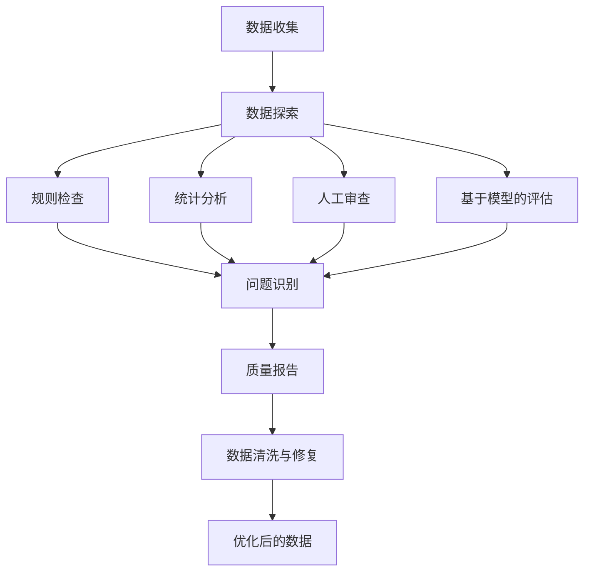

# 大语言模型原理与工程实践：数据质量评估的挑战

## 1. 背景介绍

### 1.1 大语言模型的兴起

近年来,大型语言模型(Large Language Models, LLMs)在自然语言处理(NLP)领域掀起了一场革命。这些模型通过在海量文本数据上进行预训练,学习了丰富的语言知识和上下文信息,从而在各种NLP任务上展现出了令人惊叹的性能表现。

代表性的大语言模型包括:

- GPT系列(Generative Pre-trained Transformer)
- BERT(Bidirectional Encoder Representations from Transformers)
- XLNet
- RoBERTa
- ALBERT
- T5(Text-to-Text Transfer Transformer)
- ...

这些模型不仅在学术界引起了广泛关注,也在工业界得到了大规模应用,为智能问答、文本生成、机器翻译、信息检索等任务提供了强大的支持。

### 1.2 数据质量评估的重要性

尽管大语言模型取得了令人瞩目的成就,但它们也面临着一些挑战,其中最为关键的就是数据质量评估问题。由于这些模型是在海量文本数据上训练而来,因此训练数据的质量对模型性能有着至关重要的影响。低质量的训练数据不仅会影响模型的准确性和泛化能力,还可能导致模型产生有偏见、不道德或不安全的输出。

因此,对训练数据进行全面、严格的质量评估是确保大语言模型可靠性和可解释性的关键一环。然而,由于训练数据规模庞大、多样性丰富,对其进行有效评估仍然是一个巨大的挑战。

## 2. 核心概念与联系

### 2.1 数据质量维度

评估数据质量需要考虑多个维度,包括但不限于:

1. **准确性(Accuracy)**:数据是否反映了真实情况,是否存在错误或噪声。
2. **完整性(Completeness)**:数据是否缺失重要信息或存在空值。
3. **一致性(Consistency)**:数据中是否存在矛盾或冲突的信息。
4. **时效性(Timeliness)**:数据是否反映了最新的情况。
5. **代表性(Representativeness)**:数据是否能够代表整个数据集的特征。
6. **可解释性(Interpretability)**:数据中的信息是否易于理解和解释。
7. **隐私和安全性(Privacy and Security)**:数据是否包含敏感信息,是否存在隐私和安全风险。

这些维度相互关联,需要综合考虑才能全面评估数据质量。

### 2.2 数据质量评估方法

数据质量评估可以采用多种方法,包括:

1. **规则检查(Rule-based Checking)**:根据预定义的规则和约束条件检查数据,发现违反规则的数据实例。
2. **统计分析(Statistical Analysis)**:通过计算数据的统计量(如均值、方差、分布等)来发现异常值和偏差。
3. **数据探索(Data Profiling)**:对数据进行全面的探索和分析,了解其特征、模式和潜在问题。
4. **人工审查(Manual Inspection)**:由人工专家对数据进行审查和标注,发现质量问题。
5. **基于模型的评估(Model-based Evaluation)**:利用机器学习模型对数据进行评估,如异常检测、聚类分析等。

这些方法可以单独使用,也可以相互结合,以获得更全面的评估结果。

### 2.3 数据质量与模型性能的关系

数据质量直接影响着大语言模型的性能表现。低质量的训练数据可能会导致以下问题:

1. **准确性降低**:模型在特定任务上的准确率下降。
2. **泛化能力差**:模型难以很好地推广到新的数据和场景。
3. **偏差和不公平**:模型可能会产生有偏见或不公平的输出。
4. **不安全和不道德**:模型可能会生成有害、不安全或不道德的内容。
5. **可解释性降低**:模型的行为和决策变得难以解释和理解。

因此,确保训练数据的高质量是提高大语言模型性能和可靠性的关键前提。

## 3. 核心算法原理具体操作步骤

### 3.1 数据质量评估流程

对大语言模型训练数据进行质量评估的一般流程如下:



1. **数据收集**:从各种来源收集原始训练数据。
2. **数据探索**:对数据进行初步探索,了解其结构、特征和潜在问题。
3. **规则检查**:根据预定义的规则和约束条件检查数据,发现违反规则的实例。
4. **统计分析**:计算数据的统计量,发现异常值和偏差。
5. **人工审查**:由人工专家对数据进行审查和标注,发现质量问题。
6. **基于模型的评估**:利用机器学习模型对数据进行评估,如异常检测、聚类分析等。
7. **问题识别**:综合各种评估方法的结果,识别出数据中存在的质量问题。
8. **质量报告**:生成详细的数据质量报告,包括发现的问题、严重程度和建议措施。
9. **数据清洗与修复**:根据质量报告,对数据进行清洗和修复,消除质量问题。
10. **优化后的数据**:获得经过质量评估和优化的高质量训练数据。

### 3.2 数据探索技术

数据探索是数据质量评估的基础,它可以帮助我们了解数据的整体特征和潜在问题。常用的数据探索技术包括:

1. **描述性统计分析**:计算数据的均值、中位数、最大/最小值、方差、分布等统计量。
2. **数据可视化**:使用各种图表(如直方图、散点图、箱线图等)来直观展示数据的分布和模式。
3. **相关性分析**:计算不同特征之间的相关系数,发现强相关的特征对。
4. **缺失值分析**:识别数据中存在缺失值的特征,并分析缺失值的模式和原因。
5. **异常值检测**:利用统计方法或基于模型的方法发现数据中的异常值。
6. **数据质量指标**:计算一些常用的数据质量指标,如完整性、一致性、唯一性等。

通过数据探索,我们可以全面了解数据的特征和质量状况,为后续的质量评估和优化奠定基础。

## 4. 数学模型和公式详细讲解举例说明

### 4.1 异常值检测

异常值检测是数据质量评估的一个重要环节。常用的异常值检测方法包括基于统计的方法和基于模型的方法。

#### 4.1.1 基于统计的异常值检测

基于统计的异常值检测方法通常利用数据的统计量来识别异常值。一种常见的方法是使用**三sigma原则**,即将位于均值附近三个标准差之外的数据点视为异常值。

设数据集为 $X = \{x_1, x_2, \ldots, x_n\}$,其均值为 $\mu$,标准差为 $\sigma$,则异常值的判断条件为:

$$
|x_i - \mu| > 3\sigma
$$

其中,如果数据点 $x_i$ 满足上述条件,则被视为异常值。

另一种常用的方法是**四分位距(IQR)法**,它利用数据的四分位数来识别异常值。设 $Q_1$ 和 $Q_3$ 分别为数据的下四分位数和上四分位数,则异常值的判断条件为:

$$
x_i < Q_1 - 1.5\times \text{IQR} \quad \text{或} \quad x_i > Q_3 + 1.5\times \text{IQR}
$$

其中,IQR (Interquartile Range) 为四分位距,即 $\text{IQR} = Q_3 - Q_1$。如果数据点 $x_i$ 满足上述条件,则被视为异常值。

#### 4.1.2 基于模型的异常值检测

基于模型的异常值检测方法利用机器学习模型来学习数据的正常模式,然后将偏离该模式的数据点视为异常值。常用的模型包括:

- **高斯混合模型(Gaussian Mixture Model, GMM)**:假设数据服从多个高斯分布的混合,可以通过期望最大化(EM)算法估计每个高斯分布的参数。
- **一类支持向量机(One-Class SVM)**:将数据映射到高维特征空间,寻找一个超平面将大部分数据点包围起来,偏离该超平面的数据点被视为异常值。
- **隔离森林(Isolation Forest)**:通过构建隔离树(Isolation Tree)来隔离异常值,基于异常值被隔离所需的路径长度来判断是否为异常值。

以隔离森林为例,其核心思想是通过随机划分特征空间,使异常值被隔离在较小的区域内,从而被识别出来。具体地,对于一个数据点 $x$,其异常分数可以定义为:

$$
s(x, n) = 2^{-\frac{E(h(x))}{c(n)}}
$$

其中,$E(h(x))$ 表示数据点 $x$ 在隔离树中的平均路径长度,$c(n)$ 是一个用于归一化的常数,取决于数据集大小 $n$。异常分数 $s(x, n)$ 的值越小,表示数据点 $x$ 越有可能是异常值。

通过设置异常分数的阈值,我们可以将数据点划分为正常值和异常值。

### 4.2 数据质量指标

为了量化评估数据质量,我们可以定义一些数据质量指标。常用的指标包括:

1. **完整性(Completeness)**:反映数据缺失程度的指标。

   设数据集中存在缺失值的记录数为 $n_\text{missing}$,总记录数为 $N$,则完整性可以定义为:

   $$
   \text{Completeness} = 1 - \frac{n_\text{missing}}{N}
   $$

   完整性的取值范围为 $[0, 1]$,值越大表示数据越完整。

2. **一致性(Consistency)**:反映数据中是否存在矛盾或冲突的信息。

   设数据集中存在矛盾记录的数量为 $n_\text{inconsistent}$,则一致性可以定义为:

   $$
   \text{Consistency} = 1 - \frac{n_\text{inconsistent}}{N}
   $$

   一致性的取值范围也为 $[0, 1]$,值越大表示数据越一致。

3. **准确性(Accuracy)**:反映数据与真实情况的吻合程度。

   设数据集中存在错误记录的数量为 $n_\text{error}$,则准确性可以定义为:

   $$
   \text{Accuracy} = 1 - \frac{n_\text{error}}{N}
   $$

   准确性的取值范围同样为 $[0, 1]$,值越大表示数据越准确。

通过计算这些指标,我们可以对数据的不同质量维度进行量化评估,从而更好地了解数据质量状况,并制定相应的优化策略。

## 5. 项目实践:代码实例和详细解释说明

在本节,我们将通过一个实际项目案例来演示如何对大语言模型的训练数据进行质量评估。我们将使用 Python 编程语言和一些常用的数据分析库,如 Pandas、NumPy、Scikit-learn 等。

### 5.1 数据集介绍

我们将使用一个包含新闻文本的数据集进行质量评估。该数据集包含以下字段:

- `title`: 新闻标题
- `text`: 新闻正文
- `source`: 新闻来源
- `date`: 发布日期

数据集的部分示例如下:

```
                                       title                                               text  source        date
0  Google to Buy Fitbit for $2.1 Billion to Bu...  Google has struck a deal to buy Fitbit for