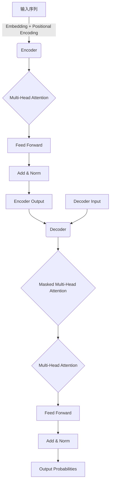

# 大语言模型原理与工程实践：预训练还有什么没有解决

## 1.背景介绍

### 1.1 大语言模型的兴起

近年来,大型语言模型(Large Language Models, LLMs)在自然语言处理(NLP)领域取得了令人瞩目的成就。这些模型通过在大规模文本语料库上进行预训练,学习到了丰富的语言知识和上下文信息,从而在下游任务中表现出色。

代表性的大语言模型有:

- GPT(Generative Pre-trained Transformer)系列模型:GPT、GPT-2、GPT-3等,由OpenAI公司开发。
- BERT(Bidirectional Encoder Representations from Transformers)模型:由谷歌开发,是第一个大规模应用Transformer架构的预训练语言模型。
- T5(Text-to-Text Transfer Transformer)模型:由谷歌开发,将所有NLP任务统一转化为文本到文本的形式。
- PALM(Pathways Language Model)模型:由谷歌开发,在多模态任务上表现出色。
- ...

这些大语言模型通过预训练学习到了丰富的语言知识,在下游任务如文本生成、机器翻译、问答系统等领域表现优异,推动了NLP技术的飞速发展。

### 1.2 预训练的重要性

预训练是大语言模型取得巨大成功的关键所在。通过在大规模语料库上进行无监督学习,模型可以获取丰富的语言知识,包括词汇、语法、语义、上下文等,为后续的有监督微调奠定基础。

相比从头开始训练,预训练可以极大地提高模型的泛化能力和性能表现。此外,预训练模型可以应用于多种下游任务,提高了模型的可迁移性和复用性。

因此,预训练是大语言模型成功的核心,也是当前研究的重点方向之一。

## 2.核心概念与联系

### 2.1 自注意力机制(Self-Attention)

自注意力机制是Transformer模型的核心,也是大语言模型取得成功的关键所在。它允许模型捕捉输入序列中任意两个位置之间的依赖关系,从而更好地建模长期依赖。

自注意力机制的计算过程如下:

1. 将输入序列映射到查询(Query)、键(Key)和值(Value)向量。
2. 计算查询和键之间的相似性得分(注意力权重)。
3. 使用注意力权重对值向量进行加权求和,得到注意力输出。

通过自注意力机制,模型可以自适应地关注输入序列中的不同部分,捕捉长距离依赖关系,从而更好地理解和生成文本。

### 2.2 掩码语言模型(Masked Language Modeling)

掩码语言模型是一种常用的预训练目标,旨在预测被掩码(masked)的单词。具体来说,模型需要根据上下文,预测被随机掩码的单词应该是什么。

BERT等模型采用了掩码语言模型作为预训练目标,通过大量的掩码预测任务,模型学习到了丰富的语言知识,提高了对上下文的理解能力。

掩码语言模型的优点是可以同时利用上下文的双向信息,而不像传统语言模型那样只能利用单向上下文。这使得预训练模型可以更好地捕捉上下文语义,提高了语言理解能力。

### 2.3 序列到序列(Seq2Seq)模型

序列到序列(Sequence-to-Sequence,Seq2Seq)模型是一种常用的模型架构,广泛应用于机器翻译、文本摘要、对话系统等任务。

Seq2Seq模型由编码器(Encoder)和解码器(Decoder)两部分组成。编码器将输入序列编码为上下文向量,解码器则根据上下文向量生成目标序列。

在大语言模型中,Seq2Seq架构被广泛采用,如T5模型将所有NLP任务统一转化为文本到文本的形式,使用编码器-解码器架构进行预训练和微调。

Seq2Seq模型的优点是可以处理不等长的输入和输出序列,并且能够自然地融合上下文信息,因此在序列生成任务中表现出色。

### 2.4 多模态模型

除了处理文本数据,大语言模型还可以扩展到多模态领域,即同时处理图像、视频、音频等不同模态的数据。

多模态模型通常采用的技术包括:

- 视觉-语言预训练:在图像-文本对的语料库上进行预训练,学习视觉和语言的联合表示。
- 跨模态注意力机制:允许不同模态之间的信息交互,捕捉模态间的关联。
- 模态融合:将不同模态的特征进行融合,得到统一的多模态表示。

代表性的多模态大语言模型包括PALM、Flamingo等。多模态模型在视觉问答、图像描述生成、多模态对话等任务中表现优异,扩展了大语言模型的应用范围。

## 3.核心算法原理具体操作步骤

### 3.1 Transformer模型架构

Transformer是大语言模型的核心架构,包括编码器(Encoder)和解码器(Decoder)两个主要部分。

编码器的工作流程如下:

1. 将输入序列转换为嵌入向量,并添加位置编码。
2. 通过多头自注意力层捕捉输入序列中元素之间的依赖关系。
3. 通过前馈神经网络对注意力输出进行变换。
4. 残差连接和层归一化,得到编码器的输出。

解码器的工作流程如下:

1. 将解码器输入(如前一时刻的输出)转换为嵌入向量。
2. 通过掩码多头自注意力层,只关注当前位置之前的输出。
3. 通过编码器-解码器注意力层,将解码器状态与编码器输出进行关联。
4. 通过前馈神经网络对注意力输出进行变换。
5. 残差连接和层归一化,得到解码器的输出概率分布。

通过自注意力机制和编码器-解码器架构,Transformer模型能够有效地捕捉长期依赖关系,并生成高质量的序列输出。

### 3.2 BERT预训练

BERT(Bidirectional Encoder Representations from Transformers)是一种基于Transformer的预训练语言模型,通过掩码语言模型(Masked Language Modeling,MLM)和下一句预测(Next Sentence Prediction,NSP)两个预训练任务,学习到了丰富的语言知识。

BERT预训练的具体步骤如下:

1. **数据预处理**:将语料库文本切分为连续的序列,并进行标记化、词汇映射等预处理操作。

2. **掩码语言模型**:随机选择一些输入token,将它们用特殊的[MASK]标记替换。模型的目标是根据上下文,预测被掩码的token原本是什么。

3. **下一句预测**:对于成对的句子,模型需要预测第二个句子是否为第一个句子的下一句。

4. **模型训练**:使用上述两个预训练任务的损失函数,对BERT模型进行端到端的联合训练。

5. **模型微调**:在特定的下游任务上,对预训练的BERT模型进行进一步的微调,以获得更好的性能表现。

通过掩码语言模型和下一句预测两个预训练任务,BERT模型学习到了丰富的语言知识,包括词汇、语法、语义和上下文信息,从而在下游任务中表现出色。

### 3.3 GPT预训练

GPT(Generative Pre-trained Transformer)是另一种基于Transformer的预训练语言模型,采用了传统语言模型的预训练目标,即根据上文预测下一个token。

GPT预训练的具体步骤如下:

1. **数据预处理**:将语料库文本切分为连续的序列,并进行标记化、词汇映射等预处理操作。

2. **语言模型预训练**:给定上文序列,模型需要预测下一个token的概率分布。通过最大化下一个token的概率,模型可以学习到语言的规律。

3. **模型训练**:使用语言模型的交叉熵损失函数,对GPT模型进行端到端的训练。

4. **模型微调**:在特定的下游任务上,对预训练的GPT模型进行进一步的微调,以获得更好的性能表现。

与BERT不同,GPT采用的是标准的语言模型预训练目标,只利用了单向的上文信息。但由于Transformer架构的自注意力机制,GPT模型仍然能够捕捉到长期依赖关系,并在文本生成等任务中表现出色。

## 4.数学模型和公式详细讲解举例说明

### 4.1 自注意力机制

自注意力机制是Transformer模型的核心,允许模型捕捉输入序列中任意两个位置之间的依赖关系。其数学表示如下:

给定一个长度为 $n$ 的输入序列 $X = (x_1, x_2, \dots, x_n)$,我们首先将其映射到查询(Query)、键(Key)和值(Value)向量:

$$
\begin{aligned}
Q &= XW^Q \\
K &= XW^K \\
V &= XW^V
\end{aligned}
$$

其中 $W^Q$、$W^K$、$W^V$ 分别是可学习的查询、键和值的线性投影矩阵。

接下来,我们计算查询 $Q$ 和所有键 $K$ 之间的相似性得分(注意力权重):

$$
\text{Attention}(Q, K, V) = \text{softmax}\left(\frac{QK^T}{\sqrt{d_k}}\right)V
$$

其中 $d_k$ 是缩放因子,用于防止较深层的值过大导致梯度饱和。

注意力输出是值向量 $V$ 根据注意力权重的加权和:

$$
\text{Attention}(Q, K, V) = \sum_{i=1}^n \alpha_i v_i
$$

其中 $\alpha_i = \text{softmax}\left(\frac{q_i k_i^T}{\sqrt{d_k}}\right)$ 是注意力权重。

通过自注意力机制,模型可以自适应地关注输入序列中的不同部分,捕捉长距离依赖关系,从而更好地理解和生成文本。

### 4.2 掩码语言模型

掩码语言模型(Masked Language Modeling, MLM)是BERT等模型采用的预训练目标之一。其目标是根据上下文,预测被掩码的token原本是什么。

设输入序列为 $X = (x_1, x_2, \dots, x_n)$,其中某些token被掩码为特殊的[MASK]标记。我们的目标是最大化掩码token的条件概率:

$$
\max_\theta \sum_{i=1}^n \log P(x_i | X_{\\mask}, \theta)
$$

其中 $X_{\\mask}$ 是将掩码token替换为[MASK]标记后的输入序列, $\theta$ 是模型参数。

BERT模型将 $X_{\\mask}$ 输入到Transformer编码器中,得到每个位置的上下文向量表示 $H = (h_1, h_2, \dots, h_n)$。对于掩码位置 $i$,我们有:

$$
P(x_i | X_{\\mask}, \theta) = \text{softmax}(W_o h_i)
$$

其中 $W_o$ 是可学习的输出层权重矩阵。

通过最大化掩码token的条件概率,BERT模型可以学习到丰富的语言知识,包括词汇、语法、语义和上下文信息,从而在下游任务中表现出色。

## 5.项目实践:代码实例和详细解释说明

为了更好地理解大语言模型的原理和实践,我们将使用PyTorch实现一个简化版的Transformer模型,并在文本生成任务上进行训练和测试。

### 5.1 数据预处理

首先,我们需要对文本数据进行预处理,包括标记化、词汇构建和数值映射等步骤