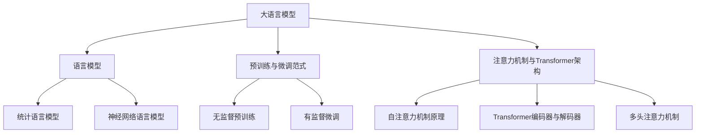

# 大语言模型原理基础与前沿 偏见

## 1. 背景介绍
### 1.1 大语言模型的发展历程
#### 1.1.1 早期的语言模型
#### 1.1.2 神经网络语言模型的兴起 
#### 1.1.3 Transformer架构的革新
### 1.2 大语言模型的应用现状
#### 1.2.1 自然语言处理领域的应用
#### 1.2.2 知识图谱构建与问答系统
#### 1.2.3 文本生成与创作辅助
### 1.3 大语言模型面临的挑战与争议
#### 1.3.1 计算资源与训练成本的挑战
#### 1.3.2 模型泛化能力与鲁棒性问题
#### 1.3.3 偏见与伦理风险的争议

## 2. 核心概念与联系
### 2.1 语言模型的定义与分类
#### 2.1.1 统计语言模型
#### 2.1.2 神经网络语言模型 
#### 2.1.3 大语言模型的特点
### 2.2 预训练与微调范式
#### 2.2.1 无监督预训练
#### 2.2.2 有监督微调
#### 2.2.3 预训练-微调范式的优势
### 2.3 注意力机制与Transformer架构
#### 2.3.1 自注意力机制原理
#### 2.3.2 Transformer编码器与解码器
#### 2.3.3 多头注意力机制



## 3. 核心算法原理具体操作步骤
### 3.1 Transformer的编码器
#### 3.1.1 输入嵌入与位置编码
#### 3.1.2 自注意力层
#### 3.1.3 前馈神经网络层
### 3.2 Transformer的解码器
#### 3.2.1 掩码自注意力机制
#### 3.2.2 编码-解码注意力机制
#### 3.2.3 前馈神经网络层
### 3.3 预训练目标与损失函数
#### 3.3.1 去噪自编码
#### 3.3.2 自回归语言建模
#### 3.3.3 对比学习

## 4. 数学模型和公式详细讲解举例说明 
### 4.1 注意力机制的数学表示
#### 4.1.1 缩放点积注意力
$Attention(Q,K,V) = softmax(\frac{QK^T}{\sqrt{d_k}})V$
其中，$Q$、$K$、$V$分别表示查询、键、值矩阵，$d_k$为键向量的维度。
#### 4.1.2 多头注意力
$$MultiHead(Q,K,V) = Concat(head_1, ..., head_h)W^O$$
$$head_i = Attention(QW_i^Q, KW_i^K, VW_i^V)$$
其中，$W_i^Q$、$W_i^K$、$W_i^V$为线性变换矩阵，$W^O$为输出线性变换矩阵。
### 4.2 Transformer的数学表示  
#### 4.2.1 编码器层
$$Encoder(x) = LayerNorm(x + FFN(x))$$
$$FFN(x) = max(0, xW_1 + b_1)W_2 + b_2$$
其中，$x$为输入序列，$W_1$、$W_2$、$b_1$、$b_2$为前馈神经网络的参数。
#### 4.2.2 解码器层
$$Decoder(y) = LayerNorm(y + FFN(y))$$
$$y = LayerNorm(y + CrossAttention(y, Encoder(x)))$$
其中，$y$为目标序列，$CrossAttention$表示编码-解码注意力机制。

## 5. 项目实践：代码实例和详细解释说明
### 5.1 使用PyTorch实现Transformer
#### 5.1.1 定义Transformer模型类
```python
class Transformer(nn.Module):
    def __init__(self, d_model, nhead, num_encoder_layers, num_decoder_layers, dim_feedforward, dropout=0.1):
        super(Transformer, self).__init__()
        self.encoder = TransformerEncoder(d_model, nhead, num_encoder_layers, dim_feedforward, dropout)
        self.decoder = TransformerDecoder(d_model, nhead, num_decoder_layers, dim_feedforward, dropout)
        
    def forward(self, src, tgt, src_mask=None, tgt_mask=None):
        memory = self.encoder(src, src_mask)
        output = self.decoder(tgt, memory, tgt_mask, None)
        return output
```
#### 5.1.2 定义编码器和解码器类
```python
class TransformerEncoder(nn.Module):
    def __init__(self, d_model, nhead, num_layers, dim_feedforward, dropout=0.1):
        super(TransformerEncoder, self).__init__()
        encoder_layer = nn.TransformerEncoderLayer(d_model, nhead, dim_feedforward, dropout)
        self.layers = nn.TransformerEncoder(encoder_layer, num_layers) 
        
    def forward(self, src, src_mask=None):
        output = self.layers(src, src_mask)
        return output

class TransformerDecoder(nn.Module):  
    def __init__(self, d_model, nhead, num_layers, dim_feedforward, dropout=0.1):
        super(TransformerDecoder, self).__init__()
        decoder_layer = nn.TransformerDecoderLayer(d_model, nhead, dim_feedforward, dropout)
        self.layers = nn.TransformerDecoder(decoder_layer, num_layers)
        
    def forward(self, tgt, memory, tgt_mask=None, memory_mask=None):
        output = self.layers(tgt, memory, tgt_mask, memory_mask)
        return output
```
### 5.2 使用TensorFlow实现BERT
#### 5.2.1 定义BERT模型类
```python
class BERT(tf.keras.Model):
    def __init__(self, vocab_size, hidden_size, num_layers, num_heads, intermediate_size, dropout_rate=0.1):
        super(BERT, self).__init__()
        self.embedding = BERTEmbedding(vocab_size, hidden_size)
        self.encoder = Transformer(hidden_size, num_layers, num_heads, intermediate_size, dropout_rate)
        
    def call(self, inputs, training=False):
        embedding = self.embedding(inputs)
        sequence_output = self.encoder(embedding, training=training)
        return sequence_output
```
#### 5.2.2 定义嵌入层和Transformer编码器
```python
class BERTEmbedding(tf.keras.layers.Layer):
    def __init__(self, vocab_size, hidden_size):
        super(BERTEmbedding, self).__init__()
        self.token_embedding = tf.keras.layers.Embedding(vocab_size, hidden_size)
        self.position_embedding = tf.keras.layers.Embedding(max_position, hidden_size)
        self.layer_norm = tf.keras.layers.LayerNormalization()
        
    def call(self, inputs):
        seq_len = tf.shape(inputs)[1]
        positions = tf.range(start=0, limit=seq_len, delta=1)
        token_embedding = self.token_embedding(inputs)
        position_embedding = self.position_embedding(positions)
        embedding = token_embedding + position_embedding
        embedding = self.layer_norm(embedding)
        return embedding

class Transformer(tf.keras.layers.Layer):
    def __init__(self, hidden_size, num_layers, num_heads, intermediate_size, dropout_rate=0.1):
        super(Transformer, self).__init__()
        self.encoder_layers = [
            TransformerBlock(hidden_size, num_heads, intermediate_size, dropout_rate)
            for _ in range(num_layers)]
        
    def call(self, inputs, training=False):
        x = inputs
        for encoder_layer in self.encoder_layers:
            x = encoder_layer(x, training=training) 
        return x
```

## 6. 实际应用场景
### 6.1 情感分析
#### 6.1.1 使用BERT进行情感分类
#### 6.1.2 基于注意力机制的情感分析
### 6.2 机器翻译
#### 6.2.1 Transformer在神经机器翻译中的应用
#### 6.2.2 基于预训练模型的低资源语言翻译
### 6.3 文本摘要
#### 6.3.1 抽取式摘要
#### 6.3.2 生成式摘要
### 6.4 对话系统
#### 6.4.1 基于Transformer的对话生成
#### 6.4.2 个性化对话生成

## 7. 工具和资源推荐
### 7.1 开源工具包
#### 7.1.1 Hugging Face Transformers
#### 7.1.2 Fairseq
#### 7.1.3 OpenNMT
### 7.2 预训练模型
#### 7.2.1 BERT
#### 7.2.2 GPT系列
#### 7.2.3 XLNet
### 7.3 数据集
#### 7.3.1 WikiText
#### 7.3.2 BookCorpus
#### 7.3.3 SQuAD

## 8. 总结：未来发展趋势与挑战
### 8.1 模型效率与性能的提升
#### 8.1.1 模型压缩与知识蒸馏
#### 8.1.2 计算优化与并行化
### 8.2 多模态语言模型
#### 8.2.1 视觉-语言预训练模型
#### 8.2.2 语音-语言预训练模型  
### 8.3 偏见与公平性问题
#### 8.3.1 数据偏见的缓解策略
#### 8.3.2 模型偏见的评估与消除
### 8.4 可解释性与可控性
#### 8.4.1 注意力可视化与分析
#### 8.4.2 可控文本生成

## 9. 附录：常见问题与解答
### 9.1 如何选择合适的预训练模型？
预训练模型的选择需要考虑任务特点、计算资源、模型大小等因素。对于特定领域的任务，使用在该领域数据上预训练的模型通常效果更好。同时，需要权衡模型大小与性能的平衡。
### 9.2 预训练模型是否需要在下游任务上微调？
在大多数情况下，预训练模型在下游任务上进行微调可以获得更好的性能。微调可以使模型适应特定任务的数据分布和目标函数。但对于某些任务，直接使用预训练模型的特征进行fine-tuning也可以达到不错的效果。
### 9.3 如何处理预训练模型的过拟合问题？
过拟合是预训练模型常见的问题之一。可以采取以下策略缓解过拟合：1)增大数据集的规模和多样性；2)使用正则化技术，如权重衰减、dropout等；3)合理设置微调的超参数，如学习率、批量大小等；4)进行交叉验证和早停等策略。
### 9.4 大语言模型生成的文本是否存在版权问题？ 
由于大语言模型是在海量文本数据上训练的，生成的文本可能与训练数据中的片段相似甚至重复。这确实存在潜在的版权风险。目前尚无明确的法律规定，但在使用大语言模型生成文本时，需要谨慎对待所生成内容的版权归属问题。

大语言模型是自然语言处理领域的重要里程碑，其在机器翻译、对话系统、文本生成等任务上取得了巨大成功。然而，大语言模型仍面临着偏见、可解释性、可控性等挑战。未来的研究方向包括提升模型效率、探索多模态语言模型、缓解偏见问题、增强可解释性与可控性等。相信通过学界和业界的共同努力，大语言模型将在更广泛的应用场景中发挥重要作用，并推动人工智能的进一步发展。

作者：禅与计算机程序设计艺术 / Zen and the Art of Computer Programming