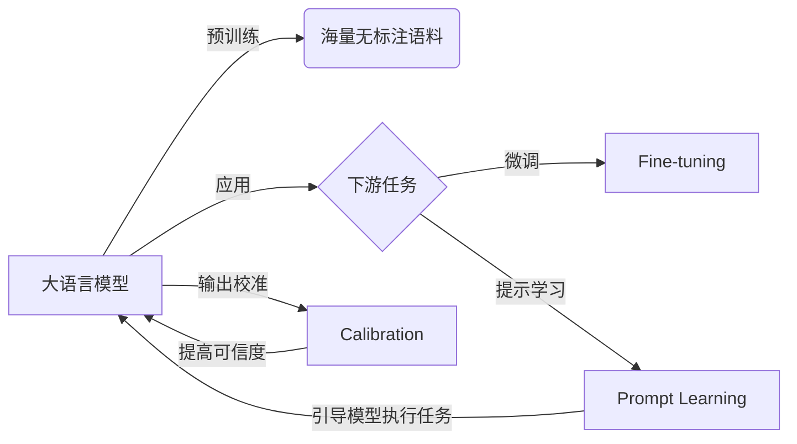

# 大语言模型原理基础与前沿 提示语言模型的校准

## 1.背景介绍
### 1.1 大语言模型的崛起
近年来,随着深度学习技术的飞速发展,特别是Transformer架构的提出,大规模预训练语言模型(Pretrained Language Models, PLMs)取得了突破性的进展。从BERT到GPT-3,再到近期的ChatGPT、LLaMA等,大语言模型展现出了惊人的自然语言理解和生成能力,在问答、对话、文本分类、机器翻译等诸多NLP任务上取得了远超人类的性能表现。

### 1.2 提示学习的兴起
伴随大语言模型能力的提升,如何更好地使用和适配预训练模型,成为了自然语言处理领域的研究热点。提示学习(Prompt Learning)作为一种新兴的范式,通过设计恰当的提示模板(prompt template),引导语言模型执行各类下游任务,无需或很少需要针对特定任务进行微调,展现出了巨大的潜力。

### 1.3 校准的重要性
然而,大语言模型虽然性能卓越,但并非完美无缺。由于在海量无标注语料上进行预训练,模型可能会习得数据中的偏见和错误知识。此外,模型输出缺乏可控性,容易产生不合理、有害或违背事实的结果。因此,对于实际应用,尤其是高风险场景,需要对语言模型进行必要的校准(calibration),以提高其可靠性和可解释性。本文将重点探讨提示语言模型校准的原理、方法与挑战。

## 2.核心概念与联系
### 2.1 大语言模型(Large Language Models)
大语言模型通常是指参数量巨大(数亿到上千亿)、在大规模无标注文本语料上进行预训练的神经网络模型。主流的大语言模型大多基于Transformer架构,通过自监督学习如掩码语言建模(Masked Language Modeling)、因果语言建模(Causal Language Modeling)等方式学习文本的统计规律和语义知识。预训练后的模型可以进一步用于下游任务的微调或提示学习。代表性的大语言模型有BERT、GPT系列、T5、PaLM等。

### 2.2 提示学习(Prompt Learning)
提示学习是一种利用语言模型先验知识,通过设计输入提示模板来引导模型执行特定任务的学习范式。核心思想是将下游任务转化为语言模型已经擅长的预测任务形式,通过自然语言指令、任务描述、少量示例(few-shot)等方式为模型提供必要的上下文信息。提示学习可以在冻结预训练模型参数的情况下,仅通过优化连续或离散的提示向量,快速适应各类任务。常见的提示学习方法包括手工提示(manual prompt)、自动提示(autoprompt)、软提示(soft prompt)等。

### 2.3 校准(Calibration)
校准是指对模型的输出概率进行调整,使其更加符合真实概率分布,提高模型预测的可信度。一个理想的校准模型,其输出的置信度应该和实际正确率相匹配。例如,对于模型预测置信度为0.8的样本,真实准确率也应接近0.8。常见的校准方法有Platt scaling、isotonic regression等。对语言模型的校准可以帮助减少错误和有害输出,提升可靠性。

### 2.4 概念之间的关系


## 3.核心算法原理具体操作步骤
### 3.1 提示语言模型校准的一般流程
提示语言模型校准通常包括以下几个关键步骤:
1. 准备校准数据集:收集一定量的输入-输出对,作为校准模型的训练和评估数据。
2. 设计提示模板:根据任务特点,设计合适的提示模板,引导语言模型生成所需的输出。
3. 生成模型输出:使用提示模板和校准数据集中的输入,利用语言模型生成相应的输出概率分布。
4. 训练校准模型:以语言模型输出的概率作为特征,真实标签作为目标,训练一个校准模型如logistic regression等。
5. 应用校准模型:对新样本,先用语言模型生成输出概率,再用校准模型进行校正,得到校准后的概率。
6. 评估校准效果:使用校准指标如ECE、Brier score等,评估校准前后模型的可信度变化。

### 3.2 代表性校准算法
#### 3.2.1 Platt Scaling
Platt Scaling是一种常用的校准方法,主要思想是在模型原始输出之上,再叠加一个logistic regression层,将原始输出映射到校准后的概率。设模型原始输出为$f(x)$,Platt Scaling定义校准后的概率为:

$$
P(y=1|x) = \frac{1}{1+\exp(Af(x)+B)}
$$

其中$A$和$B$是logistic regression的参数,通过最小化负对数似然损失进行优化:

$$
\mathcal{L} = -\sum_{i=1}^N \left[y_i \log p_i + (1-y_i)\log (1-p_i)\right]
$$

其中$p_i$是第$i$个样本的校准后概率。

#### 3.2.2 Temperature Scaling
Temperature Scaling是Platt Scaling的一个简化版本,通过引入一个温度参数$T$来调整模型输出的soft max分布。校准后的概率定义为:

$$
P(y=j|x) = \frac{\exp(f_j(x)/T)}{\sum_{k=1}^K \exp(f_k(x)/T)}
$$

其中$f_j(x)$是模型对第$j$个类别的原始输出。$T$通过最小化负对数似然损失进行优化:

$$
\mathcal{L} = -\sum_{i=1}^N \log P(y_i|x_i; T)
$$

Temperature Scaling相比Platt Scaling更加简单,但在实践中通常也能取得不错的校准效果。

#### 3.2.3 Histogram Binning
Histogram Binning通过将模型输出的概率分成若干个bin,然后对每个bin内的样本计算真实的正例比例,作为校准后的概率。具体步骤如下:
1. 将模型输出的概率范围$[0,1]$等分为$M$个bin。
2. 对每个bin $B_m$,计算其中真实标签为正例的样本比例:
$$
P(y=1|B_m) = \frac{1}{|B_m|}\sum_{x_i \in B_m} \mathbb{I}(y_i=1)
$$
3. 对新样本$x$,如果其模型输出概率落在bin $B_m$内,则校准后的概率为$P(y=1|B_m)$。

Histogram Binning是一种非参数的校准方法,适用于样本量较大的情况。

以上是几种常见的校准算法,实践中可以根据任务特点和数据情况选择合适的方法。此外,还可以将不同的校准方法进行组合,以进一步提升性能。

## 4.数学模型和公式详细讲解举例说明
本节以Platt Scaling为例,详细推导其数学原理和优化过程。

### 4.1 Platt Scaling的数学模型
假设有一个预训练的大语言模型$f(x)$,对于输入$x$,模型输出一个标量值$f(x) \in \mathbb{R}$,表示输入属于正例的raw score。Platt Scaling在此基础上,引入一个logistic regression层,将raw score映射为校准后的概率:

$$
P(y=1|x) = \sigma(Af(x)+B) = \frac{1}{1+\exp(-(Af(x)+B))}
$$

其中$\sigma(\cdot)$是logistic sigmoid函数,$A$和$B$是需要学习的参数。直观地看,$A$控制了校准曲线的陡峭程度,$B$控制了曲线的平移。

### 4.2 参数学习的优化目标
给定一个校准数据集$\mathcal{D}=\{(x_i, y_i)\}_{i=1}^N$,其中$y_i \in \{0,1\}$是样本$x_i$的真实标签。Platt Scaling通过最小化负对数似然损失来优化参数$A$和$B$:

$$
\mathcal{L}(A,B) = -\sum_{i=1}^N \left[y_i \log p_i + (1-y_i)\log (1-p_i)\right]
$$

其中$p_i=P(y=1|x_i)=\sigma(Af(x_i)+B)$是第$i$个样本的校准后概率。

### 4.3 参数优化的求解过程
对损失函数$\mathcal{L}(A,B)$求关于$A$和$B$的偏导数:

$$
\begin{aligned}
\frac{\partial \mathcal{L}}{\partial A} &= -\sum_{i=1}^N \left[y_i(1-p_i)f(x_i) - (1-y_i)p_if(x_i)\right] \\
&= -\sum_{i=1}^N (y_i-p_i)f(x_i) \\
\frac{\partial \mathcal{L}}{\partial B} &= -\sum_{i=1}^N \left[y_i(1-p_i) - (1-y_i)p_i\right] \\
&= -\sum_{i=1}^N (y_i-p_i)
\end{aligned}
$$

然后使用梯度下降法迭代更新参数:

$$
\begin{aligned}
A^{(t+1)} &= A^{(t)} - \eta \frac{\partial \mathcal{L}}{\partial A} \\
B^{(t+1)} &= B^{(t)} - \eta \frac{\partial \mathcal{L}}{\partial B}
\end{aligned}
$$

其中$\eta$是学习率。迭代直至损失函数收敛或达到预设的轮数。

### 4.4 举例说明
假设有一个二分类任务,使用BERT模型进行预测。对于一个输入样本$x$,BERT输出其属于正例的raw score为$f(x)=0.6$。如果直接将0.6作为概率输出,可能与真实概率分布不一致。

现在应用Platt Scaling进行校准。通过在校准集上训练,得到最优参数$A=1.2, B=-0.5$。则校准后的概率为:

$$
P(y=1|x) = \sigma(1.2 \times 0.6 - 0.5) = 0.55
$$

可以看到,校准后的概率(0.55)与原始输出(0.6)有一定差异。这是由于Platt Scaling根据校准集上的真实分布,对原始输出进行了调整,使其更加符合实际情况。

## 5.项目实践：代码实例和详细解释说明
下面给出了使用PyTorch实现Platt Scaling的示例代码,并对关键部分进行解释说明。

```python
import torch
import torch.nn as nn
import torch.optim as optim

# 定义Platt Scaling模型
class PlattScaling(nn.Module):
    def __init__(self):
        super(PlattScaling, self).__init__()
        self.a = nn.Parameter(torch.ones(1))
        self.b = nn.Parameter(torch.zeros(1))
    
    def forward(self, x):
        return torch.sigmoid(self.a * x + self.b)

# 准备校准数据集
def prepare_data(model, data_loader):
    model.eval()
    outputs = []
    labels = []
    with torch.no_grad():
        for input_ids, attention_mask, label in data_loader:
            logits = model(input_ids, attention_mask=attention_mask)[0]
            output = logits.squeeze(-1).tolist()
            outputs.extend(output)
            labels.extend(label.tolist())
    return torch.tensor(outputs), torch.tensor(labels)

# 训练Platt Scaling模型
def train_platt_scaling(model_outputs, true_labels, num_epochs=10, lr=0.01):
    platt_scaling = PlattScaling()
    criterion = nn.BCELoss()
    optimizer = optim.Adam(platt_scaling.parameters(), lr=lr)
    
    for epoch in range(num_epochs):
        optimizer.zero_grad()
        calibrated_probs = platt_scaling(model_outputs)
        loss = criterion(calibrated_probs, true_labels.float())
        loss.backward()
        optimizer.step()
        
        if (epoch + 1) % 5 == 0:
            print(f'Epoch [{epoch+1}/{num_epochs}], Loss: {loss.item():.4f}')
    
    return