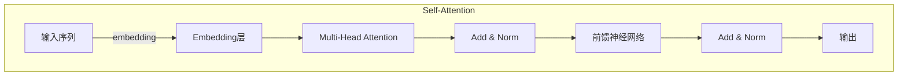
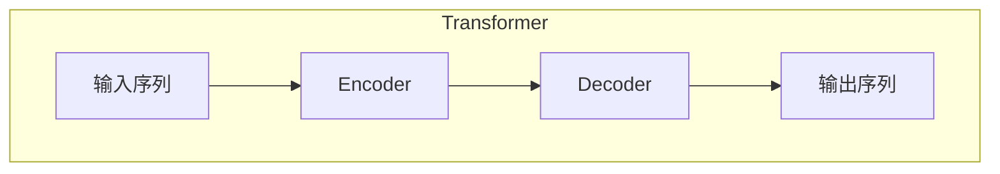
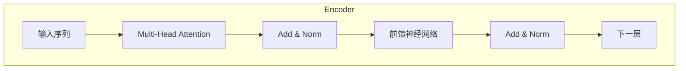
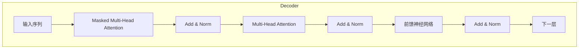

# 大语言模型原理基础与前沿 新时代的曙光

## 1.背景介绍

### 1.1 人工智能的演进

人工智能(Artificial Intelligence, AI)是一个旨在使机器能够模仿人类智能行为的研究领域。自20世纪50年代诞生以来,AI经历了几个重要的发展阶段。

- 早期阶段(1950s-1960s):专家系统、博弈论等初步探索
- 知识驱动阶段(1970s-1980s):知识库、逻辑推理等
- 统计学习阶段(1990s-2010s):机器学习、深度学习等
- 大模型阶段(2010s-至今):大规模预训练语言模型

### 1.2 大语言模型的兴起

近年来,benefitting from海量数据、算力提升和新算法,大规模预训练语言模型取得了突破性进展,成为AI发展的一个重要里程碑。这些巨大的神经网络模型在海量无标注文本数据上进行预训练,获得了广泛的知识和语言理解能力,可应用于自然语言处理的诸多任务中。

代表性的大语言模型包括:

- GPT(Generative Pre-trained Transformer)系列
- BERT(Bidirectional Encoder Representations from Transformers)
- XLNet
- RoBERTa
- ALBERT
- T5(Text-to-Text Transfer Transformer)
- ...

这些模型在自然语言理解、生成、翻译、问答等任务中表现出色,开启了AI的新时代。

## 2.核心概念与联系

### 2.1 自注意力机制(Self-Attention)

自注意力机制是大语言模型的核心,它能够捕捉输入序列中任意两个位置之间的关系,解决了RNN无法并行化和长期依赖问题。



### 2.2 transformer架构

Transformer是一种全新的基于自注意力机制的序列到序列模型,不依赖RNN或CNN,完全使用注意力机制。它包括编码器(Encoder)和解码器(Decoder)两个主要部分。



### 2.3 预训练与微调(Pre-training & Fine-tuning)

大语言模型采用两阶段策略:

1. 预训练(Pre-training): 在大规模无监督文本数据上训练模型,获得通用语言表示
2. 微调(Fine-tuning): 在特定任务的少量标注数据上继续训练,将通用表示转移到特定任务

这种策略大幅减少了标注数据需求,提高了性能。

### 2.4 模型压缩

由于大语言模型参数巨大,存在计算资源消耗大、推理慢、隐私泄露等问题。因此需要模型压缩技术如剪枝、量化、知识蒸馏等来缓解这些问题。

## 3.核心算法原理具体操作步骤

### 3.1 Self-Attention细节

给定一个长度为n的输入序列 $X = (x_1, x_2, ..., x_n)$,Self-Attention的计算过程如下:

1. 线性投影以获得Query(Q)、Key(K)和Value(V)矩阵:

$$\begin{aligned}
Q &= XW_Q \\
K &= XW_K \\
V &= XW_V
\end{aligned}$$

其中 $W_Q,W_K,W_V$ 为可训练的权重矩阵。

2. 计算注意力分数:

$$\text{Attention}(Q, K, V) = \text{softmax}(\frac{QK^T}{\sqrt{d_k}})V$$

其中 $d_k$ 为缩放因子,用于防止内积过大导致梯度消失。

3. 多头注意力机制(Multi-Head Attention):将注意力过程独立运行 $h$ 次,最后将结果拼接:

$$\text{MultiHead}(Q, K, V) = \text{Concat}(head_1, ..., head_h)W^O$$

其中 $head_i = \text{Attention}(QW_i^Q, KW_i^K, VW_i^V)$

### 3.2 Transformer编码器

Transformer编码器由N个相同的层组成,每层包括两个子层:

1. 多头自注意力子层
2. 全连接前馈神经网络子层

编码器的输出作为解码器的输入。



### 3.3 Transformer解码器  

解码器也由N个相同层组成,每层包括三个子层:

1. 掩码多头自注意力子层
2. 多头编码器-解码器注意力子层
3. 全连接前馈神经网络子层



### 3.4 预训练任务

常用的预训练任务包括:

- 掩码语言模型(Masked LM): 随机掩码部分输入token,模型需预测被掩码的token
- 下一句预测(Next Sentence Prediction): 判断两个句子是否为连续句子
- 因果语言模型(Causal LM): 基于前文预测下一个token
- 序列到序列(Seq2Seq): 输入序列到输出序列的生成

## 4.数学模型和公式详细讲解举例说明

### 4.1 Self-Attention数学原理

Self-Attention的核心思想是对每个词关注整个输入序列的不同位置,赋予不同的权重。具体来说,对于序列中的第i个词 $x_i$:

1. 将其映射到查询向量 $q_i = x_iW^Q$
2. 将所有词 $x_j$ 映射到键向量 $k_j = x_jW^K$ 和值向量 $v_j = x_jW^V$  
3. 计算查询向量 $q_i$ 与所有键向量的点积作为注意力分数: $e_{ij} = q_i^Tk_j$
4. 通过softmax归一化得到注意力权重: $\alpha_{ij} = \frac{exp(e_{ij})}{\sum_k exp(e_{ik})}$
5. 对值向量 $v_j$ 进行加权求和: $z_i = \sum_j \alpha_{ij}v_j$

即Self-Attention可表示为:

$$\text{Attention}(Q, K, V) = \text{softmax}(\frac{QK^T}{\sqrt{d_k}})V$$

其中 $\sqrt{d_k}$ 是缩放因子,防止点积过大导致梯度消失。

### 4.2 Transformer架构数学模型

#### 4.2.1 编码器(Encoder)

编码器将输入序列 $X=(x_1,...,x_n)$ 映射到连续的表示 $Z=(z_1,...,z_n)$:

$$Z = \text{Encoder}(X)$$

编码器由N个相同的层组成,每层包含两个子层:

1. 多头自注意力子层: $Z' = \text{MultiHead}(Z, Z, Z)$
2. 全连接前馈子层: $Z'' = \text{FeedForward}(Z')$

使用残差连接和层归一化:

$$Z^{(i+1)} = \text{LayerNorm}(Z^{(i)} + \text{Sublayer}(Z^{(i)}))$$

其中Sublayer为上述两个子层之一。

#### 4.2.2 解码器(Decoder) 

解码器将编码器输出Z和输入Y映射到输出序列 $Y'=(y'_1,...,y'_m)$:

$$Y' = \text{Decoder}(Z, Y)$$

解码器也由N个相同层组成,每层包含三个子层:

1. 掩码多头自注意力子层: $Y' = \text{MultiHead}(Y, Y, Y)$ 
2. 多头编码器-解码器注意力子层: $Y'' = \text{MultiHead}(Y', Z, Z)$
3. 全连接前馈子层: $Y''' = \text{FeedForward}(Y'')$

同样使用残差连接和层归一化。掩码机制确保每个位置的词只能关注之前的词。

### 4.3 注意力分数缩放

注意力分数 $e_{ij}$ 是查询向量 $q_i$ 和键向量 $k_j$ 的点积,当向量维度 $d_k$ 很大时,点积的方差也会变大。为了避免softmax函数的梯度较小(即梯度消失问题),需要对点积进行缩放:

$$\text{Attention}(Q, K, V) = \text{softmax}(\frac{QK^T}{\sqrt{d_k}})V$$

其中 $\sqrt{d_k}$ 是缩放因子,使点积的方差固定为1,从而避免梯度消失。

### 4.4 Multi-Head Attention

单一的注意力机制可能捕捉不到输入序列的所有重要关系。Multi-Head Attention通过独立运行多个注意力过程,再将结果拼接,来提高模型表达能力:  

$$\begin{aligned}
\text{MultiHead}(Q, K, V) &= \text{Concat}(head_1, ..., head_h)W^O\\
\text{where } head_i &= \text{Attention}(QW_i^Q, KW_i^K, VW_i^V)
\end{aligned}$$

其中 $W_i^Q,W_i^K,W_i^V,W^O$ 为可训练的投影矩阵。每个头专注于不同的子空间表示,最后拼接获得更全面的表示。

### 4.5 位置编码(Positional Encoding)

Transformer没有使用RNN或CNN获取序列顺序信息,而是使用位置编码将位置信息直接编码到序列的表示中。常用的位置编码公式为:

$$\begin{aligned}
PE_{(pos, 2i)} &= \sin(pos / 10000^{2i / d_{model}})\\
PE_{(pos, 2i+1)} &= \cos(pos / 10000^{2i / d_{model}})
\end{aligned}$$

其中pos为位置索引,i为维度索引。不同维度对应不同的正弦/余弦周期,从而编码位置信息。

## 5. 项目实践:代码实例和详细解释说明

以下是一个使用PyTorch实现Transformer的简化示例:

```python
import math
import torch
import torch.nn as nn

# 辅助缩放函数(Scaled Dot-Product Attention中的缩放因子)
def scaled_dot_product_attention(q, k, v, mask=None):
    # 输入的形状为(batch_size, nb_head, seq_len_q, d_head)
    matmul_qk = torch.matmul(q, k.transpose(-2, -1))  # (..., seq_len_q, seq_len_k)
    
    # 缩放
    dk = k.size()[-1]
    scaled_attention_logits = matmul_qk / math.sqrt(dk)

    # 掩码(mask出未来的token,出现在seq=1的位置)
    if mask is not None:
        scaled_attention_logits += (mask * -1e9)  
    
    # softmax
    attention_weights = scaled_attention_logits.softmax(dim=-1)  # (..., seq_len_q, seq_len_k)

    # 值与注意力权重的加权和
    output = torch.matmul(attention_weights, v)  # (..., seq_len_q, d_head)
    
    return output

# 多头注意力
class MultiHeadAttention(nn.Module):
    def __init__(self, d_model, nb_head):
        super().__init__()
        
        self.nb_head = nb_head
        self.d_head = d_model // nb_head
        
        self.q_linear = nn.Linear(d_model, d_model)
        self.v_linear = nn.Linear(d_model, d_model)
        self.k_linear = nn.Linear(d_model, d_model)
        self.fc = nn.Linear(d_model, d_model)
        
    def forward(self, x, mask=None):
        # 线性投影
        q = self.q_linear(x)  # (batch_size, seq_len_q, d_model)
        k = self.k_linear(x)  # (batch_size, seq_len_k, d_model)
        v = self.v_linear(x)  # (batch_size, seq_len_v, d_model)
        
        # 