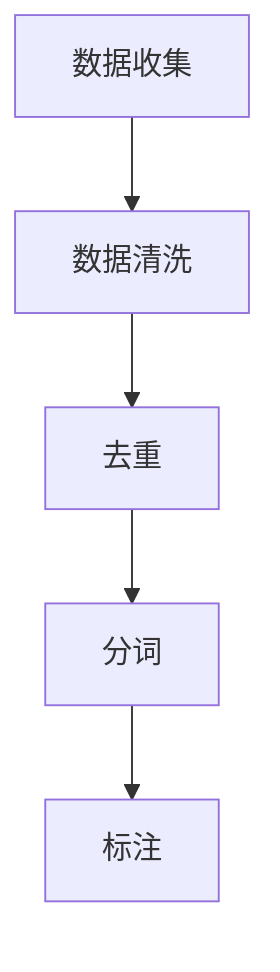
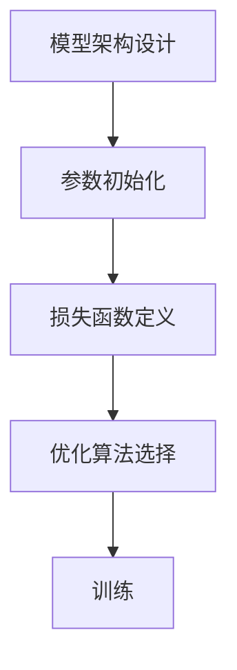
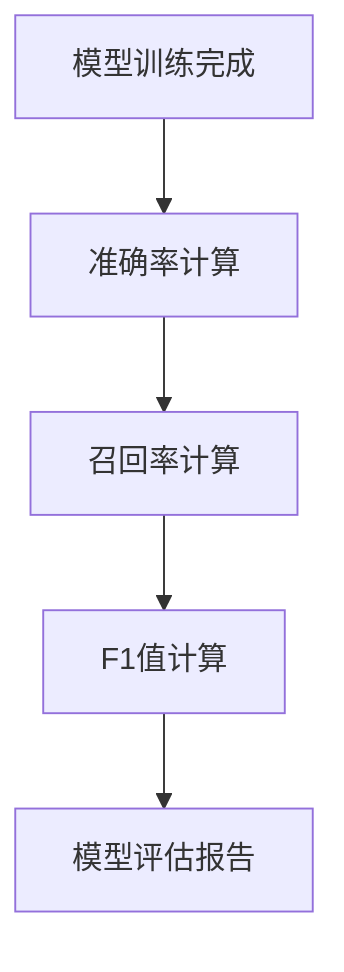

# 大语言模型原理基础与前沿 示范样本选择

## 1.背景介绍

大语言模型（Large Language Models, LLMs）是近年来人工智能领域的一个重要突破。它们通过处理和生成自然语言文本，展示了强大的理解和生成能力。大语言模型的成功不仅依赖于复杂的算法和强大的计算资源，还依赖于高质量的训练数据。本文将深入探讨大语言模型的原理基础与前沿技术，特别是示范样本选择的重要性。

## 2.核心概念与联系

### 2.1 大语言模型的定义

大语言模型是一种基于深度学习的自然语言处理模型，通常具有数十亿甚至数千亿的参数。它们通过大量的文本数据进行训练，能够生成与人类语言相似的文本。

### 2.2 训练数据的重要性

训练数据的质量直接影响大语言模型的性能。高质量的训练数据可以帮助模型更好地理解和生成自然语言，而低质量的数据则可能导致模型生成不准确或有偏见的文本。

### 2.3 示范样本选择的意义

示范样本选择是指在训练大语言模型时，如何选择和处理训练数据。合理的示范样本选择可以提高模型的训练效率和生成质量。

## 3.核心算法原理具体操作步骤

### 3.1 数据预处理

数据预处理是训练大语言模型的第一步。它包括数据清洗、去重、分词、标注等步骤。以下是一个典型的数据预处理流程：



### 3.2 模型训练

模型训练是大语言模型的核心步骤。它包括模型架构设计、参数初始化、损失函数定义、优化算法选择等。以下是一个典型的模型训练流程：



### 3.3 模型评估

模型评估是验证大语言模型性能的重要步骤。它包括准确率、召回率、F1值等指标的计算。以下是一个典型的模型评估流程：



## 4.数学模型和公式详细讲解举例说明

### 4.1 语言模型的数学定义

语言模型的目标是估计一个给定序列 $w_1, w_2, ..., w_T$ 的概率 $P(w_1, w_2, ..., w_T)$。根据链式法则，这个概率可以分解为：

$$
P(w_1, w_2, ..., w_T) = \prod_{t=1}^{T} P(w_t | w_1, w_2, ..., w_{t-1})
$$

### 4.2 损失函数

在训练过程中，我们通常使用交叉熵损失函数来衡量模型生成文本的质量。交叉熵损失函数定义为：

$$
L = -\frac{1}{N} \sum_{i=1}^{N} \sum_{t=1}^{T} \log P(w_t^{(i)} | w_1^{(i)}, w_2^{(i)}, ..., w_{t-1}^{(i)})
$$

其中，$N$ 是训练样本的数量，$T$ 是每个样本的长度，$w_t^{(i)}$ 是第 $i$ 个样本在时间步 $t$ 的单词。

### 4.3 优化算法

常用的优化算法包括随机梯度下降（SGD）、Adam等。以Adam优化算法为例，其更新规则为：

$$
m_t = \beta_1 m_{t-1} + (1 - \beta_1) g_t
$$

$$
v_t = \beta_2 v_{t-1} + (1 - \beta_2) g_t^2
$$

$$
\hat{m}_t = \frac{m_t}{1 - \beta_1^t}
$$

$$
\hat{v}_t = \frac{v_t}{1 - \beta_2^t}
$$

$$
\theta_t = \theta_{t-1} - \alpha \frac{\hat{m}_t}{\sqrt{\hat{v}_t} + \epsilon}
$$

其中，$g_t$ 是梯度，$m_t$ 和 $v_t$ 分别是梯度的一阶和二阶动量，$\alpha$ 是学习率，$\beta_1$ 和 $\beta_2$ 是动量衰减系数，$\epsilon$ 是一个小常数。

## 5.项目实践：代码实例和详细解释说明

### 5.1 数据预处理代码示例

以下是一个简单的数据预处理代码示例，使用Python和NLTK库：

```python
import nltk
from nltk.tokenize import word_tokenize
from nltk.corpus import stopwords

# 下载必要的资源
nltk.download('punkt')
nltk.download('stopwords')

# 数据清洗和去重
def clean_data(text):
    text = text.lower()
    text = ''.join([c for c in text if c.isalpha() or c.isspace()])
    return text

# 分词和去停用词
def preprocess(text):
    tokens = word_tokenize(text)
    stop_words = set(stopwords.words('english'))
    tokens = [word for word in tokens if word not in stop_words]
    return tokens

# 示例文本
text = "This is a sample text for preprocessing."
cleaned_text = clean_data(text)
tokens = preprocess(cleaned_text)
print(tokens)
```

### 5.2 模型训练代码示例

以下是一个简单的模型训练代码示例，使用PyTorch库：

```python
import torch
import torch.nn as nn
import torch.optim as optim

# 定义模型架构
class SimpleRNN(nn.Module):
    def __init__(self, input_size, hidden_size, output_size):
        super(SimpleRNN, self).__init__()
        self.rnn = nn.RNN(input_size, hidden_size, batch_first=True)
        self.fc = nn.Linear(hidden_size, output_size)

    def forward(self, x):
        out, _ = self.rnn(x)
        out = self.fc(out[:, -1, :])
        return out

# 初始化模型和优化器
model = SimpleRNN(input_size=10, hidden_size=20, output_size=1)
criterion = nn.CrossEntropyLoss()
optimizer = optim.Adam(model.parameters(), lr=0.001)

# 训练模型
for epoch in range(100):
    inputs = torch.randn(32, 10, 10)  # 示例输入
    labels = torch.randint(0, 2, (32,))  # 示例标签
    outputs = model(inputs)
    loss = criterion(outputs, labels)
    optimizer.zero_grad()
    loss.backward()
    optimizer.step()
    print(f'Epoch {epoch+1}, Loss: {loss.item()}')
```

### 5.3 模型评估代码示例

以下是一个简单的模型评估代码示例，使用Scikit-learn库：

```python
from sklearn.metrics import accuracy_score, recall_score, f1_score

# 示例预测和真实标签
y_true = [0, 1, 1, 0, 1]
y_pred = [0, 1, 0, 0, 1]

# 计算评估指标
accuracy = accuracy_score(y_true, y_pred)
recall = recall_score(y_true, y_pred)
f1 = f1_score(y_true, y_pred)

print(f'Accuracy: {accuracy}')
print(f'Recall: {recall}')
print(f'F1 Score: {f1}')
```

## 6.实际应用场景

### 6.1 自动文本生成

大语言模型可以用于自动生成高质量的文本，例如新闻报道、