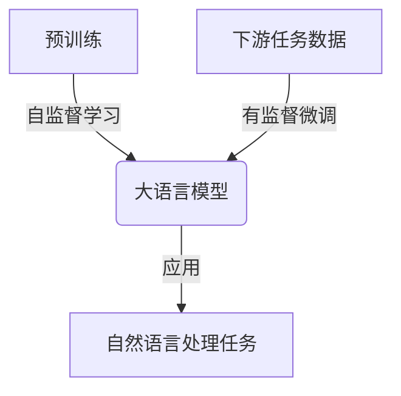
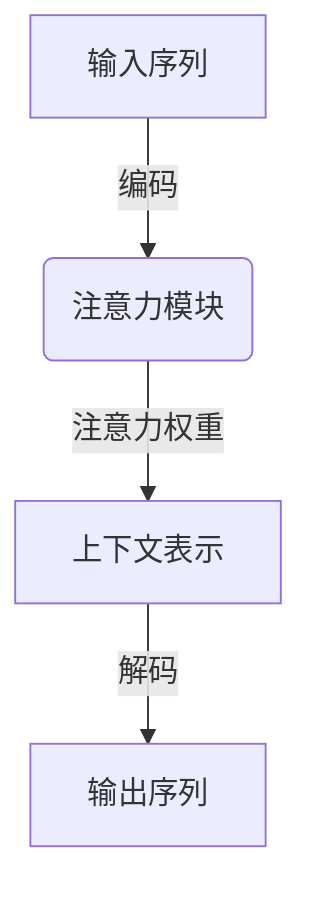
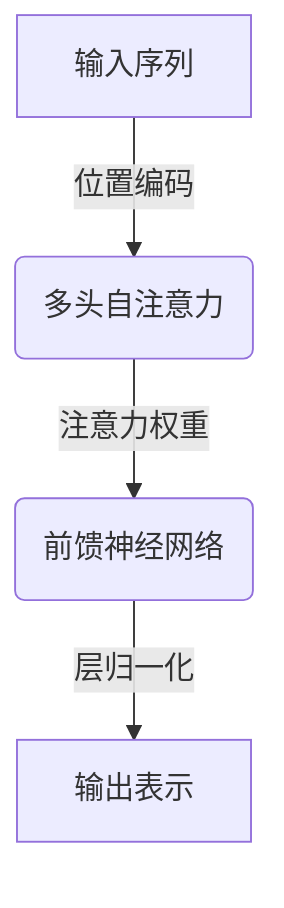
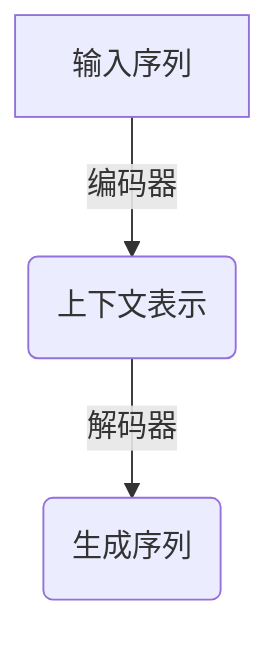

# 大语言模型应用指南：GPT-4V简介

## 1.背景介绍

### 1.1 人工智能的发展历程

人工智能(Artificial Intelligence, AI)是当代科技发展的重要领域,自20世纪50年代诞生以来,已经取得了长足的进步。早期的人工智能系统主要基于规则和逻辑推理,如专家系统、决策树等。随着计算能力和数据量的不断增长,机器学习(Machine Learning)技术开始兴起,使人工智能系统能够从海量数据中自动学习模式和规律。

### 1.2 深度学习的兴起

21世纪初,深度学习(Deep Learning)作为机器学习的一个新兴方向,取得了突破性进展。深度学习借鉴了人脑神经网络的结构和工作原理,通过构建深层次的神经网络模型,能够自动从原始数据中提取出多层次的抽象特征表示,显著提高了在计算机视觉、自然语言处理等领域的性能表现。

### 1.3 大语言模型的崛起

伴随着深度学习技术和计算能力的飞速发展,大型神经网络模型在自然语言处理领域取得了卓越的成就,催生了大语言模型(Large Language Model, LLM)的兴起。大语言模型通过在海量文本语料上进行预训练,学习捕捉语言的深层次语义和逻辑关系,从而具备出色的自然语言理解和生成能力。

GPT(Generative Pre-trained Transformer)是目前最著名的大语言模型之一,由OpenAI公司研发。GPT系列模型通过自回归(Autoregressive)的方式生成文本,可以用于多种自然语言处理任务,如机器翻译、文本摘要、问答系统、内容创作等。其中,GPT-4是该系列中最新的里程碑式模型,在性能和能力上都有重大突破。

## 2.核心概念与联系

### 2.1 自然语言处理(NLP)

自然语言处理是人工智能的一个重要分支,旨在使计算机能够理解和生成人类语言。它包括多个子领域,如机器翻译、文本分类、信息抽取、问答系统、对话系统等。大语言模型作为NLP领域的关键技术,为这些任务提供了强大的语言理解和生成能力。

### 2.2 预训练与微调(Pre-training & Fine-tuning)

大语言模型采用了预训练与微调的范式。预训练阶段是在海量无标注文本语料上进行自监督学习,捕捉语言的一般性知识和规律;微调阶段则是在特定的下游任务数据上进行有监督训练,使模型适应具体的应用场景。这种分两步的方法大大提高了模型的学习效率和性能表现。

### 2.3 注意力机制(Attention Mechanism)

注意力机制是大语言模型的核心技术之一。传统的序列模型(如RNN)受到输入长度的限制,难以捕捉长距离依赖关系。注意力机制则允许模型在编码序列时,对不同位置的输入词元赋予不同的注意力权重,从而更好地建模长期依赖关系,提高了模型的表现能力。

### 2.4 transformer架构

Transformer是大语言模型中广泛采用的一种全新的序列模型架构。它完全基于注意力机制,摒弃了RNN的递归结构,使用多头自注意力(Multi-Head Self-Attention)和位置编码(Positional Encoding)来捕捉输入序列的长期依赖关系,同时支持并行计算,大幅提升了模型的训练效率。

### 2.5 语义表示(Semantic Representation)

大语言模型通过在海量语料上预训练,学习到了丰富的语义知识,能够捕捉词语、短语和句子之间的语义关联。这种分布式语义表示使得模型能够很好地理解自然语言的含义,并生成与上下文相关的自然语言输出。

## 3.核心算法原理具体操作步骤  

### 3.1 GPT-4的总体架构

GPT-4是一种基于Transformer的大型自回归语言模型,采用了自编码器(Auto-Encoder)和自回归(Autoregressive)的混合架构。它由两个主要部分组成:编码器(Encoder)和解码器(Decoder)。

#### 3.1.1 编码器(Encoder)

编码器的作用是从输入序列中提取出语义表示,即上下文表示(Context Representation)。它由多个Transformer编码器层堆叠而成,每一层都包含多头自注意力(Multi-Head Self-Attention)和前馈神经网络(Feed-Forward Neural Network)。

1. 位置编码(Positional Encoding):将输入序列的位置信息编码到序列的表示中。
2. 多头自注意力(Multi-Head Self-Attention):捕捉输入序列中每个词元与其他词元之间的关系。
3. 前馈神经网络(Feed-Forward Neural Network):对每个词元的表示进行非线性变换,提取更高层次的特征。
4. 层归一化(Layer Normalization):对每层的输出进行归一化,提高模型的稳定性和收敛速度。

#### 3.1.2 解码器(Decoder)

解码器的作用是根据编码器提供的上下文表示,自回归地生成目标序列。它由多个Transformer解码器层堆叠而成,每一层包含掩码多头自注意力(Masked Multi-Head Self-Attention)、编码器-解码器注意力(Encoder-Decoder Attention)和前馈神经网络。

1. 掩码多头自注意力(Masked Multi-Head Self-Attention):捕捉已生成序列中词元之间的关系,但遮蔽未来位置的信息。
2. 编码器-解码器注意力(Encoder-Decoder Attention):将解码器的隐藏状态与编码器的上下文表示进行注意力计算。
3. 前馈神经网络(Feed-Forward Neural Network):对每个词元的表示进行非线性变换。
4. 层归一化(Layer Normalization):对每层的输出进行归一化。

在生成序列的过程中,解码器会自回归地预测下一个词元,并将其作为输入,重复该过程直到生成完整序列或达到最大长度。

### 3.2 GPT-4的预训练过程

GPT-4在预训练阶段采用了自监督学习的方式,在大规模无标注文本语料上进行训练,目标是最大化语言模型的概率,即最小化下一个词元的交叉熵损失。具体步骤如下:

1. 数据预处理:将原始文本语料进行标记化(Tokenization)、填充(Padding)等预处理,转换为模型可以接受的输入格式。
2. 构建数据批次:将预处理后的数据按批次(Batch)组织,以提高训练效率。
3. 前向传播:输入数据批次,通过编码器获取上下文表示,再由解码器自回归地生成目标序列。
4. 计算损失:将解码器生成的序列与真实序列进行比较,计算交叉熵损失。
5. 反向传播:根据损失值,计算模型参数的梯度,并使用优化算法(如Adam)更新模型参数。
6. 重复3-5步骤,直到模型收敛或达到预设的训练轮数。

预训练过程中还会采用一些技术来提高模型性能,如梯度裁剪(Gradient Clipping)、层归一化(Layer Normalization)、残差连接(Residual Connection)等。

### 3.3 GPT-4的微调过程

预训练完成后,GPT-4可以在特定的下游任务数据上进行微调(Fine-tuning),使模型适应具体的应用场景。微调过程与预训练类似,但有以下几点不同:

1. 数据准备:根据下游任务,准备相应的训练数据集,通常需要进行标注和特定的数据预处理。
2. 模型初始化:使用预训练好的GPT-4模型参数作为初始值,而不是从头开始训练。
3. 训练目标:根据下游任务的性质,设置合适的训练目标和损失函数,如分类任务使用交叉熵损失,生成任务使用语言模型损失等。
4. 微调策略:可以选择只微调模型的部分层,或对不同层使用不同的学习率,以提高效率和性能。
5. 早停(Early Stopping):通过在验证集上监控模型的性能,决定何时停止训练以防止过拟合。

通过微调,GPT-4可以在保留预训练获得的通用语言知识的同时,专门针对特定任务进行优化,从而获得更好的性能表现。

## 4.数学模型和公式详细讲解举例说明

### 4.1 自注意力机制(Self-Attention Mechanism)

自注意力机制是Transformer模型的核心部分,它允许模型在编码输入序列时,对不同位置的词元赋予不同的注意力权重,从而更好地捕捉长期依赖关系。具体计算过程如下:

给定一个长度为 $n$ 的输入序列 $X = (x_1, x_2, \dots, x_n)$,我们首先将其映射到一个维度为 $d_k$ 的键(Key)向量序列 $K = (k_1, k_2, \dots, k_n)$,以及维度为 $d_v$ 的值(Value)向量序列 $V = (v_1, v_2, \dots, v_n)$:

$$k_i = W^K x_i, \quad v_i = W^V x_i$$

其中 $W^K \in \mathbb{R}^{d_k \times d_x}$ 和 $W^V \in \mathbb{R}^{d_v \times d_x}$ 分别是键和值的线性变换矩阵。

接下来,我们计算查询(Query)向量 $q \in \mathbb{R}^{d_k}$ 与所有键向量的点积,得到一个长度为 $n$ 的注意力分数向量:

$$\text{Attention}(q, K) = \text{softmax}\left(\frac{qK^T}{\sqrt{d_k}}\right)$$

其中 $\sqrt{d_k}$ 是一个缩放因子,用于防止点积的值过大或过小。注意力分数向量表示了查询向量对输入序列中每个位置的注意力权重。

然后,我们将注意力分数向量与值向量序列 $V$ 进行加权求和,得到注意力输出:

$$\text{Attention}(q, K, V) = \text{Attention}(q, K)V$$

注意力输出是一个维度为 $d_v$ 的向量,它综合了输入序列中所有位置的信息,并根据查询向量 $q$ 的注意力分布进行了加权求和。

在实际应用中,通常会使用多头自注意力(Multi-Head Self-Attention),即将注意力机制独立运行多次,每次使用不同的线性变换矩阵,然后将多个注意力输出拼接起来,以捕捉不同的注意力模式。

### 4.2 交叉熵损失(Cross-Entropy Loss)

在自然语言生成任务中,交叉熵损失是一种常用的损失函数,用于衡量模型预测的概率分布与真实分布之间的差异。给定一个长度为 $n$ 的目标序列 $Y = (y_1, y_2, \dots, y_n)$,以及模型预测的概率分布序列 $P = (p_1, p_2, \dots, p_n)$,其中 $p_i$ 是一个维度为 $|V|$ 的概率向量,表示在第 $i$ 个位置预测每个词元的概率, $|V|$ 是词表的大小。交叉熵损失可以表示为:

$$\text{Loss}_{CE} = -\frac{1}{n}\sum_{i=1}^{n}\log p_i[y_i]$$

其中 