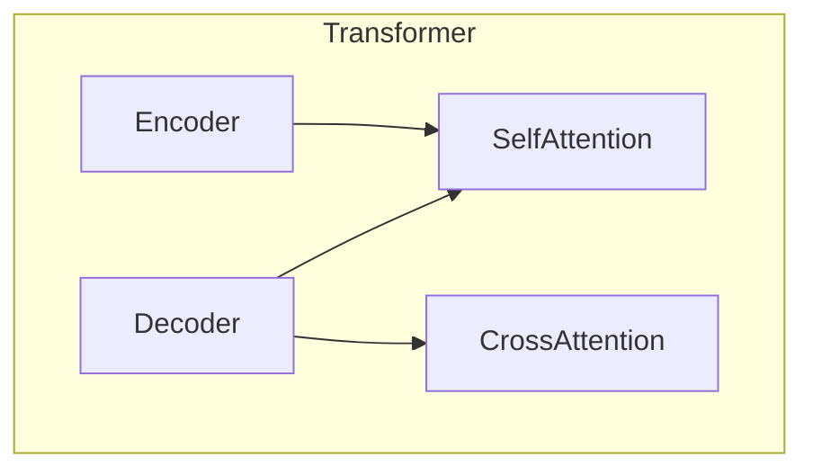
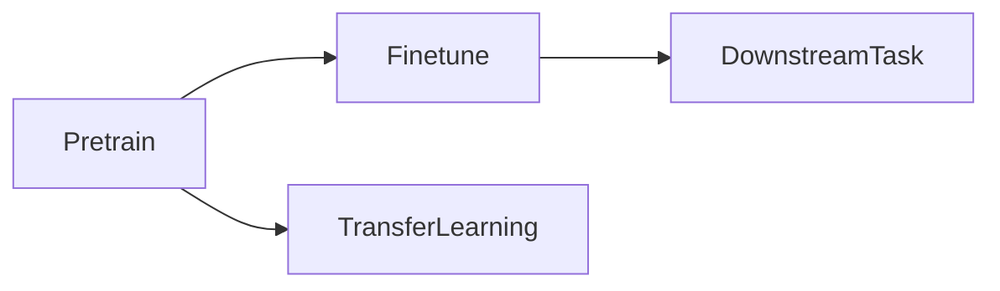
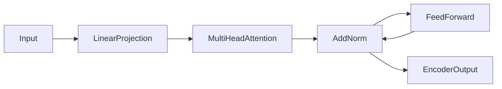
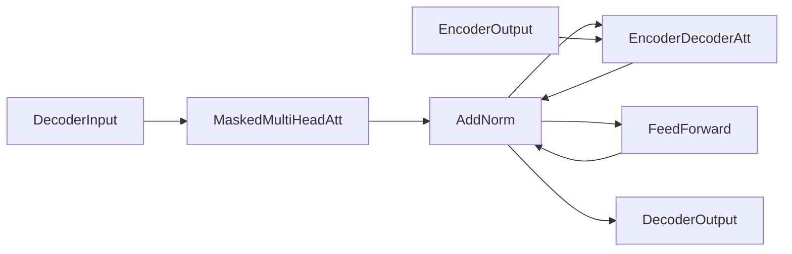

# 大语言模型应用指南：OpenAI大语言模型简介

## 1. 背景介绍

### 1.1 人工智能的发展历程

人工智能(Artificial Intelligence, AI)是当代科技发展的热点领域之一。自20世纪50年代诞生以来,AI经历了几个重要的发展阶段:

1. 早期阶段(1950s-1960s):专家系统、博弈理论等奠基性工作。
2. 知识迁徙时期(1970s-1980s):发展了知识表示、推理等技术。
3. 机器学习时代(1990s-2010s):决策树、支持向量机、神经网络等算法兴起。
4. 深度学习时代(2010s-至今):受益于大数据和算力提升,深度神经网络取得突破性进展。

### 1.2 大语言模型的兴起

在深度学习时代,自然语言处理(Natural Language Processing, NLP)成为AI的一个重要分支。传统的NLP方法主要基于规则和统计模型,但存在一定局限性。2018年,谷歌的Transformer模型和OpenAI的GPT(Generative Pre-trained Transformer)模型开启了大语言模型的新时代。

大语言模型是一种基于自注意力机制的全新神经网络架构,可以从大规模语料中学习丰富的语义和上下文信息。相比传统方法,大语言模型具有以下优势:

- 无需人工设计复杂的特征工程
- 可以通过预训练学习通用语言表示
- 具有强大的泛化能力,可迁移到各种下游任务

## 2. 核心概念与联系

### 2.1 Transformer架构

Transformer是大语言模型的核心架构,由编码器(Encoder)和解码器(Decoder)组成。编码器将输入序列映射为上下文表示,解码器则基于编码器输出和之前生成的tokens预测下一个token。

Transformer的关键创新是引入了自注意力(Self-Attention)机制,可以直接捕获序列中任意两个位置之间的依赖关系,从而更好地建模长距离依赖。



### 2.2 预训练与微调

大语言模型通常采用两阶段训练策略:

1. **预训练(Pre-training)**: 在大规模无监督语料上训练模型,学习通用的语言表示。常用的预训练目标包括掩码语言模型(Masked Language Modeling)和下一句预测(Next Sentence Prediction)等。

2. **微调(Fine-tuning)**: 将预训练模型的参数作为初始化,在特定任务的有监督数据上进行进一步训练,使模型适应目标任务。

通过预训练-微调范式,大语言模型可以有效地迁移通用语言知识,显著提高下游任务的性能。



### 2.3 OpenAI GPT系列

OpenAI是大语言模型领域的先驱者,其GPT(Generative Pre-trained Transformer)系列模型具有里程碑意义:

- **GPT(2018)**: 第一个基于Transformer的大规模预训练语言模型,展示了预训练-微调范式的强大潜力。
- **GPT-2(2019)**: 更大规模的模型(15亿参数),引发了对大模型可能带来的风险的讨论。
- **GPT-3(2020)**: 巨大的175亿参数模型,在广泛的任务上展现出惊人的零样本(Few-shot)和少样本(Few-shot)学习能力。
- **InstructGPT(2022)**: 针对指令跟随任务(Instruction Following)进行了优化,可以更好地理解和执行人类指令。
- **GPT-4(2023)**: 最新发布的多模态大语言模型,不仅能处理文本,还能理解和生成图像、视频等多种模态数据。

OpenAI GPT系列模型的发展,推动了大语言模型在自然语言处理、多模态学习等领域的广泛应用。

## 3. 核心算法原理具体操作步骤

### 3.1 Transformer编码器

Transformer编码器的核心是多头自注意力(Multi-Head Self-Attention)机制,其计算过程如下:

1. **线性投影**: 将输入序列 $X = (x_1, x_2, ..., x_n)$ 分别投影到查询(Query)、键(Key)和值(Value)空间:

   $$Q = XW^Q, K = XW^K, V = XW^V$$

   其中 $W^Q, W^K, W^V$ 为可学习的投影矩阵。

2. **计算注意力分数**: 计算查询 $Q$ 与所有键 $K$ 的点积,获得注意力分数矩阵 $A$:

   $$A = \text{softmax}(\frac{QK^T}{\sqrt{d_k}})$$

   其中 $d_k$ 为缩放因子,用于避免点积过大导致梯度消失。

3. **加权求和**: 将注意力分数矩阵 $A$ 与值 $V$ 相乘,得到加权和作为编码器输出:

   $$\text{Encoder Output} = AV$$

为了捕获不同子空间的信息,Transformer使用了多头注意力机制,将上述过程独立执行多次,最后将各头的输出拼接。



### 3.2 Transformer解码器

解码器的结构与编码器类似,但增加了两个注意力子层:

1. **掩码多头自注意力**: 用于捕获输出序列的内部依赖关系,并通过掩码机制防止看到未来的tokens。
2. **编码器-解码器注意力**: 将编码器输出作为键和值,解码器输入作为查询,捕获输入和输出序列之间的依赖关系。

解码器的计算过程如下:

1. 执行掩码多头自注意力,获得自注意力输出 $S$。
2. 将 $S$ 与编码器输出 $E$ 进行编码器-解码器注意力计算,获得交叉注意力输出 $C$。
3. 对 $C$ 进行前馈网络变换,得到解码器输出 $D$。

$$S = \text{MaskMultiHeadAtt}(Q_d, K_d, V_d)$$
$$C = \text{MultiHeadAtt}(S, E, E)$$
$$D = \text{FeedForward}(C)$$

通过自回归(Autoregressive)方式,解码器可以根据之前生成的tokens预测下一个token,实现序列生成任务。



### 3.3 预训练目标

大语言模型的预训练通常采用以下两种目标:

1. **掩码语言模型(Masked Language Modeling, MLM)**: 随机掩码部分输入tokens,模型需要预测被掩码的tokens。这种方式可以让模型学习双向上下文信息。

2. **下一句预测(Next Sentence Prediction, NSP)**: 给定两个句子,模型需要预测它们是否为连续的句子对。这种目标可以让模型捕获更长距离的依赖关系。

在预训练过程中,模型会最小化掩码tokens和下一句预测的交叉熵损失函数。通过在大规模语料上预训练,模型可以学习到丰富的语义和上下文知识。

## 4. 数学模型和公式详细讲解举例说明

### 4.1 注意力机制

注意力机制是Transformer的核心,它通过计算查询(Query)与键(Key)的相关性,为每个查询分配对应的值(Value)的权重,从而聚焦于输入序列的相关部分。

对于给定的查询 $q$、键 $K = (k_1, k_2, ..., k_n)$ 和值 $V = (v_1, v_2, ..., v_n)$,注意力分数 $\alpha$ 计算如下:

$$\alpha_i = \text{score}(q, k_i) = \frac{q \cdot k_i}{\sqrt{d_k}}$$

其中 $d_k$ 为缩放因子,用于避免点积过大导致梯度消失。接着通过 softmax 函数获得注意力权重:

$$\alpha = \text{softmax}(\alpha) = \left(\frac{e^{\alpha_1}}{\sum_j e^{\alpha_j}}, \frac{e^{\alpha_2}}{\sum_j e^{\alpha_j}}, ..., \frac{e^{\alpha_n}}{\sum_j e^{\alpha_j}}\right)$$

最终,注意力输出为加权和:

$$\text{Attention Output} = \sum_{i=1}^n \alpha_i v_i$$

注意力机制允许模型动态地分配不同位置的权重,从而更好地捕获长距离依赖关系。

### 4.2 多头注意力

为了从不同的子空间捕获信息,Transformer使用了多头注意力(Multi-Head Attention)机制。具体来说,将查询/键/值先进行线性投影,得到 $h$ 组投影后的表示:

$$\begin{aligned}
Q^{(1)}, K^{(1)}, V^{(1)} &= QW_Q^{(1)}, KW_K^{(1)}, VW_V^{(1)} \\
Q^{(2)}, K^{(2)}, V^{(2)} &= QW_Q^{(2)}, KW_K^{(2)}, VW_V^{(2)} \\
&...\\
Q^{(h)}, K^{(h)}, V^{(h)} &= QW_Q^{(h)}, KW_K^{(h)}, VW_V^{(h)}
\end{aligned}$$

其中 $W_Q^{(i)}, W_K^{(i)}, W_V^{(i)}$ 为第 $i$ 头的投影矩阵。然后分别计算每一头的注意力输出,最后将所有头的输出拼接:

$$\text{MultiHead}(Q, K, V) = \text{Concat}(\text{head}_1, \text{head}_2, ..., \text{head}_h)W^O$$

其中 $\text{head}_i = \text{Attention}(Q^{(i)}, K^{(i)}, V^{(i)})$, $W^O$ 为可学习的线性变换矩阵。

多头注意力机制赋予了模型从不同表示子空间获取信息的能力,提高了模型的表达能力。

### 4.3 位置编码

由于Transformer没有使用循环或卷积神经网络来直接捕获序列的顺序信息,因此需要一些额外的位置信息。Transformer使用位置编码(Positional Encoding)的方式将位置信息编码到输入序列中。

对于序列中的第 $i$ 个位置,其位置编码 $PE(pos, 2i)$ 和 $PE(pos, 2i+1)$ 分别为:

$$\begin{aligned}
PE(pos, 2i) &= \sin\left(\frac{pos}{10000^{\frac{2i}{d_{model}}}}\right) \\
PE(pos, 2i+1) &= \cos\left(\frac{pos}{10000^{\frac{2i}{d_{model}}}}\right)
\end{aligned}$$

其中 $pos$ 为位置索引, $d_{model}$ 为模型的embedding维度。这种基于三角函数的位置编码可以很好地编码绝对位置信息,并且在不同位置上是不同的。

位置编码会直接加到输入embedding上,使Transformer能够有效地捕获序列的位置信息。

## 5. 项目实践: 代码实例和详细解释说明

以下是使用PyTorch实现Transformer编码器的简化代码示例:

```python
import torch
import torch.nn as nn
import math

# 定义缩放因子
def scaled_dot_product_attention(q, k, v, mask=None):
    # 计算注意力分数
    attn_scores = torch.matmul(q, k.transpose(-2, -1)) / math.sqrt(q.size(-1))
    if mask is not None:
        attn_scores = attn_scores.masked_fill(mask == 0, -1e9)
    # 计算注意力权重
    attn_weights = nn.Softmax(dim=-1)(attn_scores)
    # 计算加权和作为注意力输出
    attn_output = torch.matmul(attn_weights, v)
    return attn_output, attn_weights

# 多头注意力层