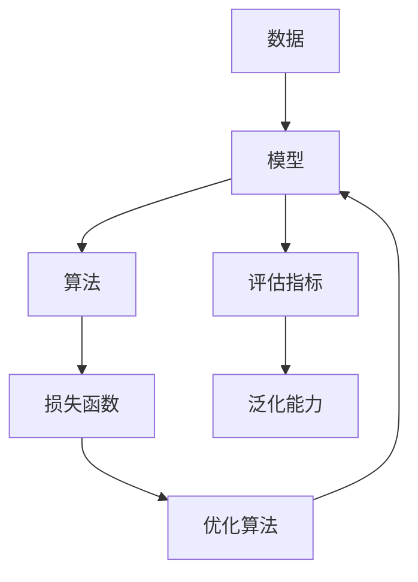
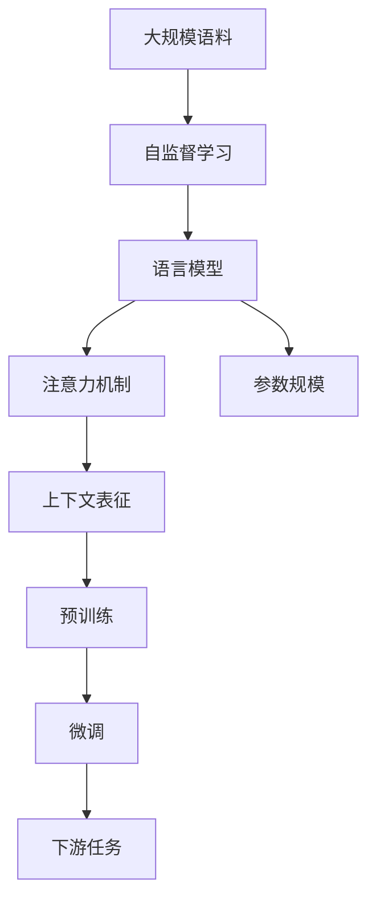

# 大语言模型应用指南：什么是机器学习

## 1.背景介绍

机器学习是一门研究如何从数据中学习的计算机科学领域。它在人工智能领域扮演着关键角色,使计算机系统能够基于经验自动改进性能,而无需显式编程。随着大数据时代的到来,海量数据的积累为机器学习提供了广阔的应用空间。

机器学习已广泛应用于图像识别、自然语言处理、推荐系统、金融风险控制等诸多领域,极大地提高了工作效率,优化了决策过程。其中,大语言模型是机器学习在自然语言处理领域的杰出代表,展现出令人惊叹的语言理解和生成能力。

### 1.1 大语言模型概述

大语言模型是一种基于大规模语料训练的深度神经网络模型,旨在捕捉语言的内在规律和语义信息。这些模型通过自监督学习方式,从海量文本数据中学习语言的统计规律,形成对语言的深层次表征。

目前,大语言模型主要分为两大类:

- **编码器-解码器模型**:将输入序列编码为向量表示,再由解码器从该向量生成输出序列,如机器翻译、文本摘要等任务。
- **自回归模型**:基于已生成的文本,自回归地预测下一个词或标记,如GPT、BERT等。

大语言模型在多种自然语言处理任务中表现出色,成为了语言理解和生成的通用基础模型。

### 1.2 大语言模型的发展历程

- **2018年**: Transformer模型及BERT模型问世,开启了大语言模型的新纪元。
- **2019年**: GPT-2和XLNet等模型进一步扩大了模型规模,展现出强大的语言生成能力。
- **2020年**: GPT-3凭借1750亿参数的庞大规模,引发了广泛关注和讨论。
- **2022年**: PaLM、Chinchilla等模型通过改进训练策略,在参数规模较小时也能取得优异表现。

大语言模型的发展离不开算力、数据和算法的共同推动,未来仍有广阔的发展空间。

## 2.核心概念与联系

### 2.1 机器学习的核心概念

机器学习的核心概念包括:

1. **数据**:机器学习模型从数据中学习,因此高质量的数据是关键。
2. **模型**:对数据的数学抽象,用于捕捉数据中的规律和模式。
3. **算法**:训练模型的方法,常用算法包括监督学习、无监督学习和强化学习等。
4. **损失函数**:衡量模型预测与真实值之间的差距,是优化算法的目标函数。
5. **优化算法**:通过迭代调整模型参数,最小化损失函数,提高模型性能。
6. **评估指标**:衡量模型性能的标准,如准确率、召回率、F1分数等。
7. **泛化能力**:模型在新数据上的表现,反映了模型的实际应用价值。

### 2.2 大语言模型的核心概念

大语言模型的核心概念包括:

1. **自监督学习**:利用大量未标注语料进行训练,无需人工标注。
2. **注意力机制**:捕捉输入序列中不同位置元素之间的依赖关系。
3. **语言模型**:基于上文预测下一个词或标记的概率分布模型。
4. **预训练与微调**:先在大规模语料上预训练,再在特定任务上微调。
5. **上下文表征**:模型对输入序列的上下文语义信息的编码表示。
6. **参数规模**:模型参数数量,通常越大性能越好,但计算代价也越高。

机器学习和大语言模型的核心概念相辅相成,共同推动了自然语言处理领域的发展。

## 3.核心算法原理具体操作步骤 

### 3.1 Transformer模型

Transformer是大语言模型的核心算法之一,其基于自注意力机制,能够更好地捕捉长距离依赖关系。Transformer的主要组成部分包括:

1. **嵌入层**:将输入词元(token)映射为向量表示。
2. **多头注意力层**:通过自注意力机制,计算不同位置词元之间的相关性权重。
3. **前馈神经网络**:对注意力输出进行非线性变换,提取更高级特征。
4. **规范化层**:加速收敛,提高模型稳定性。

Transformer的训练过程包括以下步骤:

1. 输入序列经过嵌入层,得到初始向量表示。
2. 多头注意力层计算注意力权重,捕捉输入序列中元素之间的依赖关系。
3. 前馈神经网络对注意力输出进行非线性变换,提取更高级特征。
4. 残差连接和层归一化,加速收敛,提高模型稳定性。
5. 对于编码器-解码器模型,解码器会基于编码器输出和前一时间步的输出,自回归地生成序列。
6. 根据任务目标计算损失函数,通过反向传播算法优化模型参数。

Transformer模型的自注意力机制和残差连接设计,使其能够更好地捕捉长距离依赖关系,成为大语言模型的核心算法基础。

### 3.2 BERT模型

BERT(Bidirectional Encoder Representations from Transformers)是一种基于Transformer的双向编码器模型,能够同时捕捉输入序列中左右上下文的信息。BERT的预训练过程包括以下两个任务:

1. **掩码语言模型(Masked Language Model, MLM)**:随机掩码部分输入词元,模型需要基于其他词元预测被掩码的词元。
2. **下一句预测(Next Sentence Prediction, NSP)**:判断两个句子是否为连续句子,捕捉句子级别的关系。

BERT的预训练步骤如下:

1. 从语料库中采样句子对,对其中一个句子随机掩码部分词元。
2. 将句子对输入BERT模型,模型需要预测被掩码的词元,以及判断两个句子是否连续。
3. 计算MLM和NSP任务的损失函数,通过反向传播算法优化BERT模型参数。

经过上述预训练后,BERT模型获得了对语言的深层次表征能力。在下游任务上,只需要对BERT模型进行少量微调,即可完成诸如文本分类、问答系统等任务。

BERT模型的双向编码特性和预训练任务设计,使其能够捕捉更丰富的语义信息,成为大语言模型的里程碑式模型。

### 3.3 GPT模型

GPT(Generative Pre-trained Transformer)是一种基于Transformer的自回归语言模型,专注于语言生成任务。GPT模型的预训练过程是在大规模语料上最大化语言模型的对数似然,即预测下一个词元的概率。

GPT模型的预训练步骤如下:

1. 从语料库中采样文本序列。
2. 将文本序列输入GPT模型,模型需要基于前面的词元,自回归地预测下一个词元。
3. 计算语言模型的对数似然损失函数,通过反向传播算法优化GPT模型参数。

经过预训练后,GPT模型能够生成连贯、流畅的文本。在下游任务上,可以将任务输入拼接到GPT模型的输入中,对模型进行少量微调,即可完成诸如机器翻译、文本摘要等任务。

GPT模型的自回归特性使其擅长语言生成,成为大语言模型在文本生成领域的代表。GPT-2和GPT-3等后续版本通过扩大模型规模和改进训练策略,进一步提升了语言生成质量。

## 4.数学模型和公式详细讲解举例说明

### 4.1 自注意力机制

自注意力机制是Transformer模型的核心,能够捕捉输入序列中任意两个位置元素之间的依赖关系。给定一个长度为 $n$ 的输入序列 $\boldsymbol{X} = (x_1, x_2, \dots, x_n)$,自注意力机制的计算过程如下:

1. 线性投影:将输入序列 $\boldsymbol{X}$ 分别投影到查询(Query)、键(Key)和值(Value)空间,得到 $\boldsymbol{Q}$、$\boldsymbol{K}$ 和 $\boldsymbol{V}$。

$$\begin{aligned}
\boldsymbol{Q} &= \boldsymbol{X}\boldsymbol{W}^Q \\
\boldsymbol{K} &= \boldsymbol{X}\boldsymbol{W}^K \\
\boldsymbol{V} &= \boldsymbol{X}\boldsymbol{W}^V
\end{aligned}$$

其中 $\boldsymbol{W}^Q$、$\boldsymbol{W}^K$ 和 $\boldsymbol{W}^V$ 是可学习的投影矩阵。

2. 计算注意力权重:通过查询与键的点积,计算每个位置对其他位置的注意力权重。

$$\text{Attention}(\boldsymbol{Q}, \boldsymbol{K}, \boldsymbol{V}) = \text{softmax}\left(\frac{\boldsymbol{Q}\boldsymbol{K}^\top}{\sqrt{d_k}}\right)\boldsymbol{V}$$

其中 $d_k$ 是缩放因子,用于防止点积值过大导致梯度消失。

3. 多头注意力:将注意力机制扩展到多个子空间,捕捉不同的依赖关系,最后将多个子空间的注意力输出拼接。

$$\begin{aligned}
\text{MultiHead}(\boldsymbol{Q}, \boldsymbol{K}, \boldsymbol{V}) &= \text{Concat}(\text{head}_1, \dots, \text{head}_h)\boldsymbol{W}^O \\
\text{where}\  \text{head}_i &= \text{Attention}(\boldsymbol{Q}\boldsymbol{W}_i^Q, \boldsymbol{K}\boldsymbol{W}_i^K, \boldsymbol{V}\boldsymbol{W}_i^V)
\end{aligned}$$

其中 $\boldsymbol{W}_i^Q$、$\boldsymbol{W}_i^K$、$\boldsymbol{W}_i^V$ 和 $\boldsymbol{W}^O$ 是可学习的线性投影矩阵。

自注意力机制能够捕捉输入序列中任意两个位置元素之间的依赖关系,是Transformer模型的核心创新,也是大语言模型取得巨大成功的关键所在。

### 4.2 掩码语言模型

掩码语言模型(Masked Language Model, MLM)是BERT模型预训练的核心任务之一。给定一个长度为 $n$ 的输入序列 $\boldsymbol{X} = (x_1, x_2, \dots, x_n)$,MLM任务需要预测被掩码的词元。

具体来说,MLM任务的目标是最大化被掩码词元的条件对数似然:

$$\mathcal{L}_\text{MLM} = \frac{1}{N}\sum_{i=1}^N\log P(x_i^\text{masked}|\boldsymbol{X}^\text{masked})$$

其中 $N$ 是被掩码词元的数量, $\boldsymbol{X}^\text{masked}$ 是掩码后的输入序列, $x_i^\text{masked}$ 是第 $i$ 个被掩码的词元。

BERT模型将掩码后的输入序列 $\boldsymbol{X}^\text{masked}$ 输入到Transformer编码器中,得到每个位置的上下文表征 $\boldsymbol{h}_i$。对于被掩码的位置 $i$,BERT模型将其上下文表征 $\boldsymbol{h}_i$ 输入到一个分类器中,计算每个词元在该位置出现的概率分布:

$$P(x_i^\text{masked}|\boldsymbol{X}^\text{masked}) = \text{softmax}(\bol