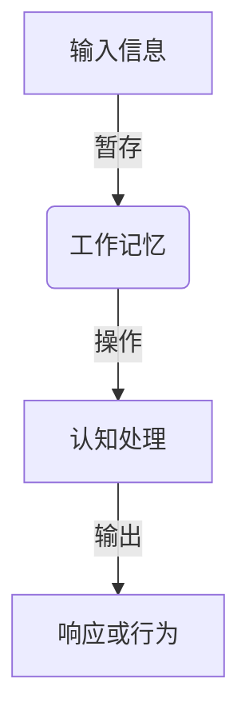
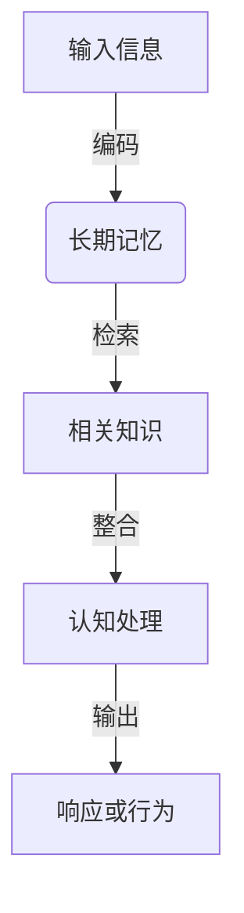
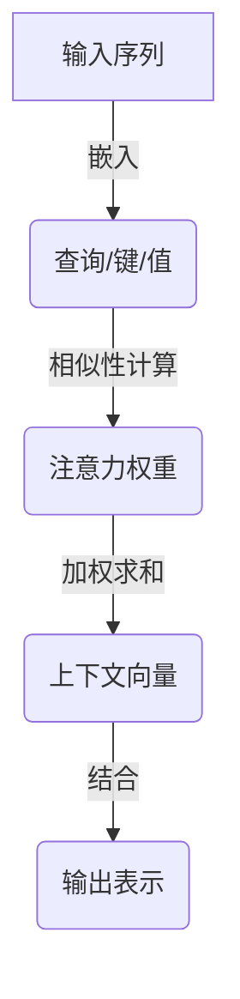
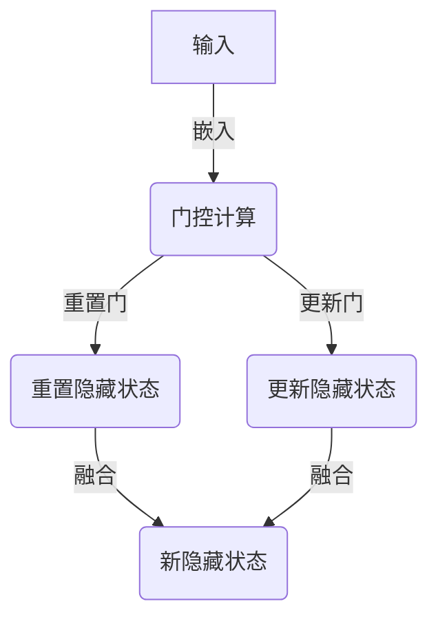
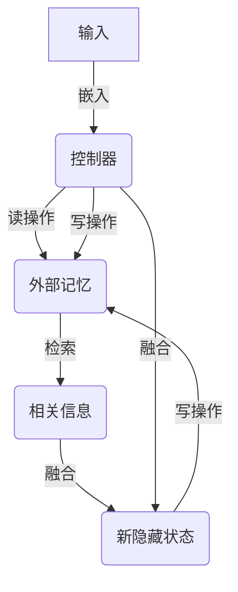

# 大语言模型应用指南：工作记忆与长短期记忆

## 1. 背景介绍

### 1.1 大语言模型的兴起

近年来,大型语言模型(Large Language Models, LLMs)在自然语言处理(NLP)领域取得了令人瞩目的成就。这些模型通过在海量文本数据上进行预训练,学习到了丰富的语言知识和上下文理解能力。代表性的大语言模型包括GPT-3、BERT、XLNet等,它们在多项NLP任务上展现出了超越人类的性能。

### 1.2 工作记忆与长短期记忆

尽管大语言模型在生成流畅、连贯的文本方面表现出色,但它们在处理长期上下文依赖和记忆存储方面仍然存在局限性。人类的认知系统中,工作记忆和长短期记忆扮演着关键角色,允许我们在短期内保持和操作信息,并将重要信息转移到长期记忆中。增强大语言模型的记忆能力,对于提高它们在复杂任务上的性能至关重要。

### 1.3 研究意义

本文将探讨如何赋予大语言模型更强大的工作记忆和长短期记忆能力,以提升它们在对话系统、问答系统、任务规划等应用中的表现。我们将介绍相关的核心概念、算法原理、数学模型,并分享代码实例、应用场景和未来发展趋势。

## 2. 核心概念与联系

### 2.1 工作记忆

工作记忆是指人类大脑中用于临时存储和操作信息的系统。它允许我们在短时间内保持和处理相关信息,对于执行复杂认知任务至关重要。在大语言模型中,工作记忆可以帮助模型更好地捕捉和利用上下文信息,提高对话质量和任务完成能力。



### 2.2 长短期记忆

长短期记忆是人类大脑中负责存储和检索长期信息的系统。它允许我们将重要的知识和经验保存下来,供将来使用。在大语言模型中,长短期记忆可以用于存储和检索大量的背景知识、任务相关信息和经验,从而增强模型的推理和决策能力。



### 2.3 工作记忆与长短期记忆的关系

工作记忆和长短期记忆在人类认知系统中密切协作,共同支持复杂的思维活动。工作记忆负责暂存和操作当前任务相关的信息,而长短期记忆则提供了必要的背景知识和经验。增强大语言模型的工作记忆和长短期记忆能力,有助于提高它们在理解、推理和决策方面的表现。

## 3. 核心算法原理具体操作步骤

### 3.1 工作记忆增强算法

#### 3.1.1 注意力机制

注意力机制是增强大语言模型工作记忆能力的关键技术之一。它允许模型动态地关注输入序列中的不同部分,并根据当前上下文分配注意力权重。这种机制有助于模型捕捉长距离依赖关系,并更好地利用上下文信息。

具体操作步骤如下:

1. 计算查询(Query)、键(Key)和值(Value)向量。
2. 计算查询和键之间的相似性得分(注意力权重)。
3. 根据注意力权重对值向量进行加权求和,得到上下文向量。
4. 将上下文向量与查询向量结合,生成最终的输出表示。



#### 3.1.2 门控循环单元

门控循环单元(Gated Recurrent Unit, GRU)是一种改进的循环神经网络(RNN)结构,旨在增强模型的工作记忆能力。GRU使用门控机制来控制信息的流动,从而更好地捕捉长期依赖关系。

具体操作步骤如下:

1. 计算重置门(Reset Gate)和更新门(Update Gate)的激活值。
2. 使用重置门控制前一时间步的隐藏状态对当前输入的影响。
3. 使用更新门控制前一时间步的隐藏状态对当前隐藏状态的影响。
4. 根据门控激活值和当前输入,计算新的隐藏状态。



### 3.2 长短期记忆增强算法

#### 3.2.1 记忆增强神经网络

记忆增强神经网络(Memory-Augmented Neural Network, MANN)是一种将外部记忆与神经网络相结合的架构,旨在增强模型的长期记忆能力。MANN包含一个主控器(Controller)和一个外部记忆模块(Memory Module),它们通过读写操作进行交互。

具体操作步骤如下:

1. 主控器根据当前输入和上一时间步的隐藏状态,生成读写操作。
2. 根据读操作从外部记忆中检索相关信息。
3. 将检索到的信息与当前输入和隐藏状态结合,生成新的隐藏状态。
4. 根据写操作更新外部记忆的内容。


#### 3.2.2 神经计算机

神经计算机(Neural Computer)是另一种将外部记忆与神经网络相结合的架构,旨在增强模型的长期记忆能力。与MANN不同的是,神经计算机使用更加灵活的读写机制,允许模型动态地更新外部记忆的内容。

具体操作步骤如下:

1. 控制器根据当前输入和上一时间步的隐藏状态,生成读写操作。
2. 根据读操作从外部记忆中检索相关信息。
3. 将检索到的信息与当前输入和隐藏状态结合,生成新的隐藏状态。
4. 根据写操作动态地更新外部记忆的内容。



## 4. 数学模型和公式详细讲解举例说明

### 4.1 注意力机制数学模型

注意力机制是计算查询(Query)和一组键(Keys)之间的相似性得分,并根据这些得分对值(Values)进行加权求和,从而生成上下文向量。

给定一个查询向量 $\mathbf{q}$、一组键向量 $\{\mathbf{k}_1, \mathbf{k}_2, \dots, \mathbf{k}_n\}$ 和一组对应的值向量 $\{\mathbf{v}_1, \mathbf{v}_2, \dots, \mathbf{v}_n\}$,注意力机制的计算过程如下:

1. 计算查询和每个键之间的相似性得分(注意力权重):

$$\alpha_i = \text{score}(\mathbf{q}, \mathbf{k}_i) = \frac{\mathbf{q}^\top \mathbf{k}_i}{\sqrt{d_k}}$$

其中 $d_k$ 是键向量的维度,用于缩放点积。

2. 对注意力权重进行软最大化(Softmax),得到归一化的注意力分布:

$$\alpha_i' = \text{softmax}(\alpha_i) = \frac{e^{\alpha_i}}{\sum_{j=1}^n e^{\alpha_j}}$$

3. 根据注意力分布对值向量进行加权求和,得到上下文向量:

$$\mathbf{c} = \sum_{i=1}^n \alpha_i' \mathbf{v}_i$$

上下文向量 $\mathbf{c}$ 可以与查询向量 $\mathbf{q}$ 结合,生成最终的输出表示。

### 4.2 门控循环单元数学模型

门控循环单元(GRU)是一种改进的循环神经网络结构,旨在解决传统RNN在捕捉长期依赖关系方面的困难。GRU使用门控机制来控制信息的流动,从而更好地捕捉长期依赖关系。

给定一个输入序列 $\{\mathbf{x}_1, \mathbf{x}_2, \dots, \mathbf{x}_T\}$,GRU在时间步 $t$ 的计算过程如下:

1. 计算重置门(Reset Gate)的激活值:

$$\mathbf{r}_t = \sigma(\mathbf{W}_r \mathbf{x}_t + \mathbf{U}_r \mathbf{h}_{t-1} + \mathbf{b}_r)$$

其中 $\sigma$ 是sigmoid激活函数,用于将门的值限制在 $[0, 1]$ 范围内。

2. 计算候选隐藏状态 $\tilde{\mathbf{h}}_t$,其中重置门控制了前一时间步的隐藏状态对当前输入的影响:

$$\tilde{\mathbf{h}}_t = \tanh(\mathbf{W}_h \mathbf{x}_t + \mathbf{r}_t \odot \mathbf{U}_h \mathbf{h}_{t-1} + \mathbf{b}_h)$$

3. 计算更新门(Update Gate)的激活值:

$$\mathbf{z}_t = \sigma(\mathbf{W}_z \mathbf{x}_t + \mathbf{U}_z \mathbf{h}_{t-1} + \mathbf{b}_z)$$

4. 根据更新门控制前一时间步的隐藏状态对当前隐藏状态的影响,计算新的隐藏状态:

$$\mathbf{h}_t = (1 - \mathbf{z}_t) \odot \mathbf{h}_{t-1} + \mathbf{z}_t \odot \tilde{\mathbf{h}}_t$$

通过门控机制,GRU能够更好地捕捉长期依赖关系,从而提高模型的工作记忆能力。

## 5. 项目实践:代码实例和详细解释说明

### 5.1 注意力机制实现

以下是使用PyTorch实现注意力机制的示例代码:

```python
import torch
import torch.nn as nn

class AttentionLayer(nn.Module):
    def __init__(self, query_dim, key_dim, value_dim):
        super(AttentionLayer, self).__init__()
        self.query_proj = nn.Linear(query_dim, key_dim)
        self.key_proj = nn.Linear(key_dim, key_dim)
        self.value_proj = nn.Linear(value_dim, value_dim)

    def forward(self, query, key, value):
        # 计算查询、键和值向量
        query = self.query_proj(query)
        key = self.key_proj(key)
        value = self.value_proj(value)

        # 计算注意力权重
        scores = torch.matmul(query, key.transpose(-2, -1)) / math.sqrt(key.size(-1))
        attention_weights = nn.functional.softmax(scores, dim=-1)

        # 计算上下文向量
        context = torch.matmul(attention_weights, value)

        return context
```

在这个示例中,我们定义了一个`AttentionLayer`模块,它接受查询(Query)、键(Key)和值(Value)作为输入,并计算注意力权重和上下文向量。

1. 首先,我们使用线性层(`nn.Linear`)将查询、键和值投影到相同的维度空间。
2. 然后,我们计算查询和键之间的点积,并对其进行缩放和软最大化,得到注意力权重。
3. 最后,我们将注意力权重与值向量相乘,得到上下文向量。

您可以将这个注意力层集