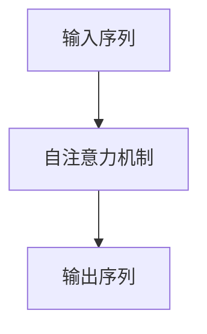
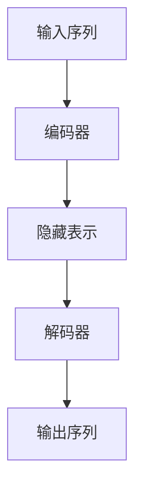

# 大语言模型应用指南：工具

## 1.背景介绍

大语言模型（Large Language Models, LLMs）近年来在自然语言处理（NLP）领域取得了显著的进展。它们不仅在学术界引起了广泛关注，也在工业界得到了广泛应用。大语言模型如GPT-3、BERT等，已经在文本生成、翻译、问答系统等多个领域展示了其强大的能力。

这些模型的成功得益于深度学习技术的进步和大规模数据集的使用。然而，如何有效地应用这些大语言模型仍然是一个复杂的问题。本文旨在提供一个全面的指南，帮助读者理解大语言模型的核心概念、算法原理、数学模型、实际应用场景以及相关工具和资源。

## 2.核心概念与联系

### 2.1 大语言模型的定义

大语言模型是一种基于深度学习的模型，通常使用数十亿甚至数百亿个参数来捕捉语言的复杂性。它们通过大量的文本数据进行训练，能够生成高质量的自然语言文本。

### 2.2 预训练与微调

大语言模型通常采用预训练和微调两个阶段。预训练阶段，模型在大规模无标签数据上进行训练，以学习语言的基本结构和语义。微调阶段，模型在特定任务的数据集上进行训练，以适应具体的应用场景。

### 2.3 自注意力机制

自注意力机制是大语言模型的核心组件之一。它允许模型在生成每个词时，考虑输入序列中的所有词，从而捕捉到长距离的依赖关系。



### 2.4 变换器架构

变换器（Transformer）是大语言模型的基础架构。它由编码器和解码器组成，编码器负责将输入序列转换为隐藏表示，解码器则根据隐藏表示生成输出序列。



## 3.核心算法原理具体操作步骤

### 3.1 数据预处理

数据预处理是大语言模型训练的第一步。它包括文本清洗、分词、词嵌入等步骤。

### 3.2 模型训练

模型训练包括前向传播、损失计算和反向传播。前向传播过程中，输入数据通过模型生成预测结果；损失计算用于衡量预测结果与真实标签之间的差异；反向传播则通过梯度下降算法更新模型参数。

### 3.3 模型评估

模型评估是验证模型性能的重要步骤。常用的评估指标包括准确率、精确率、召回率和F1分数。

### 3.4 模型部署

模型部署是将训练好的模型应用到实际场景中的过程。它包括模型导出、API开发和性能优化等步骤。

## 4.数学模型和公式详细讲解举例说明

### 4.1 词嵌入

词嵌入是将词语转换为向量表示的技术。常用的词嵌入方法包括Word2Vec和GloVe。

$$
\text{Word2Vec:} \quad \mathbf{v}_w = \frac{1}{|C(w)|} \sum_{c \in C(w)} \mathbf{v}_c
$$

### 4.2 自注意力机制

自注意力机制通过计算输入序列中每个词与其他词的相关性来生成注意力权重。

$$
\text{Attention}(Q, K, V) = \text{softmax}\left(\frac{QK^T}{\sqrt{d_k}}\right)V
$$

### 4.3 变换器架构

变换器架构中的编码器和解码器都由多个自注意力层和前馈神经网络层组成。

$$
\text{Transformer Layer:} \quad \text{Output} = \text{LayerNorm}(X + \text{FeedForward}(\text{SelfAttention}(X)))
$$

## 5.项目实践：代码实例和详细解释说明

### 5.1 数据预处理

```python
import nltk
from nltk.tokenize import word_tokenize

# 下载必要的资源
nltk.download('punkt')

# 文本清洗和分词
text = "大语言模型是人工智能领域的重要突破。"
tokens = word_tokenize(text)
print(tokens)
```

### 5.2 模型训练

```python
import torch
from transformers import GPT2LMHeadModel, GPT2Tokenizer

# 加载预训练模型和分词器
model_name = 'gpt2'
model = GPT2LMHeadModel.from_pretrained(model_name)
tokenizer = GPT2Tokenizer.from_pretrained(model_name)

# 输入文本
input_text = "大语言模型的应用前景如何？"
input_ids = tokenizer.encode(input_text, return_tensors='pt')

# 模型生成
output = model.generate(input_ids, max_length=50, num_return_sequences=1)
print(tokenizer.decode(output[0], skip_special_tokens=True))
```

### 5.3 模型评估

```python
from sklearn.metrics import accuracy_score

# 假设有真实标签和预测标签
true_labels = [1, 0, 1, 1, 0]
pred_labels = [1, 0, 1, 0, 0]

# 计算准确率
accuracy = accuracy_score(true_labels, pred_labels)
print(f"Accuracy: {accuracy}")
```

### 5.4 模型部署

```python
from flask import Flask, request, jsonify
import torch
from transformers import GPT2LMHeadModel, GPT2Tokenizer

app = Flask(__name__)

# 加载模型和分词器
model_name = 'gpt2'
model = GPT2LMHeadModel.from_pretrained(model_name)
tokenizer = GPT2Tokenizer.from_pretrained(model_name)

@app.route('/generate', methods=['POST'])
def generate():
    input_text = request.json['text']
    input_ids = tokenizer.encode(input_text, return_tensors='pt')
    output = model.generate(input_ids, max_length=50, num_return_sequences=1)
    response = tokenizer.decode(output[0], skip_special_tokens=True)
    return jsonify({'generated_text': response})

if __name__ == '__main__':
    app.run(debug=True)
```

## 6.实际应用场景

### 6.1 文本生成

大语言模型可以用于生成高质量的自然语言文本，如新闻报道、技术文档和文学作品。

### 6.2 机器翻译

大语言模型在机器翻译领域表现出色，能够实现多语言之间的高质量翻译。

### 6.3 问答系统

大语言模型可以用于构建智能问答系统，提供准确的答案和建议。

### 6.4 情感分析

大语言模型可以用于情感分析，帮助企业了解用户的情感倾向和反馈。

## 7.工具和资源推荐

### 7.1 开源框架

- TensorFlow
- PyTorch
- Hugging Face Transformers

### 7.2 数据集

- Wikipedia
- Common Crawl
- OpenAI GPT-3 Dataset

### 7.3 在线资源

- arXiv
- GitHub
- Coursera

## 8.总结：未来发展趋势与挑战

大语言模型在自然语言处理领域展现了巨大的潜力，但也面临着一些挑战。未来的发展趋势包括模型的进一步优化、跨领域应用的探索以及伦理和隐私问题的解决。

### 8.1 模型优化

未来的大语言模型将更加高效，能够在更短的时间内完成训练，并且在推理阶段更加快速。

### 8.2 跨领域应用

大语言模型的应用将不仅限于自然语言处理，还将扩展到其他领域，如计算机视觉和生物信息学。

### 8.3 伦理和隐私

随着大语言模型的广泛应用，伦理和隐私问题将变得更加重要。如何确保模型的公平性和透明性将是未来的研究重点。

## 9.附录：常见问题与解答

### 9.1 大语言模型的训练需要多长时间？

训练大语言模型的时间取决于模型的规模和硬件配置。通常需要数周甚至数月的时间。

### 9.2 如何选择合适的数据集？

选择数据集时应考虑数据的质量、规模和多样性。高质量的数据集能够提高模型的性能。

### 9.3 大语言模型的应用有哪些限制？

大语言模型在处理长文本和多语言翻译时可能会遇到一些限制。此外，模型的计算资源需求较高，可能不适用于资源有限的场景。

### 9.4 如何评估大语言模型的性能？

常用的评估指标包括准确率、精确率、召回率和F1分数。此外，还可以通过人类评估来衡量模型生成文本的质量。

### 9.5 大语言模型的未来发展方向是什么？

未来的发展方向包括模型的进一步优化、跨领域应用的探索以及伦理和隐私问题的解决。

---

作者：禅与计算机程序设计艺术 / Zen and the Art of Computer Programming