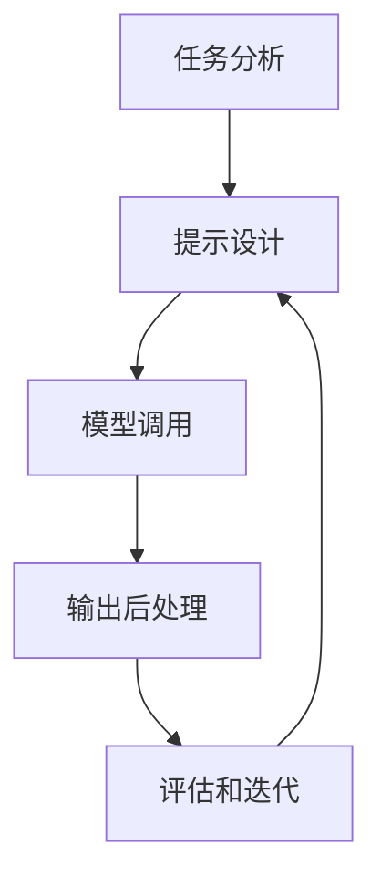

以下是题为《大语言模型应用指南：提示工程》的技术博客文章正文：

# 大语言模型应用指南：提示工程

## 1. 背景介绍

### 1.1 大语言模型的兴起

近年来,大型语言模型(Large Language Models, LLMs)在自然语言处理(NLP)领域取得了令人瞩目的进展。这些模型通过在大量文本数据上进行预训练,学习了丰富的语言知识和上下文关系,展现出惊人的生成和理解能力。

代表性的大语言模型包括 GPT-3、BERT、XLNet、T5 等,它们在机器翻译、文本摘要、问答系统、内容生成等多个领域表现出色,为人工智能的发展带来了新的机遇。

### 1.2 提示工程的重要性

虽然大语言模型具有强大的语言理解和生成能力,但如何有效地控制和指导模型输出所需的内容仍然是一个挑战。这就需要提示工程(Prompting Engineering)的介入,通过设计恰当的提示(Prompt),来指导模型按照我们的意图生成所需的输出。

提示工程已经成为利用大语言模型的关键技术,对于提高模型性能、减少不确定性输出、控制输出风格等方面发挥着重要作用。本文将深入探讨提示工程的核心概念、算法原理和实践应用。

## 2. 核心概念与联系

### 2.1 什么是提示

在大语言模型的应用中,提示(Prompt)是指给定模型的一段文本输入,用于引导模型生成所需的输出。提示可以是一个问题、一个任务描述、一个上下文场景等,模型会根据提示的内容生成相应的回答或续写。

提示的设计对于模型输出的质量至关重要。一个好的提示应该清晰地表达任务要求,提供足够的上下文信息,并且避免引入不必要的偏差或噪声。

### 2.2 提示工程的类型

根据提示的形式和目的,提示工程可以分为以下几种主要类型:

1. **前缀提示(Prefix Prompting)**: 在输入文本的开头添加一段描述性的提示,引导模型生成所需的输出。这种方式简单直观,但提示的设计需要一定的技巧和经验。

2. **示例提示(Example Prompting)**: 提供一些输入-输出的示例对,让模型学习任务模式,并生成与示例相似的输出。这种方式可以提高模型的泛化能力,但需要准备高质量的示例数据。

3. **指令提示(Instruction Prompting)**: 直接向模型发出指令,明确要求它执行某种任务或遵循某种行为模式。这种方式简洁高效,但需要模型具备较强的指令理解能力。

4. **混合提示(Hybrid Prompting)**: 结合上述多种提示形式,综合利用不同提示的优势,以获得更好的控制效果和输出质量。

### 2.3 提示工程与微调的关系

除了提示工程,另一种常见的大语言模型应用技术是微调(Fine-tuning)。微调是在预训练模型的基础上,使用任务相关的数据进行进一步训练,以使模型更好地适应特定任务。

提示工程和微调是相辅相成的技术:

- 提示工程可以充分利用预训练模型的知识,无需额外的训练数据和计算资源,适用于快速原型开发和低资源场景。
- 微调可以进一步提高模型在特定任务上的性能,但需要大量的标注数据和计算资源。

在实践中,我们可以根据具体需求和资源情况,选择合适的技术路线,或将两者相结合,以获得最佳效果。

## 3. 核心算法原理具体操作步骤

### 3.1 提示工程的基本流程

提示工程的基本流程包括以下几个关键步骤:

1. **任务分析**: 明确需要完成的任务类型(如文本生成、分类、问答等),并分析任务的输入和期望输出。

2. **提示设计**: 根据任务要求和模型的特性,设计合适的提示形式和内容,包括前缀、示例、指令等。

3. **模型调用**: 将设计好的提示输入到预训练的大语言模型中,获取模型的输出结果。

4. **输出后处理**: 对模型的原始输出进行必要的过滤、格式化或其他后处理操作,以满足实际应用需求。

5. **评估和迭代**: 评估输出结果的质量和效果,根据反馈不断优化和调整提示的设计,进行多次迭代直至满意。



### 3.2 提示设计策略

提示的设计是提示工程中最关键的环节,需要综合考虑任务要求、模型特性和上下文信息等多个因素。以下是一些常见的提示设计策略:

1. **任务框架化**: 将任务描述转化为一个通用的框架或模板,使模型更容易理解和生成所需的输出。例如,将文本摘要任务描述为"根据以下文章,生成一个简明扼要的摘要"。

2. **示例增强**: 在提示中提供多个高质量的输入-输出示例对,让模型学习任务模式并生成相似的输出。示例的选择和排列顺序都会影响模型的表现。

3. **上下文引入**: 在提示中提供足够的上下文信息,如背景知识、场景描述等,帮助模型更好地理解任务要求并生成相关的输出。

4. **约束和控制**: 在提示中加入一些约束条件或控制指令,限制模型的输出范围或风格,以满足特定的需求。例如,控制输出长度、语气等。

5. **迭代优化**: 通过多次迭代和人工评估,不断优化和调整提示的设计,直至获得满意的输出质量。

### 3.3 提示工程实践技巧

在实际应用提示工程时,还需要注意以下一些技巧和细节:

1. **尝试多种提示形式**: 根据任务特点,尝试不同类型的提示(前缀、示例、指令等),找到最合适的形式。

2. **控制提示长度**: 过长的提示可能会增加模型的计算负担,影响输出质量。适当控制提示长度,保持在模型能够高效处理的范围内。

3. **避免引入偏差**: 提示的设计应该尽量中立和客观,避免引入不必要的偏差或主观倾向。

4. **考虑上下文一致性**: 确保提示中的上下文信息与任务要求保持一致,避免引入混淆或矛盾。

5. **结合人工评估**: 除了自动评估指标,还应该引入人工评估,以更全面地衡量输出质量和满足程度。

6. **持续迭代优化**: 提示工程是一个持续的过程,需要根据实际应用效果不断优化和调整提示的设计。

通过掌握这些核心算法原理和实践技巧,我们就可以更好地利用大语言模型的强大能力,为各种自然语言处理任务提供高质量的解决方案。

## 4. 数学模型和公式详细讲解举例说明

### 4.1 提示工程的形式化表示

为了更好地理解和优化提示工程的过程,我们可以将其形式化为一个数学模型。假设我们有一个预训练的大语言模型 $M$,它的目标是根据输入的提示 $x$ 生成所需的输出 $y$。这个过程可以表示为:

$$P(y|x) = M(x)$$

其中,$P(y|x)$ 表示给定提示 $x$ 时,输出 $y$ 的条件概率分布。

我们的目标是通过设计合适的提示 $x$,使模型 $M$ 生成的输出 $y$ 满足我们的任务要求。这可以形式化为一个优化问题:

$$x^* = \arg\max_{x} R(M(x))$$

其中,$ R(y)$ 是一个评估函数,用于衡量输出 $y$ 与任务要求的匹配程度。$x^*$ 表示能够最大化评估函数值的最优提示。

在实践中,由于搜索空间过大,通常无法直接求解上述优化问题。因此,我们需要采用启发式方法和迭代优化策略,逐步逼近最优提示。

### 4.2 提示工程的评估指标

为了评估提示工程的效果,我们需要定义合适的评估指标。常见的评估指标包括:

1. **精确度(Accuracy)**: 对于分类任务,精确度表示模型正确预测的样本占总样本的比例。

2. **困惑度(Perplexity)**: 对于生成任务,困惑度用于衡量模型生成序列的概率分布与真实分布之间的差异,值越小表示模型生成的序列质量越高。

3. **BLEU分数**: 在机器翻译和文本生成任务中,BLEU分数用于评估生成文本与参考文本之间的相似度。

4. **人工评估分数**: 由人工评估者根据一定标准(如语义一致性、语法流畅性等)对模型输出进行打分,得到的综合评分。

除了上述常见指标,我们还可以根据具体任务定义特定的评估指标,以更好地衡量提示工程的效果。

### 4.3 提示工程的优化方法

为了获得最优的提示设计,我们可以采用以下一些优化方法:

1. **随机搜索**: 在提示的搜索空间中随机采样多个候选提示,并选择评估指标最优的提示作为最终结果。

2. **贪婪搜索**: 从一个初始提示出发,每次对提示进行微小的修改,选择能够提高评估指标的修改方向,直至收敛到一个局部最优解。

3. **基于梯度的优化**: 将提示表示为一个可微分的向量,并通过计算评估指标相对于提示向量的梯度,使用梯度下降等优化算法来更新提示向量。

4. **强化学习**: 将提示工程建模为一个马尔可夫决策过程,通过与环境(模型)的交互,学习出能够最大化长期回报(评估指标)的最优提示策略。

5. **人机协作优化**: 结合人工专家的经验和反馈,在自动优化的基础上进行人工干预和调整,以获得更好的提示设计。

这些优化方法各有优缺点,在实际应用中需要根据具体情况选择合适的方法,或者将多种方法相结合,以获得最佳效果。

通过上述数学模型和优化方法,我们可以更加系统和理性地分析和优化提示工程的过程,从而提高大语言模型在各种任务中的性能和可控性。

## 5. 项目实践:代码实例和详细解释说明

为了更好地理解提示工程的实践应用,我们以一个文本分类任务为例,展示如何使用Python和Hugging Face的Transformers库进行提示设计和模型调用。

### 5.1 任务描述

给定一组新闻文本,我们需要将它们分类为"政治"、"体育"、"科技"或"娱乐"四个类别。我们将使用预训练的BERT模型,并通过提示工程来指导模型进行分类预测。

### 5.2 数据准备

首先,我们需要准备一些示例数据,用于训练和测试。这里我们使用一个简单的新闻数据集,包含四个类别,每个类别10篇新闻文本。

```python
import pandas as pd

# 加载示例数据
data = pd.read_csv('news_dataset.csv')
```

### 5.3 提示设计

我们将采用示例提示(Example Prompting)的方式,为模型提供一些输入-输出示例对,让它学习分类任务的模式。

```python
from transformers import pipeline

# 定义示例提示
examples = [
    "政府今天宣布了一项新的经济刺激计划。 >>> 政治",
    "本赛季NBA总决赛由金州勇士队夺冠。 >>> 体育",
    "苹果公司发布了最新一代iPhone手机。 >>> 科技",
    "著名影星在新片首映式上亮相,