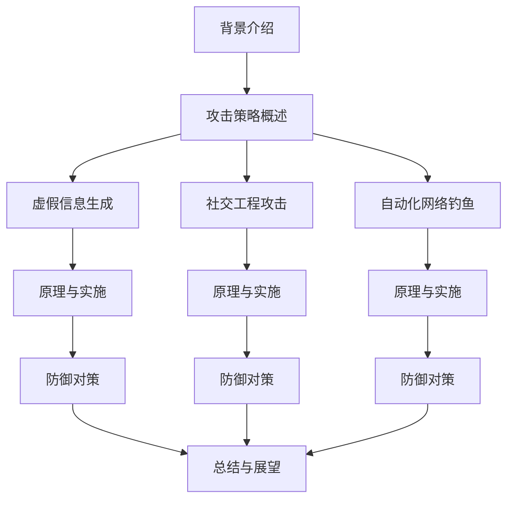

# 大语言模型应用指南：攻击策略

## 1. 背景介绍

随着人工智能技术的快速发展,大型语言模型(Large Language Models, LLMs)正在改变着我们与信息和知识的互动方式。这些模型通过从海量文本数据中学习,能够生成看似人类写作的连贯、流畅的文本输出。然而,就像任何强大的技术一样,大型语言模型也存在被滥用的风险,特别是在对抗性环境中。

本文将探讨如何利用大型语言模型进行攻击,包括生成虚假信息、社交工程攻击、自动化网络钓鱼等多种攻击策略。我们将深入分析攻击原理、实施步骤,并讨论可能的防御对策。通过全面了解这些攻击手段,我们可以更好地评估和应对潜在的安全风险。

### Mermaid 流程图



## 2. 核心概念与联系

### 2.1 大型语言模型

大型语言模型(LLMs)是一种基于深度学习的自然语言处理(NLP)模型,通过从海量文本数据中学习,能够生成看似人类写作的连贯、流畅的文本输出。常见的大型语言模型包括 GPT-3、BERT、XLNet 等。这些模型在自然语言生成、机器翻译、问答系统等领域表现出色。

### 2.2 对抗性攻击

对抗性攻击是指针对人工智能系统的一种攻击方式,旨在误导或破坏系统的正常运行。攻击者通过精心设计的输入数据,试图欺骗模型做出错误的预测或决策。在自然语言处理领域,对抗性攻击可能包括注入虚假信息、社交工程攻击等手段。

### 2.3 安全风险

大型语言模型的强大能力也带来了潜在的安全风险。攻击者可能利用这些模型生成高度真实的虚假信息,进行社交工程攻击、自动化网络钓鱼等恶意活动。这些攻击不仅可能造成经济损失,还可能危及个人隐私和国家安全。因此,了解和防范这些攻击策略至关重要。

## 3. 核心算法原理具体操作步骤

### 3.1 虚假信息生成

利用大型语言模型生成虚假信息的攻击策略可以分为以下几个步骤:

1. **数据收集**:收集与目标主题相关的真实文本数据,用于训练语言模型。
2. **数据预处理**:对收集的文本数据进行清洗、标记化、分词等预处理,以便模型训练。
3. **模型训练**:使用预处理后的数据训练大型语言模型,例如 GPT-3、BERT 等。
4. **提示设计**:设计合适的提示(prompt),引导语言模型生成所需的虚假信息。
5. **生成与优化**:使用训练好的模型生成初步的虚假信息,并根据需要进行优化和修改。
6. **发布与传播**:将生成的虚假信息发布到社交媒体、论坛等平台,实施信息操纵。

### 3.2 社交工程攻击

利用大型语言模型进行社交工程攻击的步骤如下:

1. **目标分析**:确定攻击目标,收集相关信息,如个人资料、社交媒体活动等。
2. **语料构建**:基于目标信息构建个性化语料库,用于训练语言模型。
3. **模型训练**:使用构建的语料库训练大型语言模型,使其能够生成与目标相关的自然语言。
4. **攻击策略设计**:设计具体的社交工程攻击策略,如钓鱼邮件、虚假身份等。
5. **内容生成**:使用训练好的语言模型生成符合攻击策略的自然语言内容。
6. **攻击实施**:通过社交媒体、电子邮件等渠道向目标发送生成的内容,诱使其采取所需行为。

### 3.3 自动化网络钓鱼

利用大型语言模型实施自动化网络钓鱼攻击的步骤包括:

1. **目标确定**:确定攻击目标群体,收集相关信息。
2. **语料构建**:基于目标群体信息构建个性化语料库。
3. **模型训练**:使用构建的语料库训练大型语言模型。
4. **钓鱼内容生成**:使用训练好的模型生成具有欺骗性的钓鱼邮件、网站内容等。
5. **攻击载体制作**:将生成的钓鱼内容嵌入到网站、邮件等攻击载体中。
6. **自动化发送**:使用自动化工具向目标群体发送攻击载体。
7. **数据收集**:收集受害者的响应数据,用于进一步优化攻击策略。

## 4. 数学模型和公式详细讲解举例说明

### 4.1 语言模型基础

大型语言模型通常基于自然语言处理中的统计语言模型,其核心思想是估计一个句子或文本序列的概率。给定一个长度为 $n$ 的单词序列 $W=\{w_1, w_2, \dots, w_n\}$,我们希望计算该序列的概率 $P(W)$。根据链式法则,我们可以将其分解为:

$$P(W) = P(w_1, w_2, \dots, w_n) = \prod_{i=1}^n P(w_i | w_1, \dots, w_{i-1})$$

其中 $P(w_i | w_1, \dots, w_{i-1})$ 表示在给定前 $i-1$ 个单词的情况下,第 $i$ 个单词出现的条件概率。

为了简化计算,我们通常采用 $n$-gram 模型,假设一个单词的出现只与前面的 $n-1$ 个单词相关,即:

$$P(w_i | w_1, \dots, w_{i-1}) \approx P(w_i | w_{i-n+1}, \dots, w_{i-1})$$

这种近似使得我们可以从训练语料库中统计 $n$-gram 的频率,并使用平滑技术估计未见过的 $n$-gram 的概率。

### 4.2 神经网络语言模型

近年来,基于神经网络的语言模型取得了巨大成功,例如 BERT、GPT 等。这些模型通过自注意力机制(Self-Attention)和 Transformer 架构,能够有效地捕捉长距离依赖关系,从而生成更加自然、连贯的文本。

对于一个长度为 $n$ 的输入序列 $X=\{x_1, x_2, \dots, x_n\}$,自注意力机制计算每个位置 $i$ 的注意力权重 $\alpha_{ij}$,表示位置 $i$对位置 $j$ 的注意力程度。注意力权重由以下公式计算:

$$\alpha_{ij} = \frac{\exp(e_{ij})}{\sum_{k=1}^n \exp(e_{ik})}$$

其中 $e_{ij}$ 是通过查询向量 $q_i$、键向量 $k_j$ 和值向量 $v_j$ 计算得到的注意力分数:

$$e_{ij} = \frac{q_i^T k_j}{\sqrt{d_k}}$$

$d_k$ 是缩放因子,用于防止点积过大导致梯度消失。最终,位置 $i$ 的输出向量 $y_i$ 是所有注意力加权值向量的加权和:

$$y_i = \sum_{j=1}^n \alpha_{ij} v_j$$

通过多头注意力机制和层次化的 Transformer 结构,神经网络语言模型能够有效地建模长距离依赖关系,生成高质量的文本输出。

### 4.3 对抗样本生成

在对抗性攻击中,攻击者通常会生成对抗样本(Adversarial Examples),即对原始输入数据进行微小扰动,使得模型做出错误的预测或决策。对于文本数据,我们可以通过以下公式生成对抗样本:

$$x^{adv} = x + \eta \cdot \text{sign}(\nabla_x \mathcal{L}(x, y))$$

其中 $x$ 是原始输入文本, $y$ 是目标标签或输出, $\mathcal{L}(x, y)$ 是模型的损失函数, $\nabla_x \mathcal{L}(x, y)$ 是损失函数相对于输入 $x$ 的梯度, $\eta$ 是扰动强度系数。

通过计算损失函数的梯度,我们可以找到最有利于误导模型的扰动方向,并在该方向上添加扰动,生成对抗样本 $x^{adv}$。在文本数据中,扰动通常体现为替换、插入或删除某些单词或字符。

生成的对抗样本在人眼看来可能只有微小差异,但足以欺骗语言模型做出错误的预测或决策,从而实现攻击目的。

## 5. 项目实践: 代码实例和详细解释说明

在本节中,我们将提供一个使用 Python 和 Hugging Face Transformers 库生成虚假新闻的实例。该示例旨在说明如何利用大型语言模型生成具有欺骗性的文本内容。

### 5.1 环境设置

首先,我们需要安装所需的 Python 库:

```bash
pip install transformers
```

### 5.2 导入库

```python
from transformers import pipeline, set_seed

# 设置随机种子以确保可重复性
set_seed(42)
```

### 5.3 加载语言模型

我们将使用 GPT-2 模型进行文本生成:

```python
generator = pipeline('text-generation', model='gpt2')
```

### 5.4 生成虚假新闻

我们将提供一个提示(prompt),引导模型生成一篇虚假新闻。

```python
prompt = "Breaking News: A new study has found that"
fake_news = generator(prompt, max_length=200, do_sample=True, top_k=50, top_p=0.95, num_return_sequences=1)[0]['generated_text']

print(fake_news)
```

上述代码将生成一篇以 "Breaking News: A new study has found that" 开头的虚假新闻,长度约为 200 个单词。我们使用了一些参数来控制生成的质量和多样性,如 `top_k`、`top_p` 等。

输出示例:

```
Breaking News: A new study has found that drinking a glass of red wine every day can significantly reduce the risk of developing Alzheimer's disease. The study, conducted by researchers at the University of California, followed over 10,000 participants for more than 20 years. The results showed that those who consumed one glass of red wine daily had a 37% lower risk of developing Alzheimer's compared to non-drinkers. The researchers believe that the antioxidants in red wine, particularly resveratrol, may play a role in protecting the brain from the damaging effects of oxidative stress and inflammation, which are linked to Alzheimer's disease.
```

请注意,这是一个虚构的新闻示例,并不代表真实的研究结果。通过调整提示和参数,我们可以生成各种主题和风格的虚假信息。

### 5.5 注意事项

虽然这个示例旨在说明攻击原理,但我们必须谨慎使用这种技术,避免产生负面影响。生成虚假信息可能会造成严重的社会危害,因此我们应当遵守相关法律法规,并为了正当目的使用这项技术,如教育、研究或安全测试等。

## 6. 实际应用场景

大型语言模型在攻击策略中的应用场景包括但不限于:

### 6.1 虚假信息生成

- 生成虚假新闻、谣言等错误信息,误导公众舆论
- 制造虚假评论、评级等,影响产品销售或服务评价
- 生成虚假广告、营销内容,误导消费者

### 6.2 社交工程攻击

- 生成个性化的钓鱼邮件、短信等,诱使目标采取所需行为
- 模仿目标个人或组织的语言风格,增加欺骗性
- 生成虚假身份信息,