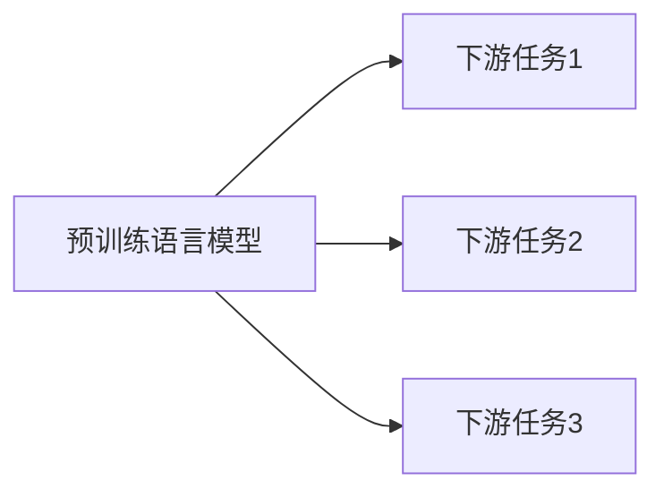

# 大语言模型应用指南：数据准备和参数微调

## 1. 背景介绍

### 1.1 大语言模型概述

大语言模型(Large Language Model, LLM)是近年来自然语言处理(NLP)领域的重大突破。它们是在海量文本数据上训练的深度神经网络模型,具有强大的语言理解和生成能力。代表性的大语言模型包括GPT系列(如GPT-3)、BERT系列(如RoBERTa)等。这些模型在机器翻译、问答系统、文本摘要等任务上取得了显著的性能提升。

### 1.2 大语言模型的应用挑战

尽管大语言模型展现出了惊人的能力,但将其应用到实际任务中仍然存在一些挑战:

1. 领域适应性:预训练的大语言模型通常在通用领域的语料上学习,但实际应用往往涉及特定领域。如何使模型适应目标领域是一大挑战。

2. 资源消耗:训练和推理大语言模型需要大量的计算资源和存储空间,给实际部署带来困难。

3. 数据隐私:大语言模型在训练时可能会记忆部分敏感数据,存在隐私泄露的风险。

### 1.3 数据准备和参数微调的重要性

为了应对上述挑战,数据准备和参数微调是两个关键步骤:

- 数据准备:为目标任务构建高质量的训练数据集,并对其进行必要的清洗和预处理,以提高模型训练的效果。

- 参数微调:在目标任务的训练数据上微调预训练模型的参数,使其适应具体领域和任务,提升性能表现。

本文将详细介绍大语言模型应用中的数据准备和参数微调流程,并给出实践指南和代码示例,帮助读者更好地掌握和应用这一强大技术。

## 2. 核心概念与联系

### 2.1 预训练和微调

- 预训练:在大规模无标注语料上训练语言模型,学习通用的语言表征。这个阶段模型是领域无关的。

- 微调:在下游任务的标注数据上微调预训练模型,使其适应具体任务。模型参数会根据任务目标进行调整。



### 2.2 迁移学习

迁移学习是将已学习的知识从源领域迁移并应用到目标领域的机器学习方法。大语言模型的预训练-微调范式本质上是一种迁移学习,即将语言模型学到的通用语言知识迁移到具体任务中。

### 2.3 领域自适应

领域自适应是指自动调整模型,使其更好地适应目标领域数据的过程。常见的方法包括:

- 领域数据混合:将目标领域数据混入预训练语料中,进行第二阶段预训练。
- 领域数据微调:在目标领域数据上对预训练模型进行微调。

## 3. 核心算法原理具体操作步骤

### 3.1 数据准备

#### 3.1.1 数据收集

根据目标任务,从各种来源收集相关领域的文本数据,如网页、文档、语料库等。注意数据的质量和覆盖面。

#### 3.1.2 数据清洗

对收集到的原始文本数据进行清洗,去除噪声和无用信息,提高数据质量。常见的清洗操作包括:

- 去除HTML标签、URL等
- 去除特殊字符、表情符号等
- 规范化文本格式,如统一大小写、中英文标点等

#### 3.1.3 数据标注

对清洗后的数据进行标注,为训练提供监督信号。标注方式取决于具体任务,如:

- 文本分类:为每个文本样本标注类别标签
- 命名实体识别:标注文本中的实体边界和类型
- 机器翻译:为源语言文本标注对应的目标语言译文

标注可以由人工完成,也可以使用半自动化工具辅助,如主动学习。

#### 3.1.4 数据增强

为扩充训练数据、提高模型泛化能力,可以对标注数据进行增强。常见的文本数据增强技术有:

- 同义词替换:用同义词替换句中的词
- 回译:将文本翻译为另一语言再翻译回来
- 随机插入、删除、交换词语

### 3.2 参数微调

#### 3.2.1 选择预训练模型

根据任务类型和语言,选择合适的预训练语言模型作为基础,如BERT、RoBERTa、GPT等。

#### 3.2.2 搭建微调架构

在预训练模型之上搭建针对目标任务的输出层,如分类任务的Softmax层。同时根据任务需要调整模型的其他部分,如Embedding层。

#### 3.2.3 准备微调数据

将标注好的领域数据转换为适合微调的格式,通常包括输入文本和对应标签。划分训练集、验证集和测试集。

#### 3.2.4 设置微调超参数

选择合适的优化算法(如Adam),设置学习率、batch大小、训练轮数(epoch)等超参数。通常使用较小的学习率。

#### 3.2.5 执行微调训练

加载预训练模型参数,用准备好的微调数据进行训练。记录每个epoch的训练损失和验证集性能,根据需要调整超参数。

#### 3.2.6 评估微调模型

在测试集上评估微调后的模型性能,使用任务相关的评价指标,如准确率、F1分数等。将结果与基准模型进行比较。

## 4. 数学模型和公式详细讲解举例说明

### 4.1 Transformer模型

大语言模型的核心架构是Transformer,它基于自注意力机制(Self-Attention)和前馈神经网络(Feed-Forward Network, FFN)构建。

#### 4.1.1 自注意力机制

自注意力用于捕捉文本内部的长距离依赖关系。对于输入序列 $X=(x_1,\dots,x_n)$,自注意力的计算过程为:

$$
\begin{aligned}
Q &= XW_Q, K = XW_K, V = XW_V \\
\text{Attention}(Q,K,V) &= \text{softmax}(\frac{QK^T}{\sqrt{d_k}})V
\end{aligned}
$$

其中 $W_Q, W_K, W_V$ 是可学习的参数矩阵, $d_k$ 是 $K$ 的维度。

#### 4.1.2 前馈神经网络

FFN对自注意力的输出进行非线性变换,增强模型的表达能力。FFN包含两个线性变换和一个ReLU激活:

$$\text{FFN}(x)=\max(0, xW_1 + b_1)W_2 + b_2$$

其中 $W_1, b_1, W_2, b_2$ 是可学习的参数。

#### 4.1.3 Transformer编码器

Transformer编码器由若干个编码器层堆叠而成,每个编码器层包含一个自注意力子层和一个FFN子层:

$$
\begin{aligned}
\text{Encoder}(X) &= \text{FFN}(\text{Attention}(X)) \\
\text{Encoder}^N(X) &= \text{Encoder}(\text{Encoder}^{N-1}(X))
\end{aligned}
$$

其中 $N$ 是编码器层数。

### 4.2 语言模型目标函数

大语言模型的训练目标是最大化文本序列的似然概率。对于输入序列 $X=(x_1,\dots,x_n)$,语言模型的似然函数为:

$$P(X)=\prod_{i=1}^n P(x_i|x_1,\dots,x_{i-1})$$

模型通过最小化负对数似然损失进行优化:

$$\mathcal{L}=-\sum_{i=1}^n \log P(x_i|x_1,\dots,x_{i-1})$$

## 5. 项目实践：代码实例和详细解释说明

下面以文本分类任务为例,演示如何使用PyTorch和Hugging Face的Transformers库进行大语言模型微调。

### 5.1 环境准备

首先安装必要的库:

```bash
pip install torch transformers datasets
```

### 5.2 加载预训练模型

使用Hugging Face的Transformers库加载预训练的BERT模型:

```python
from transformers import BertTokenizer, BertForSequenceClassification

model_name = "bert-base-uncased"
tokenizer = BertTokenizer.from_pretrained(model_name)
model = BertForSequenceClassification.from_pretrained(model_name, num_labels=num_classes)
```

其中 `num_classes` 是分类任务的类别数。

### 5.3 准备微调数据

使用Hugging Face的Datasets库加载和预处理文本分类数据集:

```python
from datasets import load_dataset

dataset = load_dataset("imdb")

def preprocess_function(examples):
    return tokenizer(examples["text"], truncation=True, padding=True)

dataset = dataset.map(preprocess_function, batched=True)
```

### 5.4 设置微调参数

定义微调的超参数,如batch大小、学习率、训练轮数等:

```python
from transformers import TrainingArguments

training_args = TrainingArguments(
    output_dir="output",
    learning_rate=2e-5,
    per_device_train_batch_size=16,
    per_device_eval_batch_size=16,
    num_train_epochs=2,
    weight_decay=0.01,
)
```

### 5.5 执行微调训练

使用Trainer类进行微调训练:

```python
from transformers import Trainer

trainer = Trainer(
    model=model,
    args=training_args,
    train_dataset=dataset["train"],
    eval_dataset=dataset["test"]
)

trainer.train()
```

### 5.6 评估微调模型

在测试集上评估微调后的模型性能:

```python
from datasets import load_metric

metric = load_metric("accuracy")

def compute_metrics(eval_pred):
    predictions, labels = eval_pred
    predictions = np.argmax(predictions, axis=1)
    return metric.compute(predictions=predictions, references=labels)

trainer.evaluate(eval_dataset=dataset["test"], metric_key_prefix="test")
```

## 6. 实际应用场景

大语言模型微调技术在各种NLP任务中得到广泛应用,如:

- 文本分类:情感分析、新闻分类、垃圾邮件检测等
- 命名实体识别:识别文本中的人名、地名、组织机构等
- 关系抽取:从文本中抽取实体间的关系,如人物关系、公司关系等
- 问答系统:根据给定问题从文本中找到相关答案
- 文本摘要:自动生成文本的摘要或关键句
- 机器翻译:将一种语言的文本翻译成另一种语言

通过在特定领域数据上微调大语言模型,可以显著提高这些任务的性能,节省大量人工标注和训练成本。

## 7. 工具和资源推荐

- Hugging Face Transformers:包含大量预训练模型和微调脚本的开源库
- Hugging Face Datasets:包含各种NLP任务数据集的开源库
- PyTorch:流行的深度学习框架,支持动态计算图
- TensorFlow:谷歌开发的深度学习框架,支持静态计算图
- Google Colab:免费的在线GPU环境,方便进行模型训练和推理
- Amazon SageMaker:基于云的机器学习平台,提供弹性计算资源和托管训练服务

## 8. 总结：未来发展趋势与挑战

大语言模型微调技术的发展日新月异,不断刷新各项NLP任务的性能记录。未来的发展趋势包括:

- 模型规模继续增大,数据量继续扩充,性能进一步提升
- 更高效的微调方法,如Prompt Tuning、Prefix Tuning等
- 更好的领域自适应技术,减少目标领域标注数据的需求
- 更强的少样本学习能力,甚至无需微调即可应用
- 更广泛的多语言和多模态应用,如图文跨模态理解

同时,大语言模型微调也面临一些挑战:

- 模型训练和推理的高昂计算成本
- 模型的可解释性和可控性有待提高
- 数据隐私和安全问题亟待解决
- 模型的公平性和伦理性有待审视

## 9. 附录：常见问题与解答

### 9.1 如何选择合适的预训练模型？

根据任务类型和语言选择相应的预训练模型。对于英文任务