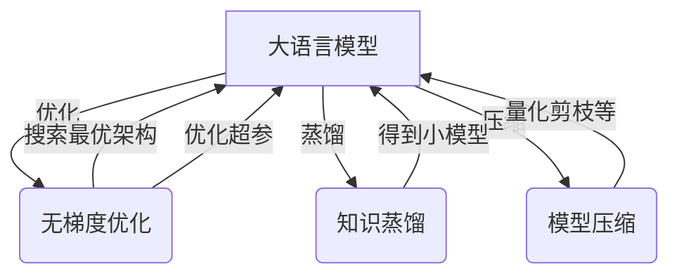

# 大语言模型应用指南：无梯度优化

## 1. 背景介绍
### 1.1 大语言模型的兴起
近年来,随着深度学习技术的飞速发展,大语言模型(Large Language Model, LLM)在自然语言处理领域取得了突破性进展。从GPT到ChatGPT,从BERT到PaLM,大语言模型展现出了惊人的语言理解和生成能力,受到学术界和工业界的广泛关注。
### 1.2 大语言模型面临的挑战  
然而,训练和部署大语言模型也面临诸多挑战:
- 计算资源需求大:训练大语言模型需要大量的计算资源和时间,对硬件提出很高要求。
- 推理速度慢:大语言模型的推理速度相对较慢,难以满足实时交互等场景的需求。
- 模型体积庞大:大语言模型动辄上百GB甚至TB级别,给存储和传输带来巨大压力。

### 1.3 无梯度优化的提出
为了应对上述挑战,无梯度优化(Gradient-Free Optimization, GFO)方法应运而生。无梯度优化旨在在不依赖梯度信息的情况下,对大语言模型进行高效优化,从而降低资源消耗,提高推理速度,并压缩模型体积。本文将重点介绍无梯度优化在大语言模型中的应用,揭示其内在原理,并探讨其未来的发展趋势与挑战。

## 2. 核心概念与联系
### 2.1 大语言模型
大语言模型是一类基于深度神经网络,在大规模文本数据上预训练得到的语言模型。它能够学习到丰富的语言知识和常识,具备强大的语言理解和生成能力。代表性的大语言模型包括GPT系列、BERT系列、T5、PaLM等。

### 2.2 无梯度优化
无梯度优化是一类不依赖梯度信息,直接在参数空间或者目标函数空间进行搜索的优化方法。与传统的基于梯度的优化方法(如SGD、Adam)相比,无梯度优化具有以下优势:
- 适用于非光滑、非连续、非凸的目标函数。
- 对参数初始化不敏感,鲁棒性更强。
- 更容易逃离局部最优,寻找全局最优解。
- 可以直接优化离散变量,如模型架构搜索等。

常见的无梯度优化算法包括进化算法(如遗传算法)、粒子群优化、模拟退火、贝叶斯优化等。

### 2.3 知识蒸馏
知识蒸馏是一种将大模型的知识迁移到小模型的技术。其基本思想是用大模型(教师模型)的输出作为小模型(学生模型)的训练目标,使学生模型尽可能模仿教师模型的行为。通过蒸馏,可以得到参数量更少、推理更快的小模型,同时保持较高的性能。

### 2.4 模型压缩
模型压缩旨在降低深度学习模型的存储和计算开销,同时尽量保持模型性能。常见的模型压缩技术包括:
- 量化:将模型权重从浮点数量化为低比特整数,如8bit、4bit等。
- 剪枝:去除冗余和不重要的神经元连接,得到稀疏网络。 
- 低秩分解:将权重矩阵分解为若干低秩矩阵的乘积,降低参数量。
- 知识蒸馏:用大模型蒸馏小模型,得到精简的学生模型。

下图展示了大语言模型、无梯度优化、知识蒸馏和模型压缩之间的关系:

无梯度优化可以用于搜索大语言模型的最优架构和超参数;知识蒸馏可以将大语言模型的知识迁移到小模型;模型压缩可以通过量化、剪枝等技术减小大语言模型的体积。三者相辅相成,共同助力大语言模型的应用落地。

## 3. 核心算法原理具体操作步骤
本节将重点介绍两种典型的无梯度优化算法在大语言模型中的应用:进化算法和贝叶斯优化。

### 3.1 基于进化算法的大语言模型架构搜索
进化算法是一类模拟生物进化过程的优化算法,通过迭代进行选择、交叉、变异等操作,逐步提升种群的适应度,最终找到最优解。将进化算法应用于大语言模型架构搜索的主要步骤如下:

1. 编码:将大语言模型的架构表示为一个编码向量,作为进化算法的个体。编码向量可以包含层数、隐藏单元数、注意力头数、激活函数类型等超参数。

2. 初始化种群:随机生成一批编码向量作为初始种群。种群的大小通常为几十到几百。

3. 适应度评估:对种群中的每个个体,根据其编码向量构建对应的大语言模型架构,在验证集上评估其性能(如perplexity),作为该个体的适应度。

4. 选择:根据适应度对种群进行选择,淘汰适应度低的个体,保留适应度高的个体。常见的选择算法有轮盘赌选择、锦标赛选择等。

5. 交叉:对选择后的个体进行交叉操作,生成新的子代个体。交叉可以在编码向量的不同位置进行,如单点交叉、多点交叉、均匀交叉等。

6. 变异:对新生成的子代个体进行变异操作,引入新的架构特征。变异可以随机改变编码向量的某些位置的值,如bitflip变异。

7. 更新种群:将子代个体加入种群,同时淘汰部分适应度低的个体,保持种群大小不变。 

8. 迭代:重复步骤3-7,直到达到预设的迭代次数或者满足收敛条件。

9. 输出:输出种群中适应度最高的个体,即为搜索到的最优大语言模型架构。

进化算法的优点是可以在非连续、非光滑的架构搜索空间中进行全局搜索,找到新颖的架构设计。但其缺点是计算开销大,需要训练和评估大量的模型。因此,在实践中通常与代理模型、权重共享等技术结合,以提高搜索效率。

### 3.2 基于贝叶斯优化的大语言模型超参调优
贝叶斯优化是一类基于贝叶斯推断的全局优化算法,特别适用于低维连续空间的黑盒优化问题。将贝叶斯优化应用于大语言模型超参调优的主要步骤如下:

1. 定义搜索空间:确定需要优化的超参数及其取值范围,如学习率、batch size、dropout率等。

2. 选择先验函数:选择一个先验函数来拟合目标函数(如验证集perplexity)。常用的先验函数有高斯过程、随机森林等。

3. 初始化观测点:随机选择几个超参数组合作为初始观测点,评估其目标函数值。

4. 更新后验分布:根据观测点的位置和目标函数值,更新先验函数的后验分布。后验分布体现了不同超参数组合的性能分布。

5. 选择下一个观测点:根据后验分布,选择一个最有可能改进目标函数值的超参数组合作为下一个观测点。常用的选点策略有期望提升(Expected Improvement)、上置信界(Upper Confidence Bound)等。

6. 评估新观测点:评估新观测点处的目标函数值,将其加入到观测点集合中。

7. 迭代:重复步骤4-6,直到达到预设的评估次数或者满足收敛条件。

8. 输出:输出观测到的最优超参数组合。

贝叶斯优化的优点是样本效率高,通过先验函数引入了目标函数的平滑性假设,能够快速找到全局最优解。但其缺点是计算复杂度高,且先验函数的选择需要领域知识。在实践中,通常先用随机搜索初始化若干观测点,再用贝叶斯优化进行局部搜索。

## 4. 数学模型和公式详细讲解举例说明
本节以高斯过程为例,详细讲解贝叶斯优化中的数学模型和公式。

### 4.1 高斯过程回归
假设我们要优化的目标函数为$f(x)$,其中$x$为$d$维的超参数向量。高斯过程假设函数$f(x)$服从一个高斯过程先验:

$$f(x) \sim \mathcal{GP}(m(x), k(x,x'))$$

其中$m(x)$为均值函数,$k(x,x')$为核函数。常用的核函数有平方指数核(Squared Exponential Kernel):

$$k_{\text{SE}}(x,x') = \sigma^2 \exp(-\frac{1}{2l^2}\|x-x'\|^2)$$

其中$\sigma^2$为方差,$l$为长度尺度。

给定$n$个观测点$\mathcal{D} = \{(x_i, y_i)\}_{i=1}^n$,其中$y_i = f(x_i) + \epsilon_i$为观测值,$\epsilon_i \sim \mathcal{N}(0,\sigma_n^2)$为观测噪声。我们可以得到联合分布:

$$\begin{bmatrix} y \\ f_* \end{bmatrix} \sim \mathcal{N}\left(\begin{bmatrix} m(X) \\ m(X_*) \end{bmatrix}, \begin{bmatrix} K(X,X) + \sigma_n^2I & K(X,X_*) \\ K(X_*,X) & K(X_*,X_*) \end{bmatrix}\right)$$

其中$X = [x_1, \dots, x_n]^T$为观测点矩阵,$y = [y_1, \dots, y_n]^T$为观测值向量,$X_*$为测试点矩阵,$f_*$为测试点处的函数值向量。

根据高斯分布的条件分布公式,我们可以得到测试点处的后验分布:

$$f_* | X, y, X_* \sim \mathcal{N}(\mu_*, \Sigma_*)$$

其中

$$\mu_* = m(X_*) + K(X_*,X)[K(X,X) + \sigma_n^2I]^{-1}(y - m(X))$$

$$\Sigma_* = K(X_*,X_*) - K(X_*,X)[K(X,X) + \sigma_n^2I]^{-1}K(X,X_*)$$

$\mu_*$即为测试点处的后验均值,$\Sigma_*$为后验方差。

### 4.2 期望提升
根据后验分布,我们可以计算每个测试点处的期望提升(Expected Improvement):

$$\text{EI}(x) = \mathbb{E}[\max(f(x) - f(x^+), 0)]$$

其中$x^+ = \arg\max_{x_i \in \mathcal{D}} f(x_i)$为当前的最优观测点。期望提升表示选择测试点$x$作为下一个观测点,相比当前最优值的期望提升。

假设后验分布为高斯分布$\mathcal{N}(\mu(x), \sigma^2(x))$,则期望提升可以解析计算:

$$\text{EI}(x) = (\mu(x) - f(x^+))\Phi(Z) + \sigma(x)\phi(Z)$$

其中$Z = \frac{\mu(x) - f(x^+)}{\sigma(x)}$,$\Phi(\cdot)$和$\phi(\cdot)$分别为标准正态分布的累积分布函数和概率密度函数。

在贝叶斯优化的每一轮迭代中,我们选择期望提升最大的测试点作为下一个观测点:

$$x_{n+1} = \arg\max_{x \in \mathcal{X}} \text{EI}(x)$$

其中$\mathcal{X}$为搜索空间。

### 4.3 示例说明
下面以一个简单的一维函数$f(x) = \sin(3x) + 0.1\cos(10