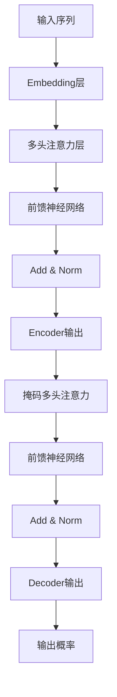

# 大语言模型应用指南：机器能思考吗

## 1.背景介绍

### 1.1 人工智能的崛起

人工智能(AI)已经成为当今科技领域最热门的话题之一。从语音助手到自动驾驶汽车,AI系统正在渗透到我们生活的方方面面。而在AI的众多分支中,大语言模型(Large Language Model,LLM)因其强大的自然语言处理能力而备受关注。

### 1.2 什么是大语言模型?

大语言模型是一种基于深度学习的自然语言处理(NLP)模型,通过在海量文本数据上进行训练,学习人类语言的模式和规则。这些模型能够生成看似人类写作的连贯、流畅的文本,并对输入的自然语言查询做出合理的响应。

### 1.3 大语言模型的重要性

大语言模型的出现为人机交互带来了革命性的变化。它们不仅能够帮助我们更高效地处理大量文本数据,还可以为各种应用程序提供智能化的语言服务,如智能写作助手、对话系统、问答系统等。随着模型规模和性能的不断提升,大语言模型正在成为推动人工智能发展的核心动力之一。

## 2.核心概念与联系

### 2.1 自然语言处理(NLP)

自然语言处理是人工智能的一个重要分支,旨在使计算机能够理解和生成人类可理解的自然语言。NLP技术广泛应用于机器翻译、情感分析、文本摘要等领域。大语言模型正是基于NLP的最新突破,它们能够更好地捕捉语言的语义和上下文信息。

### 2.2 深度学习

深度学习是机器学习的一个分支,它通过对数据进行表示学习,自动获取特征,并用于执行各种预测或决策任务。大语言模型通常采用基于transformer的深度神经网络架构,利用注意力机制来捕获长距离依赖关系,从而实现更好的语言理解和生成能力。

### 2.3 迁移学习

迁移学习是一种机器学习技术,它允许将在一个领域学习到的知识应用到另一个相关领域。大语言模型通常采用迁移学习的方式,先在大规模无标注语料库上进行预训练,获取通用的语言表示能力,然后在特定任务上进行微调,从而实现更好的性能。

### 2.4 注意力机制

注意力机制是transformer等序列模型中的关键组成部分。它允许模型在处理输入序列时,动态地关注与当前任务相关的部分,从而更好地捕获长距离依赖关系。注意力机制的引入大大提高了大语言模型的性能。

## 3.核心算法原理具体操作步骤

大语言模型的核心算法通常基于transformer架构,主要包括以下几个步骤:



1. **输入序列**:将输入文本序列化,每个词元(token)用一个独热向量表示。

2. **Embedding层**:将输入的独热向量映射到低维的稠密向量空间,作为模型的输入。

3. **多头注意力层**:计算输入序列中每个词元与其他词元的注意力权重,捕获序列内的长距离依赖关系。

4. **前馈神经网络**:对注意力输出进行非线性变换,提取更高层次的特征表示。

5. **Add & Norm**:将注意力输出和前馈网络输出相加,并进行层归一化,以保持数据分布的稳定性。

6. **Encoder输出**:Encoder的输出作为Decoder的输入,用于生成目标序列。

7. **掩码多头注意力**:在Decoder中,注意力机制需要掩码,防止关注到未来的位置。

8. **Decoder输出**:Decoder的输出是生成目标序列的概率分布。

9. **输出概率**:根据概率分布,对目标序列进行贪婪解码或beam search解码,得到最终的输出序列。

通过上述步骤,大语言模型可以有效地捕获输入序列的上下文信息,并生成自然、连贯的目标序列输出。

## 4.数学模型和公式详细讲解举例说明

在大语言模型中,注意力机制是实现长距离依赖捕获的关键。我们将详细介绍注意力机制的数学原理。

### 4.1 缩放点积注意力

缩放点积注意力(Scaled Dot-Product Attention)是transformer中使用的注意力机制,其数学表达式如下:

$$
\mathrm{Attention}(Q, K, V) = \mathrm{softmax}\left(\frac{QK^T}{\sqrt{d_k}}\right)V
$$

其中:
- $Q$是查询(Query)向量
- $K$是键(Key)向量
- $V$是值(Value)向量
- $d_k$是缩放因子,用于防止点积过大导致的梯度消失

该公式的计算过程如下:

1. 计算查询$Q$与所有键$K$的点积,得到未缩放的分数向量。
2. 将分数向量除以$\sqrt{d_k}$进行缩放,防止过大的值导致softmax函数饱和。
3. 对缩放后的分数向量应用softmax函数,得到注意力权重向量。
4. 将注意力权重向量与值向量$V$相乘,得到加权求和的注意力输出。

通过这种方式,注意力机制可以自动学习到输入序列中不同位置的相关性,并据此分配注意力权重。

### 4.2 多头注意力

为了捕获不同的注意力模式,transformer采用了多头注意力(Multi-Head Attention)机制。其数学表达式如下:

$$
\mathrm{MultiHead}(Q, K, V) = \mathrm{Concat}(\mathrm{head}_1, \ldots, \mathrm{head}_h)W^O
$$

$$
\mathrm{head}_i = \mathrm{Attention}(QW_i^Q, KW_i^K, VW_i^V)
$$

其中:
- $h$是注意力头的数量
- $W_i^Q$、$W_i^K$、$W_i^V$分别是第$i$个注意力头的查询、键和值的线性变换矩阵
- $W^O$是最终的线性变换矩阵,用于将多个注意力头的输出拼接后映射到期望的维度

多头注意力机制允许模型从不同的表示子空间中捕获不同的注意力模式,从而提高了模型的表达能力。

### 4.3 位置编码

由于transformer是一种序列模型,需要捕获输入序列中词元的位置信息。位置编码(Positional Encoding)就是用于引入位置信息的技术,其数学表达式如下:

$$
\mathrm{PE}_{(pos, 2i)} = \sin\left(\frac{pos}{10000^{2i/d_\mathrm{model}}}\right)
$$

$$
\mathrm{PE}_{(pos, 2i+1)} = \cos\left(\frac{pos}{10000^{2i/d_\mathrm{model}}}\right)
$$

其中:
- $pos$是词元的位置索引
- $i$是维度的索引
- $d_\mathrm{model}$是模型的embedding维度

位置编码将位置信息编码为一个固定的向量,并将其与输入的embedding相加,从而将位置信息注入到模型中。

通过上述数学模型和公式,大语言模型可以有效地捕获输入序列的上下文信息和位置信息,从而实现高质量的语言理解和生成。

## 5.项目实践:代码实例和详细解释说明

为了更好地理解大语言模型的实现细节,我们将提供一个基于PyTorch的代码示例,实现一个简单的transformer模型。

### 5.1 导入所需库

```python
import math
import torch
import torch.nn as nn
from torch.nn import TransformerEncoder, TransformerEncoderLayer
```

### 5.2 定义模型

```python
class TransformerModel(nn.Module):
    def __init__(self, ntoken, ninp, nhead, nhid, nlayers, dropout=0.5):
        super(TransformerModel, self).__init__()
        self.model_type = 'Transformer'
        self.pos_encoder = PositionalEncoding(ninp, dropout)
        encoder_layers = TransformerEncoderLayer(ninp, nhead, nhid, dropout)
        self.transformer_encoder = TransformerEncoder(encoder_layers, nlayers)
        self.encoder = nn.Embedding(ntoken, ninp)
        self.ninp = ninp
        self.decoder = nn.Linear(ninp, ntoken)

        self.init_weights()

    def generate_square_subsequent_mask(self, sz):
        mask = (torch.triu(torch.ones(sz, sz)) == 1).transpose(0, 1)
        mask = mask.float().masked_fill(mask == 0, float('-inf')).masked_fill(mask == 1, float(0.0))
        return mask

    def init_weights(self):
        initrange = 0.1
        self.encoder.weight.data.uniform_(-initrange, initrange)
        self.decoder.bias.data.zero_()
        self.decoder.weight.data.uniform_(-initrange, initrange)

    def forward(self, src, src_mask):
        src = self.encoder(src) * math.sqrt(self.ninp)
        src = self.pos_encoder(src)
        output = self.transformer_encoder(src, src_mask)
        output = self.decoder(output)
        return output
```

这段代码定义了一个简单的transformer模型,包括以下几个关键部分:

1. `PositionalEncoding`层:用于添加位置编码。
2. `TransformerEncoderLayer`和`TransformerEncoder`:实现transformer的encoder部分,包括多头注意力层和前馈神经网络。
3. `Embedding`层:将输入序列映射到embedding空间。
4. `Linear`层:将transformer的输出映射到词元的概率分布。

在`forward`函数中,输入序列首先通过embedding层和位置编码层,然后输入transformer encoder进行编码,最后通过线性层得到输出概率分布。

### 5.3 训练和评估

```python
import torchtext
from torchtext.datasets import WikiText2

train_iter = WikiText2(split='train')
ntokens = len(train_iter.vocab.stoi) # 词表大小

model = TransformerModel(ntokens, ...) # 初始化模型

criterion = nn.CrossEntropyLoss()
optimizer = torch.optim.SGD(model.parameters(), lr=1.0)

for epoch in range(num_epochs):
    for batch in train_iter:
        ...
        output = model(data, data_mask)
        loss = criterion(output.view(-1, ntokens), targets)
        ...
        optimizer.step()
```

在这个示例中,我们使用了`torchtext`库中的WikiText-2数据集进行训练和评估。首先,我们初始化模型,并定义损失函数和优化器。然后,在每个epoch中,我们遍历数据集,将输入数据传入模型得到输出概率分布,计算损失,并通过反向传播和优化器更新模型参数。

需要注意的是,这只是一个简化的示例,实际的大语言模型训练过程会更加复杂,需要处理大规模数据、分布式训练、模型并行等问题。但是,这个示例能够让您了解transformer模型的基本实现原理。

## 6.实际应用场景

大语言模型在许多实际应用场景中发挥着重要作用,例如:

1. **自然语言生成(NLG)**:大语言模型可以用于生成高质量的自然语言文本,如新闻报道、小说、诗歌等。这为创作型AI应用程序开辟了新的可能性。

2. **对话系统**:通过微调,大语言模型可以用于构建智能对话系统,为用户提供自然、流畅的对话体验。这在客户服务、个人助理等场景中有广泛应用。

3. **机器翻译**:大语言模型可以捕获语言之间的复杂映射关系,为高质量的机器翻译提供了新的解决方案。

4. **文本摘要**:大语言模型能够理解文本的语义,并生成准确、连贯的摘要,为信息过载时代提供了有力的工具。

5. **问答系统**:通过对大语言模型进行微调,可以构建出色的问答系统,为用户提供准确、相关的答复。

6. **代码生成**:最新的大语言模型展现出了生成代码的能力,为程序员提供了智能化的