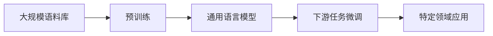

# 大语言模型应用指南：达特茅斯会议

## 1. 背景介绍

### 1.1 大语言模型的发展历程
#### 1.1.1 早期的语言模型
#### 1.1.2 神经网络语言模型的兴起
#### 1.1.3 Transformer模型的突破

### 1.2 达特茅斯会议的历史意义  
#### 1.2.1 人工智能的起源
#### 1.2.2 会议的主要内容和成果
#### 1.2.3 对人工智能发展的深远影响

### 1.3 大语言模型与达特茅斯会议的关联
#### 1.3.1 人工智能的语言理解能力 
#### 1.3.2 自然语言处理的核心挑战
#### 1.3.3 大语言模型对人工智能发展的推动作用

## 2. 核心概念与联系

### 2.1 大语言模型的定义和特点
#### 2.1.1 语言模型的基本概念
#### 2.1.2 大语言模型的规模和性能
#### 2.1.3 无监督预训练的优势

### 2.2 Transformer模型的核心思想
#### 2.2.1 注意力机制的原理
#### 2.2.2 自注意力的计算过程
#### 2.2.3 位置编码的作用

### 2.3 预训练和微调的关系
#### 2.3.1 预训练的目标和方法
#### 2.3.2 微调的适用场景和技巧
#### 2.3.3 预训练和微调的协同效应



## 3. 核心算法原理与具体操作步骤

### 3.1 Transformer的编码器结构
#### 3.1.1 输入嵌入和位置编码
#### 3.1.2 多头自注意力机制
#### 3.1.3 前馈神经网络

### 3.2 Transformer的解码器结构
#### 3.2.1 自回归语言建模
#### 3.2.2 编码-解码注意力机制
#### 3.2.3 解码器自注意力机制

### 3.3 预训练的损失函数设计
#### 3.3.1 掩码语言模型(MLM)
#### 3.3.2 下一句预测(NSP)
#### 3.3.3 对比学习目标

### 3.4 微调的具体操作步骤
#### 3.4.1 任务特定的输入表示
#### 3.4.2 添加任务特定的输出层
#### 3.4.3 调整超参数和训练策略

## 4. 数学模型和公式详细讲解举例说明

### 4.1 自注意力的数学表示
#### 4.1.1 查询(Query)、键(Key)、值(Value)的计算
$$Attention(Q,K,V) = softmax(\frac{QK^T}{\sqrt{d_k}})V$$
#### 4.1.2 多头自注意力的并行计算
$$MultiHead(Q,K,V) = Concat(head_1,...,head_h)W^O$$
#### 4.1.3 残差连接和层归一化

### 4.2 位置编码的数学表示
#### 4.2.1 正弦和余弦函数的周期性
$$PE_{(pos,2i)} = sin(pos/10000^{2i/d_{model}})$$
$$PE_{(pos,2i+1)} = cos(pos/10000^{2i/d_{model}})$$
#### 4.2.2 位置编码的相对位置关系
#### 4.2.3 可学习的位置编码

### 4.3 前馈神经网络的数学表示
#### 4.3.1 两个线性变换与ReLU激活
$$FFN(x) = max(0, xW_1 + b_1)W_2 + b_2$$
#### 4.3.2 维度变换和信息融合
#### 4.3.3 残差连接和层归一化

## 5. 项目实践：代码实例和详细解释说明

### 5.1 使用Hugging Face Transformers库
#### 5.1.1 加载预训练模型和分词器
```python
from transformers import BertTokenizer, BertModel
tokenizer = BertTokenizer.from_pretrained('bert-base-uncased')
model = BertModel.from_pretrained('bert-base-uncased')
```
#### 5.1.2 编码输入文本
```python
inputs = tokenizer("Hello world!", return_tensors="pt")
outputs = model(**inputs)
```
#### 5.1.3 提取词嵌入和句子表示

### 5.2 使用PyTorch构建Transformer模型
#### 5.2.1 定义Transformer编码器层
```python
class TransformerEncoderLayer(nn.Module):
    def __init__(self, d_model, nhead, dim_feedforward, dropout):
        super().__init__()
        self.self_attn = nn.MultiheadAttention(d_model, nhead, dropout)
        self.linear1 = nn.Linear(d_model, dim_feedforward)
        self.dropout = nn.Dropout(dropout)
        self.linear2 = nn.Linear(dim_feedforward, d_model)
        self.norm1 = nn.LayerNorm(d_model)
        self.norm2 = nn.LayerNorm(d_model)
        self.dropout1 = nn.Dropout(dropout)
        self.dropout2 = nn.Dropout(dropout)
        
    def forward(self, src, src_mask=None, src_key_padding_mask=None):
        src2 = self.self_attn(src, src, src, attn_mask=src_mask,
                              key_padding_mask=src_key_padding_mask)[0]
        src = src + self.dropout1(src2)
        src = self.norm1(src)
        src2 = self.linear2(self.dropout(F.relu(self.linear1(src))))
        src = src + self.dropout2(src2)
        src = self.norm2(src)
        return src
```
#### 5.2.2 定义Transformer解码器层
```python
class TransformerDecoderLayer(nn.Module):
    def __init__(self, d_model, nhead, dim_feedforward, dropout):
        super().__init__()
        self.self_attn = nn.MultiheadAttention(d_model, nhead, dropout)
        self.multihead_attn = nn.MultiheadAttention(d_model, nhead, dropout)
        self.linear1 = nn.Linear(d_model, dim_feedforward)
        self.dropout = nn.Dropout(dropout)
        self.linear2 = nn.Linear(dim_feedforward, d_model)
        self.norm1 = nn.LayerNorm(d_model)
        self.norm2 = nn.LayerNorm(d_model)
        self.norm3 = nn.LayerNorm(d_model)
        self.dropout1 = nn.Dropout(dropout)
        self.dropout2 = nn.Dropout(dropout)
        self.dropout3 = nn.Dropout(dropout)
        
    def forward(self, tgt, memory, tgt_mask=None, memory_mask=None, 
                tgt_key_padding_mask=None, memory_key_padding_mask=None):
        tgt2 = self.self_attn(tgt, tgt, tgt, attn_mask=tgt_mask,
                              key_padding_mask=tgt_key_padding_mask)[0]
        tgt = tgt + self.dropout1(tgt2)
        tgt = self.norm1(tgt)
        tgt2 = self.multihead_attn(tgt, memory, memory, attn_mask=memory_mask,
                                   key_padding_mask=memory_key_padding_mask)[0]
        tgt = tgt + self.dropout2(tgt2)
        tgt = self.norm2(tgt)
        tgt2 = self.linear2(self.dropout(F.relu(self.linear1(tgt))))
        tgt = tgt + self.dropout3(tgt2)
        tgt = self.norm3(tgt)
        return tgt
```
#### 5.2.3 组合Transformer编码器和解码器

### 5.3 微调预训练模型进行下游任务
#### 5.3.1 准备任务特定的数据集
#### 5.3.2 设计任务特定的输入表示和输出层
#### 5.3.3 加载预训练模型并进行微调

## 6. 实际应用场景

### 6.1 机器翻译
#### 6.1.1 多语言翻译模型的构建
#### 6.1.2 低资源语言的翻译质量提升
#### 6.1.3 领域适应和个性化翻译

### 6.2 文本摘要
#### 6.2.1 抽取式摘要和生成式摘要
#### 6.2.2 摘要的可控性和可解释性
#### 6.2.3 多文档摘要和对话摘要

### 6.3 问答系统
#### 6.3.1 阅读理解和开放域问答
#### 6.3.2 知识库问答和常识推理
#### 6.3.3 多轮对话和交互式问答

### 6.4 文本生成
#### 6.4.1 开放域对话生成
#### 6.4.2 故事和诗歌生成
#### 6.4.3 文本风格转换和属性控制

## 7. 工具和资源推荐

### 7.1 开源的预训练模型
#### 7.1.1 BERT及其变体
#### 7.1.2 GPT系列模型
#### 7.1.3 XLNet和ELECTRA等模型

### 7.2 自然语言处理工具包
#### 7.2.1 Hugging Face Transformers
#### 7.2.2 SpaCy和NLTK
#### 7.2.3 AllenNLP和Flair

### 7.3 大规模语料库和基准数据集
#### 7.3.1 维基百科和CommonCrawl
#### 7.3.2 GLUE和SuperGLUE基准
#### 7.3.3 SQuAD和CoQA数据集

### 7.4 模型评估和可视化工具
#### 7.4.1 TensorBoard和Weights & Biases
#### 7.4.2 BertViz和TransformerVis
#### 7.4.3 AllenNLP Interpret和Captum

## 8. 总结：未来发展趋势与挑战

### 8.1 大语言模型的发展趋势
#### 8.1.1 模型规模的持续增长
#### 8.1.2 多模态预训练和跨领域迁移
#### 8.1.3 低资源场景下的模型优化

### 8.2 面临的挑战和问题
#### 8.2.1 计算资源和训练效率的瓶颈
#### 8.2.2 模型的可解释性和公平性
#### 8.2.3 隐私保护和道德考量

### 8.3 未来研究方向和机遇
#### 8.3.1 知识增强的语言模型
#### 8.3.2 人机协作和交互式学习
#### 8.3.3 语言模型的理论基础探索

## 9. 附录：常见问题与解答

### 9.1 如何选择合适的预训练模型？
### 9.2 微调时如何设置超参数？
### 9.3 如何处理输入文本过长的问题？
### 9.4 如何评估生成文本的质量？
### 9.5 如何应对数据隐私和安全挑战？

作者：禅与计算机程序设计艺术 / Zen and the Art of Computer Programming