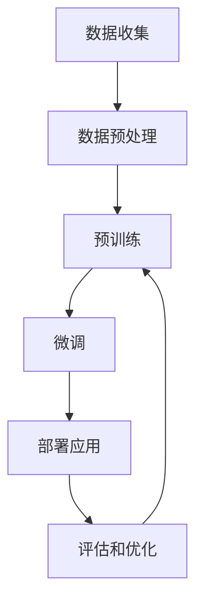

# 大语言模型应用指南：运行

## 1. 背景介绍

### 1.1 什么是大语言模型?

大语言模型(Large Language Models, LLMs)是一种基于深度学习的自然语言处理(NLP)模型,它可以处理和生成人类语言。这些模型通过在大量文本数据上进行训练,学习语言的模式和规则,从而获得对语言的深入理解。

大语言模型的出现源于近年来计算能力、数据可用性和算法创新的飞速发展。它们可以执行各种NLP任务,如文本生成、机器翻译、问答系统、文本摘要等,展现出令人印象深刻的语言理解和生成能力。

### 1.2 大语言模型的重要性

大语言模型正在彻底改变人类与计算机交互的方式。它们使得自然语言处理系统能够更加自然、流畅地与人类交流,极大地提高了人机交互的效率和体验。同时,大语言模型也为各种应用程序带来了新的可能性,如智能写作助手、自动化客户服务、内容创作等。

此外,大语言模型还为人工智能的发展提供了重要的基础。它们展示了深度学习在语言理解和生成方面的强大能力,为未来发展更加通用的人工智能系统奠定了基础。

## 2. 核心概念与联系

### 2.1 自然语言处理(NLP)

自然语言处理(Natural Language Processing, NLP)是一门研究计算机理解和生成人类语言的学科。它涉及多个子领域,如机器翻译、文本摘要、情感分析、问答系统等。

大语言模型是NLP领域的一个重要突破,它们展示了深度学习在处理自然语言方面的巨大潜力。通过在大量文本数据上训练,大语言模型能够捕捉语言的复杂模式和规则,从而更好地理解和生成自然语言。

### 2.2 深度学习

深度学习(Deep Learning)是一种基于人工神经网络的机器学习方法,它可以从数据中自动学习特征表示。深度学习模型通过多层非线性变换,从低层次的特征组合构建更高层次的复杂特征表示,从而捕捉数据的内在结构和模式。

大语言模型通常采用基于transformer的深度学习架构,如GPT(Generative Pre-trained Transformer)和BERT(Bidirectional Encoder Representations from Transformers)。这些架构利用自注意力机制来捕捉长距离依赖关系,从而更好地理解和生成自然语言。

### 2.3 预训练和微调

大语言模型通常采用预训练和微调的范式。在预训练阶段,模型在大量无标注文本数据上进行训练,学习通用的语言表示。在微调阶段,预训练的模型被进一步调整以适应特定的下游任务,如机器翻译、文本摘要等。

这种预训练和微调的范式使得大语言模型可以在有限的计算资源下获得出色的性能。预训练阶段可以在大量数据和计算资源上进行,而微调阶段则可以在较小的任务数据集上快速完成。

### 2.4 Mermaid流程图

以下是大语言模型应用的典型流程:

该流程图描述了大语言模型应用的主要步骤:

1. 数据收集: 收集大量无标注的文本数据,如网页、书籍、新闻等。
2. 数据预处理: 对文本数据进行清理、标记化等预处理。
3. 预训练: 在预处理后的大量文本数据上训练大语言模型,获得通用的语言表示。
4. 微调: 根据特定的下游任务,对预训练模型进行微调,使其适应该任务。
5. 部署应用: 将微调后的模型部署到实际应用中,如机器翻译、问答系统等。
6. 评估和优化: 评估模型的性能,并根据反馈进行进一步优化,如数据增强、模型架构调整等。

## 3. 核心算法原理具体操作步骤

### 3.1 transformer架构

transformer是大语言模型中广泛采用的核心架构,它完全基于注意力机制,不使用循环神经网络(RNN)或卷积神经网络(CNN)。transformer的主要组件包括编码器(encoder)和解码器(decoder)。

编码器将输入序列映射到一系列连续的向量表示,解码器则根据编码器的输出生成目标序列。两者都使用多头自注意力机制来捕捉输入序列中的长距离依赖关系。

transformer的具体操作步骤如下:

1. **输入embedding**: 将输入序列(如文本)映射为向量表示。
2. **位置编码**: 为每个位置添加位置信息,使transformer能够捕捉序列的顺序。
3. **多头自注意力**: 计算查询(query)、键(key)和值(value)之间的注意力分数,捕捉输入序列中的长距离依赖关系。
4. **前馈神经网络**: 对注意力输出进行非线性变换,提取更高层次的特征表示。
5. **规范化**: 对每一层的输出进行归一化,加速收敛并提高模型稳定性。
6. **解码器掩码**: 在解码器中,掩码机制确保只关注当前位置之前的输出,以生成正确的序列。

通过堆叠多个transformer编码器和解码器层,大语言模型可以学习复杂的语言模式和规则,从而实现出色的自然语言理解和生成能力。

### 3.2 自注意力机制

自注意力机制是transformer架构的核心,它允许模型捕捉输入序列中的长距离依赖关系。与RNN和CNN不同,自注意力机制不需要按顺序处理序列,而是直接计算每个位置与其他所有位置之间的注意力分数。

自注意力机制的具体操作步骤如下:

1. 计算查询(query)、键(key)和值(value)矩阵:
   $$
   \begin{aligned}
   Q &= XW^Q \\
   K &= XW^K \\
   V &= XW^V
   \end{aligned}
   $$
   其中$X$是输入序列,$W^Q$、$W^K$和$W^V$是可学习的权重矩阵。

2. 计算注意力分数:
   $$
   \text{Attention}(Q, K, V) = \text{softmax}\left(\frac{QK^T}{\sqrt{d_k}}\right)V
   $$
   其中$d_k$是缩放因子,用于防止注意力分数过大或过小。

3. 多头注意力:为了捕捉不同的子空间表示,transformer使用多个注意力头,每个头学习不同的注意力分布。最终的注意力输出是所有头的注意力输出的拼接和线性变换。

自注意力机制允许模型直接关注输入序列中的任何位置,从而更好地捕捉长距离依赖关系,这是transformer架构取得巨大成功的关键。

### 3.3 BERT和GPT

BERT(Bidirectional Encoder Representations from Transformers)和GPT(Generative Pre-trained Transformer)是两种广泛使用的大语言模型架构。

**BERT**:

- BERT是一种双向transformer编码器,可以同时考虑序列中每个位置的左右上下文信息。
- 在预训练阶段,BERT使用两种任务:掩码语言模型(Masked Language Modeling)和下一句预测(Next Sentence Prediction)。
- 掩码语言模型任务要求BERT预测被掩码的单词,从而学习序列中单词的上下文关系。
- 下一句预测任务则要求BERT判断两个句子是否相关,以捕捉句子级别的关系。
- BERT在多项NLP任务上取得了出色的性能,如文本分类、问答系统等。

**GPT**:

- GPT是一种单向transformer解码器,专注于自然语言生成任务。
- 在预训练阶段,GPT使用语言模型任务,学习预测序列中下一个单词的概率分布。
- GPT可以生成连贯、流畅的自然语言文本,广泛应用于文本生成、机器翻译等任务。
- GPT-2和GPT-3是GPT架构的后续版本,具有更大的模型规模和更强的生成能力。

BERT和GPT代表了两种不同的大语言模型范式:BERT侧重于语言理解,而GPT侧重于语言生成。它们在不同的NLP任务中发挥着重要作用,并为后续的大语言模型研究奠定了基础。

## 4. 数学模型和公式详细讲解举例说明

### 4.1 transformer模型

transformer模型的核心是自注意力机制,它允许模型直接捕捉输入序列中任意位置之间的依赖关系。自注意力机制的数学表示如下:

$$
\text{Attention}(Q, K, V) = \text{softmax}\left(\frac{QK^T}{\sqrt{d_k}}\right)V
$$

其中:

- $Q$是查询(query)矩阵,表示我们要关注的信息。
- $K$是键(key)矩阵,表示我们要匹配的信息。
- $V$是值(value)矩阵,表示我们要获取的信息。
- $d_k$是缩放因子,用于防止注意力分数过大或过小。

自注意力机制的工作原理如下:

1. 计算查询$Q$和键$K$之间的点积,得到注意力分数矩阵。
2. 对注意力分数矩阵进行行级softmax操作,得到注意力权重矩阵。
3. 将注意力权重矩阵与值$V$相乘,得到加权和表示。

通过这种方式,transformer可以直接关注输入序列中的任何位置,捕捉长距离依赖关系。

### 4.2 掩码语言模型

掩码语言模型(Masked Language Modeling, MLM)是BERT预训练的核心任务之一。它的目标是预测被掩码的单词,从而学习序列中单词的上下文关系。

掩码语言模型的数学表示如下:

$$
\begin{aligned}
\hat{y} &= \text{BERT}(x_1, \dots, \text{[MASK]}, \dots, x_n) \\
\mathcal{L}_\text{MLM} &= -\log P(x_\text{masked} | x_1, \dots, x_n)
\end{aligned}
$$

其中:

- $x_1, \dots, x_n$是输入序列。
- $\text{[MASK]}$表示被掩码的单词位置。
- $\hat{y}$是BERT模型对掩码位置的预测输出。
- $x_\text{masked}$是掩码位置的真实单词。
- $\mathcal{L}_\text{MLM}$是掩码语言模型的损失函数,即预测错误的负对数似然。

在预训练过程中,BERT会随机将输入序列中的一些单词替换为$\text{[MASK]}$标记,然后优化模型参数,使得$\hat{y}$尽可能接近$x_\text{masked}$。通过这种方式,BERT学习了序列中单词的上下文关系,从而获得了强大的语言理解能力。

### 4.3 生成式预训练transformer

生成式预训练transformer(Generative Pre-trained Transformer, GPT)是一种专注于自然语言生成的大语言模型架构。它的核心任务是语言模型,即预测序列中下一个单词的概率分布。

GPT的数学表示如下:

$$
\begin{aligned}
\hat{y}_t &= \text{GPT}(x_1, \dots, x_{t-1}) \\
\mathcal{L}_\text{LM} &= -\sum_{t=1}^n \log P(x_t | x_1, \dots, x_{t-1})
\end{aligned}
$$

其中:

- $x_1, \dots, x_n$是输入序列。
- $\hat{y}_t$是GPT模型对第$t$个位置的预测输出。
- $x_t$是第$t$个位置的真实单词。
- $\mathcal{L}_\text{LM}$是语言模型的损失函数,即预测错误的负对数似然之和。

在预训练过程中,GPT会优化模型参数,使得$\hat{y}_t$尽可能接近$x_t$。通过这种方式,GPT学习了序列中单词之间的条件概率分布,从而获得了强大的自然语言生