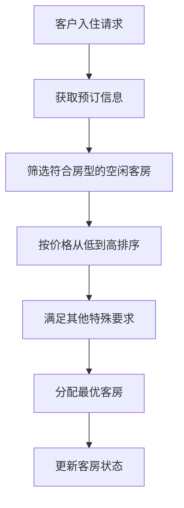
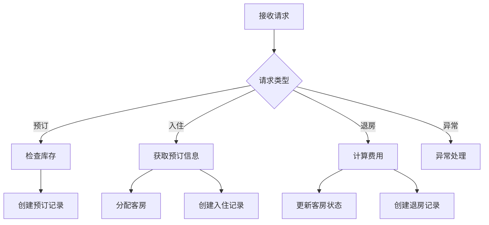
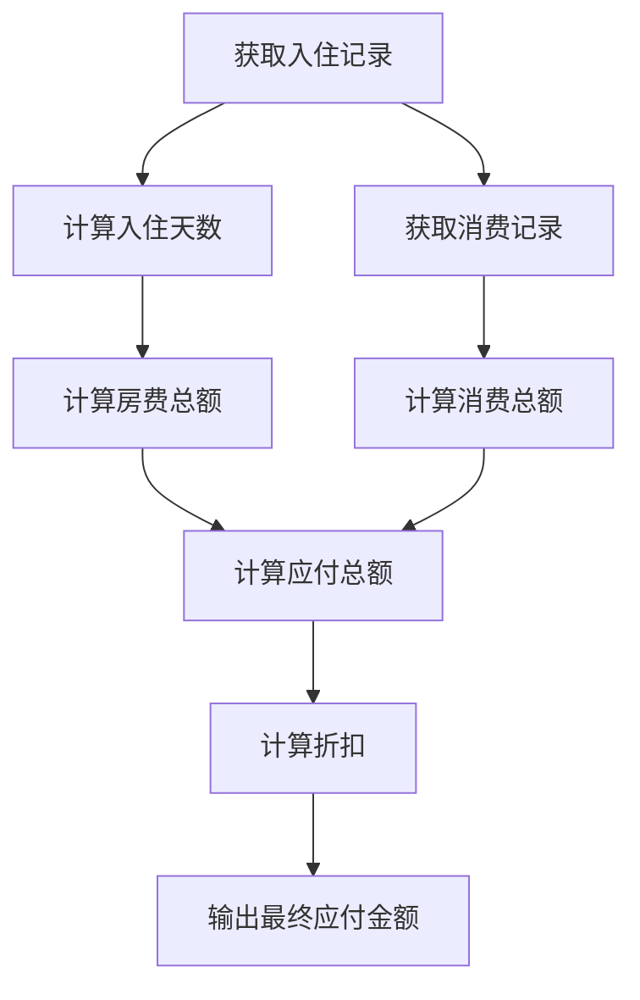

# 客房信息管理系统详细设计与具体代码实现

## 1.背景介绍

酒店业是服务业的重要组成部分,为旅客提供短期居住和相关服务。随着旅游业的蓬勃发展,酒店行业竞争日益激烈,酒店管理的要求也越来越高。为了提高管理效率、优化服务质量,现代化酒店普遍采用计算机管理系统。其中,客房信息管理系统作为酒店管理信息系统的核心模块,对于实现精细化管理、提升客户体验至关重要。

客房信息管理系统主要负责管理酒店客房的预订、入住、退房等全过程,同时对客房状态、客户信息等数据进行实时跟踪和维护。系统的高效运行直接影响着酒店的运营效率和服务质量,因此其设计和实现需要全面考虑各种实际需求,并具备良好的可扩展性和可维护性。

## 2.核心概念与联系

客房信息管理系统涉及的核心概念包括:

1. **客房(Room)**: 酒店的房间,每个客房都有唯一的房间号、房型、床型、价格等属性。
2. **客户(Customer)**: 预订或入住酒店的顾客,包括姓名、联系方式、身份证号等个人信息。
3. **预订(Reservation)**: 客户提前预定客房的行为,包括预订日期、入住日期、离店日期等信息。
4. **入住(Check-in)**: 客户实际入住酒店的过程,将预订转化为实际入住记录。
5. **退房(Check-out)**: 客户离开酒店时,结算费用并办理退房手续。

这些核心概念之间存在紧密的联系:客户通过预订获得入住权,入住时系统分配实际客房,退房时结算费用并释放客房资源。客房信息管理系统需要对这些概念及其关系进行建模和管理。

## 3.核心算法原理具体操作步骤

客房信息管理系统的核心算法包括客房分配、订单处理和收银结算等,具体操作步骤如下:

### 3.1 客房分配算法

当客户入住时,系统需要为其分配合适的客房。分配过程需要考虑以下因素:

1. **客房类型**: 根据客户预订的房型和床型,筛选符合要求的客房。
2. **客房状态**: 只有空闲的客房才能被分配。
3. **价格**: 优先分配价格合理的客房。
4. **其他要求**: 如无烟房、无障碍设施等特殊需求。



算法流程:

1. 获取客户预订信息,包括房型、床型等。
2. 筛选出所有符合预订要求且当前空闲的客房。
3. 按照客房价格从低到高排序。
4. 遍历排序后的客房列表,选择满足其他特殊要求(如无烟房)的第一个客房。
5. 将选中的客房分配给客户,更新客房状态为"已入住"。

### 3.2 订单处理算法

订单处理算法负责管理客户的预订、入住和退房记录,包括以下步骤:

1. **预订处理**:接收客户预订请求,检查请求日期的客房库存情况,如有空房则创建预订记录。
2. **入住处理**:将预订转化为实际入住记录,分配客房,更新客房状态。
3. **退房处理**:计算客户应付费用,办理退房手续,更新客房状态为"空闲"。
4. **异常处理**:处理预订取消、延期入住等异常情况。



算法流程:

1. 接收客户请求,判断请求类型(预订、入住、退房或异常情况)。
2. 对于预订请求,检查请求日期的客房库存情况,如有空房则创建预订记录。
3. 对于入住请求,获取客户预订信息,分配客房,创建入住记录。
4. 对于退房请求,计算客户应付费用,更新客房状态为"空闲",创建退房记录。
5. 对于异常情况(如预订取消、延期入住等),执行相应的异常处理流程。

### 3.3 收银结算算法

当客户退房时,系统需要计算应付费用,具体步骤如下:

1. 获取客户入住记录,计算实际入住天数。
2. 根据入住客房的价格策略(如每日价格、周末价格等),计算房费总额。
3. 统计客户在酒店内的其他消费记录(如餐饮、娱乐等),计算消费总额。
4. 计算应付总额 = 房费总额 + 消费总额。
5. 根据酒店的优惠政策,计算折扣和最终应付金额。



算法流程:

1. 获取客户的入住记录,计算实际入住天数。
2. 根据入住客房的价格策略,计算房费总额。
3. 获取客户在酒店内的其他消费记录,计算消费总额。
4. 计算应付总额 = 房费总额 + 消费总额。
5. 根据酒店的优惠政策,计算折扣。
6. 输出最终应付金额。

## 4.数学模型和公式详细讲解举例说明

在客房信息管理系统中,常用的数学模型和公式包括:

### 4.1 房费计算模型

房费计算是酒店收入的主要来源,需要根据不同的价格策略进行计算。常用的房费计算公式如下:

$$
房费总额 = \sum_{i=1}^{n}价格(日期_i) \times 权重(日期_i)
$$

其中:

- $n$表示入住天数
- $价格(日期_i)$表示第$i$天的基础房价
- $权重(日期_i)$表示第$i$天的权重系数,用于体现不同日期的价格差异(如周末价格更高)

例如,某客户入住3晚,第一天(工作日)房价为500元,第二天(周末)房价为800元,第三天(工作日)房价为500元。假设周末权重系数为1.2,工作日权重系数为1,则房费总额计算如下:

$$
房费总额 = 500 \times 1 + 800 \times 1.2 + 500 \times 1 = 1460元
$$

### 4.2 客房利用率模型

客房利用率是衡量酒店经营状况的重要指标,反映了客房的实际使用情况。客房利用率的计算公式如下:

$$
客房利用率 = \frac{实际出租房间数}{可供出租房间总数} \times 100\%
$$

其中:

- $实际出租房间数$表示一定时间段内实际被出租的客房数量
- $可供出租房间总数$表示同一时间段内,酒店可供出租的客房总数

例如,某酒店共有100间客房,在某个月中,实际出租了2500间夜。假设每间客房每天只能被出租一次,则该月的客房利用率计算如下:

$$
客房利用率 = \frac{2500}{100 \times 30} \times 100\% = 83.33\%
$$

### 4.3 收益管理模型

收益管理是酒店业的一种营销策略,旨在通过动态调整房价来最大化收益。常用的收益管理模型包括:

1. **统计模型**:根据历史数据,预测未来的客房需求和价格,制定相应的定价策略。
2. **优化模型**:建立数学规划模型,以最大化预期收益为目标,求解最优的房价和库存分配方案。

优化模型的数学表达式通常如下:

$$
\max \sum_{i=1}^{n}p_i x_i \\
s.t. \sum_{i=1}^{n}x_i \leq C \\
x_i \geq 0, i = 1, 2, \cdots, n
$$

其中:

- $n$表示预订类型的数量
- $p_i$表示第$i$种预订类型的房价
- $x_i$表示第$i$种预订类型的房间数量
- $C$表示可供出租的客房总数

目标函数$\sum_{i=1}^{n}p_i x_i$表示总收益,约束条件$\sum_{i=1}^{n}x_i \leq C$表示分配的房间数不能超过总量。通过求解该优化模型,可以获得最大化收益的房价和库存分配方案。

## 5.项目实践:代码实例和详细解释说明

为了更好地理解客房信息管理系统的实现,我们将使用Python编写一个简单的示例项目。该项目包括以下核心模块:

1. `Room`模块:定义客房类,包括房间号、房型、床型、价格等属性。
2. `Customer`模块:定义客户类,包括姓名、联系方式、身份证号等属性。
3. `Reservation`模块:定义预订类,包括预订日期、入住日期、离店日期等属性。
4. `RoomManager`模块:实现客房分配、订单处理和收银结算等核心功能。

### 5.1 Room模块

```python
class Room:
    def __init__(self, room_number, room_type, bed_type, price):
        self.room_number = room_number
        self.room_type = room_type
        self.bed_type = bed_type
        self.price = price
        self.status = 'available'  # 客房状态,可选值为'available'(空闲)或'occupied'(已入住)
        self.occupant = None  # 入住客户,初始为None

    def check_in(self, customer):
        """为客户入住"""
        self.status = 'occupied'
        self.occupant = customer

    def check_out(self):
        """客户退房"""
        self.status = 'available'
        occupant = self.occupant
        self.occupant = None
        return occupant
```

`Room`类定义了客房的基本属性和状态,包括`room_number`(房间号)、`room_type`(房型)、`bed_type`(床型)、`price`(价格)、`status`(状态)和`occupant`(入住客户)。

`check_in`方法用于为客户入住,将房间状态设置为"已入住",并记录入住客户信息。`check_out`方法用于客户退房,将房间状态设置为"空闲",并返回退房客户信息。

### 5.2 Customer模块

```python
class Customer:
    def __init__(self, name, contact, id_number):
        self.name = name
        self.contact = contact
        self.id_number = id_number
        self.reservations = []  # 客户的预订记录列表
        self.check_ins = []  # 客户的入住记录列表
        self.check_outs = []  # 客户的退房记录列表
        self.consumptions = []  # 客户的消费记录列表

    def make_reservation(self, reservation):
        """创建预订记录"""
        self.reservations.append(reservation)

    def check_in(self, check_in):
        """创建入住记录"""
        self.check_ins.append(check_in)

    def check_out(self, check_out):
        """创建退房记录"""
        self.check_outs.append(check_out)

    def add_consumption(self, consumption):
        """添加消费记录"""
        self.consumptions.append(consumption)
```

`Customer`类定义了客户的基本信息和相关记录,包括`name`(姓名)、`contact`(联系方式)、`id_number`(身份证号)、`reservations`(预订记录列表)、`check_ins`(入住记录列表)、`check_outs`(退房记录列表)和`consumptions`(消费