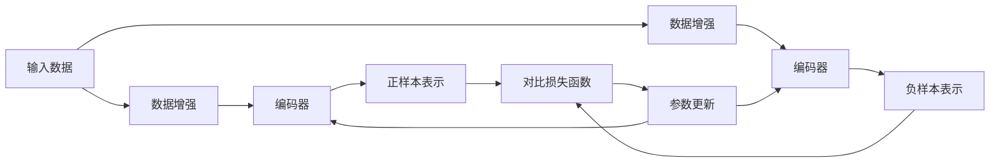

# 对比学习 原理与代码实例讲解

## 1.背景介绍
### 1.1 对比学习的定义
对比学习(Contrastive Learning)是一种无监督的表示学习方法,它通过最大化正样本对之间的相似性,同时最小化负样本对之间的相似性,从而学习到数据的有效表示。对比学习可以在没有标签信息的情况下,自动学习到数据的语义特征表示。

### 1.2 对比学习的发展历程
对比学习最早可以追溯到Hadsell等人在2006年提出的对比损失(Contrastive Loss)。此后,对比学习在深度学习时代得到了快速发展,涌现出了大量的对比学习算法,如SimCLR、MoCo、BYOL等。这些算法在图像分类、目标检测、语义分割等任务上取得了显著的性能提升。

### 1.3 对比学习的应用场景
对比学习可以应用于多个领域,包括:  
- 计算机视觉:图像分类、目标检测、语义分割等
- 自然语言处理:句子表示学习、文本分类、语义匹配等  
- 语音识别:说话人识别、情感识别等
- 推荐系统:用户行为表示学习、物品表示学习等

## 2.核心概念与联系
### 2.1 正样本对(Positive Pair)
正样本对指的是语义上相似或相关的样本对,例如同一个物体的不同视角图像,或者同一个句子的不同表述。在对比学习中,我们希望最大化正样本对的相似性。

### 2.2 负样本对(Negative Pair) 
负样本对指的是语义上不相关的样本对,例如不同物体的图像,或者不同语义的句子。在对比学习中,我们希望最小化负样本对的相似性。

### 2.3 编码器(Encoder)
编码器用于将输入数据映射为低维的语义表示向量。常见的编码器包括CNN、BERT等。编码器可以是孪生结构(Siamese)的,即对正负样本对使用相同的编码器网络。

### 2.4 对比损失函数(Contrastive Loss) 
对比损失函数用于度量正负样本对的相似性,并引导编码器学习参数。常见的对比损失函数包括:
- 对比预测编码损失(Contrastive Predictive Coding Loss) 
- InfoNCE损失(Info Noise-Contrastive Estimation)
- 余弦相似度损失(Cosine Similarity Loss)

### 2.5 数据增强(Data Augmentation)
数据增强在对比学习中扮演重要角色。通过对输入数据进行随机转换(如裁剪、翻转、颜色变换等),可以构建正样本对。数据增强可以提高模型的泛化性和鲁棒性。

下图展示了这些核心概念之间的关系:



## 3.核心算法原理具体操作步骤
对比学习的核心算法可以总结为以下步骤:

### 3.1 数据采样与增强
1. 从数据集中采样一批数据样本 $\{x_i\}_{i=1}^N$。
2. 对每个样本 $x_i$ 进行随机数据增强,得到两个不同的视图 $x_i^1$ 和 $x_i^2$,它们构成正样本对。
3. 对其他样本也进行数据增强,得到负样本 $\{x_j^1,x_j^2\}_{j\neq i}$。

### 3.2 编码器特征提取
4. 使用编码器 $f_{\theta}$ 对正负样本进行特征提取:
$$
h_i^1 = f_{\theta}(x_i^1), h_i^2 = f_{\theta}(x_i^2), h_j^1 = f_{\theta}(x_j^1), h_j^2 = f_{\theta}(x_j^2)
$$

### 3.3 对比损失计算
5. 计算正样本对 $(h_i^1,h_i^2)$ 与负样本对 $\{(h_i^1,h_j^2),(h_i^2,h_j^1)\}_{j\neq i}$ 的对比损失,例如InfoNCE损失:
$$
\mathcal{L}_{i} = -\log \frac{\exp(sim(h_i^1,h_i^2)/\tau)}{\exp(sim(h_i^1,h_i^2)/\tau) + \sum_{j\neq i} \exp(sim(h_i^1,h_j^2)/\tau)}
$$
其中 $sim(\cdot,\cdot)$ 表示余弦相似度,$\tau$ 是温度超参数。

6. 对所有正样本对的损失取平均:
$$
\mathcal{L} = \frac{1}{N} \sum_{i=1}^N \mathcal{L}_i
$$

### 3.4 参数优化更新
7. 计算损失函数对编码器参数 $\theta$ 的梯度:
$$
\nabla_{\theta} \mathcal{L} = \frac{1}{N} \sum_{i=1}^N \nabla_{\theta} \mathcal{L}_i
$$

8. 使用优化算法(如SGD、Adam)更新编码器参数 $\theta$:
$$
\theta \leftarrow \theta - \eta \nabla_{\theta} \mathcal{L}
$$
其中 $\eta$ 是学习率。

9. 重复步骤1-8,直到模型收敛或达到预设的训练轮数。

## 4.数学模型和公式详细讲解举例说明
本节我们以InfoNCE损失为例,详细推导对比学习的数学模型。

假设我们有一批大小为$N$的数据样本 $\{x_i\}_{i=1}^N$,对于每个样本 $x_i$,我们通过数据增强得到它的两个视图 $x_i^1$ 和 $x_i^2$。我们使用编码器 $f_{\theta}$ 将样本映射为 $d$ 维的特征向量:
$$
h_i^1 = f_{\theta}(x_i^1) \in \mathbb{R}^d, \quad h_i^2 = f_{\theta}(x_i^2) \in \mathbb{R}^d
$$

对于每个正样本对 $(h_i^1,h_i^2)$,我们从批次中采样 $K$ 个负样本 $\{h_j^2\}_{j\neq i}$。然后我们计算正样本对的相似度 $sim(h_i^1,h_i^2)$ 以及正样本与负样本的相似度 $sim(h_i^1,h_j^2)$。这里我们使用余弦相似度:
$$
sim(u,v) = \frac{u^{\top}v}{\|u\|\|v\|}
$$

InfoNCE损失的目标是最大化正样本对的相似度,同时最小化负样本对的相似度:
$$
\mathcal{L}_{i} = -\log \frac{\exp(sim(h_i^1,h_i^2)/\tau)}{\exp(sim(h_i^1,h_i^2)/\tau) + \sum_{j\neq i} \exp(sim(h_i^1,h_j^2)/\tau)}
$$
其中 $\tau$ 是温度超参数,用于控制软最大值的平滑度。

我们可以将损失函数写成更紧凑的形式:
$$
\mathcal{L}_{i} = -\log \frac{\exp(sim(h_i^1,h_i^2)/\tau)}{\sum_{j=1}^N \mathbf{1}_{[j\neq i]}\exp(sim(h_i^1,h_j^2)/\tau)}
$$
其中 $\mathbf{1}_{[j\neq i]}$ 是指示函数,当 $j\neq i$ 时取值为1,否则为0。

对于批次中的所有正样本对,我们取平均损失:
$$
\mathcal{L} = \frac{1}{N} \sum_{i=1}^N \mathcal{L}_i
$$

我们的目标是最小化总体损失 $\mathcal{L}$,通过梯度下降法更新编码器参数 $\theta$:
$$
\theta \leftarrow \theta - \eta \nabla_{\theta} \mathcal{L}
$$
其中 $\eta$ 是学习率。

经过足够多轮次的训练后,编码器 $f_{\theta}$ 可以学习到数据的语义特征表示,使得相似的样本在特征空间中更加靠近,不同的样本在特征空间中更加远离。

## 5.项目实践:代码实例和详细解释说明
下面我们使用PyTorch实现一个简单的对比学习示例。我们以MNIST手写数字数据集为例,训练一个对比学习模型来学习数字图像的特征表示。

```python
import torch
import torch.nn as nn
import torch.optim as optim
from torchvision import datasets, transforms

# 定义编码器网络
class Encoder(nn.Module):
    def __init__(self, input_dim, hidden_dim, output_dim):
        super(Encoder, self).__init__()
        self.fc1 = nn.Linear(input_dim, hidden_dim)
        self.fc2 = nn.Linear(hidden_dim, output_dim)
        
    def forward(self, x):
        x = torch.flatten(x, start_dim=1)
        x = nn.functional.relu(self.fc1(x))
        x = nn.functional.normalize(self.fc2(x), dim=1)
        return x

# 定义对比损失函数  
class ContrastiveLoss(nn.Module):
    def __init__(self, temperature=0.5):
        super(ContrastiveLoss, self).__init__()
        self.temperature = temperature
        
    def forward(self, features):
        batch_size = features.shape[0]
        labels = torch.cat([torch.arange(batch_size) for i in range(2)], dim=0)
        labels = (labels.unsqueeze(0) == labels.unsqueeze(1)).float()
        
        features = nn.functional.normalize(features, dim=1)
        similarity_matrix = torch.matmul(features, features.T)
        
        # 去除对角线元素
        mask = torch.eye(labels.shape[0], dtype=torch.bool)
        labels = labels[~mask].view(labels.shape[0], -1)
        similarity_matrix = similarity_matrix[~mask].view(similarity_matrix.shape[0], -1)
        
        # 选择并计算相似度
        positives = similarity_matrix[labels.bool()].view(labels.shape[0], -1)
        negatives = similarity_matrix[~labels.bool()].view(similarity_matrix.shape[0], -1)
        
        logits = torch.cat([positives, negatives], dim=1)
        labels = torch.zeros(logits.shape[0], dtype=torch.long)
        
        logits = logits / self.temperature
        return nn.functional.cross_entropy(logits, labels)

# 超参数设置  
batch_size = 256
hidden_dim = 512
output_dim = 128
temperature = 0.5
learning_rate = 0.001
num_epochs = 50

# 数据增强
transform = transforms.Compose([
    transforms.RandomResizedCrop(28, scale=(0.8, 1.0)),
    transforms.RandomHorizontalFlip(),
    transforms.ToTensor(),
    transforms.Normalize((0.1307,), (0.3081,))
])

# 加载MNIST数据集
train_dataset = datasets.MNIST('./data', train=True, download=True, transform=transform)
train_loader = torch.utils.data.DataLoader(train_dataset, batch_size=batch_size, shuffle=True)

# 初始化编码器和损失函数
encoder = Encoder(28*28, hidden_dim, output_dim)
criterion = ContrastiveLoss(temperature)

# 定义优化器
optimizer = optim.Adam(encoder.parameters(), lr=learning_rate)

# 训练模型
for epoch in range(num_epochs):
    for images, _ in train_loader:
        images = torch.cat([images[0], images[1]], dim=0)
        features = encoder(images)
        loss = criterion(features)
        
        optimizer.zero_grad()
        loss.backward()
        optimizer.step()
        
    print(f"Epoch [{epoch+1}/{num_epochs}], Loss: {loss.item():.4f}")
```

代码解释:
1. 我们定义了一个简单的两层全连接编码器网络`Encoder`,将图像映射为128维的特征向量。
2. 我们定义了InfoNCE对比损失函数`ContrastiveLoss`,用于计算正负样本对的相似度损失。
3. 我们设置了一些超参数,如批次大小、隐藏层维度、特征维度、温度系数和学习率等。  
4. 我们对MNIST数据集进行了随机裁剪和翻转的数据增强,并将其转换为张量格式。
5. 我们加载了MNIST训练集,并初始化了编码器、损失函数和优化器。
6. 在训练过程中,我们对每个批次的数据进行编码,计算对比