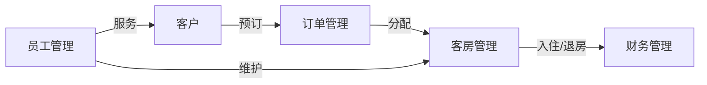

# 小型酒店管理系统设计与实现

## 1. 背景介绍

在现代酒店管理中,信息技术的应用已经成为提高酒店运营效率、优化客户体验的关键因素。传统的人工管理模式已经无法满足日益增长的客户需求和激烈的市场竞争。为了适应这一趋势,开发一套功能完善、易于使用的酒店管理系统势在必行。

本文将详细介绍一个小型酒店管理系统的设计与实现过程,包括需求分析、架构设计、数据库设计、核心模块实现以及系统测试与部署等方面。通过对该系统的深入剖析,读者可以全面了解现代酒店管理系统的开发流程和关键技术,为今后从事相关领域的工作提供有益的参考。

## 2. 核心概念与联系

在小型酒店管理系统中,涉及到以下几个核心概念:

### 2.1 客房管理
客房是酒店的核心资源,客房管理模块负责客房的分配、预订、入住、退房等操作,同时还要记录客房的状态、房型、价格等信息。

### 2.2 客户管理  
客户是酒店的服务对象,客户管理模块负责记录客户的基本信息、联系方式、消费记录等,通过对客户数据的分析,可以为客户提供个性化的服务。

### 2.3 订单管理
订单是连接客户和酒店的纽带,订单管理模块负责处理客户的预订请求,生成订单,并跟踪订单的执行情况。

### 2.4 财务管理
财务管理模块负责记录酒店的收支情况,包括客房收入、餐饮收入、其他服务收入以及各项支出,通过财务报表反映酒店的经营状况。

### 2.5 员工管理
员工是酒店运营的基础,员工管理模块负责员工的招聘、培训、考勤、绩效考核等,合理的员工管理有助于提高服务质量和工作效率。

这些核心概念之间存在着紧密的联系,形成了酒店管理系统的有机整体。客房管理是基础,订单管理连接客户与客房,财务管理反映经营成果,员工管理保障服务质量,共同构成了现代酒店管理的核心要素。

下图使用 Mermaid 流程图展示了这些概念之间的关系:



## 3. 核心算法原理具体操作步骤

在小型酒店管理系统中,有几个核心算法值得关注:

### 3.1 客房分配算法
当客户预订客房时,系统需要根据客户的要求(如房型、入住日期、价格区间等)从可用客房中选择最合适的房间。这可以看作是一个约束满足问题(CSP)。基本步骤如下:

1. 根据客户的入住日期,筛选出该日期可用的客房列表。
2. 根据客户要求的房型,从可用客房列表中筛选出满足条件的客房子集。
3. 根据客户要求的价格区间,从上一步的结果中进一步筛选,得到满足所有条件的客房子集。
4. 如果上一步的结果为空,则放宽条件(如价格区间)重新筛选,直到找到合适的客房或无法满足要求。
5. 从满足条件的客房子集中选择一个房间(如根据某种优先级规则),分配给客户,并将该客房标记为已预订。

### 3.2 客户信用评估算法
为了防范客户的信用风险,酒店可以根据客户的历史消费记录、信用等级等因素,对客户进行信用评估,决定是否接受其预订请求。一种简单的评估算法如下:

1. 根据客户的身份信息,从系统数据库中查询其历史消费记录。
2. 如果客户有过不良记录(如未按时结算账单),则拒绝其预订请求。
3. 如果客户是新客户,则根据其提供的信用卡信息,向银行或第三方信用评估机构查询其信用等级。
4. 根据客户的信用等级和酒店的风险偏好,决定是否接受其预订请求。如果拒绝,可以要求客户提供额外的担保或预付款。

### 3.3 动态房价调整算法
为了最大化客房收益,酒店可以根据客房的供需状况动态调整房价。一种简单的动态定价算法如下:

1. 根据历史数据,预测未来一段时间内的客房需求量。
2. 根据当前的客房预订状况,计算出每个房型的入住率。
3. 对于入住率较高的房型,适当提高房价;对于入住率较低的房型,适当降低房价。
4. 重复步骤2-3,直到达到预期的收益目标或房价调整幅度超过阈值。

以上算法只是一些基本的思路,实际应用中需要根据具体的业务场景和数据特点进行优化和改进。

## 4. 数学模型和公式详细讲解举例说明

在酒店管理系统中,可以使用一些数学模型和公式来优化业务流程,提高决策的科学性。下面以客房动态定价为例,介绍几个常用的数学模型。

### 4.1 需求预测模型
为了合理调整房价,首先需要预测一段时间内的客房需求量。一种常用的方法是时间序列分析,如使用 ARIMA 模型:

$$
\hat{y}_t = \mu + \sum_{i=1}^p \phi_i(y_{t-i}-\mu) + \sum_{i=1}^q \theta_i \varepsilon_{t-i} + \varepsilon_t
$$

其中,$\hat{y}_t$是第$t$天的预测需求量,$\mu$是需求量的均值,$p$和$q$分别是自回归项和移动平均项的阶数,$\phi_i$和$\theta_i$是模型参数,$\varepsilon_t$是随机误差项。

例如,假设通过历史数据拟合得到一个ARIMA(1,1,1)模型:

$$
\hat{y}_t = 0.8(y_{t-1}-100) + 0.6 \varepsilon_{t-1} + \varepsilon_t + 100
$$

其中,均值$\mu=100$,自回归系数$\phi_1=0.8$,移动平均系数$\theta_1=0.6$。如果已知前一天的实际需求量$y_{t-1}=110$,则可以预测第$t$天的需求量为:

$$
\hat{y}_t = 0.8(110-100) + 0.6 \varepsilon_{t-1} + \varepsilon_t + 100 = 108 + 0.6 \varepsilon_{t-1} + \varepsilon_t
$$

### 4.2 动态定价模型
根据需求预测结果,可以使用动态定价模型来调整房价,常用的有线性模型和对数模型。

线性模型假设价格与需求量呈线性关系:

$$
p = a - b \cdot \hat{y}
$$

其中,$p$是价格,$\hat{y}$是预测需求量,$a$和$b$是模型参数。例如,假设$a=500,b=2$,预测需求量$\hat{y}=100$,则优化后的价格为:

$$
p = 500 - 2 \times 100 = 300
$$

对数模型假设价格与需求量呈对数关系:

$$
\ln p = a - b \cdot \ln \hat{y}
$$

例如,假设$a=6,b=0.5$,预测需求量$\hat{y}=100$,则优化后的价格为:

$$
p = e^{6-0.5 \ln 100} \approx 166.5
$$

### 4.3 收益管理模型
除了单独调整价格,还可以综合考虑客房的预订情况和收益贡献,使用收益管理模型来优化客房分配。一种常用的模型是线性规划:

$$
\max \sum_{i=1}^n \sum_{j=1}^m r_{ij} x_{ij}
$$

$$
\text{s.t.} \quad \sum_{j=1}^m x_{ij} \leq C_i, \forall i=1,\ldots,n
$$

$$
x_{ij} \geq 0, \forall i,j
$$

其中,$n$是客房类型的数量,$m$是预订类型的数量,$x_{ij}$是第$i$种客房分配给第$j$种预订的数量,$r_{ij}$是第$i$种客房第$j$种预订的单位收益,$C_i$是第$i$种客房的总数量。目标是在满足客房数量约束的条件下,最大化总收益。

例如,假设酒店有两种客房 A 和 B,每种客房有10间。现在有三种预订:预付款、常规和现场,它们对 A 房的收益分别为 \$100、\$120 和 \$150,对 B 房的收益分别为 \$80、\$100 和 \$130。则上述问题可以表示为:

$$
\max 100x_{11} + 120x_{12} + 150x_{13} + 80x_{21} + 100x_{22} + 130x_{23}
$$

$$
\text{s.t.} \quad x_{11} + x_{12} + x_{13} \leq 10
$$

$$
x_{21} + x_{22} + x_{23} \leq 10
$$

$$
x_{ij} \geq 0, \forall i,j
$$

求解该线性规划问题,可以得到最优的客房分配方案。

以上只是酒店管理系统中常用数学模型的一些示例,实际应用中还需要根据具体问题选择合适的模型,并结合业务知识和数据进行分析和优化。

## 5. 项目实践:代码实例和详细解释说明

下面以 Python 语言为例,演示如何实现酒店管理系统的部分功能。

### 5.1 客房管理模块

```python
class Room:
    def __init__(self, room_type, price, status):
        self.room_type = room_type
        self.price = price
        self.status = status
    
    def check_in(self):
        if self.status == 'available':
            self.status = 'occupied'
            print(f"Room {self.room_type} checked in.")
        else:
            print(f"Room {self.room_type} is not available.")
    
    def check_out(self):
        if self.status == 'occupied':
            self.status = 'available'
            print(f"Room {self.room_type} checked out.")
        else:
            print(f"Room {self.room_type} is not occupied.")

class RoomManager:
    def __init__(self):
        self.rooms = []
    
    def add_room(self, room):
        self.rooms.append(room)
    
    def remove_room(self, room):
        self.rooms.remove(room)
    
    def get_available_rooms(self, room_type):
        return [room for room in self.rooms if room.room_type == room_type and room.status == 'available']
    
    def book_room(self, room_type):
        rooms = self.get_available_rooms(room_type)
        if rooms:
            room = rooms[0]
            room.check_in()
            return room
        else:
            print(f"No {room_type} room available.")
            return None

# 示例用法
room_manager = RoomManager()

# 添加客房
room_manager.add_room(Room('Single', 100, 'available'))
room_manager.add_room(Room('Single', 100, 'available'))
room_manager.add_room(Room('Double', 200, 'available'))

# 预订客房
room = room_manager.book_room('Single')
if room:
    print(f"Booked room: {room.room_type}, Price: {room.price}")

# 退房
room.check_out()
```

在这个示例中,我们定义了两个类:Room 和 RoomManager。Room 类表示一个客房,包含房型、价格和状态等属性,以及入住和退房的方法。RoomManager 类负责管理多个客房,提供添加、删除、查询可用房间以及预订客房的方法。

在示例用法中,我们首先创建一个 RoomManager 对象,然后添加几个不同类型的客房。接着,我们尝试预订一个单人房,如果成功,则打印出预订信息。最后,我们将该房间退房。

这个示例只是简单演示了客房管理的基本功能,实际应用中还需要考虑更多的业务逻辑和异常处理。

### 5.2 订单管理模块

```python
from datetime import datetime

class Order:
    def __init__(self, order_id, customer, room, check_in_date, check_out_date):
        self.order_id = order_id