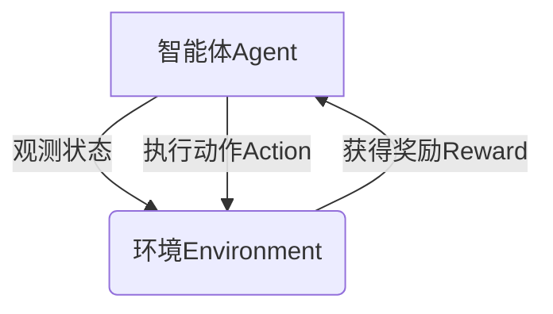

# 强化学习Reinforcement Learning与传统机器学习方法对比

## 1.背景介绍

### 1.1 机器学习的发展历程

机器学习是人工智能领域的一个重要分支,旨在赋予计算机系统自主学习和改进的能力。传统机器学习方法主要包括监督学习、非监督学习和半监督学习等。这些方法在许多领域取得了巨大成功,如计算机视觉、自然语言处理、推荐系统等。

然而,传统机器学习方法存在一些局限性,例如需要大量标注数据、难以处理序列决策问题等。为了解决这些问题,强化学习(Reinforcement Learning)应运而生。

### 1.2 强化学习的兴起

强化学习是机器学习的一个重要分支,它借鉴了行为主义心理学中的理论,通过与环境的交互来学习,旨在找到一种策略,使智能体在完成特定任务时获得最大的累积奖励。

近年来,随着深度学习技术的快速发展,强化学习也取得了突破性进展,在游戏、机器人控制、自动驾驶等领域展现出巨大的潜力。著名的例子包括 AlphaGo 战胜人类顶尖棋手、OpenAI 的机器人手臂等。

## 2.核心概念与联系

### 2.1 强化学习的核心概念

强化学习的核心概念包括:

- 智能体(Agent):执行动作的主体,通过与环境交互来学习。
- 环境(Environment):智能体所处的外部世界,智能体通过观测环境状态并执行动作来影响环境。
- 状态(State):描述环境的当前情况。
- 动作(Action):智能体在当前状态下可执行的操作。
- 奖励(Reward):环境对智能体执行动作的反馈,用于指导智能体学习。
- 策略(Policy):智能体在每个状态下选择动作的规则或策略。

强化学习的目标是找到一种最优策略,使智能体在完成任务时获得最大的累积奖励。

### 2.2 传统机器学习方法

传统机器学习方法主要包括:

- 监督学习(Supervised Learning):通过学习输入数据和标签数据之间的映射关系来进行预测或分类。常见算法包括线性回归、逻辑回归、支持向量机等。
- 非监督学习(Unsupervised Learning):从无标签数据中发现隐藏的模式或结构。常见算法包括聚类算法、关联规则挖掘等。
- 半监督学习(Semi-Supervised Learning):结合有标签数据和无标签数据进行学习,以提高模型的性能。

这些传统机器学习方法通常假设训练数据和测试数据的分布是相同的,并且需要大量的标注数据。然而,在许多现实场景中,这种假设并不总是成立,例如自动驾驶、机器人控制等领域。

## 3.核心算法原理具体操作步骤

### 3.1 马尔可夫决策过程(MDP)

强化学习问题通常被形式化为马尔可夫决策过程(Markov Decision Process, MDP)。MDP由以下五个要素组成:

- 状态集合 $\mathcal{S}$
- 动作集合 $\mathcal{A}$
- 转移概率 $\mathcal{P}_{ss'}^a = \mathbb{P}(s' | s, a)$,表示在状态 $s$ 下执行动作 $a$ 后转移到状态 $s'$ 的概率
- 奖励函数 $\mathcal{R}_s^a$ 或 $\mathcal{R}_{ss'}^a$,表示在状态 $s$ 执行动作 $a$ 获得的奖励
- 折扣因子 $\gamma \in [0, 1)$,用于平衡即时奖励和长期奖励

强化学习的目标是找到一个最优策略 $\pi^*$,使得在该策略下,智能体从任意初始状态出发,获得的期望累积折扣奖励最大:

$$
\pi^* = \arg\max_\pi \mathbb{E}_\pi \left[ \sum_{t=0}^\infty \gamma^t r_t \right]
$$

其中 $r_t$ 是在时间步 $t$ 获得的奖励。

### 3.2 价值函数与贝尔曼方程

在强化学习中,我们通常使用价值函数来评估一个策略的好坏。价值函数定义为在当前状态下,按照某一策略执行,获得的期望累积折扣奖励。

- 状态价值函数 $V^\pi(s)$:表示在状态 $s$ 下,按照策略 $\pi$ 执行,获得的期望累积折扣奖励。
- 动作价值函数 $Q^\pi(s, a)$:表示在状态 $s$ 下,执行动作 $a$,之后按照策略 $\pi$ 执行,获得的期望累积折扣奖励。

价值函数满足贝尔曼方程:

$$
\begin{aligned}
V^\pi(s) &= \mathbb{E}_\pi \left[ r_t + \gamma V^\pi(s') | s_t = s \right] \\
&= \sum_{a \in \mathcal{A}} \pi(a | s) \sum_{s' \in \mathcal{S}} \mathcal{P}_{ss'}^a \left[ \mathcal{R}_s^a + \gamma V^\pi(s') \right]
\end{aligned}
$$

$$
Q^\pi(s, a) = \mathbb{E}_\pi \left[ r_t + \gamma \max_{a'} Q^\pi(s', a') | s_t = s, a_t = a \right]
$$

我们可以通过求解贝尔曼方程来获得最优价值函数,进而得到最优策略。

### 3.3 策略迭代与价值迭代

策略迭代(Policy Iteration)和价值迭代(Value Iteration)是两种常用的求解最优策略的算法。

1. **策略迭代**

策略迭代包括两个阶段:策略评估和策略改进。

- 策略评估:对于给定的策略 $\pi$,计算其价值函数 $V^\pi$。
- 策略改进:根据价值函数 $V^\pi$,对每个状态 $s$ 更新策略 $\pi(s)$,使得 $\pi(s) = \arg\max_a \sum_{s'} \mathcal{P}_{ss'}^a \left[ \mathcal{R}_s^a + \gamma V^\pi(s') \right]$。

重复上述两个步骤,直至策略收敛。

2. **价值迭代**

价值迭代直接计算最优价值函数 $V^*$,然后根据 $V^*$ 构造最优策略 $\pi^*$。

对于每个状态 $s$,更新 $V(s)$ 为:

$$
V(s) \leftarrow \max_a \sum_{s'} \mathcal{P}_{ss'}^a \left[ \mathcal{R}_s^a + \gamma V(s') \right]
$$

重复上述步骤,直至 $V$ 收敛。最终得到的 $V$ 即为最优价值函数 $V^*$,对应的最优策略为:

$$
\pi^*(s) = \arg\max_a \sum_{s'} \mathcal{P}_{ss'}^a \left[ \mathcal{R}_s^a + \gamma V^*(s') \right]
$$

### 3.4 时序差分学习

时序差分(Temporal Difference, TD)学习是一种基于采样的强化学习算法,它不需要完整的环境模型,而是通过智能体与环境的交互来学习价值函数或策略。

TD学习的核心思想是利用时序差分误差(TD error)来更新价值函数或策略,TD error定义为:

$$
\delta_t = r_t + \gamma V(s_{t+1}) - V(s_t)
$$

其中 $r_t$ 是在时间步 $t$ 获得的奖励, $V(s_t)$ 和 $V(s_{t+1})$ 分别是当前状态和下一状态的价值函数估计值。

TD学习算法包括 Sarsa、Q-Learning 等,它们利用 TD error 来更新动作价值函数或状态价值函数,从而逐步改进策略。

## 4.数学模型和公式详细讲解举例说明

### 4.1 马尔可夫决策过程的数学模型

马尔可夫决策过程(MDP)可以用一个五元组 $(\mathcal{S}, \mathcal{A}, \mathcal{P}, \mathcal{R}, \gamma)$ 来表示:

- $\mathcal{S}$ 是状态集合,表示环境可能的状态。
- $\mathcal{A}$ 是动作集合,表示智能体在每个状态下可执行的动作。
- $\mathcal{P}$ 是状态转移概率函数,其中 $\mathcal{P}_{ss'}^a = \mathbb{P}(s' | s, a)$ 表示在状态 $s$ 下执行动作 $a$ 后转移到状态 $s'$ 的概率。
- $\mathcal{R}$ 是奖励函数,可以表示为 $\mathcal{R}_s^a$ 或 $\mathcal{R}_{ss'}^a$,分别表示在状态 $s$ 执行动作 $a$ 获得的奖励,或在状态 $s$ 执行动作 $a$ 后转移到状态 $s'$ 获得的奖励。
- $\gamma \in [0, 1)$ 是折扣因子,用于平衡即时奖励和长期奖励。

在 MDP 中,智能体的目标是找到一个最优策略 $\pi^*$,使得在该策略下,从任意初始状态出发,智能体获得的期望累积折扣奖励最大:

$$
\pi^* = \arg\max_\pi \mathbb{E}_\pi \left[ \sum_{t=0}^\infty \gamma^t r_t \right]
$$

其中 $r_t$ 是在时间步 $t$ 获得的奖励。

### 4.2 价值函数与贝尔曼方程

在强化学习中,我们通常使用价值函数来评估一个策略的好坏。价值函数定义为在当前状态下,按照某一策略执行,获得的期望累积折扣奖励。

1. **状态价值函数**

状态价值函数 $V^\pi(s)$ 表示在状态 $s$ 下,按照策略 $\pi$ 执行,获得的期望累积折扣奖励:

$$
V^\pi(s) = \mathbb{E}_\pi \left[ \sum_{t=0}^\infty \gamma^t r_t | s_0 = s \right]
$$

状态价值函数满足贝尔曼方程:

$$
\begin{aligned}
V^\pi(s) &= \mathbb{E}_\pi \left[ r_t + \gamma V^\pi(s') | s_t = s \right] \\
&= \sum_{a \in \mathcal{A}} \pi(a | s) \sum_{s' \in \mathcal{S}} \mathcal{P}_{ss'}^a \left[ \mathcal{R}_s^a + \gamma V^\pi(s') \right]
\end{aligned}
$$

2. **动作价值函数**

动作价值函数 $Q^\pi(s, a)$ 表示在状态 $s$ 下,执行动作 $a$,之后按照策略 $\pi$ 执行,获得的期望累积折扣奖励:

$$
Q^\pi(s, a) = \mathbb{E}_\pi \left[ \sum_{t=0}^\infty \gamma^t r_t | s_0 = s, a_0 = a \right]
$$

动作价值函数也满足贝尔曼方程:

$$
Q^\pi(s, a) = \mathbb{E}_\pi \left[ r_t + \gamma \max_{a'} Q^\pi(s', a') | s_t = s, a_t = a \right]
$$

我们可以通过求解贝尔曼方程来获得最优价值函数,进而得到最优策略。

### 4.3 策略迭代与价值迭代

策略迭代(Policy Iteration)和价值迭代(Value Iteration)是两种常用的求解最优策略的算法。

1. **策略迭代**

策略迭代包括两个阶段:策略评估和策略改进。

- 策略评估:对于给定的策略 $\pi$,计算其价值函数 $V^\pi$。这可以通过求解线性方程组 $V^\pi = \mathcal{R}^\pi + \gamma \mathcal{P}^\pi V^\pi$ 来实现,其中 $\mathcal{R}^\pi$ 和 $\mathcal{P}^\pi$ 分别表示在策略 $\pi$ 下的奖励函数和状态转移概率矩阵。
- 策