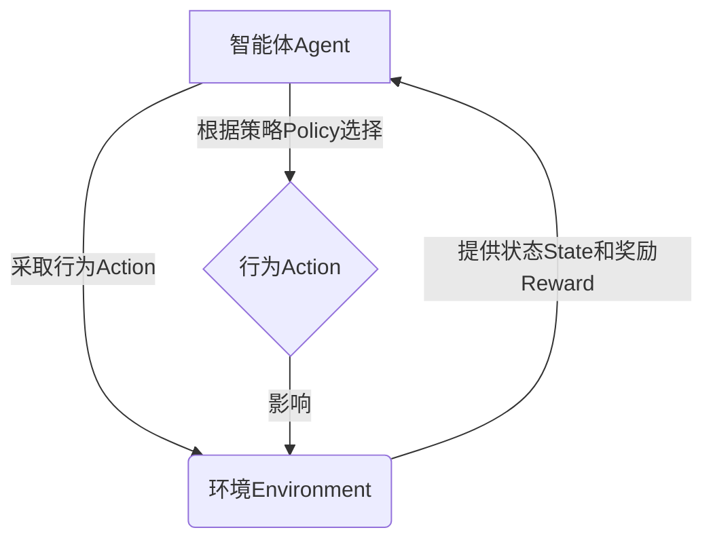

# 强化学习Reinforcement Learning的终生学习与持续适应能力

## 1.背景介绍

### 1.1 什么是强化学习

强化学习(Reinforcement Learning, RL)是机器学习的一个重要分支,它研究如何基于环境反馈来学习行为策略,以最大化预期的长期回报。与监督学习不同,强化学习没有给定的输入-输出样本对,而是通过与环境的交互来学习。

强化学习的核心思想是让智能体(Agent)通过与环境(Environment)的互动来学习,如何在给定的情况下采取最优行为,以获得最大的长期回报。这种学习过程通过奖励(Reward)信号来指导,奖励信号反映了智能体当前行为的好坏。

### 1.2 终生学习与持续适应的重要性

在现实世界的复杂环境中,情况往往是动态变化的。因此,仅依赖有限的训练数据来训练智能体是远远不够的,智能体必须具备持续学习和适应新环境的能力。终生学习(Lifelong Learning)和持续适应(Continual Adaptation)正是解决这一挑战的关键。

终生学习指的是智能体在整个生命周期中持续学习新知识和新技能的能力,而不会遗忘已经学习过的知识。持续适应则是指智能体能够在动态变化的环境中及时调整策略,以适应新的情况。这两个能力对于强化学习智能体在复杂环境中取得长期成功至关重要。

## 2.核心概念与联系

### 2.1 强化学习的核心概念

1. **智能体(Agent)**: 执行行为并与环境交互的决策实体。
2. **环境(Environment)**: 智能体所处的外部世界,包括状态和奖励。
3. **状态(State)**: 环境的当前情况,反映了可观测的信息。
4. **行为(Action)**: 智能体在当前状态下可以采取的操作。
5. **奖励(Reward)**: 环境对智能体当前行为的评价,指导智能体学习。
6. **策略(Policy)**: 智能体在每个状态下选择行为的规则或策略。



### 2.2 终生学习与持续适应的关键概念

1. **知识迁移(Knowledge Transfer)**: 利用已学习的知识来加速新任务的学习过程。
2. **灾难性遗忘(Catastrophic Forgetting)**: 在学习新知识时,智能体遗忘已经学习过的知识。
3. **在线学习(Online Learning)**: 智能体在与环境交互的同时持续学习。
4. **元学习(Meta Learning)**: 学习如何更好地学习,提高学习效率。
5. **多任务学习(Multi-Task Learning)**: 同时学习多个相关任务,提高泛化能力。
6. **自我监督学习(Self-Supervised Learning)**: 利用环境中的信息作为监督信号进行学习。

## 3.核心算法原理具体操作步骤

强化学习算法的核心思想是通过与环境交互,不断更新策略,使得智能体能够采取最优行为来获得最大的长期回报。下面介绍两种经典的强化学习算法:Q-Learning和策略梯度(Policy Gradient)。

### 3.1 Q-Learning算法

Q-Learning是一种基于价值函数(Value Function)的强化学习算法,它试图学习一个行为价值函数Q(s,a),表示在状态s下采取行为a后可获得的预期长期回报。算法的步骤如下:

1. 初始化Q(s,a)为任意值(通常为0)
2. 对每个episode:
    - 初始化状态s
    - 对每个时间步:
        - 选择行为a(基于epsilon-greedy或其他探索策略)
        - 执行行为a,观察到新状态s'和奖励r
        - 更新Q(s,a)值:
        
        $$Q(s,a) \leftarrow Q(s,a) + \alpha[r + \gamma\max_{a'}Q(s',a') - Q(s,a)]$$
        
        其中,$\alpha$是学习率,$\gamma$是折扣因子
        - s <- s'
3. 直到达到终止条件

通过不断更新Q值,最终Q(s,a)会收敛到真实的行为价值函数,智能体只需在每个状态选择具有最大Q值的行为,就可以获得最优策略。

### 3.2 策略梯度算法(Policy Gradient)

策略梯度算法直接对策略$\pi_\theta(a|s)$进行参数化,并根据策略的表现来更新参数$\theta$,使得预期的长期回报最大化。算法步骤如下:

1. 初始化策略参数$\theta$
2. 对每个episode:
    - 生成一个episode的轨迹$\tau = (s_0,a_0,r_0,s_1,a_1,r_1,...,s_T)$
    - 计算episode的回报:$R(\tau) = \sum_{t=0}^T\gamma^tr_t$  
    - 更新策略参数:
    
    $$\theta \leftarrow \theta + \alpha\nabla_\theta\log\pi_\theta(\tau)R(\tau)$$
    
    其中,$\alpha$是学习率
3. 直到收敛

策略梯度算法直接优化策略参数,可以处理连续动作空间和随机策略,但收敛较为困难,需要使用各种技巧(如优势函数、基线、entroppy正则化等)来提高稳定性和收敛速度。

## 4.数学模型和公式详细讲解举例说明  

### 4.1 马尔可夫决策过程(Markov Decision Process, MDP)

强化学习问题通常建模为马尔可夫决策过程(MDP),它是一个离散时间的随机控制过程,由一个五元组$(S, A, P, R, \gamma)$来定义:

- $S$是状态空间的集合
- $A$是行为空间的集合 
- $P(s'|s,a)$是状态转移概率,表示在状态$s$下执行行为$a$后,转移到状态$s'$的概率
- $R(s,a,s')$是奖励函数,表示在状态$s$下执行行为$a$并转移到状态$s'$时获得的奖励
- $\gamma \in [0,1)$是折扣因子,用于权衡即时奖励和长期回报

在MDP中,智能体的目标是找到一个策略$\pi: S \rightarrow A$,使得期望的长期折扣回报$G_t = \sum_{k=0}^\infty \gamma^k r_{t+k+1}$最大化,其中$r_t$是时间步$t$获得的奖励。

### 4.2 价值函数(Value Function)

价值函数是评估一个状态或状态-行为对在给定策略下的预期长期回报。有两种常用的价值函数:

**状态价值函数(State Value Function)**: 
$$V^\pi(s) = \mathbb{E}_\pi[G_t|s_t=s] = \mathbb{E}_\pi\left[\sum_{k=0}^\infty \gamma^k r_{t+k+1}|s_t=s\right]$$

**行为价值函数(Action Value Function)**: 
$$Q^\pi(s,a) = \mathbb{E}_\pi[G_t|s_t=s,a_t=a] = \mathbb{E}_\pi\left[\sum_{k=0}^\infty \gamma^k r_{t+k+1}|s_t=s,a_t=a\right]$$

价值函数满足以下贝尔曼方程:

$$V^\pi(s) = \sum_{a}\pi(a|s)\sum_{s'}P(s'|s,a)[R(s,a,s') + \gamma V^\pi(s')]$$

$$Q^\pi(s,a) = \sum_{s'}P(s'|s,a)[R(s,a,s') + \gamma \sum_{a'}Q^\pi(s',a')\pi(a'|s')]$$

基于价值函数的算法(如Q-Learning)试图直接学习最优的行为价值函数$Q^*(s,a)$,从而得到最优策略$\pi^*(s) = \arg\max_aQ^*(s,a)$。

### 4.3 策略梯度理论(Policy Gradient Theorem)

策略梯度算法的理论基础是策略梯度定理,它给出了优化策略参数的梯度:

$$\nabla_\theta J(\theta) = \mathbb{E}_{\pi_\theta}\left[\sum_{t=0}^\infty\nabla_\theta\log\pi_\theta(a_t|s_t)Q^{\pi_\theta}(s_t,a_t)\right]$$

其中,$J(\theta)$是目标函数,通常定义为期望的长期折扣回报:$J(\theta) = \mathbb{E}_{\pi_\theta}\left[\sum_{t=0}^\infty\gamma^tr_t\right]$。

策略梯度定理表明,我们可以通过在轨迹中的每个时间步,用期望行为价值函数$Q^{\pi_\theta}(s_t,a_t)$加权$\log\pi_\theta(a_t|s_t)$的梯度,来优化策略参数$\theta$。

由于计算真实的$Q^{\pi_\theta}(s_t,a_t)$很困难,实际算法中通常使用各种技巧来估计它,如蒙特卡罗回报(Monte Carlo return)、时序差分(Temporal Difference)、优势函数(Advantage Function)等。

## 5.项目实践:代码实例和详细解释说明

以下是一个使用Python和PyTorch实现的简单网格世界(Gridworld)环境,以及对应的Q-Learning和策略梯度算法实现。

### 5.1 环境:网格世界(Gridworld)

```python
import numpy as np

class GridWorld:
    def __init__(self, height, width, start, goal):
        self.height = height
        self.width = width
        self.start = start
        self.goal = goal
        self.reset()

    def reset(self):
        self.state = self.start
        return self.state

    def step(self, action):
        row, col = self.state
        if action == 0:  # up
            next_state = (max(row - 1, 0), col)
        elif action == 1:  # right
            next_state = (row, min(col + 1, self.width - 1))
        elif action == 2:  # down
            next_state = (min(row + 1, self.height - 1), col)
        elif action == 3:  # left
            next_state = (row, max(col - 1, 0))
        else:
            raise ValueError(f"Invalid action: {action}")

        self.state = next_state
        reward = 1 if self.state == self.goal else 0
        done = self.state == self.goal
        return next_state, reward, done

    def render(self):
        grid = np.zeros((self.height, self.width), dtype=str)
        grid[self.start] = "S"
        grid[self.goal] = "G"
        grid[self.state] = "A"
        print("\n".join(["".join(row) for row in grid]))
```

这个网格世界环境包含以下组成部分:

- `height`和`width`: 网格的高度和宽度
- `start`: 起始状态(行,列)
- `goal`: 目标状态(行,列)
- `reset()`: 重置环境到初始状态
- `step(action)`: 执行一个行为,返回下一个状态、奖励和是否结束
- `render()`: 打印当前网格状态

### 5.2 Q-Learning 实现

```python
import numpy as np

class QLearning:
    def __init__(self, env, alpha=0.1, gamma=0.9, epsilon=0.1):
        self.env = env
        self.alpha = alpha  # 学习率
        self.gamma = gamma  # 折扣因子
        self.epsilon = epsilon  # 探索率
        self.Q = np.zeros((env.height, env.width, 4))  # 初始化Q表

    def choose_action(self, state):
        row, col = state
        if np.random.uniform() < self.epsilon:
            # 探索: 随机选择一个行为
            action = np.random.randint(4)
        else:
            # 利用: 选择Q值最大的行为
            action = np.argmax(self.Q[row, col])
        return action

    def update(self, state, action, next_state, reward):
        row, col = state
        next_row, next_col = next_state
        self.Q[row, col, action] += self.alpha * (
            reward + self.gamma * np.max(self.Q[next_row, next_col]) - self.Q[row, col, action]
        )

    def train(self, num_episodes):
        for episode in range(num_episodes):
            state = self.env.reset()
            done = False
            while not done:
                action = self.choose_action(state)
                next_state, reward, done = self.env.step(action)
                self.update(state, action, next_state, reward)
                state = next_state

    def get_policy(self):
        policy = np.zeros((self.env.height, self.env.width), dtype