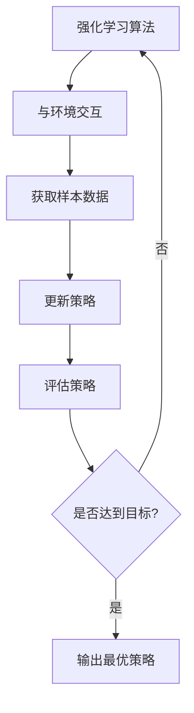

# 强化学习Reinforcement Learning算法的样本效率提升策略

## 1.背景介绍

强化学习是机器学习中一个非常重要和具有挑战性的领域。它旨在让智能体(agent)通过与环境(environment)的交互来学习如何采取最优策略,以最大化预期的累积奖励。与监督学习不同,强化学习没有提供正确的输入/输出对,智能体必须通过试错来发现哪些行为会带来最佳结果。

然而,强化学习算法通常需要大量的样本(数据)来学习,这使得在一些应用场景下效率低下,例如机器人控制、网络系统优化等。因此,提高强化学习算法的样本效率(sample efficiency)成为了一个重要的研究方向。样本效率指的是算法达到特定性能水平所需的样本(环境交互)数量。提高样本效率可以加快学习过程,降低数据需求,从而节省计算资源和时间成本。

### Mermaid 流程图:

## 2.核心概念与联系

在探讨提升样本效率的策略之前,我们需要了解一些强化学习中的核心概念:

1. **策略(Policy)**: 定义了智能体在给定状态下采取行动的策略或行为方式。
2. **奖励函数(Reward Function)**: 指定了智能体采取特定行动后从环境获得的奖励或惩罚。
3. **价值函数(Value Function)**: 估计从给定状态出发,按照特定策略行动所能获得的预期累积奖励。
4. **Q函数(Q-Function)**: 估计在给定状态采取特定行动后,按照特定策略行动所能获得的预期累积奖励。
5. **模型(Model)**: 描述了环境的转移概率和奖励函数。
6. **探索与利用权衡(Exploration-Exploitation Trade-off)**: 在学习过程中,智能体需要在探索新的状态行为组合(以获取更多信息)和利用已学习的知识(以获取最大化奖励)之间进行权衡。

提高样本效率的策略通常涉及以下几个方面:利用先验知识、改进探索策略、构建环境模型、转移学习等。下面我们将详细探讨每个策略。

## 3.核心算法原理具体操作步骤

### 3.1 利用先验知识(Leveraging Prior Knowledge)

在许多实际应用中,我们可能已经拥有一些关于环境或任务的先验知识。利用这些知识可以加速强化学习算法的学习过程,从而提高样本效率。常见的利用先验知识的方法包括:

1. **初始化值函数或策略(Initializing Value Functions or Policies)**: 如果我们已经知道一些状态或行动的潜在价值,可以使用这些知识来初始化值函数或策略,而不是从无到有地学习。这为算法提供了一个良好的起点,可以加快收敛速度。

2. **设计reward shaping(Reward Shaping)**: 通过设计合理的reward shaping函数,可以将先验知识编码到奖励函数中,从而引导智能体朝着正确的方向学习。但需要注意,过度的reward shaping可能会导致算法收敛到次优解。

3. **设计状态特征(Designing State Features)**: 通过设计反映先验知识的状态特征,可以让算法更容易捕获问题的结构,从而加快学习。例如,在棋盘游戏中,可以使用一些反映棋局局势的特征。

4. **引入层次结构(Introducing Hierarchies)**: 在一些复杂任务中,可以利用先验知识将问题分解为多个层次,每个层次负责不同的子任务。这种分层结构可以简化学习过程,提高样本效率。

5. **示范学习(Learning from Demonstrations)**: 如果我们可以获得人类专家或其他智能体在该任务上的示范数据,就可以将这些数据用于初始化或指导强化学习算法的学习过程。

### 3.2 改进探索策略(Improving Exploration Strategies)

合理的探索策略对于提高样本效率至关重要。传统的$\epsilon$-greedy和软max策略虽然简单,但往往效率较低。一些改进的探索策略包括:

1. **计数基础探索(Count-Based Exploration)**: 根据状态或状态-行动对的访问次数来调整探索概率,确保算法充分探索所有状态。

2. **噪声探索(Noisy Exploration)**: 在确定性策略的基础上添加噪声,以引入探索性。常见的噪声探索方法包括$\epsilon$-greedy、软更新(Soft Updates)、参数空间噪声(Parameter Space Noise)等。

3. **内在激励探索(Intrinsic Motivation Exploration)**: 除了任务奖励之外,还引入一些内在激励信号(如新奇度、熵等)来鼓励探索未知状态。

4. **Meta探索(Meta Exploration)**: 使用另一个策略或算法来学习如何进行有效的探索,例如使用梯度策略(Gradient Policies)或基于模型的探索策略。

5. **多智能体探索(Multi-Agent Exploration)**: 在多智能体环境中,不同智能体可以通过协作或竞争的方式进行探索,从而提高探索效率。

6. **自我监督探索(Self-Supervised Exploration)**: 通过设计一些辅助任务(如预测未来状态、重建状态等),智能体可以在完成这些任务的同时获得有用的探索经验。

改进探索策略不仅可以提高样本效率,还有助于避免陷入次优解,提高算法的泛化能力。

### 3.3 构建环境模型(Building Environment Models)

如果我们可以构建出环境的精确模型(包括状态转移概率和奖励函数),就可以使用模型预测环境响应,而不需要与真实环境交互。这种基于模型的强化学习方法(Model-Based Reinforcement Learning)可以极大地提高样本效率。常见的基于模型的方法包括:

1. **规划算法(Planning Algorithms)**: 利用已学习的环境模型,使用经典的规划算法(如价值迭代、策略迭代等)来计算最优策略,而无需在真实环境中进行探索。

2. **模型预测控制(Model Predictive Control, MPC)**: 在每个时间步,使用模型预测未来状态序列,并选择能够最大化预期累积奖励的行动序列。

3. **随机树搜索(Random Tree Search)**: 通过构建一棵搜索树,模拟智能体在模型中采取不同行动序列的结果,从而发现高质量的行动序列。

4. **模型集成(Model Ensembles)**: 通过集成多个不同的环境模型,可以提高预测的准确性和鲁棒性。

5. **模型学习(Model Learning)**: 使用监督学习等技术从环境交互数据中学习环境模型,而不是手工设计模型。

虽然基于模型的方法可以大幅提高样本效率,但构建精确的环境模型本身也是一个挑战。在复杂环境中,模型可能存在偏差,导致次优甚至不可行的策略。因此,需要采用一些技术(如模型集成、模型学习等)来提高模型的准确性和鲁棒性。

### 3.4 转移学习(Transfer Learning)

转移学习旨在利用在相关任务或环境中学习到的知识,加速新任务的学习过程。在强化学习中,常见的转移学习方法包括:

1. **初始化(Initialization)**: 使用在源任务中学习到的策略、值函数或模型来初始化目标任务的学习过程。

2. **特征转移(Feature Transfer)**: 在源任务和目标任务之间共享状态特征表示,以减少目标任务需要学习的特征数量。

3. **示范转移(Demonstration Transfer)**: 将源任务中的优化策略或示范数据转移到目标任务,作为监督信号来指导目标任务的学习。

4. **对抗性转移(Adversarial Transfer)**: 使用对抗性训练的方式,强化源任务和目标任务之间的特征不变性,以提高转移的有效性。

5. **多任务学习(Multi-Task Learning)**: 同时学习多个相关任务,并在这些任务之间共享知识,从而提高每个单一任务的学习效率。

6. **元学习(Meta Learning)**: 学习一种通用的学习策略,使其能够快速适应新的任务,从而加速目标任务的学习过程。

转移学习的关键在于找到源任务和目标任务之间的相似性,并设计合适的知识转移机制。成功的转移学习需要解决负迁移(Negative Transfer)的问题,即源任务和目标任务之间的差异可能导致性能下降。

### 3.5 其他策略

除了上述主要策略之外,还有一些其他方法可以提高强化学习算法的样本效率:

1. **优先体验重放(Prioritized Experience Replay)**: 在训练过程中,智能体会存储历史交互数据。通过优先采样那些重要或者难以学习的转换样本,可以提高数据的利用效率。

2. **分布式训练(Distributed Training)**: 通过在多个智能体或多个环境副本上并行收集数据,可以加速数据收集过程,从而提高样本效率。

3. **自我修正(Self-Correction)**: 智能体可以通过分析自身的行为,发现并修正错误决策,从而减少浪费的样本数据。

4. **自我监督辅助任务(Self-Supervised Auxiliary Tasks)**: 除了主要任务之外,还可以设计一些辅助任务(如状态重构、未来预测等),智能体在完成这些任务的同时也能获得有用的探索经验。

5. **注意力机制(Attention Mechanisms)**: 在复杂环境中,注意力机制可以帮助智能体关注最相关的状态信息,从而提高学习效率。

6. **层次强化学习(Hierarchical Reinforcement Learning)**: 通过将复杂任务分解为多个层次,每个层次负责不同的子任务,可以简化学习过程,提高样本效率。

7. **多智能体协作(Multi-Agent Collaboration)**: 在多智能体环境中,不同智能体可以通过协作的方式共享经验和知识,从而提高整体的学习效率。

这些策略通常与上述主要策略相结合使用,以进一步提升强化学习算法的样本效率。

## 4.数学模型和公式详细讲解举例说明

在强化学习中,我们通常使用马尔可夫决策过程(Markov Decision Process, MDP)来对环境进行建模。MDP可以用一个5元组 $(S, A, P, R, \gamma)$ 来表示,其中:

- $S$ 是状态空间的集合
- $A$ 是行动空间的集合
- $P(s'|s,a)$ 是状态转移概率,表示在状态 $s$ 下执行行动 $a$ 后,转移到状态 $s'$ 的概率
- $R(s,a)$ 是奖励函数,表示在状态 $s$ 下执行行动 $a$ 后获得的即时奖励
- $\gamma \in [0, 1)$ 是折现因子,用于权衡即时奖励和未来奖励的重要性

在 MDP 中,我们的目标是找到一个策略 $\pi: S \rightarrow A$,使得在遵循该策略时,预期的累积折现奖励最大化:

$$J(\pi) = \mathbb{E}_\pi \left[ \sum_{t=0}^\infty \gamma^t R(s_t, a_t) \right]$$

其中 $s_t$ 和 $a_t$ 分别表示在时间步 $t$ 的状态和行动。

### 4.1 值函数和Q函数

为了评估一个策略的好坏,我们引入了值函数 $V^\pi(s)$ 和Q函数 $Q^\pi(s,a)$,它们分别表示在状态 $s$ 下,或者在状态 $s$ 下执行行动 $a$ 后,按照策略 $\pi$ 行动所能获得的预期累积折现奖励:

$$V^\pi(s) = \mathbb{E}_\pi \left[ \sum_{t=0}^\infty \gamma^t R(s_t, a_t) \mid s_0 = s \right]$$

$$Q^\pi(s,a) = \mathbb{E}_\pi \left[ \sum_{t=0}^\