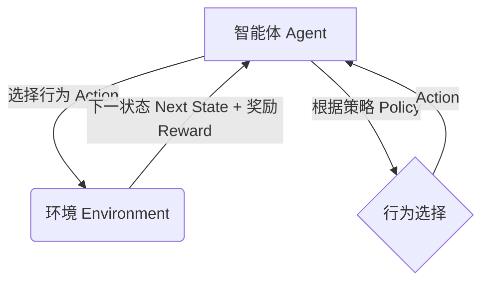

# 强化学习：DL、ML和AI的交集

## 1.背景介绍

强化学习(Reinforcement Learning, RL)是机器学习的一个重要分支,近年来受到了广泛关注和研究。它的核心思想是通过与环境的交互,智能体(Agent)不断尝试不同的行为策略,获得相应的奖励或惩罚,从而学习到最优的决策策略。

强化学习的应用领域非常广泛,包括机器人控制、游戏AI、自动驾驶、智能调度等。它为解决一些传统方法难以处理的序列决策问题提供了新的思路和方法。与监督学习和无监督学习不同,强化学习没有确定的输入输出数据集,而是通过与环境的持续交互来获取经验,这使得它具有很强的通用性和适应性。

### 1.1 强化学习与其他机器学习方法的关系

强化学习与深度学习(Deep Learning, DL)和机器学习(Machine Learning, ML)有着密切的联系,它们相互借鉴、相互促进。

- **深度学习为强化学习提供了强大的函数逼近能力**。在强化学习中,我们需要估计价值函数或策略函数,传统的线性函数或者核方法往往难以有效拟合复杂的函数。深度神经网络具有强大的非线性拟合能力,可以更好地近似这些函数,从而提高强化学习算法的性能。
- **机器学习算法为强化学习提供了理论基础**。强化学习中的许多核心算法,如时序差分(Temporal Difference)学习、策略梯度(Policy Gradient)等,都源于机器学习理论。同时,一些优化算法、正则化方法等也被广泛应用于强化学习中。
- **强化学习为深度学习和机器学习开拓了新的应用领域**。传统的深度学习和机器学习主要关注于数据驱动的监督学习或无监督学习问题。而强化学习为它们开辟了序列决策问题的应用场景,如控制、规划、博弈等,极大地扩展了它们的应用范围。

总的来说,强化学习、深度学习和机器学习三者相辅相成,相互促进。强化学习与深度学习的结合,使得智能体能够直接从原始感知数据(如图像、视频等)中学习策略;与机器学习的结合,则为强化学习提供了更多理论支持和优化算法。

## 2.核心概念与联系

### 2.1 强化学习的核心要素

强化学习系统通常由以下几个核心要素组成:

- **智能体(Agent)**: 也称为决策者,它根据当前状态选择行为,与环境进行交互。
- **环境(Environment)**: 智能体所处的外部世界,它根据智能体的行为产生下一个状态和相应的奖励或惩罚。
- **状态(State)**: 描述当前环境的条件或信息。
- **行为(Action)**: 智能体在当前状态下可以采取的操作。
- **奖励(Reward)**: 环境对智能体当前行为的反馈,用来评价行为的好坏。
- **策略(Policy)**: 智能体根据当前状态选择行为的策略或规则。

强化学习的目标是通过与环境的交互,学习到一个最优策略,使得在给定的环境中,智能体可以获得最大的累积奖励。

### 2.2 强化学习与监督学习、无监督学习的区别

强化学习与监督学习和无监督学习有着本质的区别:

- **监督学习**:给定一个带标签的训练数据集,学习一个从输入到输出的映射函数。典型任务包括分类、回归等。
- **无监督学习**:只给定输入数据,需要从数据中发现内在的模式或结构。典型任务包括聚类、降维等。
- **强化学习**:没有给定的训练数据集,智能体通过与环境的交互,获取经验并学习策略,以最大化累积奖励。

强化学习的特点是:

1. **在线学习**:智能体通过与环境的持续交互来学习,而不是事先给定一个固定的训练数据集。
2. **序列决策**:智能体需要根据当前状态选择一系列行为,而不是简单的一次性输入输出映射。
3. **延迟奖励**:智能体的行为可能需要经过一段时间后才能获得相应的奖励或惩罚,这与监督学习中立即获得标签的情况不同。

因此,强化学习更加关注于如何通过试错来学习一个最优的序列决策策略,而监督学习和无监督学习则更多地关注于从给定的数据中学习模型。

## 3.核心算法原理具体操作步骤

强化学习算法的核心在于如何根据与环境的交互经验,更新和优化策略,以获得更大的累积奖励。下面介绍两种经典的强化学习算法:Q-Learning和策略梯度(Policy Gradient)。

### 3.1 Q-Learning算法

Q-Learning是一种基于价值函数(Value Function)的强化学习算法,它试图学习一个行为价值函数Q(s,a),表示在状态s下执行行为a后可获得的期望累积奖励。具体步骤如下:

1. 初始化Q函数,通常将所有Q(s,a)值初始化为0或一个较小的常数。
2. 对于每一个Episode(一个完整的交互序列):
    - 初始化当前状态s
    - 对于每一个时间步:
        - 根据当前的Q函数值,选择一个行为a(通常使用$\epsilon$-贪婪策略)
        - 执行选择的行为a,获得下一个状态s'和即时奖励r
        - 更新Q(s,a)的估计值:
        
        $$Q(s,a) \leftarrow Q(s,a) + \alpha[r + \gamma\max_{a'}Q(s',a') - Q(s,a)]$$
        
        其中,$\alpha$是学习率,$\gamma$是折现因子。
        - 将s'作为新的当前状态s
3. 重复步骤2,直到收敛或达到停止条件

通过不断更新Q函数的估计值,Q-Learning算法最终会收敛到最优的Q函数,从而可以根据$\max_{a}Q(s,a)$获得最优策略。

### 3.2 策略梯度算法(Policy Gradient)

策略梯度算法直接对策略函数$\pi_\theta(a|s)$进行参数化,并通过梯度上升的方式优化策略参数$\theta$,以最大化期望的累积奖励。算法步骤如下:

1. 初始化策略参数$\theta$
2. 对于每一个Episode:
    - 初始化当前状态s
    - 对于每一个时间步:
        - 根据当前策略$\pi_\theta(a|s)$,选择一个行为a
        - 执行选择的行为a,获得下一个状态s'和即时奖励r
        - 存储(s,a,r,s')作为一个转移样本
        - 将s'作为新的当前状态s
    - 根据存储的转移样本,估计策略的累积奖励$J(\theta)$
    - 计算策略梯度$\nabla_\theta J(\theta)$
    - 使用梯度上升法更新策略参数:$\theta \leftarrow \theta + \alpha\nabla_\theta J(\theta)$
3. 重复步骤2,直到收敛或达到停止条件

策略梯度算法的关键在于如何有效估计累积奖励$J(\theta)$及其梯度$\nabla_\theta J(\theta)$。常用的方法包括REINFORCE算法、Actor-Critic算法等。

除了上述两种经典算法外,还有许多其他强化学习算法,如深度Q网络(Deep Q-Network, DQN)、深度确定性策略梯度(Deep Deterministic Policy Gradient, DDPG)、信任区域策略优化(Trust Region Policy Optimization, TRPO)、近端策略优化(Proximal Policy Optimization, PPO)等,它们都在不同程度上结合了深度学习技术,显著提高了强化学习的性能和应用范围。

## 4.数学模型和公式详细讲解举例说明

强化学习中有许多重要的数学模型和公式,下面将对其中几个核心概念进行详细讲解和举例说明。

### 4.1 马尔可夫决策过程(Markov Decision Process, MDP)

马尔可夫决策过程是强化学习的数学基础,它是一个离散时间的随机控制过程,由以下五元组组成:

$$\langle \mathcal{S}, \mathcal{A}, \mathcal{P}, \mathcal{R}, \gamma \rangle$$

- $\mathcal{S}$是状态空间的集合
- $\mathcal{A}$是行为空间的集合
- $\mathcal{P}$是状态转移概率,其中$\mathcal{P}_{ss'}^a = \mathbb{P}(s_{t+1}=s'|s_t=s,a_t=a)$表示在状态s下执行行为a,转移到状态s'的概率
- $\mathcal{R}$是奖励函数,其中$\mathcal{R}_s^a = \mathbb{E}[r_{t+1}|s_t=s,a_t=a]$表示在状态s下执行行为a所获得的期望奖励
- $\gamma \in [0,1)$是折现因子,用于权衡未来奖励的重要性

在MDP中,智能体的目标是学习一个策略$\pi: \mathcal{S} \rightarrow \mathcal{A}$,使得在遵循该策略时,可获得最大的期望累积奖励:

$$J(\pi) = \mathbb{E}_\pi\left[\sum_{t=0}^\infty \gamma^t r_{t+1}\right]$$

其中,$r_{t+1}$是在时间步t+1获得的即时奖励。

例如,在一个简单的网格世界(GridWorld)环境中,状态空间$\mathcal{S}$是所有可能的网格位置,行为空间$\mathcal{A}$是{上,下,左,右}四个方向移动。状态转移概率$\mathcal{P}_{ss'}^a$表示从位置s执行行为a后,到达位置s'的概率。奖励函数$\mathcal{R}_s^a$可以设置为到达目标位置时获得正奖励,否则为0或负奖励(例如撞墙)。智能体的目标是学习一个策略,使其可以从起点到达目标位置,并获得最大的累积奖励。

### 4.2 贝尔曼方程(Bellman Equation)

贝尔曼方程是强化学习中另一个非常重要的概念,它为求解MDP提供了理论基础。根据策略$\pi$和MDP的定义,我们可以定义状态价值函数$V^\pi(s)$和行为价值函数$Q^\pi(s,a)$如下:

$$V^\pi(s) = \mathbb{E}_\pi\left[\sum_{t=0}^\infty \gamma^t r_{t+1}|s_0=s\right]$$

$$Q^\pi(s,a) = \mathbb{E}_\pi\left[\sum_{t=0}^\infty \gamma^t r_{t+1}|s_0=s,a_0=a\right]$$

它们分别表示在策略$\pi$下,从状态s出发,或者从状态s执行行为a出发,可获得的期望累积奖励。

贝尔曼方程给出了$V^\pi(s)$和$Q^\pi(s,a)$的递推关系式:

$$V^\pi(s) = \sum_{a \in \mathcal{A}}\pi(a|s)\left(\mathcal{R}_s^a + \gamma\sum_{s' \in \mathcal{S}}\mathcal{P}_{ss'}^aV^\pi(s')\right)$$

$$Q^\pi(s,a) = \mathcal{R}_s^a + \gamma\sum_{s' \in \mathcal{S}}\mathcal{P}_{ss'}^aV^\pi(s')$$

这些递推关系式使我们可以通过动态规划或其他迭代方法来求解$V^\pi(s)$和$Q^\pi(s,a)$。

例如,在网格世界环境中,假设智能体位于位置s,执行行为a后到达位置s',获得即时奖励$\mathcal{R}_s^a$。根据贝尔曼方程,我们可以将$Q^\pi(s,a)$表示为:

$$Q^\pi(s,a) = \mathcal{R}_s^a + \gamma V^\pi(s')$$

其