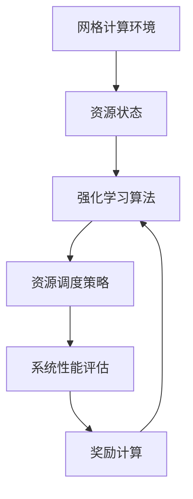

# 强化学习：在网格计算中的应用

## 1. 背景介绍

### 1.1 什么是网格计算？

网格计算是一种将分布在不同地理位置的计算机资源进行有效整合和利用的计算模式。它通过将大量异构计算资源组织成一个虚拟的超级计算机,为用户提供高性能计算、海量数据存储和远程访问等服务。网格计算的核心思想是资源共享和协作,旨在最大限度地利用现有的计算资源,提高资源利用率,降低计算成本。

### 1.2 网格计算的挑战

尽管网格计算具有巨大的潜力,但它也面临着一些挑战,如资源管理、负载平衡、容错性等。传统的静态资源调度策略往往效率低下,无法充分利用动态变化的计算资源。因此,需要一种智能、自适应的资源管理方法来应对这些挑战。

### 1.3 强化学习在网格计算中的应用

强化学习是一种基于奖励或惩罚的机器学习方法,它可以通过与环境的交互来学习最优策略。近年来,强化学习在网格计算领域得到了广泛的关注和应用,被用于解决资源调度、负载平衡、容错等问题。强化学习算法可以根据当前的系统状态和资源利用情况,动态地调整资源分配策略,从而提高整个系统的性能和效率。

## 2. 核心概念与联系

### 2.1 强化学习基本概念

强化学习是一种基于奖励或惩罚的机器学习方法,它由四个基本元素组成:

1. **环境 (Environment)**: 指代理与之交互的外部世界。
2. **状态 (State)**: 描述环境的当前状况。
3. **动作 (Action)**: 代理可以采取的行为。
4. **奖励 (Reward)**: 代理采取某个动作后,环境给予的反馈。

强化学习的目标是找到一个最优策略,使得代理在环境中采取行动时,能够获得最大的累积奖励。

### 2.2 网格计算中的强化学习模型

在网格计算中,我们可以将资源管理问题建模为一个强化学习问题:

- **环境**: 网格计算环境,包括计算节点、存储节点、网络等资源。
- **状态**: 描述当前资源利用情况的状态向量,如CPU利用率、内存使用率等。
- **动作**: 资源调度策略,如任务分配、负载迁移等。
- **奖励**: 根据系统性能指标(如响应时间、吞吐量等)计算得到的奖励值。

通过与环境的交互,强化学习算法可以不断优化资源调度策略,从而提高整个系统的性能和效率。



## 3. 核心算法原理具体操作步骤

强化学习算法通常包括以下几个关键步骤:

### 3.1 初始化

1. 定义状态空间、动作空间和奖励函数。
2. 初始化策略函数或值函数。

### 3.2 交互循环

1. 观察当前状态 $s_t$。
2. 根据策略函数选择动作 $a_t$。
3. 执行动作 $a_t$,观察下一个状态 $s_{t+1}$ 和获得的奖励 $r_{t+1}$。
4. 更新策略函数或值函数。

### 3.3 策略评估

对于给定的策略 $\pi$,计算其在每个状态下的值函数 $V^\pi(s)$,表示从状态 $s$ 开始,执行策略 $\pi$ 所能获得的期望累积奖励。

### 3.4 策略改进

基于当前的值函数 $V^\pi(s)$,构造一个新的策略 $\pi'$,使得 $V^{\pi'}(s) \geq V^\pi(s)$ 对所有状态 $s$ 成立。

### 3.5 策略迭代

重复执行策略评估和策略改进,直到策略收敛为最优策略 $\pi^*$。

### 3.6 值迭代

直接计算最优值函数 $V^*(s)$,然后从中导出最优策略 $\pi^*$。

### 3.7 时序差分学习

在线更新值函数,无需等待一个完整的episode结束。常用算法包括Q-Learning和SARSA。

### 3.8 策略梯度方法

直接对策略函数进行参数化,通过梯度上升来优化策略参数,常用算法包括REINFORCE和Actor-Critic。

## 4. 数学模型和公式详细讲解举例说明

### 4.1 马尔可夫决策过程 (MDP)

强化学习问题通常被建模为一个马尔可夫决策过程 (Markov Decision Process, MDP),它是一个五元组 $\langle S, A, P, R, \gamma \rangle$:

- $S$ 是有限的状态集合
- $A$ 是有限的动作集合
- $P(s, a, s')= \mathbb{P}(s_{t+1}=s' | s_t=s, a_t=a)$ 是状态转移概率
- $R(s, a, s')$ 是在状态 $s$ 采取动作 $a$ 后转移到状态 $s'$ 时获得的奖励
- $\gamma \in [0, 1)$ 是折现因子,用于权衡当前奖励和未来奖励的重要性

在 MDP 中,我们的目标是找到一个最优策略 $\pi^*$,使得从任意初始状态 $s_0$ 开始执行时,其期望累积折现奖励最大化:

$$
\pi^* = \arg\max_\pi \mathbb{E}_\pi \left[ \sum_{t=0}^\infty \gamma^t R(s_t, a_t, s_{t+1}) \right]
$$

其中 $\pi$ 是一个映射函数,将状态映射到动作: $\pi: S \rightarrow A$。

### 4.2 值函数和Q函数

对于任意策略 $\pi$,我们可以定义其在状态 $s$ 下的值函数 $V^\pi(s)$ 和动作值函数 $Q^\pi(s, a)$:

$$
V^\pi(s) = \mathbb{E}_\pi \left[ \sum_{t=0}^\infty \gamma^t R(s_t, a_t, s_{t+1}) | s_0 = s \right]
$$

$$
Q^\pi(s, a) = \mathbb{E}_\pi \left[ \sum_{t=0}^\infty \gamma^t R(s_t, a_t, s_{t+1}) | s_0 = s, a_0 = a \right]
$$

值函数 $V^\pi(s)$ 表示在状态 $s$ 下执行策略 $\pi$ 所能获得的期望累积奖励,而动作值函数 $Q^\pi(s, a)$ 表示在状态 $s$ 下采取动作 $a$,然后执行策略 $\pi$ 所能获得的期望累积奖励。

对于最优策略 $\pi^*$,我们有:

$$
V^*(s) = \max_\pi V^\pi(s)
$$

$$
Q^*(s, a) = \max_\pi Q^\pi(s, a)
$$

### 4.3 Bellman方程

Bellman方程是值函数和Q函数的递推关系式,它们为求解值函数和Q函数提供了理论基础。

对于值函数 $V^\pi(s)$,Bellman方程为:

$$
V^\pi(s) = \sum_{a \in A} \pi(a|s) \sum_{s' \in S} P(s, a, s') \left[ R(s, a, s') + \gamma V^\pi(s') \right]
$$

对于Q函数 $Q^\pi(s, a)$,Bellman方程为:

$$
Q^\pi(s, a) = \sum_{s' \in S} P(s, a, s') \left[ R(s, a, s') + \gamma \sum_{a' \in A} \pi(a'|s') Q^\pi(s', a') \right]
$$

这些方程揭示了值函数和Q函数的递推性质,为求解它们提供了基础。

### 4.4 策略迭代算法

策略迭代算法是一种基于值函数的强化学习算法,它包括两个阶段:策略评估和策略改进。

在策略评估阶段,我们利用Bellman方程求解给定策略 $\pi$ 下的值函数 $V^\pi(s)$。

在策略改进阶段,我们构造一个新的策略 $\pi'$,使得对所有状态 $s$ 都有 $V^{\pi'}(s) \geq V^\pi(s)$。具体来说,对于每个状态 $s$,我们选择一个能够最大化 $Q^\pi(s, a)$ 的动作 $a$,作为新策略 $\pi'(s)$ 在状态 $s$ 下的动作。

重复执行策略评估和策略改进,直到策略收敛为最优策略 $\pi^*$。

### 4.5 值迭代算法

值迭代算法是另一种基于值函数的强化学习算法,它直接求解最优值函数 $V^*(s)$,然后从中导出最优策略 $\pi^*$。

值迭代算法利用Bellman最优性方程:

$$
V^*(s) = \max_{a \in A} \sum_{s' \in S} P(s, a, s') \left[ R(s, a, s') + \gamma V^*(s') \right]
$$

通过不断更新值函数,直到收敛为最优值函数 $V^*(s)$。

一旦获得了最优值函数 $V^*(s)$,我们就可以导出最优策略 $\pi^*(s)$:

$$
\pi^*(s) = \arg\max_{a \in A} \sum_{s' \in S} P(s, a, s') \left[ R(s, a, s') + \gamma V^*(s') \right]
$$

### 4.6 时序差分学习

时序差分 (Temporal Difference, TD) 学习是一种在线更新值函数或Q函数的方法,无需等待一个完整的episode结束。

TD学习基于时序差分误差 (TD error):

$$
\delta_t = R_{t+1} + \gamma V(s_{t+1}) - V(s_t)
$$

或

$$
\delta_t = R_{t+1} + \gamma \max_{a'} Q(s_{t+1}, a') - Q(s_t, a_t)
$$

TD误差反映了当前值函数或Q函数的估计值与实际值之间的差异。我们可以利用TD误差来不断更新值函数或Q函数,使其逐步接近真实值。

常用的TD学习算法包括Q-Learning和SARSA。

### 4.7 策略梯度方法

策略梯度方法是另一类强化学习算法,它们直接对策略函数进行参数化,通过梯度上升来优化策略参数。

假设我们的策略函数是一个参数化的概率分布 $\pi_\theta(a|s)$,其中 $\theta$ 是参数向量。我们的目标是最大化期望累积奖励:

$$
J(\theta) = \mathbb{E}_{\pi_\theta} \left[ \sum_{t=0}^\infty \gamma^t R(s_t, a_t, s_{t+1}) \right]
$$

利用策略梯度定理,我们可以计算目标函数 $J(\theta)$ 相对于参数 $\theta$ 的梯度:

$$
\nabla_\theta J(\theta) = \mathbb{E}_{\pi_\theta} \left[ \sum_{t=0}^\infty \nabla_\theta \log \pi_\theta(a_t|s_t) Q^{\pi_\theta}(s_t, a_t) \right]
$$

然后,我们可以通过梯度上升法更新策略参数 $\theta$,使得期望累积奖励最大化。

常用的策略梯度算法包括REINFORCE和Actor-Critic。

## 5. 项目实践: 代码实例和详细解释说明

在这一部分,我们将提供一个基于Python和OpenAI Gym环境的强化学习代码示例,用于解决网格计算中的资源调度问题。

### 5.1 环境设置

我们将使用OpenAI Gym提供的一个自定义环境 `GridWorldEnv`。该环境模拟了一个网格计算系统,其中包括多个计算节点和任务队列。我们的目标是通过合理分配任务,最大化系统的吞吐量和资源利用率。

```python
import gym
import gym_gridworld

env = gym.make('GridWorld-v0')
```

### 5.2 Q-Learning算法实现

我们将使用Q-Learning算法来训练一个智能代理,