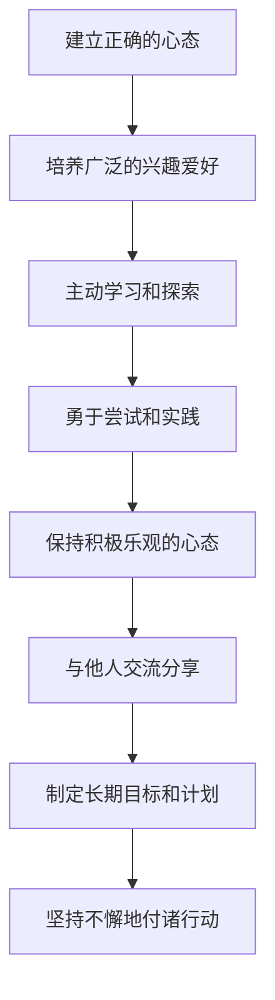

# 怎样培养强烈的求知欲、好奇心和进取心

## 1. 背景介绍

在当今快节奏的科技时代,求知欲、好奇心和进取心是推动个人成长和职业发展的关键驱动力。无论是学生、专业人士还是企业家,培养这些品质都至关重要。它们不仅能帮助我们获取新知识、发现新机遇,还能促进创新思维,应对未来的挑战。

然而,在日常生活的压力和惯性下,我们常常会失去求知的动力,陷入舒适区。因此,有必要采取有效的策略来激发和保持强烈的求知欲、好奇心和进取心。

## 2. 核心概念与联系

### 2.1 求知欲

求知欲是人类对知识的渴望,是推动学习和探索的内在动机。它体现在对新事物的好奇心和对未解之谜的执着追求。强烈的求知欲能驱使我们主动学习,不断扩展知识领域,提高认知能力。

### 2.2 好奇心  

好奇心是人类对新奇事物的关注和探索欲望。它是求知欲的外在表现,促使我们主动观察、提出疑问、寻找答案。好奇心是创新和发现的源泉,能够激发我们的想象力和创造力。

### 2.3 进取心

进取心是一种积极向上的精神状态,体现在对更高目标的追求和不断超越自我的决心。它驱使我们勇于尝试新事物,勇于承担风险,勇于突破自我。进取心是成功的重要品质,能够帮助我们实现个人价值和事业理想。

这三个概念相互关联、相辅相成。求知欲是根源动力,好奇心是外在表现,进取心则是内在驱动力。它们共同构成了一个完整的系统,推动着我们不断学习、探索和成长。

## 3. 核心算法原理具体操作步骤

培养强烈的求知欲、好奇心和进取心需要一个持续的过程,可以借助以下几个步骤来实现:



### 3.1 建立正确的心态

首先,我们需要建立正确的心态,认识到求知、好奇和进取的重要性。我们应该意识到,这些品质不仅能够丰富我们的生活,还能帮助我们在工作和事业中取得成功。

### 3.2 培养广泛的兴趣爱好

其次,我们应该培养广泛的兴趣爱好。通过阅读、观察、旅行等方式,接触不同的领域和文化,开阔视野,激发好奇心。同时,我们也可以尝试一些新的爱好,如学习一门新语言、参与户外运动等,这有助于培养求知欲和进取心。

### 3.3 主动学习和探索

第三步是主动学习和探索。当我们对某个领域产生兴趣时,就应该主动寻找相关资源,通过自学、上课、参加讲座等方式来学习。在学习过程中,我们应该保持好奇心,勇于质疑、思考和探索,而不是被动地接受现有知识。

### 3.4 勇于尝试和实践

理论知识固然重要,但真正的学习和成长来自于实践。因此,我们需要勇于尝试和实践。无论是尝试一项新技能、参与一个新项目,还是创办一个新业务,实践都能帮助我们将所学知识转化为实际能力,同时也能培养进取心和应对挑战的勇气。

### 3.5 保持积极乐观的心态

在学习和实践的过程中,我们难免会遇到困难和挫折。这时,保持积极乐观的心态就显得尤为重要。我们应该相信自己的能力,坚持不放弃,从失败中吸取教训,继续前进。同时,我们也应该学会欣赏周围的美好事物,保持乐观积极的心态,这有助于我们保持求知欲和进取心。

### 3.6 与他人交流分享

与他人交流分享也是培养求知欲、好奇心和进取心的重要环节。通过与他人交流,我们可以获得新的见解和启发,开阔思路。同时,分享自己的知识和经验也能帮助我们巩固所学,激发进一步探索的欲望。

### 3.7 制定长期目标和计划

为了持续保持求知欲、好奇心和进取心,我们需要制定长期目标和计划。无论是学习一门新技能、开展一个新项目,还是实现一个人生理想,都需要有明确的目标和详细的计划。这不仅能够指引我们的努力方向,也能够激发我们的动力和决心。

### 3.8 坚持不懈地付诸行动

最后,我们需要坚持不懈地付诸行动。培养求知欲、好奇心和进取心需要持之以恒的努力,任何一次的懈怠都可能导致我们失去动力。因此,我们应该时刻提醒自己,坚持不懈地实践和学习,直到达成目标。

## 4. 数学模型和公式详细讲解举例说明

在培养求知欲、好奇心和进取心的过程中,我们可以借助一些数学模型和公式来量化和优化我们的努力。

### 4.1 目标设定模型

设定明确的目标对于保持动力至关重要。我们可以使用 SMART 原则来设定目标,即:

- Specific(具体): 目标应该具体、可衡量。
- Measurable(可衡量): 目标应该有明确的衡量标准。
- Achievable(可实现): 目标应该在现有条件下可实现。
- Relevant(相关): 目标应该与个人发展或职业发展相关。
- Time-bound(有时限): 目标应该设定明确的截止日期。

我们可以将目标分解为多个子目标,并为每个子目标设定具体的衡量指标和完成时间。这样可以更好地跟踪进度,及时调整策略。

### 4.2 习惯养成模型

培养求知欲、好奇心和进取心需要形成良好的习惯。我们可以借助习惯循环模型来培养新习惯:

$$
\text{Habit Loop} = \text{Cue} \rightarrow \text{Routine} \rightarrow \text{Reward}
$$

- Cue(线索): 触发习惯的信号或环境因素。
- Routine(常规): 实际执行的行为或习惯。
- Reward(奖励): 完成习惯后获得的正向反馈或满足感。

通过识别和优化这个循环,我们可以更容易地培养新习惯。例如,我们可以设置一个固定的时间作为线索,执行阅读或学习的常规行为,并给予自己一些奖励,如休息一会或吃一些小零食。

### 4.3 时间管理模型

有效的时间管理对于保持求知欲、好奇心和进取心也很重要。我们可以使用矩阵法来优化时间分配:

$$
\begin{array}{c|c}
  \textbf{重要且紧急} & \textbf{不重要但紧急} \\
  \hline
  \textbf{重要但不紧急} & \textbf{不重要且不紧急}
\end{array}
$$

我们应该优先处理重要且紧急的事项,然后安排时间处理重要但不紧急的事项,如学习、探索等。同时,我们也应该尽量减少不重要且不紧急的事项,以节省更多时间用于提升自我。

通过合理分配时间,我们可以更好地兼顾工作、学习和生活,从而保持求知欲、好奇心和进取心。

## 5. 项目实践:代码实例和详细解释说明

为了更好地理解如何培养求知欲、好奇心和进取心,我们可以通过一个实际项目来实践。这个项目旨在帮助用户建立一个持续学习的习惯,探索新领域,并实现自我提升。

### 5.1 项目概述

我们将开发一个名为 "Learn Explorer" 的 Web 应用程序,它可以帮助用户:

1. 设定学习目标并分解为可实现的子目标。
2. 发现和订阅感兴趣的学习资源,如在线课程、博客、播客等。
3. 跟踪学习进度,记录学习笔记和心得体会。
4. 与其他用户交流分享,互相鼓励和启发。
5. 可视化学习数据,分析自己的学习习惯和效率。

### 5.2 技术栈

该项目将使用以下技术栈:

- 前端: React、Redux、React Router、Ant Design
- 后端: Node.js、Express、MongoDB
- 其他: JWT 认证、Socket.IO (实时通信)、Recharts (数据可视化)

### 5.3 核心功能实现

以下是一些核心功能的实现示例:

#### 5.3.1 目标设定

我们可以使用 React 和 Ant Design 构建一个交互式的目标设定界面,允许用户输入主目标和子目标,并设置相应的截止日期和衡量指标。

```jsx
import React, { useState } from 'react';
import { Form, Input, DatePicker, Button } from 'antd';

const GoalSetting = () => {
  const [goals, setGoals] = useState([]);

  const handleAddGoal = (values) => {
    setGoals([...goals, values]);
  };

  return (
    <div>
      <Form onFinish={handleAddGoal}>
        <Form.Item
          name="goal"
          label="Goal"
          rules={[{ required: true, message: 'Please input your goal' }]}
        >
          <Input />
        </Form.Item>
        <Form.Item
          name="deadline"
          label="Deadline"
          rules={[{ required: true, message: 'Please select a deadline' }]}
        >
          <DatePicker />
        </Form.Item>
        <Form.Item
          name="metric"
          label="Metric"
          rules={[{ required: true, message: 'Please input a metric' }]}
        >
          <Input />
        </Form.Item>
        <Form.Item>
          <Button type="primary" htmlType="submit">
            Add Goal
          </Button>
        </Form.Item>
      </Form>
      <ul>
        {goals.map((goal, index) => (
          <li key={index}>
            <p>Goal: {goal.goal}</p>
            <p>Deadline: {goal.deadline.format('YYYY-MM-DD')}</p>
            <p>Metric: {goal.metric}</p>
          </li>
        ))}
      </ul>
    </div>
  );
};

export default GoalSetting;
```

#### 5.3.2 资源发现和订阅

我们可以使用 React 和 Redux 构建一个资源浏览和订阅功能,允许用户搜索和订阅感兴趣的学习资源。

```jsx
import React, { useState } from 'react';
import { useDispatch, useSelector } from 'react-redux';
import { Input, Button, List } from 'antd';
import { searchResources, subscribeResource } from './actions';

const ResourceExplorer = () => {
  const [searchTerm, setSearchTerm] = useState('');
  const dispatch = useDispatch();
  const resources = useSelector((state) => state.resources);

  const handleSearch = () => {
    dispatch(searchResources(searchTerm));
  };

  const handleSubscribe = (resource) => {
    dispatch(subscribeResource(resource));
  };

  return (
    <div>
      <Input
        placeholder="Search resources..."
        value={searchTerm}
        onChange={(e) => setSearchTerm(e.target.value)}
      />
      <Button type="primary" onClick={handleSearch}>
        Search
      </Button>
      <List
        dataSource={resources}
        renderItem={(resource) => (
          <List.Item>
            <List.Item.Meta
              title={resource.title}
              description={resource.description}
            />
            <Button onClick={() => handleSubscribe(resource)}>Subscribe</Button>
          </List.Item>
        )}
      />
    </div>
  );
};

export default ResourceExplorer;
```

#### 5.3.3 学习跟踪和笔记

我们可以使用 React 和 Ant Design 构建一个学习跟踪和笔记功能,允许用户记录学习进度、笔记和心得体会。

```jsx
import React, { useState } from 'react';
import { Form, Input, Progress, Button } from 'antd';

const LearningTracker = () => {
  const [progress,