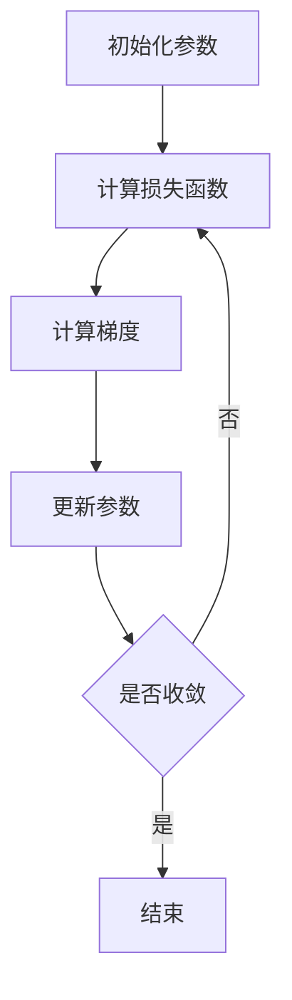
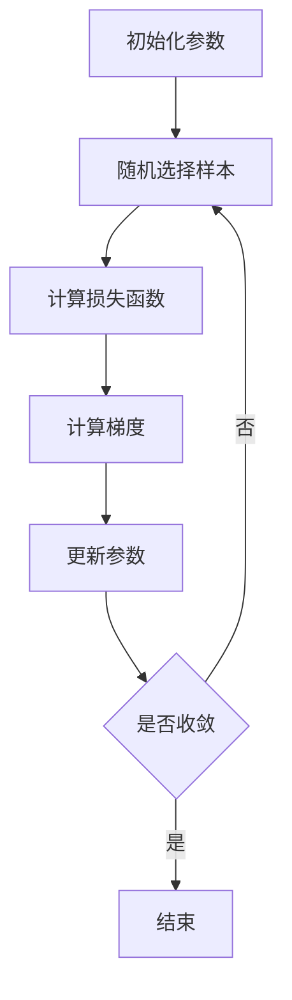

# 损失函数 (Loss Function)

## 1.背景介绍

在机器学习和深度学习领域，损失函数（Loss Function）是一个至关重要的概念。它是模型训练过程中用于衡量预测结果与实际结果之间差异的函数。损失函数的选择直接影响模型的性能和训练效果。本文将深入探讨损失函数的核心概念、算法原理、数学模型、实际应用场景以及未来发展趋势。

## 2.核心概念与联系

### 2.1 损失函数的定义

损失函数是一个数学函数，用于量化模型预测值与真实值之间的差异。其主要目的是指导模型参数的优化，使得模型在训练数据上的表现尽可能好。

### 2.2 损失函数与优化算法的关系

损失函数与优化算法密切相关。优化算法通过最小化损失函数来调整模型参数，从而提高模型的预测精度。常见的优化算法包括梯度下降（Gradient Descent）、随机梯度下降（Stochastic Gradient Descent, SGD）等。

### 2.3 损失函数与评价指标的区别

损失函数用于训练过程中的参数优化，而评价指标（如准确率、精确率、召回率等）用于评估模型在测试数据上的表现。两者虽然有联系，但在使用场景和目的上有所不同。

## 3.核心算法原理具体操作步骤

### 3.1 梯度下降算法

梯度下降算法是最常用的优化算法之一，其基本思想是通过计算损失函数的梯度，沿着梯度的反方向更新模型参数，使得损失函数值逐步减小。



### 3.2 随机梯度下降算法

随机梯度下降算法（SGD）是梯度下降算法的一种变体，其每次只使用一个样本来计算梯度，从而加快了训练速度。



## 4.数学模型和公式详细讲解举例说明

### 4.1 均方误差（Mean Squared Error, MSE）

均方误差是回归问题中常用的损失函数，其定义为预测值与真实值之差的平方和的平均值。

$$
MSE = \frac{1}{n} \sum_{i=1}^{n} (y_i - \hat{y}_i)^2
$$

其中，$y_i$ 是第 $i$ 个样本的真实值，$\hat{y}_i$ 是第 $i$ 个样本的预测值，$n$ 是样本总数。

### 4.2 交叉熵损失（Cross-Entropy Loss）

交叉熵损失常用于分类问题，其定义为真实标签与预测概率之间的差异。

$$
L = -\frac{1}{n} \sum_{i=1}^{n} \sum_{c=1}^{C} y_{i,c} \log(\hat{y}_{i,c})
$$

其中，$y_{i,c}$ 是第 $i$ 个样本属于第 $c$ 类的真实标签，$\hat{y}_{i,c}$ 是第 $i$ 个样本属于第 $c$ 类的预测概率，$C$ 是类别总数。

### 4.3 Hinge Loss

Hinge Loss 常用于支持向量机（SVM）中，其定义为：

$$
L = \sum_{i=1}^{n} \max(0, 1 - y_i \cdot \hat{y}_i)
$$

其中，$y_i$ 是第 $i$ 个样本的真实标签，$\hat{y}_i$ 是第 $i$ 个样本的预测值。

## 5.项目实践：代码实例和详细解释说明

### 5.1 使用均方误差的线性回归

```python
import numpy as np

# 生成数据
X = 2 * np.random.rand(100, 1)
y = 4 + 3 * X + np.random.randn(100, 1)

# 初始化参数
theta = np.random.randn(2, 1)

# 增加偏置项
X_b = np.c_[np.ones((100, 1)), X]

# 学习率和迭代次数
learning_rate = 0.01
n_iterations = 1000

# 梯度下降算法
for iteration in range(n_iterations):
    gradients = 2/100 * X_b.T.dot(X_b.dot(theta) - y)
    theta = theta - learning_rate * gradients

print("参数估计值:", theta)
```

### 5.2 使用交叉熵损失的逻辑回归

```python
import numpy as np
from sklearn.datasets import make_classification
from sklearn.model_selection import train_test_split
from sklearn.linear_model import LogisticRegression
from sklearn.metrics import log_loss

# 生成数据
X, y = make_classification(n_samples=1000, n_features=20, random_state=42)
X_train, X_test, y_train, y_test = train_test_split(X, y, test_size=0.2, random_state=42)

# 训练逻辑回归模型
model = LogisticRegression()
model.fit(X_train, y_train)

# 预测概率
y_pred_prob = model.predict_proba(X_test)

# 计算交叉熵损失
loss = log_loss(y_test, y_pred_prob)
print("交叉熵损失:", loss)
```

## 6.实际应用场景

### 6.1 回归问题

在回归问题中，常用的损失函数包括均方误差（MSE）、均方根误差（RMSE）等。这些损失函数用于衡量模型预测值与真实值之间的差异。

### 6.2 分类问题

在分类问题中，常用的损失函数包括交叉熵损失、Hinge Loss 等。这些损失函数用于衡量模型预测概率与真实标签之间的差异。

### 6.3 强化学习

在强化学习中，损失函数用于衡量策略的好坏。常用的损失函数包括策略梯度损失、价值函数损失等。

## 7.工具和资源推荐

### 7.1 工具

- **TensorFlow**：一个开源的机器学习框架，支持多种损失函数的实现。
- **PyTorch**：另一个流行的开源机器学习框架，提供了丰富的损失函数库。
- **Scikit-learn**：一个简单易用的机器学习库，适合初学者使用。

### 7.2 资源

- **《深度学习》**：由 Ian Goodfellow 等人编写的经典教材，详细介绍了损失函数的理论和应用。
- **Coursera 和 Udacity 的在线课程**：提供了丰富的机器学习和深度学习课程，涵盖了损失函数的相关内容。

## 8.总结：未来发展趋势与挑战

损失函数在机器学习和深度学习中扮演着重要角色。随着技术的发展，新的损失函数不断被提出，以解决不同的应用场景和问题。然而，选择合适的损失函数仍然是一个具有挑战性的任务，需要根据具体问题进行深入分析和实验。

未来，损失函数的研究将继续深入，特别是在自适应损失函数、对抗性损失函数等方面。如何设计更有效、更鲁棒的损失函数，将是一个重要的研究方向。

## 9.附录：常见问题与解答

### 9.1 为什么损失函数对模型训练如此重要？

损失函数用于衡量模型预测值与真实值之间的差异，是模型训练过程中参数优化的依据。选择合适的损失函数可以显著提高模型的性能。

###