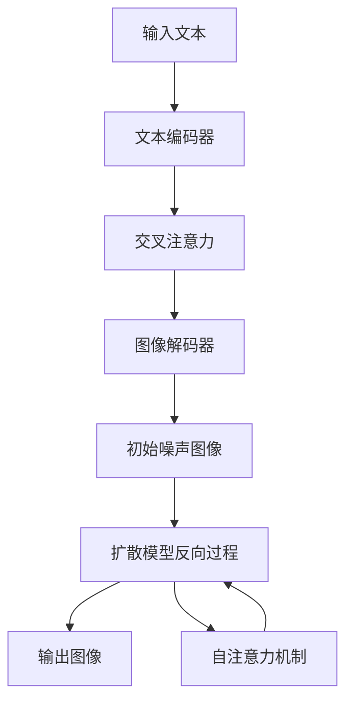

# 掌握Imagen:端到端训练流程和技巧

## 1. 背景介绍
### 1.1 Imagen的诞生
2022年5月,谷歌发布了一个名为Imagen的文本到图像(Text-to-Image)生成模型,标志着AI图像生成技术的一个重大突破。Imagen能够根据给定的文本描述生成高度逼真、细节丰富的图像。

### 1.2 Imagen的优势
与此前的DALL-E、Stable Diffusion等模型相比,Imagen在图像质量、多样性、语义理解等方面都有显著提升。它能生成分辨率高达1024x1024的图像,支持多种艺术风格,对文本描述的理解也更加深入。

### 1.3 Imagen的应用前景
Imagen强大的文本到图像生成能力为多个领域带来了新的机遇,如辅助设计、艺术创作、游戏开发、教育培训等。掌握Imagen的训练流程和技巧,对于相关从业者和研究人员来说至关重要。

## 2. 核心概念与联系
### 2.1 扩散模型(Diffusion Model) 
Imagen采用了扩散模型作为生成图像的基础框架。扩散模型通过迭代去噪的过程,将随机噪声逐步转化为清晰图像。它包含正向和反向两个过程:
- 正向过程:通过逐步添加高斯噪声,将真实图像转化为纯噪声。
- 反向过程:通过逐步去噪,将纯噪声还原为真实图像。

### 2.2 变分自编码器(VAE)
变分自编码器是一种生成模型,由编码器和解码器两部分组成。编码器将输入图像映射到隐空间,解码器从隐空间重构出图像。Imagen使用了层级VAE结构,通过多个VAE的级联提高生成图像的质量。

### 2.3 注意力机制(Attention)
注意力机制让模型能够聚焦于输入序列中的关键信息。Imagen使用了自注意力机制和交叉注意力机制:
- 自注意力:捕捉图像不同区域之间的关联。
- 交叉注意力:建立文本和图像之间的对应关系。

通过注意力机制,Imagen能更好地理解文本描述,生成与之相关的图像内容。

### 2.4 概念关系图
下面是Imagen中几个核心概念的关系示意图:



## 3. 核心算法原理与步骤
### 3.1 文本编码
- 将输入的文本描述通过预训练的文本编码器(如T5)转化为文本嵌入向量。
- 文本嵌入向量作为后续交叉注意力模块的输入,指导图像生成。

### 3.2 初始噪声图像生成
- 从高斯分布中随机采样噪声向量。
- 将噪声向量输入到图像解码器(如层级VAE解码器)中,生成初始的噪声图像。

### 3.3 扩散模型反向去噪
- 对初始噪声图像进行多轮迭代去噪。
- 每一轮去噪包括预测噪声、更新图像两个步骤:
  - 预测噪声:利用UNet等模型,根据当前图像和文本嵌入预测噪声。
  - 更新图像:从当前图像中减去预测的噪声,得到去噪后的图像。
- 通过多轮迭代,噪声图像逐渐转化为清晰、逼真的图像。

### 3.4 注意力机制应用
- 在扩散模型的UNet结构中,加入自注意力和交叉注意力模块。  
- 自注意力模块捕捉图像不同区域之间的关联,提高图像的连贯性。
- 交叉注意力模块建立文本嵌入和图像特征之间的对应关系,使生成图像符合文本描述。

## 4. 数学模型与公式详解
### 4.1 扩散模型
扩散模型的数学表示如下:

正向过程:
$$q(x_t|x_{t-1}) = \mathcal{N}(x_t; \sqrt{1-\beta_t} x_{t-1}, \beta_t \mathbf{I})$$

反向过程: 
$$p_\theta(x_{t-1}|x_t) = \mathcal{N}(x_{t-1}; \mu_\theta(x_t, t), \sigma_t^2 \mathbf{I})$$

其中,$x_t$表示扩散过程中的中间状态图像,$\beta_t$控制噪声添加的强度,$\mu_\theta$由神经网络(如UNet)参数化。反向过程通过迭代优化$\theta$使生成分布逼近真实分布。

### 4.2 变分自编码器
VAE的目标是最大化边际似然的下界(ELBO):

$$\log p(x) \geq \mathbb{E}_{q_\phi(z|x)}[\log p_\theta(x|z)] - D_{KL}(q_\phi(z|x) || p(z))$$

其中,$q_\phi(z|x)$是编码器,$p_\theta(x|z)$是解码器,$D_{KL}$是KL散度,用于度量编码分布与先验分布的差异。通过最大化ELBO,VAE学习到有意义的隐空间表示。

### 4.3 注意力机制
自注意力可以表示为:

$$\text{Attention}(Q, K, V) = \text{softmax}(\frac{QK^T}{\sqrt{d_k}})V$$

其中,$Q$,$K$,$V$分别是查询、键、值矩阵,$d_k$是键向量的维度。自注意力通过计算查询和键的相似度,对值进行加权求和。

交叉注意力与自注意力类似,只是查询来自另一个模态(如文本嵌入),而键和值来自图像特征。

## 5. 项目实践:代码实例与详解
下面是使用PyTorch实现Imagen扩散模型反向去噪过程的简化示例:

```python
import torch
import torch.nn as nn

class DiffusionModel(nn.Module):
    def __init__(self, unet, timesteps):
        super().__init__()
        self.unet = unet
        self.timesteps = timesteps
    
    def forward(self, x, t, text_embeddings):
        # 根据时间步t计算噪声强度
        alpha_t = self.get_alpha(t)
        
        # 预测噪声残差
        noise_pred = self.unet(x, t, text_embeddings) 
        
        # 计算去噪后的图像
        x_denoised = (x - (1 - alpha_t) * noise_pred) / torch.sqrt(alpha_t)
        
        return x_denoised
    
    def get_alpha(self, t):
        # 计算噪声强度的函数,可以根据需要进行定制
        return torch.cos(t * math.pi / self.timesteps) ** 2

# 实例化扩散模型    
model = DiffusionModel(unet, timesteps=1000)

# 加载预训练权重
model.load_state_dict(torch.load('model.pth')) 

# 生成图像
with torch.no_grad():
    x = torch.randn((1, 3, 256, 256))  # 初始噪声图像
    text_embeddings = get_text_embeddings(text)  # 获取文本嵌入
    
    for t in range(model.timesteps):
        t = torch.tensor([t])
        x = model(x, t, text_embeddings)
        
img = x.squeeze().permute(1, 2, 0).cpu().numpy()  # 得到生成图像
```

以上代码展示了扩散模型反向去噪的核心逻辑:
1. 初始化一个随机噪声图像。
2. 在每个时间步,利用UNet预测噪声残差。
3. 根据预测的噪声残差更新图像。
4. 迭代多个时间步,直到得到最终的生成图像。

实际应用中,还需要加入文本编码器、注意力机制等组件,并在大规模数据集上进行训练。

## 6. 实际应用场景
Imagen强大的文本到图像生成能力在多个领域有广泛应用,例如:

- 设计创意:根据文字描述自动生成设计草图、概念图,辅助设计师进行创作。
- 艺术创作:生成各种风格的艺术作品,如油画、水彩画、插画等,激发艺术家灵感。  
- 游戏开发:自动生成游戏场景、角色、物品等图像素材,加速游戏内容制作。
- 教育培训:将文字课程材料转化为生动形象的视觉内容,提升学习体验。
- 虚拟试衣:根据文字描述生成人物形象,实现虚拟试衣、换装等功能。
- 辅助医疗:根据医学报告生成解剖结构图、病理图像等,辅助医生诊断。

Imagen的应用可以极大提升生产效率,降低创作门槛,为相关行业带来变革性影响。

## 7. 工具与资源推荐
- **官方代码与模型**:谷歌发布的Imagen官方实现和预训练模型。
- **Hugging Face**:提供了多个Imagen的开源实现和演示Demo。
- **Diffusers**:一个扩散模型训练的PyTorch库,包含Imagen等多个SOTA模型。
- **AK-Imagen**:一个支持Imagen的开源框架,提供了API接口和Web UI。
- **Imagen-pytorch**:一个Imagen的PyTorch实现,提供了训练和推理代码。
- **Awesome-text-to-image**:一个文本到图像生成资源的汇总仓库。

这些工具和资源可以帮助开发者快速上手Imagen,搭建自己的应用。同时还有许多优秀的教程和文章,分享了使用Imagen的经验和技巧。

## 8. 总结:未来发展与挑战
Imagen的出现标志着文本到图像生成技术的重大突破,展现了人工智能在视觉创作领域的巨大潜力。未来,这项技术有望在更多场景得到应用,极大提升生产效率和创新能力。

同时,Imagen的进一步发展也面临一些挑战:
- 提高图像分辨率和清晰度,生成更大尺寸的高质量图像。
- 加强对文本描述的语义理解,生成更符合人类意图的图像。 
- 扩展到更多领域,如医学影像、遥感图像等,满足行业需求。
- 缓解数据偏差问题,生成更加公平、无偏见的图像内容。
- 开发更高效的训练方法,减少计算资源消耗,实现快速迭代。

相信通过研究者和业界的共同努力,Imagen及类似技术将不断突破瓶颈,在更广阔的应用领域发挥重要作用,推动人工智能的发展。

## 9. 附录:常见问题与解答
### Q1:Imagen与DALL-E、Stable Diffusion等模型有何区别?
A1:Imagen在图像质量、分辨率、语义理解等方面有显著优势。它采用了更先进的扩散模型架构,引入了注意力机制,训练数据规模也更大。因此Imagen生成的图像更加逼真、细节丰富,与文本描述的相关性也更高。

### Q2:Imagen可以生成任意风格和内容的图像吗?
A2:理论上Imagen可以生成各种风格和内容的图像,但实际效果取决于训练数据。如果训练数据中缺乏某些风格或主题的图像,那么生成相应图像的质量可能会下降。此外,一些抽象或复杂的概念可能超出了当前模型的理解能力。

### Q3:如何利用Imagen生成定制化的图像?
A3:可以通过调整输入的文本描述来定制图像内容。文本描述需要尽量清晰、具体,包含关键信息如主体、动作、场景、风格等。此外,还可以通过微调模型或添加特定领域的训练数据,使其更适应特定任务。一些开源实现还支持图像反演,从现有图像出发生成变体。

### Q4:Imagen生成的图像是否有版权问题?
A4:由于Imagen生成的图像是全新合成的,一般不存在直接的版权问题。但如果生成图像与现有作品高度相似,仍可能引发知识产权纠纷。在商业使用时,建议咨询法律专业人士,确