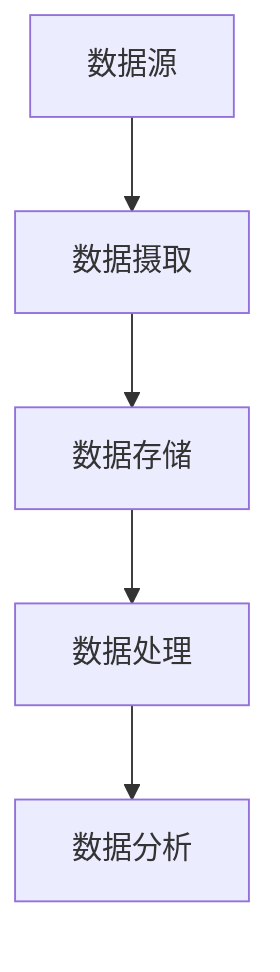

# 数据湖 原理与代码实例讲解

## 1.背景介绍

在大数据时代，数据的爆炸性增长使得传统的数据存储和处理方式面临巨大的挑战。数据湖（Data Lake）作为一种新兴的数据管理架构，提供了一种灵活、高效的解决方案。数据湖允许企业将各种类型的数据（结构化、半结构化和非结构化）存储在一个统一的存储库中，并支持大规模的数据分析和处理。

数据湖的概念最早由James Dixon提出，他将其描述为一个可以存储原始数据的地方，数据可以在需要时被提取和处理。与传统的数据仓库不同，数据湖不需要在数据进入之前进行严格的模式定义，这使得数据湖在处理多样化和快速变化的数据时具有显著优势。

## 2.核心概念与联系

### 2.1 数据湖的定义

数据湖是一个集中式存储库，可以存储来自不同来源的原始数据。数据湖的核心特点是其灵活性和可扩展性，允许存储各种类型的数据，并支持多种数据处理和分析工具。

### 2.2 数据湖与数据仓库的区别

数据湖和数据仓库都是用于存储和管理数据的解决方案，但它们在架构、数据处理方式和应用场景上有显著区别：

- **架构**：数据湖采用扁平化的存储结构，数据以原始格式存储；数据仓库则采用分层存储结构，数据在进入仓库前需要进行清洗和转换。
- **数据处理**：数据湖支持多种数据处理工具和框架，如Hadoop、Spark等；数据仓库则主要依赖于SQL查询。
- **应用场景**：数据湖适用于大规模、多样化的数据分析和机器学习；数据仓库则更适用于结构化数据的商业智能和报表分析。

### 2.3 数据湖的核心组件

数据湖的核心组件包括：

- **数据存储**：用于存储原始数据的存储系统，如HDFS、Amazon S3等。
- **数据处理**：用于处理和分析数据的计算框架，如Apache Spark、Flink等。
- **数据管理**：用于管理数据生命周期和元数据的工具，如Apache Atlas、AWS Glue等。
- **数据安全**：用于保护数据隐私和安全的机制，如加密、访问控制等。

## 3.核心算法原理具体操作步骤

### 3.1 数据摄取

数据摄取是将数据从各种来源导入数据湖的过程。常见的数据摄取方式包括批量摄取和流式摄取。

- **批量摄取**：适用于定期导入大批量数据的场景，如每日数据备份。可以使用工具如Apache Sqoop、AWS Data Pipeline等。
- **流式摄取**：适用于实时数据处理的场景，如日志监控、实时分析。可以使用工具如Apache Kafka、AWS Kinesis等。

### 3.2 数据存储

数据存储是将摄取的数据存储在数据湖中的过程。常见的数据存储系统包括HDFS、Amazon S3、Azure Data Lake Storage等。



### 3.3 数据处理

数据处理是对存储在数据湖中的数据进行清洗、转换和分析的过程。常见的数据处理框架包括Apache Spark、Apache Flink、Presto等。

### 3.4 数据分析

数据分析是对处理后的数据进行分析和可视化的过程。常见的数据分析工具包括Tableau、Power BI、Jupyter Notebook等。

## 4.数学模型和公式详细讲解举例说明

在数据湖的构建和使用过程中，数学模型和算法起着至关重要的作用。以下是一些常见的数学模型和公式的详细讲解和举例说明。

### 4.1 数据清洗中的统计模型

数据清洗是数据处理的第一步，常用的统计模型包括均值、中位数、标准差等。

- **均值**：用于计算数据的平均值，公式为：
  $$
  \text{Mean} = \frac{1}{n} \sum_{i=1}^{n} x_i
  $$
  其中，$x_i$ 表示第 $i$ 个数据点，$n$ 表示数据点的总数。

- **标准差**：用于衡量数据的离散程度，公式为：
  $$
  \text{Standard Deviation} = \sqrt{\frac{1}{n} \sum_{i=1}^{n} (x_i - \text{Mean})^2}
  $$

### 4.2 数据分析中的回归模型

回归模型用于预测和分析数据之间的关系，常见的回归模型包括线性回归和多元回归。

- **线性回归**：用于预测一个因变量与一个自变量之间的线性关系，公式为：
  $$
  y = \beta_0 + \beta_1 x + \epsilon
  $$
  其中，$y$ 表示因变量，$x$ 表示自变量，$\beta_0$ 和 $\beta_1$ 表示回归系数，$\epsilon$ 表示误差项。

- **多元回归**：用于预测一个因变量与多个自变量之间的关系，公式为：
  $$
  y = \beta_0 + \beta_1 x_1 + \beta_2 x_2 + \cdots + \beta_n x_n + \epsilon
  $$

### 4.3 数据处理中的聚类算法

聚类算法用于将数据分组，常见的聚类算法包括K-means和层次聚类。

- **K-means算法**：用于将数据分为 $k$ 个簇，算法步骤如下：
  1. 随机选择 $k$ 个初始中心点。
  2. 将每个数据点分配到最近的中心点。
  3. 重新计算每个簇的中心点。
  4. 重复步骤2和3，直到中心点不再变化。

  K-means算法的目标是最小化簇内的平方误差，公式为：
  $$
  \text{SSE} = \sum_{i=1}^{k} \sum_{x \in C_i} \| x - \mu_i \|^2
  $$
  其中，$C_i$ 表示第 $i$ 个簇，$\mu_i$ 表示第 $i$ 个簇的中心点。

## 5.项目实践：代码实例和详细解释说明

在本节中，我们将通过一个具体的项目实例，展示如何构建和使用数据湖。我们将使用Apache Spark和Amazon S3来实现数据湖的核心功能。

### 5.1 环境准备

首先，我们需要准备好开发环境，包括安装Apache Spark和配置Amazon S3存储。

```bash
# 安装Apache Spark
wget https://archive.apache.org/dist/spark/spark-3.0.1/spark-3.0.1-bin-hadoop2.7.tgz
tar -xzf spark-3.0.1-bin-hadoop2.7.tgz
export SPARK_HOME=$(pwd)/spark-3.0.1-bin-hadoop2.7
export PATH=$SPARK_HOME/bin:$PATH

# 配置Amazon S3
pip install boto3
```

### 5.2 数据摄取

我们将从一个CSV文件中摄取数据，并将其存储在Amazon S3中。

```python
import boto3
import pandas as pd

# 读取CSV文件
data = pd.read_csv('data.csv')

# 将数据存储到Amazon S3
s3 = boto3.client('s3')
s3.put_object(Bucket='my-data-lake', Key='data.csv', Body=data.to_csv(index=False))
```

### 5.3 数据处理

我们将使用Apache Spark对存储在Amazon S3中的数据进行处理。

```python
from pyspark.sql import SparkSession

# 创建SparkSession
spark = SparkSession.builder \
    .appName("DataLakeExample") \
    .getOrCreate()

# 读取存储在Amazon S3中的数据
df = spark.read.csv('s3a://my-data-lake/data.csv', header=True, inferSchema=True)

# 数据清洗
df_cleaned = df.dropna()

# 数据