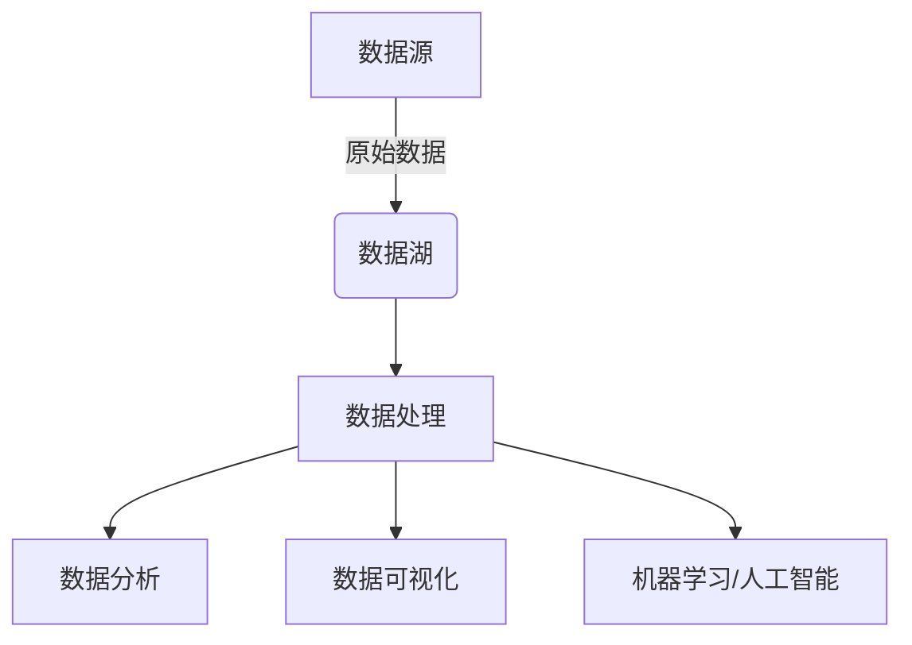
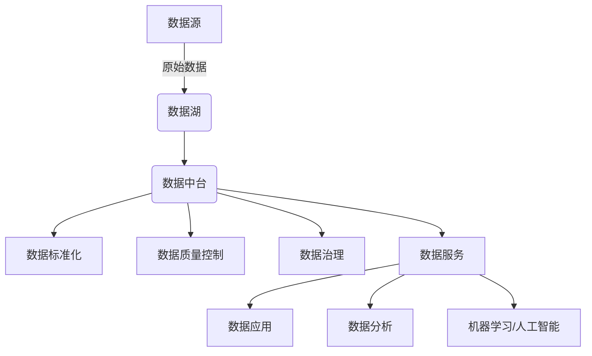

# 数据湖与数据中台的未来趋势

## 1.背景介绍

在当今的数字时代,数据已经成为企业最宝贵的资产之一。随着数据量的快速增长和多样化,传统的数据管理方式已经无法满足现代企业的需求。为了更好地利用和管理这些海量数据,数据湖(Data Lake)和数据中台(Data Middleware)的概念应运而生。

### 1.1 数据湖的兴起

数据湖是一种存储所有形式的原始数据(结构化、半结构化和非结构化)的集中式存储库。与传统的数据仓库不同,数据湖不需要预先定义数据模式,可以存储任何类型的数据,从而提供了更大的灵活性和可扩展性。数据湖的出现解决了传统数据管理系统无法处理大量非结构化数据的痛点,为企业提供了一种更加高效和经济的数据存储和管理方式。

### 1.2 数据中台的崛起

随着数据湖的普及,企业面临着如何高效利用这些海量数据的挑战。数据中台(Data Middleware)应运而生,作为一个统一的数据管理平台,它将数据湖中的原始数据进行处理、整合和管理,为企业提供高质量、可信赖的数据服务。数据中台通过建立数据标准、数据质量控制和数据治理机制,确保数据的一致性、准确性和可靠性,从而支持企业的数据驱动决策和创新。

## 2.核心概念与联系

### 2.1 数据湖

数据湖是一种存储所有形式的原始数据(结构化、半结构化和非结构化)的集中式存储库。它具有以下核心特征:

1. **无模式存储**: 数据湖可以存储任何类型的数据,无需预先定义数据模式,提供了极大的灵活性。
2. **低成本存储**: 数据湖通常采用廉价的存储介质(如Hadoop分布式文件系统HDFS),降低了存储成本。
3. **海量数据处理**: 数据湖可以利用大数据技术(如Apache Spark)高效处理海量数据。
4. **数据湖沉淀**: 数据湖中的数据是原始的、未经处理的,需要进一步清洗和加工才能为业务提供价值。



### 2.2 数据中台

数据中台是一个统一的数据管理平台,它从数据湖中获取原始数据,进行处理、整合和管理,为企业提供高质量、可信赖的数据服务。数据中台的核心概念包括:

1. **数据标准化**: 建立统一的数据标准,确保数据的一致性和可比性。
2. **数据质量控制**: 通过数据清洗、去重、校验等措施,确保数据的准确性和完整性。
3. **数据治理**: 建立数据治理机制,明确数据的所有权、使用权限和生命周期管理。
4. **数据服务**: 为企业提供统一的数据访问接口,支持各种数据应用和分析需求。



### 2.3 数据湖与数据中台的关系

数据湖和数据中台是密切相关的概念,它们共同构建了企业的现代数据架构。

- **数据湖**: 作为原始数据的存储库,为数据中台提供数据源。
- **数据中台**: 从数据湖中获取原始数据,进行处理、整合和管理,为企业提供高质量的数据服务。

数据湖和数据中台的结合,使企业能够充分利用海量数据,实现数据驱动的业务创新和决策优化。

## 3.核心算法原理具体操作步骤

### 3.1 数据湖构建

构建数据湖的核心步骤包括:

1. **选择合适的存储系统**: 通常采用分布式文件系统(如HDFS)或对象存储系统(如Amazon S3)作为数据湖的存储基础。
2. **设计数据摄入管道**: 建立数据摄入管道,将来自各种数据源(如数据库、日志文件、传感器等)的原始数据实时或批量导入数据湖。
3. **实现数据湖治理**: 建立数据湖治理机制,包括数据安全性、数据质量、数据生命周期管理等方面。
4. **构建数据湖元数据管理系统**: 元数据管理系统用于记录和管理数据湖中数据的元信息,如数据来源、格式、结构等,便于数据发现和使用。
5. **部署数据湖分析工具**: 部署大数据分析工具(如Apache Spark、Apache Hive等),用于对数据湖中的数据进行处理和分析。

### 3.2 数据中台构建

构建数据中台的核心步骤包括:

1. **定义数据标准**: 建立统一的数据标准,包括数据模型、数据编码、数据命名规范等,确保数据的一致性和可比性。
2. **实现数据质量控制**: 通过数据清洗、去重、校验等措施,确保数据的准确性和完整性。
3. **建立数据治理机制**: 明确数据的所有权、使用权限和生命周期管理,确保数据安全和合规。
4. **构建数据服务层**: 构建统一的数据服务层,提供标准化的数据访问接口,支持各种数据应用和分析需求。
5. **集成数据工具链**: 集成各种数据工具,如数据建模工具、数据质量工具、数据可视化工具等,支持数据中台的全生命周期管理。

### 3.3 数据湖与数据中台集成

为了充分发挥数据湖和数据中台的协同作用,需要将两者紧密集成:

1. **数据摄入**: 将数据湖中的原始数据导入数据中台进行处理和管理。
2. **数据处理**: 在数据中台中对数据进行清洗、转换、enrichment等处理,生成高质量的数据资产。
3. **数据服务**: 通过数据中台提供统一的数据服务接口,为各种数据应用和分析需求提供支持。
4. **数据反馈**: 将数据应用和分析的反馈信息回馈到数据中台,用于持续优化数据质量和数据模型。
5. **元数据管理**: 在数据中台中集中管理数据湖和数据中台的元数据,实现数据资产的可发现性和可追溯性。

通过数据湖和数据中台的紧密集成,企业可以充分利用海量数据,实现数据驱动的业务创新和决策优化。

## 4.数学模型和公式详细讲解举例说明

在数据湖和数据中台的建设和运维过程中,涉及到一些数学模型和公式,用于评估和优化系统的性能和效率。

### 4.1 数据压缩算法

为了节省存储空间和提高数据传输效率,数据湖和数据中台通常会对数据进行压缩。常用的数据压缩算法包括:

1. **熵编码算法**:

熵编码算法是一种无损压缩算法,它根据数据中每个符号出现的概率来编码,概率越高的符号编码越短。常用的熵编码算法包括霍夫曼编码和算术编码。

给定一个符号序列 $X = \{x_1, x_2, \ldots, x_n\}$,其中每个符号 $x_i$ 出现的概率为 $p(x_i)$,则序列的熵 $H(X)$ 可以表示为:

$$H(X) = -\sum_{i=1}^{n} p(x_i) \log_2 p(x_i)$$

熵 $H(X)$ 反映了序列的平均信息量,也就是对序列进行无损压缩所需的最小编码长度。

2. **字典编码算法**:

字典编码算法是一种有损压缩算法,它通过建立数据模式和字典,将重复出现的数据模式用较短的编码表示。常用的字典编码算法包括LZW算法和deflate算法。

对于一个长度为 $n$ 的数据序列 $X$,假设字典大小为 $k$,则压缩后的数据长度 $L$ 可以近似表示为:

$$L \approx n \times \frac{H(X)}{\log_2 k}$$

其中 $H(X)$ 是序列的熵。可以看出,字典大小 $k$ 越大,压缩率越高,但同时也需要更多的内存来存储字典。

### 4.2 数据分区策略

在大数据系统中,合理的数据分区策略对于提高数据处理效率至关重要。常用的数据分区策略包括:

1. **哈希分区**:

哈希分区是根据数据的哈希值将数据分配到不同的分区中。对于一个包含 $n$ 个分区的系统,给定一个键 $k$,它被分配到第 $i$ 个分区的概率为:

$$P(k \in \text{partition}_i) = \frac{1}{n}$$

哈希分区可以确保数据在分区之间的均匀分布,但无法保证相关数据被分配到同一个分区中。

2. **范围分区**:

范围分区是根据数据的某个键值范围将数据分配到不同的分区中。假设有 $m$ 个分区,键值范围为 $[a, b]$,则第 $i$ 个分区的键值范围为:

$$\text{partition}_i = [a + \frac{i-1}{m}(b-a), a + \frac{i}{m}(b-a)]$$

范围分区可以确保相关数据被分配到同一个分区中,但可能导致数据分布不均匀。

在实际应用中,通常需要根据具体的数据特征和应用场景,选择合适的分区策略或者组合使用多种分区策略,以达到最佳的数据处理效率。

## 5.项目实践：代码实例和详细解释说明

在本节中,我们将提供一个基于Apache Spark的数据湖和数据中台集成的实践案例,并给出详细的代码实例和解释说明。

### 5.1 案例背景

假设我们有一个电子商务网站,需要构建一个数据湖和数据中台系统,用于存储和处理来自多个数据源(如网站日志、交易记录、用户评论等)的海量数据,并为业务分析和决策提供支持。

### 5.2 数据湖构建

我们首先构建一个基于Apache Hadoop的数据湖,用于存储原始数据。

```scala
// 创建SparkSession
val spark = SparkSession.builder()
  .appName("DataLakeExample")
  .getOrCreate()

// 定义数据源
val logSource = "/path/to/weblogs"
val transactionSource = "/path/to/transactions"
val reviewSource = "/path/to/reviews"

// 将数据导入数据湖
val logs = spark.read.text(logSource)
val transactions = spark.read.parquet(transactionSource)
val reviews = spark.read.json(reviewSource)

// 将数据写入HDFS
logs.write.mode("overwrite").parquet("/datalake/weblogs")
transactions.write.mode("overwrite").parquet("/datalake/transactions")
reviews.write.mode("overwrite").parquet("/datalake/reviews")
```

在上面的代码中,我们首先创建了一个SparkSession,然后从不同的数据源读取原始数据(网站日志、交易记录和用户评论),最后将这些数据以Parquet格式写入HDFS中的数据湖。

### 5.3 数据中台构建

接下来,我们构建一个数据中台,从数据湖中读取原始数据,进行处理和整合,生成高质量的数据资产。

```scala
// 从数据湖读取原始数据
val logs = spark.read.parquet("/datalake/weblogs")
val transactions = spark.read.parquet("/datalake/transactions")
val reviews = spark.read.parquet("/datalake/reviews")

// 数据清洗和转换
val cleanedLogs = logs.na.drop().distinct()
val cleanedTransactions = transactions.na.fill(0.0, Seq("amount"))
val cleanedReviews =