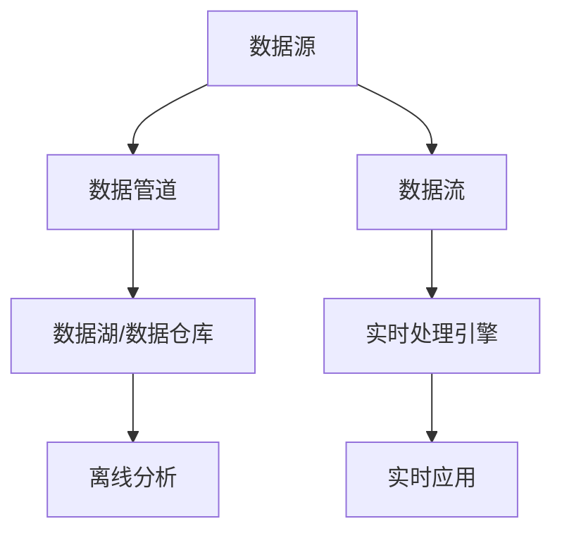

# 数据管道与数据流原理与代码实战案例讲解

## 1.背景介绍

### 1.1 数据时代的到来

在当今时代,数据无疑成为了一种新型的战略资源。无论是传统行业还是新兴领域,数据都扮演着至关重要的角色。随着物联网、5G、人工智能等新技术的快速发展,海量数据的产生和积累使得数据管理和处理变得前所未有的复杂和挑战。因此,构建高效、可扩展、容错的数据管道和数据流系统成为企业和组织的当务之急。

### 1.2 数据管道与数据流的重要性

数据管道(Data Pipeline)是指将数据从源头可靠地传输到目的地的端到端过程。而数据流(Data Stream)则是指连续不断的数据序列,通常来自各种传感器、日志文件、网络活动等实时数据源。构建健壮的数据管道和数据流系统能够确保数据的高效传输、处理和存储,从而为后续的数据分析、机器学习、业务智能等应用提供支撑。

## 2.核心概念与联系  

### 2.1 数据管道的概念

数据管道是指将数据从源头可靠地传输到目的地的端到端过程,涉及数据提取(Extract)、转换(Transform)和加载(Load)等步骤,常被称为ETL过程。数据管道的核心目标是确保数据的完整性、一致性和可用性。

### 2.2 数据流的概念

数据流是指连续不断的数据序列,通常来自各种传感器、日志文件、网络活动等实时数据源。与传统的批处理方式不同,数据流需要实时或近实时地处理数据,以支持低延迟的应用场景。

### 2.3 数据管道与数据流的关系

数据管道和数据流是密切相关的概念。数据管道通常用于批量数据的ETL过程,而数据流则侧重于实时数据的处理。在实际应用中,两者常常结合使用,形成混合的lambda架构或kappa架构,以满足不同的业务需求。



## 3.核心算法原理具体操作步骤

### 3.1 数据提取(Extract)

数据提取是数据管道的第一步,旨在从各种异构数据源获取所需数据。常见的数据源包括关系数据库、NoSQL数据库、文件系统、消息队列等。提取过程需要考虑数据源的类型、格式、访问权限等因素,并采用适当的技术和工具进行数据抽取。

一些常用的数据提取方法包括:

- 数据库连接器(如JDBC、ODBC)
- 文件读取器(如CSV、JSON、XML解析器)
- 消息队列消费者(如Kafka Consumer、RabbitMQ Consumer)
- Web API调用
- 日志文件解析器

### 3.2 数据转换(Transform)

数据转换是数据管道的核心环节,旨在对提取的原始数据进行清洗、转换和规范化处理,以满足后续数据加载和分析的需求。常见的数据转换操作包括:

- 数据过滤和去重
- 数据类型转换
- 字段重命名和合并
- 数据规范化(如地址标准化)
- 数据加密和脱敏
- 数据聚合和衍生计算

数据转换通常采用编程或可视化工具实现,如Python、Java等编程语言,或者使用Apache NiFi、Talend等数据集成工具。

### 3.3 数据加载(Load)

数据加载是数据管道的最后一步,将经过转换的数据加载到目标系统中,如数据仓库、数据湖或实时处理引擎。常见的数据加载方式包括:

- 批量加载(Bulk Load)
- 增量加载(Incremental Load)
- 实时加载(Streaming Load)

根据目标系统的特点选择合适的加载方式,并确保数据的完整性和一致性。例如,对于数据仓库,通常采用批量加载或增量加载;而对于实时处理引擎,则需要使用实时加载方式。

### 3.4 数据流处理

数据流处理侧重于实时或近实时地处理连续的数据流,通常采用流式计算模型。常见的数据流处理步骤包括:

1. 数据采集:从各种数据源(如消息队列、日志文件、传感器等)采集实时数据流。
2. 数据预处理:对采集的原始数据进行过滤、转换和规范化处理。
3. 数据分区:根据业务需求对数据流进行分区,以实现并行处理。
4. 流式计算:使用流式计算框架(如Apache Spark Streaming、Apache Flink等)对数据流进行实时计算和处理。
5. 结果输出:将处理结果输出到目标系统,如数据库、消息队列或可视化系统。

## 4.数学模型和公式详细讲解举例说明

在数据管道和数据流系统中,常常需要使用一些数学模型和公式来描述和优化系统的性能和行为。以下是一些常见的数学模型和公式:

### 4.1 小文件合并

在处理大量小文件时,通常需要进行文件合并操作,以提高数据处理效率。文件合并的目标是将多个小文件合并为较大的文件,从而减少元数据开销和I/O操作。

假设有N个小文件,每个文件的大小为S,合并后的文件大小为M,则合并后的文件数量为:

$$
N_{merged} = \lceil \frac{\sum_{i=1}^{N}S_i}{M} \rceil
$$

其中$\lceil x \rceil$表示向上取整。

通过适当选择合并后的文件大小M,可以平衡I/O开销和元数据开销,从而优化系统性能。

### 4.2 数据流窗口

在数据流处理中,常常需要对连续的数据流进行窗口划分,以便进行有状态的计算和聚合操作。常见的窗口类型包括滚动窗口(Tumbling Window)、滑动窗口(Sliding Window)和会话窗口(Session Window)等。

对于滚动窗口,给定窗口大小为$w$和数据流$\{x_1, x_2, \ldots, x_n\}$,则第$i$个窗口的数据为:

$$
W_i = \{x_{(i-1)w+1}, x_{(i-1)w+2}, \ldots, x_{iw}\}
$$

对于滑动窗口,给定窗口大小为$w$、滑动步长为$s$和数据流$\{x_1, x_2, \ldots, x_n\}$,则第$i$个窗口的数据为:

$$
W_i = \{x_{(i-1)s+1}, x_{(i-1)s+2}, \ldots, x_{(i-1)s+w}\}
$$

通过选择合适的窗口类型和参数,可以满足不同的业务需求,如实时计算、模式匹配、异常检测等。

### 4.3 数据流连接

在处理多个数据流时,常常需要对不同的数据流进行连接操作,以关联和整合不同来源的数据。数据流连接可以采用窗口连接(Window Join)或行连接(Row Join)等方式。

对于窗口连接,给定两个数据流$S_1$和$S_2$,窗口大小分别为$w_1$和$w_2$,则第$i$个窗口的连接结果为:

$$
R_i = W_{1i} \bowtie W_{2j}
$$

其中$\bowtie$表示连接操作,$W_{1i}$和$W_{2j}$分别表示第$i$个和第$j$个窗口的数据。

对于行连接,给定两个数据流$S_1$和$S_2$,连接条件为$\theta$,则连接结果为:

$$
R = \{(x, y) | x \in S_1, y \in S_2, \theta(x, y)\}
$$

通过选择合适的连接策略和算法,可以实现高效的数据流连接操作,支持复杂的数据关联和分析需求。

## 5.项目实践:代码实例和详细解释说明

为了更好地理解数据管道和数据流的原理和实现,我们将通过一个实际项目案例进行代码实战演示。该项目旨在构建一个端到端的数据管道系统,从多个异构数据源提取数据,进行转换和加载,并将结果数据实时流式输出到消费者端。

### 5.1 项目概述

本项目将模拟一个电子商务网站的数据管道和数据流系统,包括以下主要组件:

- 数据源:
  - 关系数据库(MySQL):存储订单和客户信息
  - NoSQL数据库(MongoDB):存储产品目录信息
  - 日志文件(CSV):记录网站访问日志
  - 消息队列(Kafka):实时接收订单事件数据流

- 数据管道:
  - 使用Apache NiFi构建数据管道,从各个数据源提取数据,进行转换和加载
  - 转换操作包括数据过滤、字段重命名、数据规范化等
  - 加载目标为Hadoop分布式文件系统(HDFS)

- 数据流:
  - 使用Apache Spark Streaming从Kafka消费实时订单事件数据流
  - 对订单数据进行实时处理和聚合,如计算每个产品的实时销售额
  - 将处理结果输出到Kafka主题,供下游消费者订阅

### 5.2 代码实现

#### 5.2.1 Apache NiFi数据管道

Apache NiFi是一个基于流程的数据集成工具,可以方便地构建和管理数据管道。以下是使用NiFi构建数据管道的主要步骤:

1. 创建输入处理器(Input Processors),从各个数据源提取数据,如`GetSQL`(从MySQL提取数据)、`GetMongo`(从MongoDB提取数据)、`GetFile`(从CSV文件提取数据)等。

2. 添加转换处理器(Transformation Processors),对提取的数据进行转换操作,如`FilterRecord`(过滤记录)、`ReplaceText`(替换文本)、`JoltTransformJSON`(JSON数据转换)等。

3. 配置输出处理器(Output Processors),将转换后的数据加载到目标系统,如`PutHDFS`(写入HDFS)。

4. 连接各个处理器,构建完整的数据流程。

5. 启动和监控数据管道,查看运行状态和统计信息。

以下是一个使用NiFi从MySQL提取订单数据、进行转换并加载到HDFS的示例流程:

```xml
<?xml version="1.0" encoding="UTF-8"?>
<template encoding-version="1.3">
    <description></description>
    <groupId>28ade5e0-0181-1000-6675-63f4c9e80e71</groupId>
    <name>Extract Orders from MySQL</name>
    <snippet>
        <processGroups>
            <id>aae8311d-d7b1-3149-0000-000000000000</id>
            <processors>
                <id>1c64b1b7-d7b5-3bc8-0000-000000000000</id>
                <parentGroupId>aae8311d-d7b1-3149-0000-000000000000</parentGroupId>
                <position>
                    <x>0.0</x>
                    <y>0.0</y>
                </position>
                <bundle>
                    <artifact>nifi-mysql-bundle</artifact>
                    <group>org.apache.nifi</group>
                    <version>1.15.0</version>
                </bundle>
                <config>
                    <properties>
                        <entry>
                            <key>Database User</key>
                            <value>root</value>
                        </entry>
                        <entry>
                            <key>Password</key>
                        </entry>
                        <entry>
                            <key>Database Name</key>
                            <value>ecommerce</value>
                        </entry>
                        <entry>
                            <key>max-value-entries</key>
                            <value>10000</value>
                        </entry>
                        <entry>
                            <key>SQL select query</key>
                            <value>SELECT * FROM orders</value>
                        </entry>
                    </properties>
                    <descriptors>
                        <entry>
                            <key>Database User</key>
                            <value>
                                <name>Database User</name>
                            </value>
                        </entry>
                        <entry>
                            <key>Password</key>
                            <value>
                                <name>Password</name>
                            </value>
                        </entry>
                        <entry>
                            <key>Database Name</key>
                            <value>
                                <name