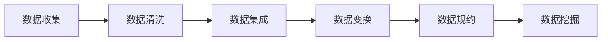

## 1. 背景介绍

在当今数据驱动的时代，数据预处理成为了数据分析和机器学习领域的重要环节。数据预处理是指在数据分析之前，对原始数据进行清洗和转换的过程，以提高数据质量，确保模型训练的准确性和有效性。由于现实世界中的数据往往是不完整、不一致或者含有噪声的，因此，数据预处理对于提取有价值的信息至关重要。

## 2. 核心概念与联系

数据预处理包括多个步骤，如数据清洗、数据集成、数据变换和数据规约。这些步骤相互联系，共同构成了数据预处理的完整流程。



## 3. 核心算法原理具体操作步骤

数据预处理的核心算法原理涉及多个方面，包括缺失值处理、异常值检测、数据归一化、特征编码等。每个步骤都有其特定的操作流程和算法。

### 3.1 缺失值处理

缺失值处理的目的是处理数据集中的缺失数据，常用的方法有删除法、均值填充法、中位数填充法、最频繁值填充法和预测模型法。

### 3.2 异常值检测

异常值检测旨在识别数据集中的异常或离群点。常用的方法包括标准差法、箱线图法和基于聚类的方法。

### 3.3 数据归一化

数据归一化是将数据按比例缩放，使之落入一个小的特定区间。常用的归一化方法有最小-最大规范化、Z-score标准化和小数定标规范化。

### 3.4 特征编码

特征编码是将非数值型特征转换为数值型特征的过程，常见的编码方式有独热编码（One-Hot Encoding）和标签编码（Label Encoding）。

## 4. 数学模型和公式详细讲解举例说明

### 4.1 缺失值处理

以均值填充法为例，其数学公式为：

$$
x_{\text{fill}} = \frac{1}{N}\sum_{i=1}^{N}x_i
$$

其中，$x_{\text{fill}}$ 是用于填充缺失值的均值，$N$ 是非缺失值的数量，$x_i$ 是非缺失的观测值。

### 4.2 异常值检测

以Z-score标准化为例，其数学公式为：

$$
z = \frac{(x - \mu)}{\sigma}
$$

其中，$x$ 是原始数据点，$\mu$ 是数据的均值，$\sigma$ 是数据的标准差。通常情况下，如果$|z|$ 大于2或3，则认为$x$ 是一个异常值。

### 4.3 数据归一化

以最小-最大规范化为例，其数学公式为：

$$
x' = \frac{x - \min(x)}{\max(x) - \min(x)}
$$

其中，$x'$ 是归一化后的值，$x$ 是原始数据点，$\min(x)$ 和 $\max(x)$ 分别是数据集中的最小值和最大值。

### 4.4 特征编码

以独热编码为例，假设有一个名为“颜色”的特征，其取值为“红色”，“绿色”和“蓝色”。独热编码会创建三个新的特征：“红色”，“绿色”和“蓝色”，并使用0和1来表示每个观测的颜色。

## 5. 项目实践：代码实例和详细解释说明

在本节中，我们将通过一个Python代码实例来展示数据预处理的实际操作。

```python
import pandas as pd
from sklearn.preprocessing import Imputer, StandardScaler, OneHotEncoder

# 加载数据集
data = pd.read_csv('data.csv')

# 缺失值处理
imputer = Imputer(strategy='mean')
data['column_with_missing_values'] = imputer.fit_transform(data[['column_with_missing_values']])

# 异常值检测和处理
data = data[(data['column'] - data['column'].mean()) / data['column'].std() < 3]

# 数据归一化
scaler = StandardScaler()
data['normalized_column'] = scaler.fit_transform(data[['column_to_normalize']])

# 特征编码
encoder = OneHotEncoder()
encoded_features = encoder.fit_transform(data[['categorical_column']]).toarray()
```

在这个例子中，我们使用了`Imputer`来填充缺失值，使用了`StandardScaler`来进行Z-score标准化，以及`OneHotEncoder`来进行独热编码。

## 6. 实际应用场景

数据预处理在多个领域都有广泛的应用，如金融风控、医疗诊断、社交网络分析和推荐系统等。在这些领域中，数据预处理帮助提高了模型的准确性和效率。

## 7. 工具和资源推荐

- Pandas: 数据处理和分析工具。
- Scikit-learn: 机器学习库，提供多种数据预处理方法。
- NumPy: 数值计算工具。
- Matplotlib: 数据可视化库。

## 8. 总结：未来发展趋势与挑战

数据预处理技术正在不断发展，未来的趋势包括自动化数据预处理、实时数据预处理和预处理算法的优化。同时，随着数据量的增加，数据预处理面临的挑战也在增加，如如何处理大规模数据集、保护数据隐私等。

## 9. 附录：常见问题与解答

Q1: 数据预处理为什么重要？
A1: 数据预处理可以提高数据质量，确保模型训练的准确性和有效性。

Q2: 数据预处理包括哪些步骤？
A2: 数据预处理通常包括数据清洗、数据集成、数据变换和数据规约等步骤。

Q3: 如何处理缺失值？
A3: 处理缺失值的方法包括删除法、均值填充法、中位数填充法、最频繁值填充法和预测模型法等。

作者：禅与计算机程序设计艺术 / Zen and the Art of Computer Programming