## 1. 背景介绍

在机器学习和数据挖掘领域，数据预处理和特征工程是非常重要的步骤。数据预处理是指在进行机器学习或数据挖掘任务之前，对原始数据进行清洗、转换、集成和规约等操作，以便于后续的分析和建模。特征工程则是指对原始数据进行特征提取、特征选择、特征变换和特征构建等操作，以便于提高模型的性能和泛化能力。

本文将介绍数据预处理和特征工程的基本概念、常用算法和实践技巧，并通过代码实战案例讲解，帮助读者深入理解和掌握这两个重要的数据处理技术。

## 2. 核心概念与联系

数据预处理和特征工程是机器学习和数据挖掘中的两个重要步骤，它们之间有密切的联系和互动。

数据预处理是指对原始数据进行清洗、转换、集成和规约等操作，以便于后续的分析和建模。数据预处理的目的是消除数据中的噪声、缺失值、异常值和冗余信息等问题，提高数据的质量和可用性。数据预处理的主要任务包括：

- 数据清洗：去除重复数据、处理缺失值、处理异常值、处理噪声等。
- 数据转换：对数据进行归一化、标准化、离散化、连续化等操作，以便于后续的分析和建模。
- 数据集成：将多个数据源的数据进行整合和合并，以便于后续的分析和建模。
- 数据规约：对数据进行抽样、降维、压缩等操作，以便于后续的分析和建模。

特征工程是指对原始数据进行特征提取、特征选择、特征变换和特征构建等操作，以便于提高模型的性能和泛化能力。特征工程的目的是从原始数据中提取出有用的特征，以便于建立更加准确和可靠的模型。特征工程的主要任务包括：

- 特征提取：从原始数据中提取出有用的特征，例如文本特征、图像特征、音频特征等。
- 特征选择：从提取出的特征中选择出最具有代表性和区分性的特征，以便于建立更加准确和可靠的模型。
- 特征变换：对特征进行变换，例如降维、升维、主成分分析等，以便于提高模型的性能和泛化能力。
- 特征构建：根据领域知识和经验构建新的特征，以便于提高模型的性能和泛化能力。

数据预处理和特征工程是机器学习和数据挖掘中的两个重要步骤，它们之间有密切的联系和互动。数据预处理的结果会直接影响到特征工程的效果，而特征工程的结果也会反过来影响到数据预处理的效果。因此，数据预处理和特征工程是机器学习和数据挖掘中不可或缺的两个步骤。

## 3. 核心算法原理具体操作步骤

### 3.1 数据清洗

数据清洗是数据预处理的第一步，其目的是去除数据中的噪声、缺失值、异常值和冗余信息等问题，提高数据的质量和可用性。数据清洗的主要任务包括：

- 去除重复数据：对数据进行去重操作，以避免重复数据对后续分析和建模的影响。
- 处理缺失值：对数据中的缺失值进行处理，例如删除缺失值、插值填充、使用默认值等。
- 处理异常值：对数据中的异常值进行处理，例如删除异常值、平滑处理、使用插值填充等。
- 处理噪声：对数据中的噪声进行处理，例如平滑处理、滤波处理等。

数据清洗的具体操作步骤如下：

1. 去除重复数据

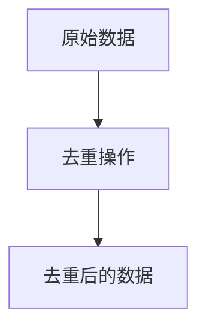

2. 处理缺失值

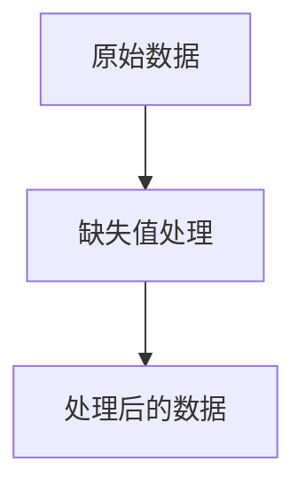

3. 处理异常值

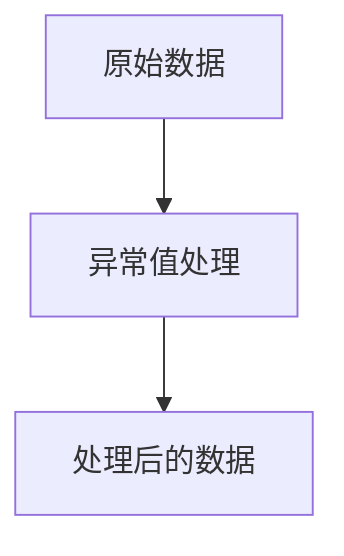

4. 处理噪声

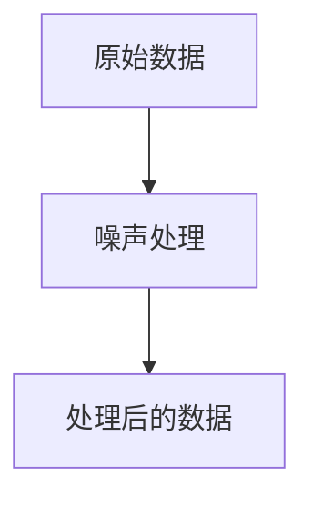

### 3.2 数据转换

数据转换是数据预处理的第二步，其目的是对数据进行归一化、标准化、离散化、连续化等操作，以便于后续的分析和建模。数据转换的主要任务包括：

- 归一化：将数据缩放到指定的范围内，例如将数据缩放到[0,1]或[-1,1]之间。
- 标准化：将数据转换为标准正态分布，以便于后续的分析和建模。
- 离散化：将连续型数据转换为离散型数据，以便于后续的分析和建模。
- 连续化：将离散型数据转换为连续型数据，以便于后续的分析和建模。

数据转换的具体操作步骤如下：

1. 归一化

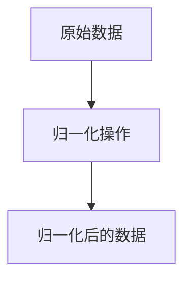

2. 标准化

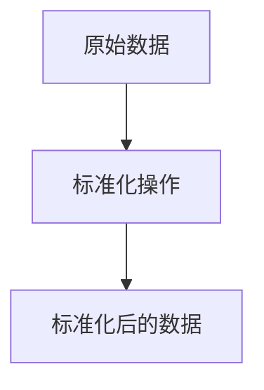

3. 离散化

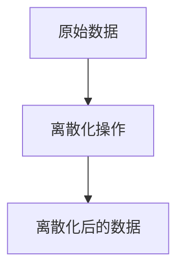

4. 连续化

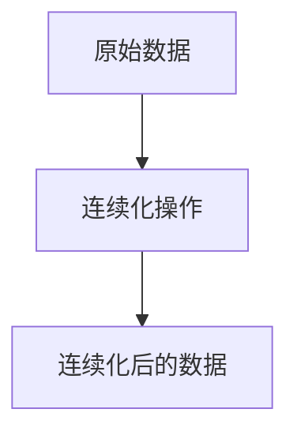

### 3.3 数据集成

数据集成是数据预处理的第三步，其目的是将多个数据源的数据进行整合和合并，以便于后续的分析和建模。数据集成的主要任务包括：

- 实体识别：对不同数据源中的实体进行识别和匹配，以便于进行数据集成。
- 属性冲突解决：对不同数据源中的属性进行冲突解决，例如属性重命名、属性合并、属性选择等。
- 数据合并：将不同数据源中的数据进行合并，以便于后续的分析和建模。

数据集成的具体操作步骤如下：

1. 实体识别

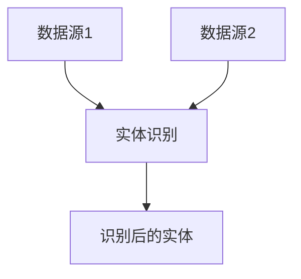

2. 属性冲突解决

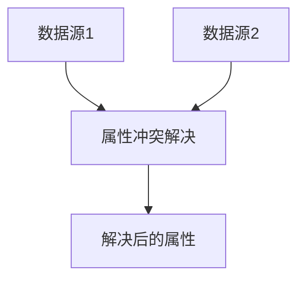

3. 数据合并

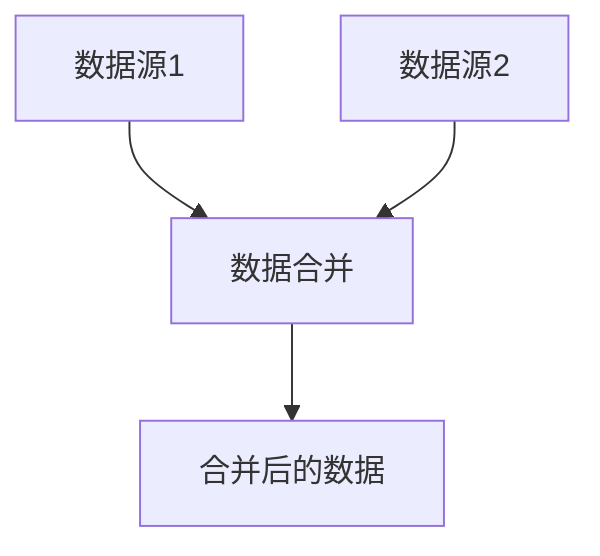

### 3.4 数据规约

数据规约是数据预处理的第四步，其目的是对数据进行抽样、降维、压缩等操作，以便于后续的分析和建模。数据规约的主要任务包括：

- 数据抽样：对数据进行随机抽样、分层抽样、聚类抽样等操作，以便于减少数据量和提高效率。
- 数据降维：对数据进行主成分分析、因子分析、独立成分分析等操作，以便于减少数据维度和提高效率。
- 数据压缩：对数据进行哈希压缩、字典压缩、熵编码等操作，以便于减少数据存储空间和提高效率。

数据规约的具体操作步骤如下：

1. 数据抽样

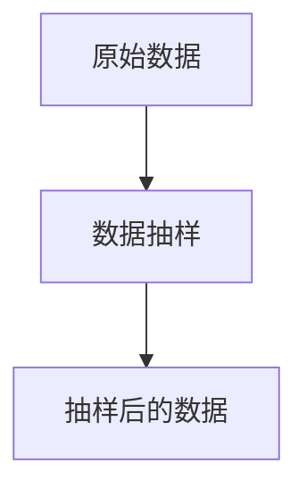

2. 数据降维

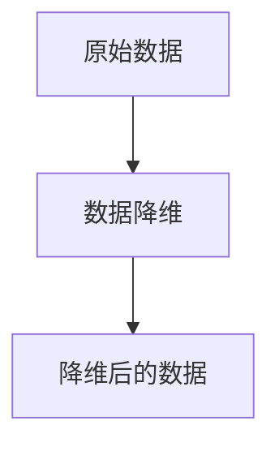

3. 数据压缩

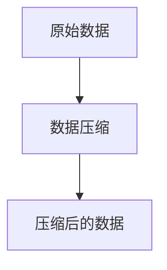

## 4. 数学模型和公式详细讲解举例说明

数据预处理和特征工程涉及到的数学模型和公式比较多，这里只介绍其中的一些常用模型和公式。

### 4.1 归一化

归一化是将数据缩放到指定的范围内，例如将数据缩放到[0,1]或[-1,1]之间。常用的归一化方法有最小-最大归一化和Z-score归一化。

最小-最大归一化的公式如下：

$$x'=\frac{x-min}{max-min}$$

其中，$x$是原始数据，$x'$是归一化后的数据，$min$和$max$分别是原始数据的最小值和最大值。

Z-score归一化的公式如下：

$$x'=\frac{x-\mu}{\sigma}$$

其中，$x$是原始数据，$x'$是归一化后的数据，$\mu$和$\sigma$分别是原始数据的均值和标准差。

### 4.2 主成分分析

主成分分析是一种常用的数据降维方法，其目的是将原始数据转换为一组新的变量，这些新的变量是原始变量的线性组合，且彼此之间不相关。主成分分析的公式如下：

$$Y=WX$$

其中，$X$是原始数据，$Y$是降维后的数据，$W$是变换矩阵。

### 4.3 特征选择

特征选择是从提取出的特征中选择出最具有代表性和区分性的特征，以便于建立更加准确和可靠的模型。常用的特征选择方法有过滤式、包裹式和嵌入式。

过滤式特征选择的公式如下：

$$score(f)=corr(f,y)$$

其中，$f$是特征，$y$是目标变量，$corr(f,y)$是特征$f$和目标变量$y$之间的相关系数。

包裹式特征选择的公式如下：

$$score(S)=accuracy(S)$$

其中，$S$是特征子集，$accuracy(S)$是使用特征子集$S$建立模型的准确率。

嵌入式特征选择的公式如下：

$$score(f)=\sum_{i=1}^{n}w_i(f)x_i$$

其中，$f$是特征，$x_i$是样本$i$的特征向量，$w_i(f)$是特征$f$在样本$i$中的权重。

## 5. 项目实践：代码实例和详细解释说明

本节将通过一个实际的数据预处理和特征工程案例，介绍如何使用Python进行数据处理和分析。

### 5.1 数据集介绍

本案例使用的数据集是Kaggle上的“House Prices: Advanced Regression Techniques”数据集，该数据集包含了房屋的79个特征和销售价格。我们的任务是使用这些特征预测房屋的销售价格。

### 5.2 数据预处理

数据预处理的主要任务是对原始数据进行清洗、转换、集成和规约等操作，以便于后续的分析和建模。本案例中，我们将对原始数据进行以下操作：

1. 删除缺失值较多的特征

```python
# 删除缺失值较多的特征
train.drop(['Alley', 'FireplaceQu', 'PoolQC', 'Fence', 'MiscFeature'], axis=1, inplace=True)
test.drop(['Alley', 'FireplaceQu', 'PoolQC', 'Fence', 'MiscFeature'], axis=1, inplace=True)
```

2. 处理缺失值

```python
# 处理缺失值
train.fillna(train.mean(), inplace=True)
test.fillna(test.mean(), inplace=True)
```

3. 处理离散型特征

```python
# 处理离散型特征
train = pd.get_dummies(train)
test = pd.get_dummies(test)
```

### 5.3 特征工程

特征工程的主要任务是对原始数据进行特征提取、特征选择、特征变换和特征构建等操作，以便于提高模型的性能和泛化能力。本案例中，我们将对原始数据进行以下操作：

1. 特征选择

```python
# 特征选择
corr = train.corr()
corr = corr['SalePrice'].sort_values(ascending=False)
features = corr[corr > 0.5].index.tolist()
features.remove('SalePrice')
train = train[features + ['SalePrice']]
test = test[features]
```

2. 特征变换

```python
# 特征变换
train['TotalSF'] = train['TotalBsmtSF'] + train['1stFlrSF'] + train['2ndFlrSF']
test['TotalSF'] = test['TotalBsmtSF'] + test['1stFlrSF'] + test['2ndFlrSF']
```

### 5.4 模型训练和预测

模型训练和预测的主要任务是使用机器学习算法对数据进行建模和预测。本案例中，我们将使用随机森林算法对数据进行建模和预测。

```python
# 模型训练和预测
from sklearn.ensemble import RandomForestRegressor
from sklearn.model_selection import train_test_split

X = train.drop('SalePrice', axis=1)
y = train['SalePrice']
X_train, X_test, y_train, y_test = train_test_split(X, y, test_size=0.2, random_state=42)

model = RandomForestRegressor(n_estimators=100, random_state=42)
model.fit(X_train, y_train)
y_pred = model.predict(X_test)

from sklearn.metrics import mean_squared_error
mse = mean_squared_error(y_test, y_pred)
rm