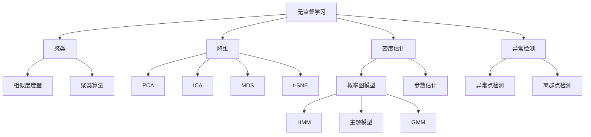

# 无监督学习(Unsupervised Learning) - 原理与代码实例讲解

## 1.背景介绍
无监督学习是机器学习的一个重要分支,与监督学习不同,无监督学习不需要标注数据,而是通过对数据内在结构和分布的学习,从而发现数据的隐藏模式。无监督学习在现实世界中有着广泛的应用,如客户细分、社交网络分析、基因数据分析等。本文将深入探讨无监督学习的原理,并通过代码实例讲解其具体实现。

### 1.1 无监督学习的定义与特点
无监督学习是一种机器学习范式,其目标是在没有标注信息的情况下,通过对数据的观察和分析,发现数据内在的结构和规律。与监督学习需要标注数据不同,无监督学习仅需要输入数据本身,无需人工标注。这使得无监督学习在许多领域具有广阔的应用前景。

无监督学习的主要特点包括:
- 不需要标注数据,降低了人工成本
- 可以发现数据内在的结构和模式
- 适用于探索性数据分析和知识发现
- 常用于数据预处理,如降维、特征提取等

### 1.2 无监督学习的主要任务
无监督学习主要包括以下几类任务:
- 聚类(Clustering):将相似的样本自动归类到一起,形成不同的簇。
- 降维(Dimensionality Reduction):在保留数据主要信息的前提下,将高维数据映射到低维空间。
- 密度估计(Density Estimation):估计数据的概率密度函数。
- 异常检测(Anomaly Detection):识别出数据中的异常点或离群点。

### 1.3 无监督学习的应用场景
无监督学习在许多领域都有着广泛应用,例如:
- 客户细分:根据客户的属性和行为,将其划分为不同的群体,制定针对性的营销策略。
- 社交网络分析:发现社交网络中的社区结构,分析用户之间的关系和互动模式。
- 基因数据分析:对基因表达数据进行聚类,发现功能相关的基因模块。
- 图像分割:将图像划分为不同的区域,如前景和背景。
- 文本主题发现:从大量文本数据中发现潜在的主题结构。

## 2.核心概念与联系
要深入理解无监督学习,需要掌握一些核心概念。本节将介绍无监督学习的关键概念,并阐述它们之间的联系。

### 2.1 相似度度量
在无监督学习中,衡量样本之间的相似程度是一个基本问题。常用的相似度度量包括:
- 欧氏距离(Euclidean Distance):两个样本之间的直线距离。
- 曼哈顿距离(Manhattan Distance):两个样本在各个维度上差值的绝对值之和。
- 余弦相似度(Cosine Similarity):两个向量夹角的余弦值。
- 皮尔逊相关系数(Pearson Correlation Coefficient):衡量两个变量之间线性关系的强度。

### 2.2 聚类算法
聚类是无监督学习的重要任务之一,常见的聚类算法包括:
- K-均值聚类(K-Means Clustering):通过迭代优化,将样本划分为K个簇。
- 层次聚类(Hierarchical Clustering):通过构建树状结构,实现样本的层次化聚类。
- 基于密度的聚类(Density-Based Clustering):根据样本的密度连通性,发现任意形状的簇。
- 谱聚类(Spectral Clustering):利用图论和谱图理论,实现聚类。

### 2.3 降维算法
降维是无监督学习的另一个重要任务,常用的降维算法包括:
- 主成分分析(PCA):通过线性变换,将数据投影到方差最大的几个正交方向上。
- 独立成分分析(ICA):寻找数据中统计独立的潜在因子。
- 多维缩放(MDS):保持样本之间的距离关系,将高维数据映射到低维空间。
- t-SNE:基于概率分布的相似度,实现数据的非线性降维。

### 2.4 概率图模型
概率图模型是一类重要的无监督学习模型,通过图结构表示变量之间的概率依赖关系。常见的概率图模型包括:
- 隐马尔可夫模型(HMM):用于建模时序数据,如语音识别、自然语言处理等。
- 主题模型(Topic Model):用于发现文本数据中的潜在主题,如LDA。
- 高斯混合模型(GMM):用于密度估计和聚类,假设数据由多个高斯分布混合而成。

下图展示了无监督学习的核心概念及其关系:



## 3.核心算法原理具体操作步骤
本节将详细介绍几种常用的无监督学习算法的原理和操作步骤。

### 3.1 K-均值聚类
K-均值聚类是一种基于中心的聚类算法,其目标是将样本划分为K个簇,使得簇内样本的相似度最大,簇间样本的相似度最小。其基本步骤如下:

1. 随机选择K个样本作为初始聚类中心。
2. 对每个样本,计算其与各个聚类中心的距离,并将其分配给距离最近的簇。
3. 对每个簇,重新计算其均值作为新的聚类中心。
4. 重复步骤2和3,直到聚类中心不再变化或达到最大迭代次数。

K-均值聚类的优点是简单高效,易于实现。但其缺点是需要预先指定簇的数量K,且对初始聚类中心敏感。

### 3.2 主成分分析(PCA)
主成分分析是一种常用的线性降维方法,其目标是在保留数据主要信息的同时,将高维数据映射到低维空间。其基本步骤如下:

1. 对数据进行中心化,即减去每个特征的均值。
2. 计算数据的协方差矩阵。
3. 对协方差矩阵进行特征值分解,得到特征值和特征向量。
4. 选择前k个最大特征值对应的特征向量,构成变换矩阵。
5. 将原始数据乘以变换矩阵,得到降维后的数据。

PCA的优点是简单有效,可以去除数据中的噪声和冗余信息。但其缺点是仅考虑线性关系,对非线性数据的降维效果有限。

### 3.3 t-SNE
t-SNE是一种非线性降维算法,特别适用于高维数据的可视化。其基本思想是在低维空间中保持样本之间的相对距离关系。其基本步骤如下:

1. 在高维空间中计算样本之间的成对相似度,得到相似度矩阵。
2. 根据相似度矩阵,构建样本在高维空间中的条件概率分布。
3. 在低维空间中随机初始化样本的坐标。
4. 根据低维坐标,计算样本在低维空间中的条件概率分布。
5. 通过最小化高维和低维条件概率分布之间的KL散度,不断更新低维坐标。
6. 重复步骤4和5,直到收敛或达到最大迭代次数。

t-SNE的优点是可以有效地保持样本的局部结构,适用于高维数据的可视化。但其缺点是计算复杂度高,对大规模数据的处理效率较低。

## 4.数学模型和公式详细讲解举例说明
无监督学习涉及一些重要的数学模型和公式,本节将通过具体例子对其进行详细讲解。

### 4.1 K-均值聚类的目标函数
K-均值聚类的目标是最小化簇内样本与聚类中心之间的距离平方和。其目标函数可以表示为:

$$J = \sum_{i=1}^{K}\sum_{x\in C_i} ||x - \mu_i||^2$$

其中,$K$是簇的数量,$C_i$表示第$i$个簇,$\mu_i$是第$i$个簇的中心,$x$是属于第$i$个簇的样本。

例如,假设有4个二维样本点$\{(1,1),(2,2),(4,4),(5,5)\}$,如果将其划分为2个簇,聚类中心分别为$(1.5,1.5)$和$(4.5,4.5)$,则目标函数值为:

$$J = (1-1.5)^2 + (1-1.5)^2 + (2-1.5)^2 + (2-1.5)^2 + (4-4.5)^2 + (4-4.5)^2 + (5-4.5)^2 + (5-4.5)^2 = 2$$

### 4.2 PCA的协方差矩阵
PCA的核心是对数据的协方差矩阵进行特征值分解。协方差矩阵$\Sigma$的元素$\sigma_{ij}$表示第$i$个特征和第$j$个特征之间的协方差,其计算公式为:

$$\sigma_{ij} = \frac{1}{n-1}\sum_{k=1}^{n}(x_{ki} - \bar{x}_i)(x_{kj} - \bar{x}_j)$$

其中,$n$是样本数量,$x_{ki}$表示第$k$个样本的第$i$个特征,$\bar{x}_i$是第$i$个特征的均值。

例如,假设有4个样本,每个样本有3个特征:

$$\begin{bmatrix}1 & 2 & 3\\4 & 5 & 6\\7 & 8 & 9\\10 & 11 & 12\end{bmatrix}$$

则协方差矩阵为:

$$\Sigma = \begin{bmatrix}9 & 9 & 9\\9 & 9 & 9\\9 & 9 & 9\end{bmatrix}$$

### 4.3 t-SNE的条件概率分布
t-SNE的核心是在高维和低维空间中构建条件概率分布,并最小化两个分布之间的KL散度。在高维空间中,样本$i$和$j$的条件概率$p_{j|i}$的计算公式为:

$$p_{j|i} = \frac{\exp(-||x_i - x_j||^2 / 2\sigma_i^2)}{\sum_{k\neq i}\exp(-||x_i - x_k||^2 / 2\sigma_i^2)}$$

其中,$\sigma_i$是样本$i$的高斯核宽度,通过二分搜索确定。

在低维空间中,样本$i$和$j$的条件概率$q_{j|i}$的计算公式为:

$$q_{j|i} = \frac{(1 + ||y_i - y_j||^2)^{-1}}{\sum_{k\neq i}(1 + ||y_i - y_k||^2)^{-1}}$$

其中,$y_i$和$y_j$是样本$i$和$j$在低维空间中的坐标。

例如,假设在高维空间中有3个样本$\{x_1,x_2,x_3\}$,在低维空间中的坐标为$\{y_1,y_2,y_3\}$,则样本1和2的条件概率分别为:

$$p_{2|1} = \frac{\exp(-||x_1 - x_2||^2 / 2\sigma_1^2)}{\exp(-||x_1 - x_2||^2 / 2\sigma_1^2) + \exp(-||x_1 - x_3||^2 / 2\sigma_1^2)}$$

$$q_{2|1} = \frac{(1 + ||y_1 - y_2||^2)^{-1}}{(1 + ||y_1 - y_2||^2)^{-1} + (1 + ||y_1 - y_3||^2)^{-1}}$$

## 5.项目实践:代码实例和详细解释说明
本节将通过Python代码实例,演示几种常用无监督学习算法的具体实现。

### 5.1 K-均值聚类
```python
from sklearn.cluster import KMeans
from sklearn.datasets import make_blobs

# 生成