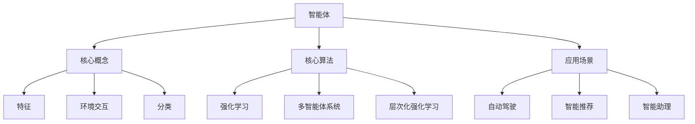

# 智能体 (Agent)

## 1. 背景介绍
### 1.1 人工智能的发展历程
#### 1.1.1 早期人工智能
#### 1.1.2 专家系统时代  
#### 1.1.3 机器学习时代
### 1.2 智能体的起源与定义
#### 1.2.1 智能体的起源
#### 1.2.2 智能体的定义
### 1.3 智能体在人工智能中的地位
#### 1.3.1 智能体是人工智能的核心概念
#### 1.3.2 智能体推动人工智能的发展

## 2. 核心概念与联系
### 2.1 智能体的特征
#### 2.1.1 自主性
#### 2.1.2 社会性
#### 2.1.3 反应性
#### 2.1.4 主动性
### 2.2 智能体与环境的交互
#### 2.2.1 感知
#### 2.2.2 行动
#### 2.2.3 学习与适应
### 2.3 智能体的分类
#### 2.3.1 反应型智能体
#### 2.3.2 认知型智能体
#### 2.3.3 目标型智能体
#### 2.3.4 效用型智能体

## 3. 核心算法原理具体操作步骤
### 3.1 强化学习
#### 3.1.1 马尔可夫决策过程
#### 3.1.2 Q-learning算法
#### 3.1.3 策略梯度算法
### 3.2 多智能体系统
#### 3.2.1 博弈论基础
#### 3.2.2 合作博弈
#### 3.2.3 竞争博弈
### 3.3 层次化强化学习
#### 3.3.1 选项框架
#### 3.3.2 feudal网络
#### 3.3.3 max-Q算法

## 4. 数学模型和公式详细讲解举例说明 
### 4.1 马尔可夫决策过程
#### 4.1.1 状态转移概率
#### 4.1.2 奖励函数
#### 4.1.3 贝尔曼方程
### 4.2 Q-learning算法
#### 4.2.1 Q值更新公式
#### 4.2.2 探索与利用
#### 4.2.3 收敛性证明
### 4.3 策略梯度算法
#### 4.3.1 策略参数化
#### 4.3.2 目标函数与梯度估计
#### 4.3.3 REINFORCE算法

## 5. 项目实践：代码实例和详细解释说明
### 5.1 OpenAI Gym环境
#### 5.1.1 安装与配置
#### 5.1.2 环境接口介绍
#### 5.1.3 经典控制问题
### 5.2 DQN算法实现
#### 5.2.1 神经网络设计
#### 5.2.2 经验回放
#### 5.2.3 目标网络
### 5.3 PPO算法实现 
#### 5.3.1 Actor-Critic框架
#### 5.3.2 重要性采样
#### 5.3.3 近端策略优化

## 6. 实际应用场景
### 6.1 自动驾驶
#### 6.1.1 感知与决策
#### 6.1.2 路径规划
#### 6.1.3 多车协同
### 6.2 智能推荐系统
#### 6.2.1 用户建模
#### 6.2.2 在线学习
#### 6.2.3 探索与利用
### 6.3 智能助理
#### 6.3.1 自然语言理解
#### 6.3.2 任务规划
#### 6.3.3 知识图谱推理

## 7. 工具和资源推荐
### 7.1 开发框架
#### 7.1.1 TensorFlow
#### 7.1.2 PyTorch
#### 7.1.3 Keras
### 7.2 开源项目
#### 7.2.1 OpenAI Baselines
#### 7.2.2 Stable Baselines
#### 7.2.3 RLlib
### 7.3 学习资源
#### 7.3.1 Sutton & Barto《强化学习》
#### 7.3.2 David Silver强化学习课程
#### 7.3.3 OpenAI Spinning Up

## 8. 总结：未来发展趋势与挑战
### 8.1 智能体的发展趋势
#### 8.1.1 多智能体协作
#### 8.1.2 人机混合增强智能
#### 8.1.3 可解释性与安全性
### 8.2 面临的挑战
#### 8.2.1 样本效率
#### 8.2.2 泛化能力
#### 8.2.3 奖励设计
### 8.3 未来展望
#### 8.3.1 通用人工智能
#### 8.3.2 智能体的应用前景
#### 8.3.3 人工智能的社会影响

## 9. 附录：常见问题与解答
### 9.1 如何选择合适的智能体算法？
### 9.2 如何设计智能体的状态表示和行动空间？
### 9.3 如何处理非平稳环境下的智能体学习？
### 9.4 如何评估智能体的性能表现？
### 9.5 如何实现智能体的迁移学习和终身学习？

智能体(Agent)是人工智能领域的核心概念之一，它指的是能够感知环境、做出决策并采取行动的自主实体。随着人工智能技术的不断发展，智能体已经成为了推动人工智能走向通用智能的关键力量。

智能体具有自主性、社会性、反应性和主动性等特征。自主性是指智能体能够独立地感知环境、推理决策和执行行动，而不需要人类的直接控制。社会性是指智能体能够与环境中的其他智能体进行交互和协作，以实现共同的目标。反应性是指智能体能够及时地对环境变化做出反应，调整自身的行为。主动性是指智能体能够主动地探索环境，寻找机会，优化自身的决策和行动。

智能体与环境的交互主要包括三个方面：感知、行动和学习。通过传感器，智能体能够获取环境的状态信息；通过执行器，智能体能够对环境施加影响；通过学习算法，智能体能够不断地优化自身的决策策略，适应环境的变化。

根据智能体的决策机制和行为特征，可以将其分为反应型、认知型、目标型和效用型等不同类型。反应型智能体直接将感知到的环境状态映射为行动，其决策过程简单快速。认知型智能体具有内部状态表示，能够根据历史经验和当前观测进行推理和规划。目标型智能体会追求特定的目标状态，并不断优化行动序列以达成目标。效用型智能体会评估每个行动的效用值，选择能够最大化长期累积奖励的行动策略。

强化学习是智能体的核心算法之一，它通过智能体与环境的交互，以试错的方式学习最优的行动策略。马尔可夫决策过程(MDP)为强化学习提供了理论基础，其中状态转移概率$P(s'|s,a)$刻画了在状态$s$下采取行动$a$后转移到状态$s'$的概率，奖励函数$R(s,a)$定义了在状态$s$下采取行动$a$后获得的即时奖励。智能体的目标是最大化长期累积奖励$G_t=\sum_{k=0}^{\infty}\gamma^k R_{t+k+1}$，其中$\gamma$为折扣因子。

Q-learning是一种经典的值迭代型强化学习算法，它通过不断更新状态-行动值函数$Q(s,a)$来逼近最优策略。Q值更新公式为：

$$Q(s,a) \leftarrow Q(s,a) + \alpha [R(s,a) + \gamma \max_{a'}Q(s',a') - Q(s,a)]$$

其中$\alpha$为学习率。Q-learning算法具有收敛性保证，在一定条件下能够收敛到最优策略。

策略梯度算法是另一类重要的强化学习算法，它直接对策略函数$\pi_{\theta}(a|s)$的参数$\theta$进行优化。策略梯度定理给出了目标函数$J(\theta)$对策略参数$\theta$的梯度：

$$\nabla_{\theta}J(\theta) = \mathbb{E}_{\pi_{\theta}}[\nabla_{\theta}\log\pi_{\theta}(a|s)Q^{\pi_{\theta}}(s,a)]$$

其中$Q^{\pi_{\theta}}(s,a)$为状态-行动值函数。REINFORCE算法通过蒙特卡洛方法对梯度进行无偏估计，然后利用随机梯度上升法对策略参数进行更新。

在实际应用中，智能体技术已经广泛应用于自动驾驶、智能推荐、智能助理等领域。以自动驾驶为例，智能体需要通过传感器感知道路环境，根据路况和交通规则做出实时决策，控制车辆的运动。其中涉及感知、决策、规划、控制等多个模块，需要综合运用计算机视觉、机器学习、控制理论等技术。

智能体的未来发展趋势包括多智能体协作、人机混合增强智能、可解释性与安全性等方面。多智能体系统能够实现大规模的分布式智能，通过智能体之间的协作与竞争，解决复杂的现实世界问题。人机混合增强智能旨在将人类智能和机器智能进行有机结合，发挥各自的优势，实现人机协同。可解释性是指让智能体的决策过程对人类而言是透明和可理解的，有助于提升人们对智能系统的信任度。安全性则要求智能体在学习和执行的过程中遵循一定的行为准则，避免产生危害。

智能体技术的发展也面临着诸多挑战，如样本效率问题、泛化能力问题、奖励设计问题等。样本效率是指智能体在有限的交互数据中进行有效学习的能力，这对于实际应用至关重要。泛化能力是指智能体在面对新的环境和任务时的适应能力，需要具备一定的迁移学习和终身学习能力。奖励设计问题则涉及如何合理地设置奖励函数，引导智能体学习到期望的行为策略，这往往需要领域专家的参与。

总的来说，智能体作为人工智能的核心概念和关键技术，在推动人工智能的发展和应用中扮演着至关重要的角色。未来，智能体技术的不断进步将为实现通用人工智能、构建智能社会提供重要支撑，同时也对人类社会的发展产生深远影响。我们需要审慎地发展智能体技术，让其更好地服务于人类社会的进步。

作者：禅与计算机程序设计艺术 / Zen and the Art of Computer Programming