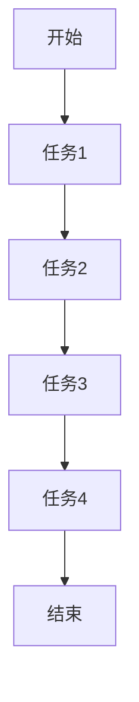
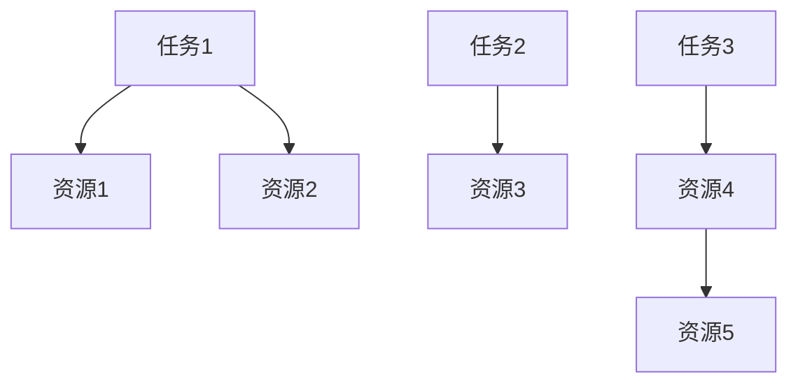
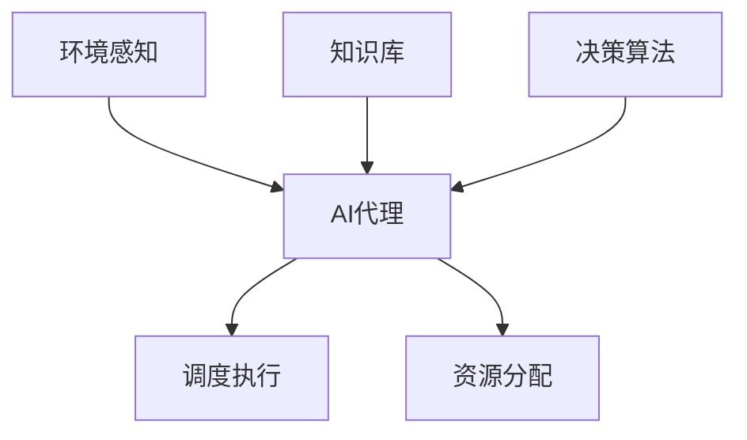
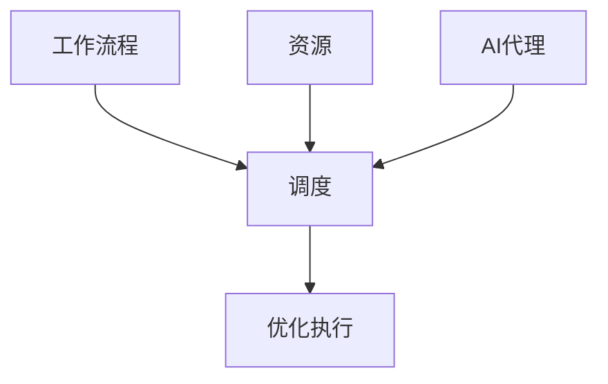
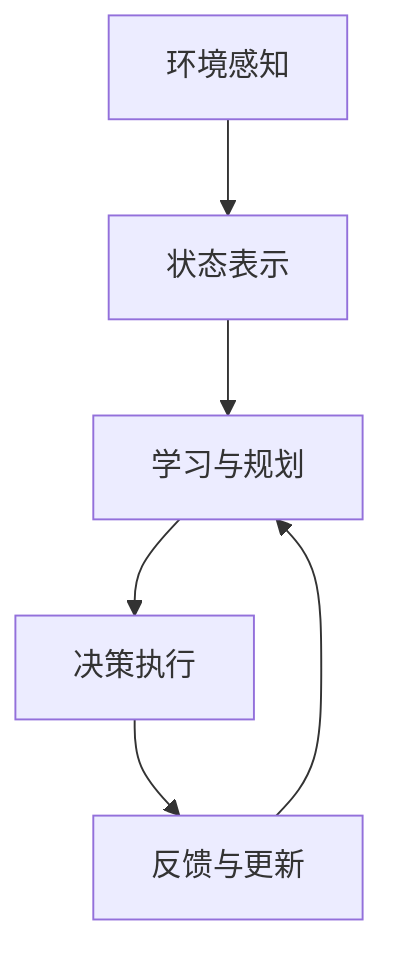

# 智能调度与资源分配：AI代理的工作流优化

## 1.背景介绍

在当今快节奏的商业环境中,高效的资源分配和工作流程优化对于企业的成功至关重要。传统的调度和资源分配方法往往依赖于人工决策,这种方式不仅效率低下,而且容易出现错误和偏差。随着人工智能(AI)技术的不断发展,智能调度和资源分配系统应运而生,为企业带来了前所未有的效率和优化潜力。

本文将探讨如何利用AI代理来优化工作流程,实现智能调度和资源分配。我们将深入了解AI代理在这一领域的应用原理、算法和实现方式,并探讨其在实际场景中的应用。无论您是技术从业者还是决策者,本文都将为您提供宝贵的见解和实用的指导。

### 1.1 传统调度与资源分配的挑战

传统的调度和资源分配方法面临着诸多挑战:

- **复杂性**:现代企业的工作流程和资源需求通常是高度复杂和动态的,人工决策很难做到最优化。
- **实时性**:随着业务环境的不断变化,调度和资源分配需要实时响应,人工决策往往滞后于实际需求。
- **可扩展性**:随着企业规模的扩大,人工决策的效率和准确性将受到严重影响。
- **偏差和错误**:人工决策容易受到主观因素的影响,导致偏差和错误。

### 1.2 AI代理在智能调度和资源分配中的作用

AI代理可以通过机器学习、优化算法和自适应决策等技术,有效解决传统方法面临的挑战。AI代理具有以下优势:

- **高效处理复杂数据**:AI代理能够快速处理大量复杂的数据,并从中发现隐藏的模式和规律。
- **实时优化决策**:AI代理可以实时监控环境变化,并动态调整调度和资源分配策略。
- **可扩展性强**:AI代理的决策能力不受规模限制,可以轻松应对大规模复杂场景。
- **无偏差和高准确性**:AI代理的决策基于数据和算法,减少了人为偏差和错误。

通过将AI代理应用于智能调度和资源分配,企业可以显著提高效率、降低成本,并获得竞争优势。

## 2.核心概念与联系

在探讨智能调度和资源分配的具体实现之前,我们需要了解一些核心概念及其之间的联系。

### 2.1 工作流程 (Workflow)

工作流程是指为完成特定任务而设计的一系列相互关联的活动或步骤。它定义了任务的执行顺序、参与者、数据流和决策点等。工作流程是智能调度和资源分配的基础,需要对其进行优化以提高效率。

### 2.2 资源 (Resource)

资源是指完成工作流程所需的各种资产,包括人力资源、设备、原材料等。合理分配和利用资源对于提高工作效率至关重要。资源通常具有可用性、成本和优先级等属性,需要在调度过程中加以考虑。

### 2.3 调度 (Scheduling)

调度是指将工作流程中的任务分配给合适的资源,并确定执行顺序和时间的过程。调度需要考虑多种约束条件,如资源可用性、优先级、依赖关系等,以实现工作流程的高效执行。

### 2.4 AI代理 (AI Agent)

AI代理是一种具有自主性、响应性和主动性的软件实体,能够感知环境、处理信息、做出决策并采取行动。在智能调度和资源分配中,AI代理可以根据工作流程、资源状态和约束条件,自主地进行优化决策和执行。

### 2.5 核心概念之间的关系

工作流程定义了需要完成的任务序列,资源提供了执行任务所需的各种资产,调度则将任务分配给合适的资源。AI代理通过感知环境、处理信息和应用决策算法,自主地进行智能调度和资源分配,以优化工作流程的执行效率。

通过对这些核心概念及其关系的理解,我们可以更好地把握智能调度和资源分配的本质,为后续的算法和实现奠定基础。

## 3.核心算法原理具体操作步骤

智能调度和资源分配涉及多种算法和技术,包括机器学习、优化算法、决策理论等。本节将重点介绍一些核心算法的原理和具体操作步骤。

### 3.1 机器学习在智能调度中的应用

机器学习算法可以从历史数据中学习工作流程模式、资源利用情况和约束条件,从而预测未来的需求并优化调度决策。常用的机器学习算法包括:

#### 3.1.1 监督学习

监督学习算法利用标记的训练数据,学习将输入数据(如工作流程、资源状态等)映射到期望输出(如最优调度方案)。常用算法包括:

- **决策树 (Decision Tree)**:通过构建决策树模型,根据特征值递归地将实例划分到不同的叶节点,每个叶节点对应一个调度决策。
- **支持向量机 (Support Vector Machine, SVM)**:将调度问题转化为高维空间中的分类问题,通过构建最大间隔超平面来进行分类。
- **神经网络 (Neural Network)**:利用多层神经元网络模拟人脑的工作原理,通过训练学习复杂的映射关系。

#### 3.1.2 无监督学习

无监督学习算法直接从未标记的数据中发现隐藏的模式和结构,用于识别工作流程的聚类和异常检测等。常用算法包括:

- **K-均值聚类 (K-Means Clustering)**:将数据划分为K个聚类,使得同一聚类内的数据相似度高,不同聚类之间的相似度低。
- **层次聚类 (Hierarchical Clustering)**:通过递归地将数据划分为更小的聚类,构建层次化的聚类树状结构。
- **关联规则挖掘 (Association Rule Mining)**:发现数据集中频繁出现的项集模式,用于识别工作流程中的相关性和依赖关系。

#### 3.1.3 强化学习

强化学习算法通过与环境的交互,学习一种策略,使得在给定状态下采取的行动能够最大化预期回报。在智能调度中,可以将调度过程建模为马尔可夫决策过程 (Markov Decision Process, MDP),利用强化学习算法自动学习最优调度策略。常用算法包括:

- **Q-Learning**:一种基于价值函数的强化学习算法,通过不断更新状态-行为对的价值函数,逐步学习最优策略。
- **策略梯度 (Policy Gradient)**:直接对策略函数进行参数化,通过梯度上升的方式优化策略参数,使得预期回报最大化。
- **深度强化学习 (Deep Reinforcement Learning)**:将深度神经网络与强化学习相结合,用于处理高维、复杂的状态和行为空间。

### 3.2 优化算法在资源分配中的应用

资源分配问题通常可以建模为约束优化问题,目标是在满足各种约束条件的前提下,最大化或最小化某个目标函数(如成本、时间等)。常用的优化算法包括:

#### 3.2.1 整数规划 (Integer Programming)

整数规划是一种求解离散优化问题的有效方法,适用于资源分配等需要整数解的场景。常用算法包括:

- **整数线性规划 (Integer Linear Programming, ILP)**:目标函数和约束条件都是线性的,可以使用简单分支定界法或切割平面法求解。
- **整数非线性规划 (Integer Non-linear Programming, INLP)**:目标函数或约束条件存在非线性项,需要使用更复杂的算法如分支界限法、外点法等。

#### 3.2.2 启发式算法

对于大规模的NP难问题,精确求解算法的计算复杂度往往过高。启发式算法通过牺牲一定的精确性,以较低的计算代价获得近似最优解。常用算法包括:

- **遗传算法 (Genetic Algorithm, GA)**:模拟生物进化过程,通过选择、交叉和变异等操作,逐代优化种群中的个体,最终获得较优解。
- **模拟退火 (Simulated Annealing, SA)**:模拟固体退火过程,通过随机扰动和概率接受策略,逐步逼近全局最优解。
- **蚁群算法 (Ant Colony Optimization, ACO)**:模拟蚂蚁觅食行为,通过信息素的正反馈机制,逐步找到最优路径。

#### 3.2.3 约束编程 (Constraint Programming)

约束编程是一种基于约束的知识表示和推理范式,通过在变量域上传播约束,剪枝搜索空间,从而高效求解约束满足问题。在资源分配中,可以将各种约束条件建模为约束,利用约束求解器进行求解。

### 3.3 AI代理决策框架

智能调度和资源分配的核心是AI代理的决策框架,它将感知、学习、规划和执行等功能有机结合,形成一个闭环的自主决策系统。典型的AI代理决策框架包括以下步骤:

1. **环境感知**:AI代理通过各种传感器收集工作流程、资源状态等环境信息。
2. **状态表示**:将收集到的原始数据转换为内部状态表示,作为决策的输入。
3. **学习与规划**:基于当前状态和历史经验,利用机器学习算法或优化算法,生成调度和资源分配的决策方案。
4. **决策执行**:将生成的决策方案转化为具体的调度指令和资源分配指令,并执行相应的操作。
5. **反馈与更新**:监测决策执行的效果,并将反馈信息用于更新知识库和优化决策模型。

通过不断的学习、规划、执行和反馈,AI代理可以逐步优化其决策策略,实现智能调度和资源分配的自适应优化。

## 4.数学模型和公式详细讲解举例说明

智能调度和资源分配问题通常可以建模为优化问题,需要使用数学模型和公式进行形式化描述和求解。本节将详细讲解一些常见的数学模型和公式,并给出具体的例子和说明。

### 4.1 工作流程建模

工作流程可以用有向无环图 (Directed Acyclic Graph, DAG) 进行建模,其中节点表示任务,边表示任务之间的依赖关系。

设有 $n$ 个任务 $T = \{t_1, t_2, \dots, t_n\}$,任务之间的依赖关系用有向边 $E$ 表示。对于任意两个任务 $t_i$ 和 $t_j$,如果存在一条从 $t_i$ 到 $t_j$ 的有向路径,则说明 $t_j$ 依赖于 $t_i$,需要先执行 $t_i$ 才能执行 $t_j$。

我们可以定义一个 $n \times n$ 的邻接矩阵 $