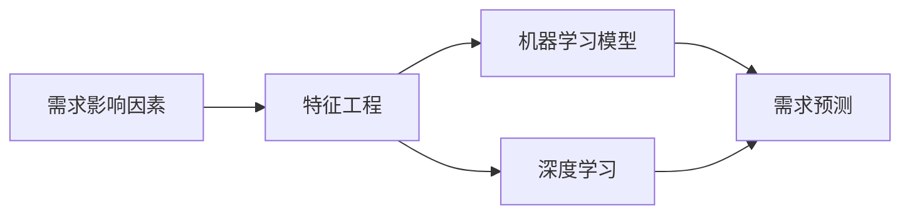

# 智能需求预测:提升需求预测的准确性

## 1.背景介绍

随着大数据、人工智能等技术的快速发展,企业正面临着前所未有的机遇和挑战。在供应链管理中,需求预测是一个关键环节,直接影响企业的库存管理、生产计划、销售策略等各个方面。传统的需求预测方法,如时间序列分析、回归分析等,已经难以满足日益复杂多变的市场需求。因此,如何利用先进的人工智能技术来提升需求预测的准确性,成为当前企业亟需解决的问题。

本文将深入探讨智能需求预测的核心概念、关键技术、实践案例以及未来发展趋势,为企业提供一份全面、实用的智能需求预测指南。

### 1.1 需求预测的重要性

需求预测是供应链管理的基础,其准确性直接影响企业的各项决策。准确的需求预测可以帮助企业:

- 优化库存管理,减少库存积压和缺货风险
- 制定合理的生产计划,提高生产效率,降低成本 
- 制定有效的销售和营销策略,提升客户满意度
- 提高整体运营效率,增强企业竞争力

### 1.2 传统需求预测方法的局限性

传统的需求预测方法主要包括:

- 时间序列分析:基于历史数据,预测未来一段时间内的需求趋势
- 回归分析:通过建立自变量和因变量之间的数学模型,预测需求
- 定性分析:通过专家经验、市场调研等方式,对需求进行主观判断

这些方法在一定程度上可以预测需求,但也存在一些局限性:

- 难以应对复杂多变的市场环境和消费者行为
- 缺乏对影响需求的关键因素的深入分析和建模
- 预测精度和效率有待提高

### 1.3 智能需求预测的优势

智能需求预测利用人工智能技术,如机器学习、深度学习等,可以克服传统方法的局限性,具有以下优势:

- 能够处理海量、高维、非线性的数据,捕捉需求的复杂模式
- 通过深度学习自动提取影响需求的关键特征,无需人工设计特征
- 实时更新模型,适应市场变化,提供动态预测
- 预测精度高,可显著降低预测误差,为决策提供可靠依据

## 2.核心概念与联系

智能需求预测涉及多个核心概念,它们之间相互关联、相互影响。深入理解这些概念及其联系,是掌握智能需求预测的基础。

### 2.1 需求影响因素

影响需求的因素错综复杂,主要包括:

- 内部因素:历史销售数据、价格、促销等
- 外部因素:经济环境、竞争对手、节假日等
- 用户因素:人口统计属性、购买行为、偏好等

智能需求预测需要全面考虑各类影响因素,构建多维度的特征空间。

### 2.2 特征工程

特征工程是将原始数据转化为模型特征的过程,是智能需求预测的关键步骤。主要任务包括:

- 特征提取:从原始数据中提取有效特征
- 特征选择:选择影响需求的关键特征子集
- 特征表示:将特征转化为适合模型学习的形式

深度学习可以自动学习特征表示,减少人工特征工程的工作量。

### 2.3 机器学习模型

机器学习是智能需求预测的核心,通过学习历史数据,构建需求预测模型。常用的模型包括:

- 线性回归:适用于线性关系的需求预测
- 决策树:可解释性强,适合分段预测需求
- 支持向量机:适合小样本、非线性的需求预测
- 神经网络:强大的非线性拟合能力,适合复杂需求预测

不同模型有各自的适用场景,需根据实际问题选择合适的模型。

### 2.4 深度学习

深度学习是机器学习的一个分支,通过多层神经网络学习数据的层次特征表示。常用的深度学习模型包括:

- 多层感知机(MLP):可以拟合任意非线性函数,适合复杂需求预测
- 卷积神经网络(CNN):善于提取局部特征,适合图像、时空数据
- 循环神经网络(RNN):适合处理时序数据,如销售时间序列

深度学习可显著提高需求预测的精度,是智能需求预测的重要技术手段。

### 2.5 概念联系

智能需求预测的核心概念之间紧密联系,形成一个有机的整体:

需求影响因素通过特征工程转化为模型特征,再由机器学习或深度学习模型学习特征与需求之间的关系,最终实现智能的需求预测。

## 3.核心算法原理具体操作步骤

智能需求预测的核心是机器学习算法,下面以一个典型的机器学习需求预测流程为例,介绍其主要操作步骤。

### 3.1 数据准备

- 收集历史销售数据、价格、促销、节假日等内外部数据
- 数据清洗,处理缺失值、异常值、不一致等质量问题 
- 数据集成,将多源异构数据整合到一个统一的数据集中

### 3.2 特征工程  

- 时间特征:提取年、月、日、周等时间特征
- 历史特征:滑动窗口提取历史N天的销量、价格等
- 统计特征:销量均值、方差、最大值、最小值等
- 交叉特征:各特征的交叉组合,如节假日&促销
- 嵌入特征:使用深度学习提取抽象的隐层特征

### 3.3 数据集划分

- 划分训练集、验证集、测试集,比例一般为6:2:2
- 注意数据集的时间顺序,避免数据泄露
- 交叉验证,如K折交叉验证,提高模型评估的可靠性

### 3.4 模型训练

- 选择合适的机器学习或深度学习模型,如MLP、CNN等
- 定义损失函数,如均方误差(MSE)、平均绝对误差(MAE)
- 选择优化算法,如随机梯度下降(SGD)、Adam等
- 设置超参数,如学习率、正则化系数、迭代次数等
- 在训练集上训练模型,并在验证集上评估模型性能

### 3.5 模型评估

- 在测试集上评估模型的预测性能,如MSE、MAE、MAPE等
- 分析模型的泛化能力和稳定性
- 对比不同模型的性能,选择最优模型
- 绘制学习曲线、特征重要性等,分析模型行为

### 3.6 模型应用

- 使用训练好的模型对未来一段时间的需求进行预测
- 将预测结果应用于库存管理、生产计划、销售策略等环节
- 持续监控模型性能,定期更新和优化模型

以上是智能需求预测的典型流程,在实践中还需根据具体问题进行适当调整和优化。

## 4.数学模型和公式详细讲解举例说明

智能需求预测涉及多个数学模型和公式,下面以几个典型的模型为例进行详细讲解。

### 4.1 线性回归

线性回归是一种简单但实用的机器学习模型,适用于需求与特征之间存在线性关系的情况。其数学模型为:

$$y = w^Tx + b$$

其中,$y$为需求预测值,$x$为特征向量,$w$为权重向量,$b$为偏置项。

线性回归的目标是找到最优的权重向量$w$和偏置项$b$,使得预测值$y$与真实需求值$y'$之间的误差最小。常用的损失函数是均方误差(MSE):

$$MSE = \frac{1}{n}\sum_{i=1}^n(y_i - y'_i)^2$$

其中,$n$为样本数量,$y_i$为第$i$个样本的预测值,$y'_i$为第$i$个样本的真实值。

求解线性回归模型的最优参数,可以使用梯度下降法,对损失函数求梯度,并沿梯度反方向更新参数:

$$w := w - \alpha\frac{\partial MSE}{\partial w}$$
$$b := b - \alpha\frac{\partial MSE}{\partial b}$$

其中,$\alpha$为学习率,控制每次更新的步长。

举例说明:假设我们要预测某商品未来一周的日销量,已知影响日销量的因素有:历史销量、价格、是否周末。我们可以构建如下线性回归模型:

$$sales = w_1 * history\_sales + w_2 * price + w_3 * is\_weekend + b$$

通过训练数据学习模型参数$w_1,w_2,w_3,b$,然后用学习到的模型对未来一周的日销量进行预测。

### 4.2 多层感知机(MLP)

多层感知机(MLP)是一种前馈神经网络,可以拟合任意非线性函数,是深度学习需求预测的常用模型。MLP由输入层、隐藏层和输出层组成,每层由多个神经元构成,相邻层之间全连接。

假设MLP有$L$层,第$l$层有$n_l$个神经元,第$l$层第$i$个神经元的输出为$a_i^l$,则MLP的前向传播过程为:

$$z_i^l = \sum_{j=1}^{n_{l-1}}w_{ij}^la_j^{l-1} + b_i^l$$
$$a_i^l = f(z_i^l)$$

其中,$w_{ij}^l$为第$l-1$层第$j$个神经元到第$l$层第$i$个神经元的连接权重,$b_i^l$为第$l$层第$i$个神经元的偏置项,$f$为激活函数,如sigmoid、tanh、ReLU等。

MLP的训练过程通过反向传播算法实现,首先计算损失函数(如MSE)对输出层神经元的梯度,然后逐层向前传播梯度,并更新各层参数:

$$\delta_i^L = \frac{\partial MSE}{\partial a_i^L}f'(z_i^L)$$
$$\delta_i^l = (\sum_{j=1}^{n_{l+1}}w_{ji}^{l+1}\delta_j^{l+1})f'(z_i^l)$$
$$\frac{\partial MSE}{\partial w_{ij}^l} = a_j^{l-1}\delta_i^l$$
$$\frac{\partial MSE}{\partial b_i^l} = \delta_i^l$$

举例说明:假设我们要预测某商品未来一个月的日销量,已知影响因素包括:历史销量、价格、天气、节假日等。我们可以构建一个MLP模型,输入层为各影响因素,隐藏层可以设置为2层,每层100个神经元,输出层为未来30天的日销量预测值。通过训练数据学习MLP的各层参数,然后用训练好的模型对未来30天的日销量进行预测。

### 4.3 长短期记忆网络(LSTM)

长短期记忆网络(LSTM)是一种特殊的循环神经网络(RNN),适合处理时序数据,在需求预测领域有广泛应用。LSTM通过引入门控机制,克服了传统RNN的梯度消失问题,能够学习长期依赖关系。

LSTM的核心是记忆单元,每个记忆单元包含一个细胞状态$c_t$和三个门:输入门$i_t$、遗忘门$f_t$、输出门$o_t$。LSTM的前向传播过程为:

$$f_t = \sigma(W_f\cdot[h_{t-1},x_t] + b_f)$$
$$i_t = \sigma(W_i\cdot[h_{t-1},x_t] + b_i)$$ 
$$\tilde{C}_t = tanh(W_C\cdot[h_{t-1},x_t] + b_C)$$
$$C_t = f_t * C_{t-1} + i_t * \tilde{C}_t$$
$$o_t = \sigma(W_o\cdot[h_{t-1},x_t] + b_o)$$
$$h_t = o_t * tanh(C_t)$$

其中