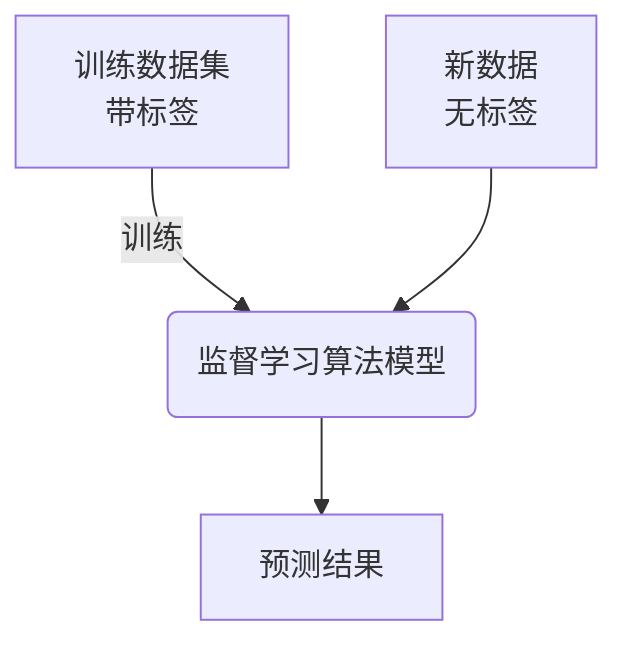
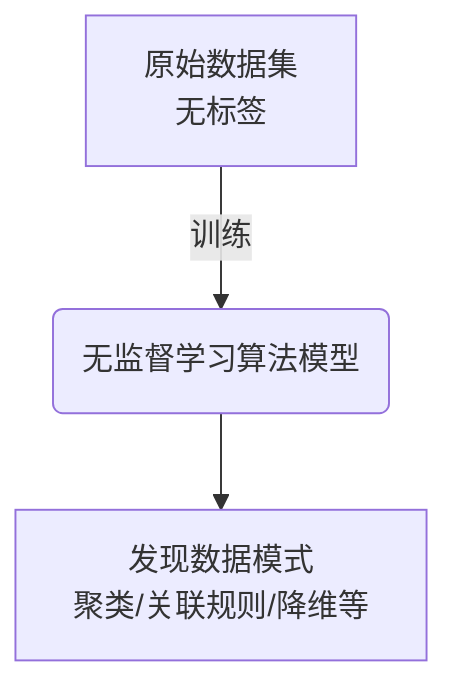
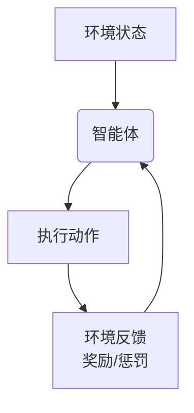

# 机器学习(Machine Learning)原理与代码实战案例讲解

## 1. 背景介绍

在当今的数字时代,数据无处不在。从社交媒体平台到电子商务网站,再到物联网设备,海量的数据不断被产生和收集。然而,这些原始数据本身并没有太多价值,关键在于如何从中发现隐藏的模式和洞见,进而推动业务决策和创新。这就是机器学习(Machine Learning)大显身手的时候。

机器学习是人工智能(Artificial Intelligence)的一个分支,它赋予计算机从数据中自主学习和改进的能力,而无需显式编程。通过构建算法模型并使用训练数据集,机器学习系统可以学习数据中的模式,并对新数据做出预测或决策。

从语音识别和计算机视觉,到推荐系统和自然语言处理,机器学习已广泛应用于各个领域,为我们的生活带来了前所未有的智能体验。随着数据量的不断增长和算力的提升,机器学习的潜力还有待进一步挖掘。

## 2. 核心概念与联系

机器学习涉及多个关键概念,理解它们及其相互联系对于掌握这一领域至关重要。

### 2.1 监督学习(Supervised Learning)

监督学习是最常见的机器学习任务之一。在这种情况下,算法会使用带有正确答案的标记数据进行训练。目标是从训练数据中学习一个函数,该函数可以对新的未标记数据做出准确的预测。

常见的监督学习任务包括:

- 分类(Classification):根据输入特征将数据实例划分到预定义的类别中,如垃圾邮件检测、图像分类等。
- 回归(Regression):预测连续值的输出,如房价预测、销量预测等。

一些典型的监督学习算法有:线性回归、逻辑回归、决策树、支持向量机(SVM)、神经网络等。

### 2.2 无监督学习(Unsupervised Learning)

与监督学习不同,无监督学习使用未标记的数据进行训练。算法需要自主发现数据中的内在结构和模式,而无需任何人工标注的目标值。

常见的无监督学习任务包括:

- 聚类(Clustering):根据数据的相似性将其分组到不同的簇中,如客户细分、基因序列聚类等。
- 关联规则挖掘(Association Rule Mining):发现数据集中频繁出现的项集模式,如购物篮分析。
- 降维(Dimensionality Reduction):将高维数据映射到低维空间,以提高可解释性和降低计算复杂度。

常用的无监督学习算法有:K-Means聚类、层次聚类、主成分分析(PCA)、关联规则挖掘算法等。

### 2.3 强化学习(Reinforcement Learning)

强化学习是一种基于环境交互的学习范式。智能体(Agent)通过观察环境状态并执行动作,获得相应的奖励或惩罚信号。目标是最大化长期累积奖励,从而学习到最优策略。

强化学习广泛应用于:

- 机器人控制
- 游戏AI
- 自动驾驶
- 资源调度优化

常用的强化学习算法包括:Q-Learning、深度Q网络(DQN)、策略梯度等。

### 2.4 深度学习(Deep Learning)

深度学习是机器学习的一个子领域,它利用深层神经网络模型来学习数据特征。这些模型通过多层非线性变换,可以自动从原始数据中提取高级特征,从而解决复杂的任务。

深度学习模型包括:

- 卷积神经网络(CNN):在计算机视觉和图像处理任务中表现出色。
- 循环神经网络(RNN):擅长处理序列数据,如自然语言处理和时间序列预测。
- 生成对抗网络(GAN):可用于生成式建模,如图像生成和语音合成。

深度学习已成为机器学习的主流方向,并在多个领域取得了突破性进展。

## 3. 核心算法原理具体操作步骤

机器学习算法的核心思想是从数据中学习,并基于所学习的模式对新数据做出预测或决策。虽然不同算法的细节有所差异,但它们通常遵循以下基本步骤:

1. **数据收集和预处理**
   - 收集相关的数据集,可能来自各种来源,如数据库、文件、传感器等。
   - 对原始数据进行清洗和转换,处理缺失值、异常值和噪声。
   - 进行特征工程,从原始数据中提取有意义的特征。

2. **数据集划分**
   - 将整个数据集划分为训练集、验证集和测试集。
   - 训练集用于训练模型,验证集用于调整模型超参数,测试集用于评估最终模型性能。

3. **选择模型和训练算法**
   - 根据问题类型(分类、回归等)和数据特征选择合适的机器学习算法,如决策树、支持向量机或神经网络。
   - 选择合适的损失函数和优化算法,如梯度下降、随机梯度下降等。

4. **模型训练**
   - 使用训练数据集训练模型,通过优化算法调整模型参数,使损失函数最小化。
   - 在验证集上评估模型性能,并根据需要调整超参数。

5. **模型评估**
   - 使用测试数据集评估最终模型的性能,计算相关指标,如准确率、精确率、召回率等。
   - 分析模型的优缺点,并根据需要进行改进或重新训练。

6. **模型部署**
   - 将训练好的模型集成到实际应用系统中,用于进行预测或决策。
   - 根据新数据的反馈,定期重新训练或微调模型。

需要注意的是,上述步骤可能会根据具体算法和任务而有所调整。此外,在实际应用中,还需要考虑数据隐私、模型解释性、公平性等重要问题。

## 4. 数学模型和公式详细讲解举例说明

机器学习算法通常基于数学模型和公式来描述和优化目标函数。以下是一些常见的数学模型和公式,以及它们在机器学习中的应用。

### 4.1 线性回归

线性回归是一种广泛使用的监督学习算法,用于预测连续值的输出。它假设目标值 $y$ 和特征向量 $\boldsymbol{x}$ 之间存在线性关系:

$$y = \boldsymbol{w}^T\boldsymbol{x} + b$$

其中 $\boldsymbol{w}$ 是权重向量, $b$ 是偏置项。训练过程的目标是找到最佳的 $\boldsymbol{w}$ 和 $b$,使得预测值 $\hat{y}$ 与实际值 $y$ 之间的差异最小化。常用的损失函数是平方误差:

$$J(\boldsymbol{w}, b) = \frac{1}{2m}\sum_{i=1}^m(\hat{y}^{(i)} - y^{(i)})^2$$

其中 $m$ 是训练样本数量。通过梯度下降等优化算法,可以找到最小化损失函数的 $\boldsymbol{w}$ 和 $b$ 值。

线性回归在许多领域有广泛应用,如房价预测、销量预测等。但它也有局限性,如无法拟合非线性数据。

### 4.2 逻辑回归

逻辑回归是一种用于分类任务的监督学习算法。它通过对线性回归的输出应用 Sigmoid 函数,将输出值映射到 (0, 1) 范围内,从而可以解释为概率值。

对于二分类问题,逻辑回归模型如下:

$$\hat{y} = \sigma(\boldsymbol{w}^T\boldsymbol{x} + b) = \frac{1}{1 + e^{-(\boldsymbol{w}^T\boldsymbol{x} + b)}}$$

其中 $\sigma(\cdot)$ 是 Sigmoid 函数。通常将 $\hat{y} \geq 0.5$ 预测为正类,否则为负类。

对于多分类问题,可以使用 Softmax 函数将线性模型的输出转换为概率分布:

$$\hat{y}_k = \text{Softmax}(\boldsymbol{w}_k^T\boldsymbol{x} + b_k) = \frac{e^{\boldsymbol{w}_k^T\boldsymbol{x} + b_k}}{\sum_{j=1}^K e^{\boldsymbol{w}_j^T\boldsymbol{x} + b_j}}$$

其中 $K$ 是类别数量。

逻辑回归广泛应用于垃圾邮件检测、疾病诊断等二分类问题,以及文本分类、图像分类等多分类问题。

### 4.3 决策树

决策树是一种基于树形结构的监督学习算法,可用于分类和回归任务。它通过对特征进行递归分割,将输入空间划分为多个区域,每个区域对应一个预测值。

决策树的构建过程可以使用信息增益或基尼系数等指标来选择最优特征进行分割。对于分类问题,信息增益定义为:

$$\text{Gain}(D, a) = \text{Entropy}(D) - \sum_{v \in \text{Values}(a)} \frac{|D^v|}{|D|}\text{Entropy}(D^v)$$

其中 $D$ 是当前数据集, $a$ 是特征, $D^v$ 是根据特征 $a$ 的值 $v$ 划分的子数据集。$\text{Entropy}(D)$ 是数据集 $D$ 的信息熵,反映了数据的纯度或不确定性。

决策树易于解释和可视化,但也容易过拟合。常见的解决方案包括剪枝、随机森林等。

### 4.4 支持向量机

支持向量机(SVM)是一种有监督的机器学习算法,主要用于分类和回归任务。它的基本思想是在高维特征空间中找到一个最优超平面,将不同类别的数据点分开,同时最大化两类数据点到超平面的距离(即间隔)。

对于线性可分的二分类问题,SVM寻找的最优超平面可以表示为:

$$\boldsymbol{w}^T\boldsymbol{x} + b = 0$$

其中 $\boldsymbol{w}$ 是法向量,垂直于超平面; $b$ 是偏置项,决定了超平面的位置。SVM的目标是最大化间隔 $\frac{2}{||\boldsymbol{w}||}$,这等价于最小化 $\frac{1}{2}||\boldsymbol{w}||^2$,同时满足约束条件:

$$y^{(i)}(\boldsymbol{w}^T\boldsymbol{x}^{(i)} + b) \geq 1, \quad i = 1, 2, \ldots, m$$

其中 $m$ 是训练样本数量。

对于线性不可分的情况,可以引入核技巧将数据映射到高维空间,使其在新空间中线性可分。常用的核函数包括多项式核、高斯核等。

SVM具有良好的泛化能力,尤其适用于高维数据和小样本场景。它广泛应用于文本分类、图像识别等领域。

## 5. 项目实践:代码实例和详细解释说明

为了更好地理解机器学习算法的实现细节,我们将通过一个实际项目案例来演示如何使用Python和流行的机器学习库(如scikit-learn、TensorFlow等)构建和训练模型。

### 5.1 项目概述

在这个项目中,我们将构建一个二手车价格预测模型。给定一辆二手车的特征,如品牌、年份、里程数等,模型需要预测该车的合理价格。这是一个典型的回归问题。

我们将使用来自Kaggle的开