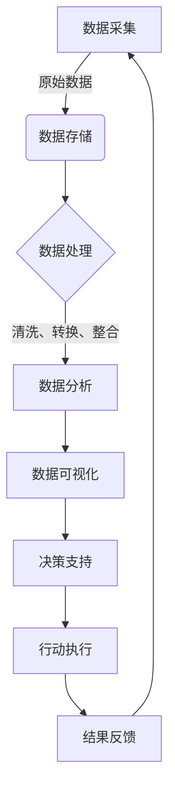

# "构建以数据为中心的决策体系"

## 1.背景介绍

### 1.1 数据驱动决策的重要性

在当今快节奏的商业环境中，及时做出明智的决策对于企业的成功至关重要。然而,传统的决策过程往往依赖于直觉、经验和有限的信息,这可能会导致决策缺乏客观依据,从而产生次优甚至错误的结果。幸运的是,随着大数据和人工智能技术的飞速发展,企业现在可以利用数据驱动的决策方法来提高决策质量。

### 1.2 数据驱动决策的优势

与传统决策方式相比,数据驱动决策具有以下显著优势:

1. **客观性和准确性** - 基于大量真实数据而非主观猜测,可以更准确地反映实际情况。
2. **洞察力** - 通过数据分析,可以发现隐藏的模式和趋势,获得更深入的洞察力。
3. **预测能力** - 利用机器学习等技术,可以基于历史数据预测未来发展趋势。
4. **决策效率** - 通过自动化流程,可以加快决策速度,提高效率。

### 1.3 数据驱动决策的挑战

尽管数据驱动决策有诸多优势,但在实施过程中也面临一些挑战:

1. **数据质量** - 确保数据的完整性、准确性和相关性至关重要。
2. **数据集成** - 整合来自多个异构数据源的数据是一项艰巨的任务。
3. **隐私和安全** - 必须采取适当的措施保护敏感数据,防止数据泄露。
4. **人才缺乏** - 具备数据分析和建模技能的人才短缺。

## 2.核心概念与联系

### 2.1 数据驱动决策体系概述

构建以数据为中心的决策体系需要将多个关键组件有机结合,包括数据采集、数据存储、数据处理、数据分析、数据可视化和决策支持等。这些组件相互关联、相互作用,共同支撑企业的数据驱动决策过程。



### 2.2 数据采集

数据采集是整个数据驱动决策体系的基础,旨在从各种来源获取所需的原始数据。常见的数据来源包括:

- 内部运营数据(销售、财务、生产等)
- 外部市场数据(竞争对手、行业趋势等)
- 网络数据(社交媒体、搜索引擎等)
- 物联网数据(传感器、设备等)

数据采集过程需要确保数据的及时性、完整性和准确性,同时兼顾隐私和安全性。

### 2.3 数据存储

收集到的原始数据需要存储在适当的数据存储系统中,以备后续处理和分析。常用的数据存储解决方案包括:

- 关系型数据库(MySQL、PostgreSQL等)
- NoSQL数据库(MongoDB、Cassandra等)
- 数据仓库(Hadoop、Spark等)
- 数据湖(Amazon S3、Azure Data Lake等)

选择合适的数据存储方案需要考虑数据量、数据类型、访问模式等因素,以确保数据的高效存储和访问。

### 2.4 数据处理

原始数据通常存在噪声、缺失值、不一致性等问题,需要进行适当的处理才能为后续分析做好准备。数据处理包括以下主要步骤:

1. **数据清洗** - 去除或修复不一致、错误或缺失的数据。
2. **数据转换** - 将数据转换为统一的格式或表示形式。
3. **数据整合** - 从多个异构数据源整合相关数据。
4. **数据丰富** - 通过外部数据源或算法丰富现有数据。

数据处理过程可以利用各种大数据技术和工具,如Apache Spark、Apache Kafka等。

### 2.5 数据分析

经过处理后的数据可以进行各种分析,以发现隐藏的模式、趋势和洞察力。常见的数据分析技术包括:

- **描述性分析** - 总结和可视化历史数据,回答"发生了什么"的问题。
- **诊断性分析** - 确定数据模式背后的原因,回答"为什么会发生"的问题。
- **预测性分析** - 基于历史数据预测未来趋势,回答"将会发生什么"的问题。
- **规范性分析** - 确定实现目标的最佳方案,回答"应该怎么做"的问题。

数据分析可以借助各种机器学习算法和统计建模技术,如回归分析、聚类分析、决策树等。

### 2.6 数据可视化

数据分析的结果需要以直观、易于理解的方式呈现,以便于决策者获取洞见。数据可视化技术可以将复杂的数据转化为图表、仪表盘等视觉形式,提高数据的可读性和可解释性。常用的数据可视化工具包括Tableau、Power BI、D3.js等。

### 2.7 决策支持

数据分析和可视化的最终目标是为决策提供支持。决策支持系统可以综合考虑各种数据洞见、业务规则和约束条件,为决策者提供建议或自动做出决策。常见的决策支持技术包括优化模型、推理引擎、专家系统等。

### 2.8 行动执行和结果反馈

基于决策支持系统的建议,决策者可以执行相应的行动。同时,需要持续监控行动的结果,并将结果数据反馈回数据采集环节,形成闭环,为下一轮决策提供依据。

## 3.核心算法原理具体操作步骤

构建以数据为中心的决策体系涉及多种算法和技术,其中一些核心算法原理和具体操作步骤如下:

### 3.1 数据清洗算法

数据清洗是数据处理的重要环节,旨在消除原始数据中的噪声、不一致性和缺失值。常见的数据清洗算法包括:

1. **缺失值处理算法**
   - 删除缺失值记录
   - 使用平均值/中位数/众数等统计量填充缺失值
   - 使用机器学习模型预测缺失值

2. **异常值检测算法**
   - 基于统计量(如3σ原则)检测异常值
   - 基于聚类算法(如DBSCAN)检测异常值
   - 基于隔离森林等算法检测异常值

3. **数据规范化算法**
   - Min-Max标准化
   - Z-Score标准化
   - 小数定标标准化

算法具体操作步骤:

```python
# 缺失值处理示例(使用平均值填充)
import pandas as pd
from sklearn.impute import SimpleImputer

# 加载数据
data = pd.read_csv('data.csv')

# 创建SimpleImputer实例
imputer = SimpleImputer(strategy='mean')

# 对数据集中的缺失值进行填充
data_cleaned = imputer.fit_transform(data)
```

```python
# 异常值检测示例(基于3σ原则)
import pandas as pd
import numpy as np

# 加载数据
data = pd.read_csv('data.csv')

# 计算每列的均值和标准差
mean = data.mean(axis=0)
std = data.std(axis=0)

# 基于3σ原则检测异常值
outliers = (np.abs(data - mean) > 3 * std).any(axis=1)

# 删除异常值记录
data_cleaned = data[~outliers]
```

### 3.2 数据整合算法

数据整合是将来自多个异构数据源的相关数据集成到一起的过程。常见的数据整合算法包括:

1. **实体解析算法**
   - 基于规则的实体解析
   - 基于机器学习的实体解析(如深度学习模型)

2. **实体匹配算法**
   - 基于字符串相似度的匹配(如编辑距离、Jaro-Winkler距离等)
   - 基于语义相似度的匹配(如Word2Vec、BERT等)
   - 基于规则的匹配

3. **数据融合算法**
   - 联合算法(如全外连接)
   - 映射算法(如实体-属性-值模型)
   - 转换算法(如数据透视表)

算法具体操作步骤:

```python
# 实体匹配示例(基于编辑距离)
import pandas as pd
from rapidfuzz import fuzz

# 加载两个数据源
data1 = pd.read_csv('data1.csv')
data2 = pd.read_csv('data2.csv')

# 定义匹配函数
def match_entities(x, y):
    return fuzz.ratio(str(x), str(y)) > 85

# 基于编辑距离匹配实体
merged = pd.merge(data1, data2, left_on='entity1', right_on='entity2', how='outer', indicator=True, suffixes=('_1', '_2'))
merged = merged[merged.apply(lambda x: match_entities(x['entity1'], x['entity2']) if x['_merge'] == 'both' else True, axis=1)]
```

```python
# 数据融合示例(联合算法)
import pandas as pd

# 加载两个数据源
data1 = pd.read_csv('data1.csv')
data2 = pd.read_csv('data2.csv')

# 执行全外连接
merged = pd.merge(data1, data2, how='outer', on='common_key')
```

### 3.3 关联规则挖掘算法

关联规则挖掘是一种常用的数据分析技术,旨在发现数据集中的频繁模式和相关性。常见的关联规则挖掘算法包括:

1. **Apriori算法**
2. **FP-Growth算法**
3. **Eclat算法**

算法具体操作步骤:

```python
# Apriori算法示例
from mlxtend.frequent_patterns import apriori
from mlxtend.frequent_patterns import association_rules

# 加载数据
dataset = [['面包', '牛奶', '饼干'],
           ['面包', '牛奶', '鸡蛋'],
           ['面包', '牛奶', '火腿'],
           ['面包', '牛奶', '饼干'],
           ['面包', '牛奶', '鸡蛋'],
           ['面包', '牛奶', '火腿']]

# 执行Apriori算法
frequent_itemsets = apriori(dataset, min_support=0.2, use_colnames=True)

# 生成关联规则
rules = association_rules(frequent_itemsets, metric="confidence", min_threshold=0.6)
print(rules)
```

### 3.4 聚类算法

聚类算法是一种无监督学习技术,旨在根据数据的相似性将其划分为多个簇。常见的聚类算法包括:

1. **K-Means算法**
2. **层次聚类算法**
3. **DBSCAN算法**
4. **高斯混合模型**

算法具体操作步骤:

```python
# K-Means算法示例
from sklearn.cluster import KMeans
import numpy as np

# 生成示例数据
X = np.array([[1, 2], [1, 4], [1, 0],
              [10, 2], [10, 4], [10, 0]])

# 初始化KMeans对象
kmeans = KMeans(n_clusters=2, random_state=0)

# 执行聚类
labels = kmeans.fit_predict(X)
print(labels)
```

```python
# DBSCAN算法示例
from sklearn.cluster import DBSCAN
import numpy as np

# 生成示例数据
X = np.array([[1, 2], [2, 2], [2, 3],
              [8, 7], [8, 8], [25, 80]])

# 初始化DBSCAN对象
clustering = DBSCAN(eps=3, min_samples=2).fit(X)

# 获取聚类标签
labels = clustering.labels_
print(labels)
```

### 3.5 回归算法

回归算法是一种监督学习技术,旨在建立自变量和因变量之间的数学关系模型。常见的回归算法包括:

1. **线性回归**
2. **逻辑回归**
3. **决策树回归**
4. **随机森林回归**
5. **梯度提升回归树**

算法具体操作步骤:

```python
# 线性回归示例
from sklearn.linear_model import LinearRegression
import numpy as np

# 生成示例数据
X = np.array([[1], [2], [3], [4], [5]])
y = np.array([2, 4