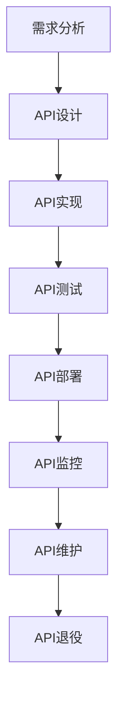

# "构建企业级API：数字化转型的关键驱动力"

## 1.背景介绍

在当今数字化时代，企业需要与客户、合作伙伴和其他系统进行高效的数据交换和集成。企业级API(Application Programming Interface)作为一种标准化的数据交换接口,已成为实现企业数字化转型的关键驱动力。API允许不同的应用程序、系统和设备相互通信,促进了数据共享、业务流程自动化和创新服务的开发。

企业级API不仅可以简化内部系统集成,还可以打开企业数据和功能,为合作伙伴和开发者提供可编程的访问入口。通过开放API,企业可以构建强大的生态系统,扩展产品和服务的覆盖范围,实现业务模式创新。此外,API还为企业提供了一种标准化的方式来暴露和消费云服务,促进了云计算的采用。

然而,构建高质量、可扩展和安全的企业级API绝非易事。它需要全面考虑API设计、开发、测试、部署、监控和生命周期管理等多个方面。本文将深入探讨构建企业级API的核心概念、最佳实践和挑战,为读者提供实用的指导和见解。

## 2.核心概念与联系

### 2.1 API设计原则

设计高质量的API是构建企业级API的基础。良好的API设计应该遵循以下原则:

1. **简单性**: API应该易于理解和使用,避免过度复杂的设计。
2. **一致性**: API应该在命名、结构和行为上保持一致,提高可维护性。
3. **面向资源**: API应该围绕业务资源进行设计,而不是技术细节。
4. **无状态性**: API应该是无状态的,每个请求都包含足够的信息进行处理。
5. **版本控制**: API应该支持版本控制,以确保向后兼容性。
6. **安全性**: API应该采用适当的安全措施,如身份验证、授权和加密。

### 2.2 API开发生命周期

API的开发需要遵循一个完整的生命周期,包括以下阶段:



1. **需求分析**: 明确API的目的、目标受众和功能需求。
2. **API设计**: 根据设计原则,确定API的资源模型、接口定义和数据格式。
3. **API实现**: 编写API的服务端代码,实现业务逻辑和数据访问。
4. **API测试**: 进行单元测试、集成测试和性能测试,确保API的正确性和可靠性。
5. **API部署**: 将API部署到生产环境,并进行监控和管理。
6. **API监控**: 持续监控API的性能、错误和使用情况,及时发现和解决问题。
7. **API维护**: 根据反馈和需求变更,对API进行升级和优化。
8. **API退役**: 当API不再需要时,按照计划安全地退役API。

### 2.3 API管理

随着企业API数量的增长,有效的API管理变得至关重要。API管理包括以下关键方面:

1. **API网关**: 作为API的统一入口点,提供路由、身份验证、限流和日志记录等功能。
2. **API开发者门户**: 为API开发者提供文档、示例代码和测试环境,促进API的采用。
3. **API分析**: 收集和分析API的使用数据,了解API的性能和受欢迎程度。
4. **API产品化**: 将API打包为产品,并制定相应的定价和营销策略。
5. **API生命周期管理**: 管理API的整个生命周期,从设计到退役。

## 3.核心算法原理具体操作步骤

构建企业级API涉及多种算法和技术,其中一些核心算法原理和具体操作步骤如下:

### 3.1 RESTful API设计

RESTful API设计是一种流行的API设计范式,它遵循REST(Representational State Transfer)架构风格。RESTful API设计的核心原则包括:

1. **资源识别**: 使用URI(Uniform Resource Identifier)来标识API资源。
2. **资源表示**: 使用JSON或XML等格式来表示资源的状态。
3. **无状态**: 客户端和服务器之间的交互是无状态的,每个请求都包含足够的信息。
4. **统一接口**: 使用标准的HTTP方法(GET、POST、PUT、DELETE)来操作资源。

RESTful API设计的具体操作步骤如下:

1. **确定API资源**: 根据业务需求,确定API需要暴露的资源,如用户、订单等。
2. **定义资源URI**: 为每个资源设计一个唯一的URI,通常采用层次结构的方式组织。
3. **选择HTTP方法**: 根据操作的语义,选择适当的HTTP方法。例如,GET用于获取资源,POST用于创建资源。
4. **设计资源表示**: 选择合适的数据格式(如JSON)来表示资源的状态。
5. **定义状态码**: 根据操作的结果,返回适当的HTTP状态码,如200 OK、404 Not Found等。
6. **实现API逻辑**: 编写服务端代码,实现API的业务逻辑和数据访问。

### 3.2 API身份验证和授权

为了保护API的安全性,需要实现适当的身份验证和授权机制。常见的身份验证方式包括:

1. **API密钥**: 为每个API客户端分配一个唯一的密钥,并在每个请求中包含该密钥进行身份验证。
2. **OAuth 2.0**: 一种行业标准的授权框架,允许第三方应用代表用户安全地访问API资源。
3. **JWT(JSON Web Token)**: 一种基于令牌的身份验证方式,将用户身份信息编码到令牌中,避免了服务器端的状态存储。

API授权的目的是控制不同的客户端对API资源的访问权限。常见的授权方式包括:

1. **基于角色的访问控制(RBAC)**: 根据用户的角色分配不同的权限。
2. **基于属性的访问控制(ABAC)**: 根据用户的属性(如部门、职位等)分配权限。
3. **基于资源的访问控制**: 为每个API资源定义细粒度的访问控制策略。

实现API身份验证和授权的具体操作步骤如下:

1. **选择身份验证方式**: 根据安全性和可用性要求,选择合适的身份验证方式,如API密钥、OAuth 2.0或JWT。
2. **集成身份验证机制**: 在API网关或服务端代码中集成所选的身份验证机制,验证每个请求的身份。
3. **定义授权策略**: 根据业务需求,制定适当的授权策略,确定不同客户端对API资源的访问权限。
4. **实现授权逻辑**: 在API服务端代码中实现授权逻辑,根据请求的身份和授权策略决定是否允许访问。
5. **记录审计日志**: 记录每个API请求的身份验证和授权信息,用于安全审计和问题排查。

## 4.数学模型和公式详细讲解举例说明

在构建企业级API时,可能需要应用一些数学模型和公式来优化API的性能和可靠性。以下是一些常见的数学模型和公式:

### 4.1 限流算法

为了防止API被过度使用,常常需要实现限流(Rate Limiting)机制。常见的限流算法包括令牌桶算法(Token Bucket)和漏桶算法(Leaky Bucket)。

#### 令牌桶算法

令牌桶算法模拟了一个存放固定容量令牌的桶,以固定的速率向桶中添加令牌。如果桶已满,新的令牌将被丢弃。每次请求到达时,需要从桶中取出一个令牌,如果桶中没有令牌,则拒绝该请求。

令牌桶算法可以用以下公式描述:

$$
N(t) = \min(N_0 + r(t - t_0), B)
$$

其中:

- $N(t)$ 表示时间 $t$ 时桶中的令牌数量
- $N_0$ 表示初始令牌数量
- $r$ 表示每秒向桶中添加的令牌数量
- $t_0$ 表示上一次添加令牌的时间
- $B$ 表示桶的最大容量

#### 漏桶算法

漏桶算法模拟了一个固定容量的桶,以固定的速率从桶中漏出水滴。当请求到达时,将被放入桶中。如果桶已满,新的请求将被拒绝。

漏桶算法可以用以下公式描述:

$$
N(t) = \min(N_0 + r(t - t_0), B)
$$

其中:

- $N(t)$ 表示时间 $t$ 时桶中的请求数量
- $N_0$ 表示初始请求数量
- $r$ 表示每秒处理的请求数量
- $t_0$ 表示上一次处理请求的时间
- $B$ 表示桶的最大容量

这两种算法都可以用于限制API的请求速率,防止过度使用。选择哪种算法取决于具体的需求和场景。

### 4.2 缓存失效策略

为了提高API的响应速度和可扩展性,常常需要使用缓存技术。但是,缓存数据可能会过期,因此需要采用合适的缓存失效策略来保证数据的一致性。

常见的缓存失效策略包括:

1. **超时失效(Time-based Expiration)**: 为每个缓存项设置一个过期时间,在该时间后自动失效。
2. **主动失效(Proactive Expiration)**: 当数据发生变更时,主动失效相关的缓存项。
3. **基于使用情况的失效(Usage-based Expiration)**: 根据缓存项的使用频率和时间来决定失效时间。

其中,基于使用情况的失效策略常常采用LRU(Least Recently Used)或LFU(Least Frequently Used)算法。

#### LRU算法

LRU算法根据数据的历史访问记录,将最近最少使用的数据从缓存中移除。它可以用以下公式描述:

$$
C(k, t) = \begin{cases}
t, & \text{if } k \in S \\
-\infty, & \text{if } k \notin S
\end{cases}
$$

其中:

- $C(k, t)$ 表示键 $k$ 在时间 $t$ 的访问时间
- $S$ 表示缓存中的键集合

当缓存达到容量上限时,将移除 $\min_{k \in S} C(k, t)$ 对应的键值对。

#### LFU算法

LFU算法根据数据的访问频率,将访问频率最低的数据从缓存中移除。它可以用以下公式描述:

$$
F(k, t) = \sum_{i=1}^{n} \mathbb{1}_{k_i = k}
$$

其中:

- $F(k, t)$ 表示键 $k$ 在时间 $t$ 之前的访问次数
- $k_i$ 表示第 $i$ 次访问的键
- $n$ 表示总的访问次数

当缓存达到容量上限时,将移除 $\min_{k \in S} F(k, t)$ 对应的键值对。

选择合适的缓存失效策略可以在数据一致性和性能之间达到平衡,提高API的整体效率。

## 5.项目实践: 代码实例和详细解释说明

为了更好地理解如何构建企业级API,我们将通过一个实际的代码示例来演示RESTful API的设计和实现。

### 5.1 项目概述

假设我们需要构建一个简单的在线商店API,提供产品列表、产品详情、创建订单和查询订单等功能。我们将使用Node.js和Express框架来实现这个API。

### 5.2 API设计

根据RESTful API设计原则,我们定义了以下API资源和对应的HTTP方法:

| 资源 | HTTP方法 | 描述 |
| --- | --- | --- |
| `/products` | GET | 获取产品列表 |
| `/products/:id` | GET | 获取单个产品详情 |
| `/orders` | POST | 创建新订单 |
| `/orders/:id` | GET | 获取单个订单详情 |

### 5.3 API实现

以下是实现上述API的Node.js代码示例:

```javascript