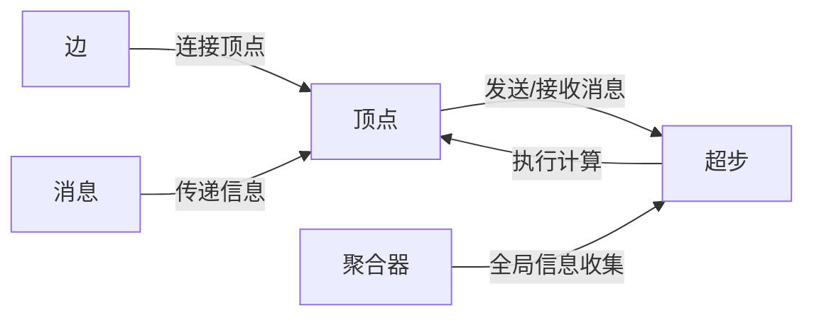

## 1. 背景介绍

在大数据时代，图形处理已成为数据分析的重要手段。图数据结构在社交网络、推荐系统、交通网络等领域扮演着核心角色。然而，随着数据量的激增，传统的图处理方法在处理大规模图数据时面临着严峻的挑战。为了解决这一问题，Google提出了Pregel系统，它是一个基于BSP（Bulk Synchronous Parallel）模型的大规模图处理平台。Pregel的设计哲学是将图的处理过程分布在多个计算节点上，通过迭代计算和消息传递来处理图数据，从而实现高效的图形处理。

## 2. 核心概念与联系

Pregel架构基于几个核心概念：顶点、边、消息、超步（Superstep）和聚合器。每个顶点都可以发送和接收消息，执行计算，并且能够改变自身和相邻顶点的状态。超步是Pregel执行的基本单位，每个超步包含了消息的发送、接收和顶点的计算。聚合器用于全局信息的收集和分发。



## 3. 核心算法原理具体操作步骤

Pregel算法的执行可以分为以下步骤：

1. 初始化：图的每个顶点被赋予一个初始值。
2. 超步迭代：在每个超步中，每个顶点接收上一个超步中发送给它的消息，根据这些消息和自身的值执行用户定义的计算，并可以向其他顶点发送消息。
3. 终止条件：当所有顶点投票停止计算或达到预设的超步数时，算法终止。

## 4. 数学模型和公式详细讲解举例说明

Pregel算法的数学模型可以表示为：

$$
V_{t+1} = F(V_t, M_t)
$$

其中，$V_t$ 是在超步 $t$ 的顶点状态，$M_t$ 是在超步 $t$ 接收到的消息集合，$F$ 是用户定义的计算函数，$V_{t+1}$ 是下一个超步的顶点状态。

例如，在计算最短路径的Pregel应用中，$F$ 可以定义为：

$$
V_{t+1} = \min(V_t, \min(M_t))
$$

这表示顶点在下一个超步的状态是当前状态和接收到的消息中的最小值。

## 5. 项目实践：代码实例和详细解释说明

以下是一个使用Pregel计算图中顶点的最短路径的简单代码示例：

```java
public class ShortestPathVertex extends BasicVertex<LongWritable, DoubleWritable, FloatWritable, DoubleWritable> {
    public void compute(Iterator<DoubleWritable> messages) {
        if (getSuperstep() == 0) {
            setValue(new DoubleWritable(Double.MAX_VALUE));
        }
        double minDist = isSource() ? 0d : Double.MAX_VALUE;
        while (messages.hasNext()) {
            minDist = Math.min(minDist, messages.next().get());
        }
        if (minDist < getValue().get()) {
            setValue(new DoubleWritable(minDist));
            for (Edge<LongWritable, FloatWritable> edge : getEdges()) {
                double distance = minDist + edge.getValue().get();
                sendMessage(edge.getTargetVertexId(), new DoubleWritable(distance));
            }
        }
        voteToHalt();
    }
}
```

在这个例子中，每个顶点在第一个超步将自己的值初始化为无穷大，除了源顶点，它的初始值为0。然后，每个顶点尝试通过接收到的消息来更新自己的值，如果新计算出的距离小于当前值，则更新并向邻居顶点发送新的距离。

## 6. 实际应用场景

Pregel系统在多个领域都有广泛的应用，例如：

- 社交网络分析：如计算用户之间的影响力或社区检测。
- 交通网络优化：如城市交通流量的模拟和优化。
- 生物信息学：如蛋白质网络的分析和基因序列的比对。

## 7. 工具和资源推荐

- Apache Giraph：一个基于Pregel模型的开源图处理框架。
- Google Cloud Dataflow：支持Pregel-like模型的托管服务。
- Hama：Apache下的一个BSP计算框架，支持图形处理。

## 8. 总结：未来发展趋势与挑战

Pregel模型为大规模图形处理提供了一种有效的解决方案，但仍面临着诸如图数据的动态变化、算法的优化和扩展性等挑战。未来的发展趋势可能包括更高效的计算模型、更好的容错机制以及对动态图数据的支持。

## 9. 附录：常见问题与解答

Q1: Pregel如何处理大规模图数据的存储？
A1: Pregel通常使用分布式文件系统来存储图数据，每个顶点和边分布在不同的计算节点上。

Q2: Pregel如何保证计算的正确性？
A2: Pregel通过同步模型来保证每个超步的计算是一致的，同时提供了容错机制来处理节点故障。

作者：禅与计算机程序设计艺术 / Zen and the Art of Computer Programming