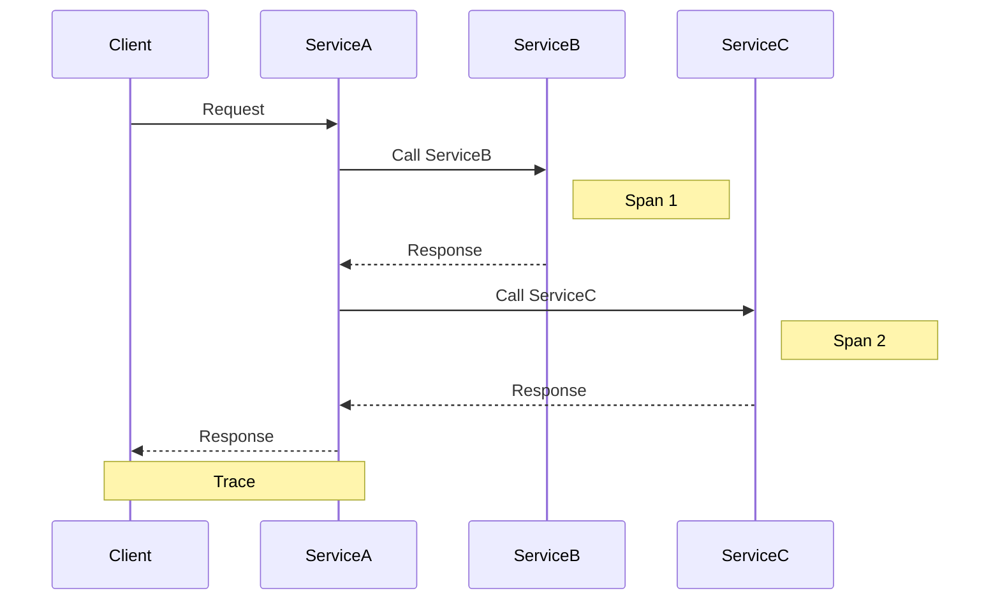
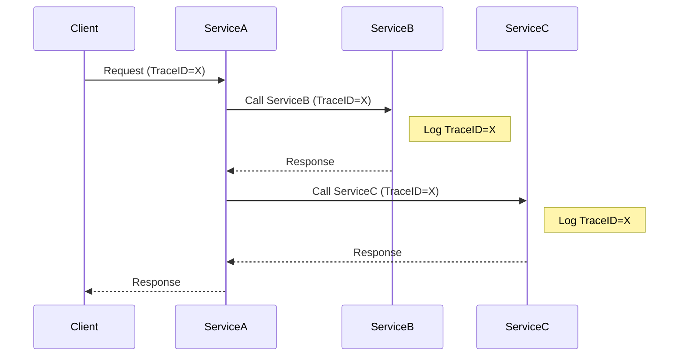

# 架构设计中的分布式追踪和链路跟踪

## 1.背景介绍

在现代分布式系统中,应用程序通常由多个独立的微服务或组件组成,这些组件通过网络进行通信和协作以完成复杂的业务逻辑。随着系统复杂性的增加,跟踪分布在多个服务之间的请求变得越来越具有挑战性。分布式追踪和链路跟踪是一种解决方案,旨在帮助开发人员更好地理解系统中的请求流,识别性能瓶颈并诊断错误。

### 1.1 分布式系统的复杂性

在单体架构中,应用程序作为一个整体单元运行,所有组件都位于同一进程中。这种架构虽然简单,但存在可伸缩性、可维护性和灵活性方面的挑战。相比之下,微服务架构将应用程序拆分为多个独立的服务,每个服务负责特定的业务功能。这种方式提高了系统的模块化和灵活性,但也增加了复杂性。

在分布式系统中,单个请求可能需要跨越多个服务,每个服务都可能依赖于其他服务。这种依赖关系会导致请求在系统中产生复杂的流程,从而使跟踪和调试变得更加困难。如果某个服务出现问题或性能下降,可能会影响整个系统的运行。因此,有效地跟踪和监控分布式系统中的请求流程变得至关重要。

### 1.2 分布式追踪和链路跟踪的作用

分布式追踪(Distributed Tracing)和链路跟踪(Trace Tracking)是一种技术,旨在帮助开发人员可视化和分析分布式系统中的请求流程。它们提供了一种全局视角,使开发人员能够跟踪请求在整个系统中的执行路径,识别性能瓶颈、错误和异常。

通过分布式追踪和链路跟踪,开发人员可以:

- 可视化整个请求流程,了解请求在系统中的执行路径
- 测量每个服务的响应时间,识别性能瓶颈
- 跟踪异常和错误,快速定位问题根源
- 分析系统依赖关系,优化服务交互
- 监控系统健康状况,提高可观察性

总的来说,分布式追踪和链路跟踪为开发人员提供了一种强大的工具,帮助他们更好地理解、优化和诊断复杂的分布式系统。

## 2.核心概念与联系

在探讨分布式追踪和链路跟踪的核心概念之前,让我们先了解一些基本术语:

- **Span(跨度)**: 描述一个单独的工作单元,例如一个远程过程调用或一个数据库查询。
- **Trace(追踪)**: 由一系列有因果关系的Span组成,描述了一个完整的请求流程。
- **TraceID**: 唯一标识一个Trace的ID。
- **SpanID**: 唯一标识一个Span的ID。
- **ParentSpanID**: 当前Span的父Span的ID,用于建立Span之间的层次关系。

### 2.1 分布式追踪(Distributed Tracing)

分布式追踪是一种技术,用于跟踪分布式系统中的请求流程。它通过在每个服务中插入跟踪代码,收集请求在各个服务中的执行信息,并将这些信息汇总到一个集中式的追踪系统中进行分析和可视化。

分布式追踪的核心概念是**Trace**和**Span**。一个Trace代表一个完整的请求流程,由多个Span组成。每个Span描述请求在某个服务中的一个工作单元,例如一个远程过程调用或一个数据库查询。通过将所有相关的Span连接起来,我们可以重构出整个请求的执行路径。

下面是一个简单的分布式追踪示例:

在这个示例中,一个请求从Client发出,经过ServiceA、ServiceB和ServiceC,最终返回响应。整个请求流程被称为一个Trace,而每个服务中的工作单元(如远程调用或数据库查询)被称为一个Span。通过收集和分析这些Span的信息,我们可以重构出整个Trace,了解请求在系统中的执行路径。

### 2.2 链路跟踪(Trace Tracking)

链路跟踪是一种补充分布式追踪的技术,它关注于跟踪请求在系统中的执行路径,而不是收集详细的性能指标。链路跟踪通常采用注入一个唯一的TraceID到每个请求中,并在每个服务中记录这个TraceID,从而能够追踪请求在整个系统中的流程。

链路跟踪的主要目的是提供一种简单的方式来可视化和理解分布式系统中的请求流程,而不需要收集大量的性能指标。它可以帮助开发人员快速定位问题所在,并了解系统的依赖关系。

下面是一个链路跟踪的示例:

在这个示例中,客户端发出一个请求,并携带一个唯一的TraceID(X)。每个服务在处理请求时,都会记录下这个TraceID。通过分析日志中的TraceID,我们可以追踪请求在整个系统中的执行路径,而不需要收集详细的性能指标。

### 2.3 分布式追踪和链路跟踪的关系

分布式追踪和链路跟踪是两种紧密相关的技术,它们共同为开发人员提供了一种可视化和分析分布式系统中请求流程的方式。

- 分布式追踪侧重于收集详细的性能指标和执行信息,以便进行深入的性能分析和问题诊断。它提供了一种全面的视角,帮助开发人员了解请求在整个系统中的执行情况。
- 链路跟踪则更加关注于追踪请求在系统中的执行路径,而不是收集详细的性能指标。它提供了一种简单的方式来可视化和理解系统的依赖关系,快速定位问题所在。

在实际应用中,这两种技术通常会结合使用,以获得更全面的可观察性。分布式追踪提供了详细的性能分析和问题诊断能力,而链路跟踪则提供了一种快速定位问题所在的方式。通过结合使用这两种技术,开发人员可以更好地理解和优化复杂的分布式系统。

## 3.核心算法原理具体操作步骤

分布式追踪和链路跟踪的核心算法原理涉及几个关键步骤:

1. **生成唯一标识符(TraceID和SpanID)**
2. **传播跟踪上下文**
3. **收集和存储跟踪数据**
4. **数据分析和可视化**

### 3.1 生成唯一标识符

在分布式追踪和链路跟踪中,每个请求都需要一个唯一的TraceID来标识,而每个Span也需要一个唯一的SpanID。这些唯一标识符通常使用UUID或其他算法生成,以确保在整个分布式系统中的唯一性。

生成唯一标识符的算法通常需要满足以下要求:

- 高度唯一性,在整个分布式系统中不会出现重复
- 高性能,生成标识符的开销尽可能小
- 可扩展性,能够支持大规模并发请求

常见的生成唯一标识符的算法包括:

- **UUID**: 基于时间戳、节点ID和随机数生成的128位标识符,具有很高的唯一性,但生成开销较大。
- **Snowflake算法**: 由Twitter开源,基于时间戳和节点ID生成64位标识符,生成性能较高,但需要保证节点ID的唯一性。
- **自增长ID**: 在单机环境下使用自增长ID,可以保证高性能和唯一性,但在分布式环境下需要额外的同步机制。

### 3.2 传播跟踪上下文

为了跟踪请求在分布式系统中的执行路径,需要在每个服务之间传播跟踪上下文。跟踪上下文包括TraceID、ParentSpanID和其他元数据,用于建立Span之间的关系。

传播跟踪上下文的方式取决于服务之间的通信方式,常见的方式包括:

- **HTTP头**: 在HTTP请求中添加特定的头部字段,如`X-Request-ID`、`X-Trace-ID`等,携带跟踪上下文信息。
- **消息队列元数据**: 在消息队列中的消息元数据中携带跟踪上下文信息。
- **RPC元数据**: 在RPC调用中的元数据中携带跟踪上下文信息。

每个服务在收到请求时,需要从请求中提取跟踪上下文信息,并为当前的工作单元(Span)创建一个新的SpanID。在处理完成后,服务需要将更新后的跟踪上下文传递给下一个服务。

### 3.3 收集和存储跟踪数据

为了进行分析和可视化,需要将每个服务中的跟踪数据收集并存储到集中式的跟踪系统中。常见的跟踪数据收集方式包括:

- **日志文件**: 将跟踪数据记录到日志文件中,然后由日志收集系统(如Logstash或Fluentd)收集并发送到跟踪系统。
- **直接上报**: 每个服务直接将跟踪数据上报到跟踪系统,通常使用异步方式以避免影响服务性能。
- **代理模式**: 在每个服务旁部署一个代理,代理负责收集和上报跟踪数据。

收集到的跟踪数据通常包括以下信息:

- TraceID和SpanID,用于建立Span之间的关系
- 操作名称,描述当前Span的工作单元
- 开始和结束时间戳,用于计算Span的持续时间
- 标签(Tags),包括服务名称、端点信息、错误信息等元数据
- 日志数据,用于问题诊断和调试

跟踪数据通常会存储在专门的跟踪系统中,如Jaeger、Zipkin或AWS X-Ray等。这些系统提供了数据存储、查询和可视化的功能,帮助开发人员分析和诊断分布式系统中的问题。

### 3.4 数据分析和可视化

收集到的跟踪数据需要进行分析和可视化,以便开发人员更好地理解分布式系统中的请求流程和性能情况。常见的分析和可视化方式包括:

- **时间线视图**: 以时间线的形式展示整个Trace的执行过程,显示每个Span的开始和结束时间,以及它们之间的依赖关系。
- **服务依赖视图**: 展示系统中各个服务之间的依赖关系,以及每个服务的性能指标,如响应时间、错误率等。
- **性能指标分析**: 分析各个Span的持续时间、错误率等性能指标,识别潜在的性能瓶颈。
- **异常检测**: 基于历史数据建立基线,自动检测异常情况,如响应时间突然延长或错误率升高等。
- **日志关联**: 将跟踪数据与日志数据关联,方便进行问题诊断和调试。

这些分析和可视化功能通常由专门的跟踪系统提供,如Jaeger、Zipkin或AWS X-Ray等。开发人员可以利用这些工具来更好地理解和优化分布式系统的性能和稳定性。

## 4.数学模型和公式详细讲解举例说明

在分布式追踪和链路跟踪中,常见的数学模型和公式主要用于计算和分