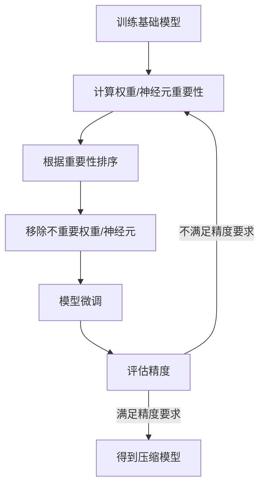
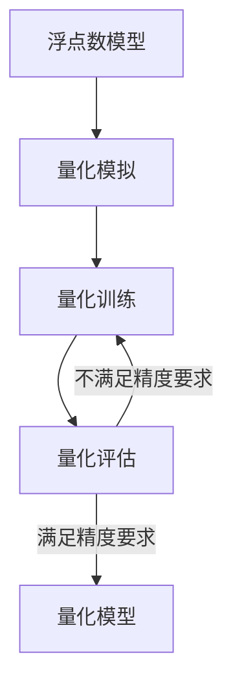
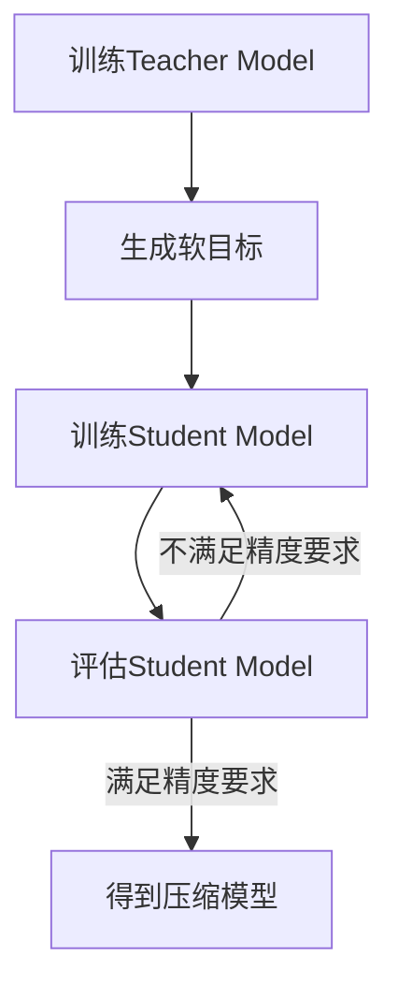
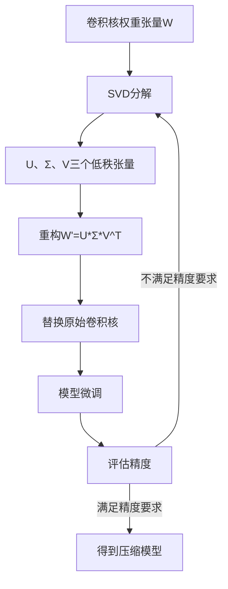

# 模型压缩与加速原理与代码实战案例讲解

## 1.背景介绍

随着深度学习模型在各个领域的广泛应用,模型的计算复杂度和存储开销也在不断增加。大型模型需要大量的计算资源和内存,这对于资源受限的设备(如移动设备、嵌入式系统等)来说是一个巨大的挑战。因此,如何在保持模型精度的同时减小模型的计算复杂度和存储开销,成为了深度学习领域的一个重要研究方向,这就是所谓的模型压缩与加速技术。

模型压缩与加速技术旨在通过各种优化策略,降低深度学习模型的计算复杂度和存储开销,从而实现在资源受限环境中的高效部署。这些技术不仅可以减小模型的footprint,还能提高模型的inference速度,降低能耗,扩大深度学习在边缘设备等场景的应用范围。

## 2.核心概念与联系

模型压缩与加速技术主要包括以下几个核心概念:

### 2.1 剪枝(Pruning)

剪枝是通过移除神经网络中的冗余权重和神经元,从而减小模型大小的一种技术。常见的剪枝方法有:

- 权重剪枝(Weight Pruning):移除权重绝对值较小的连接
- 神经元剪枝(Neuron Pruning):移除神经元的输出接近于常数的情况
- 滤波器剪枝(Filter Pruning):移除卷积层中冗余的滤波器

### 2.2 量化(Quantization)

量化是将原本使用高精度浮点数(32位或更高)表示的模型权重和激活值,用较低比特位数(如8位或更低)的定点数或其他数值格式来表示,从而降低模型大小和计算复杂度。常见的量化方法有:

- 权重量化(Weight Quantization)
- 激活值量化(Activation Quantization)
- 整体量化(Quantization-Aware Training)

### 2.3 知识蒸馏(Knowledge Distillation)

知识蒸馏是将一个大型复杂模型(Teacher Model)的知识迁移到一个小型简单模型(Student Model)中的过程。通过训练Student Model来模拟Teacher Model的预测结果,可以在降低计算复杂度的同时,保留Teacher Model的精度水平。

### 2.4 低秩分解(Low-Rank Decomposition)

低秩分解技术通过将高维张量(如卷积核权重张量)分解为几个低秩张量的乘积,从而降低参数数量和计算复杂度。常用的分解方法有奇异值分解(SVD)和CP分解。

### 2.5 紧凑网络设计(Compact Network Design)

紧凑网络设计旨在直接设计出参数少、计算高效的网络架构,常见的方法有SqueezeNet、MobileNets、ShuffleNets等。

上述这些核心概念相互关联,并且常常会组合使用,以达到最佳的压缩和加速效果。

## 3.核心算法原理具体操作步骤  

### 3.1 剪枝算法原理及操作步骤

剪枝算法的核心思想是识别并移除神经网络中的冗余连接、神经元或滤波器,而不会过多降低模型的精度。一般的剪枝流程如下:

1. **训练基础模型**: 首先训练一个过参数化的基础模型,作为剪枝的对象。
2. **计算权重/神经元重要性**: 使用一定的评价标准(如L1范数、L2范数、平均百分位数等)计算每个权重或神经元的重要性得分。
3. **根据重要性排序**: 将权重或神经元按重要性得分从小到大排序。
4. **移除不重要权重/神经元**: 移除排名靠后(得分较低)的一部分权重或神经元。
5. **模型微调**: 对剪枝后的模型进行进一步的微调训练,以恢复可能的精度损失。
6. **评估精度**: 在验证集上评估微调后模型的精度,判断是否满足要求。如不满足,则返回第2步,重新计算重要性得分并剪枝。
7. **得到压缩模型**: 如果精度满足要求,则得到最终的压缩模型。

剪枝算法的关键在于设计合理的重要性评价标准,以及在剪枝后保留足够的模型容量。不同类型的剪枝(权重剪枝、神经元剪枝、滤波器剪枝等)的具体操作细节也有所不同。

### 3.2 量化算法原理及操作步骤

量化算法的目标是将原本使用高精度浮点数表示的模型参数和激活值,用较低比特位数的定点数或其他数值格式来表示,以减小模型大小和计算复杂度。常见的量化方法有:

1. **权重量化**
2. **激活值量化**
3. **整体量化(Quantization-Aware Training)**

其中,整体量化是指在模型训练阶段就考虑量化的影响,使用人工量化的权重/激活值进行模拟训练,以减小量化带来的精度损失。整体量化的典型流程如下:

1. **浮点数模型**: 首先训练一个浮点数精度的模型。
2. **量化模拟**: 使用量化模拟技术(如Fake Quantization),将模型的权重和激活值模拟为低比特定点数。
3. **量化训练**: 使用模拟量化的权重/激活值,在量化感知的训练环境中继续训练模型,使其适应量化操作。
4. **量化评估**: 在验证集上评估量化训练后模型的精度。
5. **量化模型**: 如果精度满足要求,则将模型量化为低比特定点数格式,得到最终的量化模型。

量化算法的关键在于选择合适的量化比特位数,以及设计高效的量化模拟和量化训练策略,最大限度地减小量化带来的精度损失。

### 3.3 知识蒸馏算法原理及操作步骤  

知识蒸馏的目标是将一个大型复杂模型(Teacher Model)的知识迁移到一个小型简单模型(Student Model)中,使得Student Model能够在降低计算复杂度的同时,保留Teacher Model的精度水平。典型的知识蒸馏流程如下:

1. **训练Teacher Model**: 首先训练一个大型高精度的Teacher Model,作为知识来源。
2. **生成软目标**: 使用Teacher Model在训练数据上进行前向传播,得到"软化"的预测结果(即类别概率分布),作为Student Model的训练目标。
3. **训练Student Model**: 使用知识蒸馏损失函数(如KL散度损失),将Teacher Model的软目标知识迁移到Student Model中。
4. **评估Student Model**: 在验证集上评估Student Model的精度。
5. **得到压缩模型**: 如果精度满足要求,则Student Model即为最终的压缩模型。

知识蒸馏算法的关键在于设计合理的知识表示形式(如软目标)和损失函数,以及选择合适的Teacher Model和Student Model架构,使得知识能够被高效地迁移。

### 3.4 低秩分解算法原理及操作步骤

低秩分解算法的目标是将高维张量(如卷积核权重张量)分解为几个低秩张量的乘积,从而降低参数数量和计算复杂度。常用的分解方法有奇异值分解(SVD)和CP分解。以SVD为例,其分解过程如下:

1. **卷积核权重张量W**: 首先获取卷积层的权重张量W。
2. **SVD分解**: 对权重张量W进行奇异值分解,得到三个低秩张量U、Σ、V。
3. **重构W'**: 使用U、Σ、V三个低秩张量的乘积近似重构原始权重张量W,得到W'=U*Σ*V^T。
4. **替换原始卷积核**: 将原始卷积核权重W替换为重构的W'。
5. **模型微调**: 对替换后的模型进行微调训练,以恢复可能的精度损失。
6. **评估精度**: 在验证集上评估微调后模型的精度。
7. **得到压缩模型**: 如果精度满足要求,则得到最终的压缩模型。

低秩分解算法的关键在于选择合适的分解方法(如SVD或CP分解)和秩值,使得重构的低秩张量能够很好地近似原始权重张量,同时降低参数数量。

## 4.数学模型和公式详细讲解举例说明

### 4.1 剪枝算法中的重要性评价标准

在剪枝算法中,常用的权重重要性评价标准包括:

1. **L1范数**:

$$\text{Importance}(w) = |w|$$

其中$w$表示权重值。L1范数直观上表示权重的绝对值大小,值越小则被认为越不重要。

2. **L2范数**:  

$$\text{Importance}(w) = w^2$$

L2范数实际上是权重值的平方,也可以反映权重的重要程度。

3. **百分位数(Percentile)**: 

$$\text{Importance}(w) = \text{Percentile}(|w|, p)$$

其中$p$是一个超参数,表示百分位数的水平。该标准将所有权重的绝对值从小到大排序,取前$p\%$的权重作为重要权重。

对于神经元重要性评价,常用的标准是**平均百分位数(Average Percentile)**:

$$\text{Importance}(n) = \frac{1}{|\mathcal{W}|}\sum_{w\in\mathcal{W}}\text{Percentile}(|w|, p)$$

其中$\mathcal{W}$表示与神经元$n$相连的所有权重集合,$p$是百分位数超参数。该标准实际上是连接到该神经元的所有权重的平均百分位数重要性得分。

不同的重要性评价标准对应着不同的剪枝策略,需要根据具体任务选择合适的标准。

### 4.2 量化算法中的量化函数

在量化算法中,常用的量化函数有线性量化函数和对数量化函数等。以线性量化函数为例:

$$Q(r)=\begin{cases}
\lfloor\frac{r}{S}\rceil, & \text{如果} \lfloor\frac{r}{S}\rceil\in[0,2^{B}-1]\\
0, & \text{如果} r<0\\
2^{B}-1, & \text{如果} r\geq(2^{B}-1)S
\end{cases}$$

其中:
- $r$是待量化的实数(如权重或激活值)
- $B$是量化比特位数
- $S$是量化步长(Scale)
- $\lfloor\cdot\rceil$表示向最近整数取整

该量化函数将实数$r$线性映射到$[0,2^B-1]$的整数区间内。量化步长$S$控制了量化的精度,通常需要通过校准(Calibration)来确定合适的$S$值。

对于量化训练,我们可以使用**直通估计量化(Straight-Through Estimator)**技术,在反向传播时