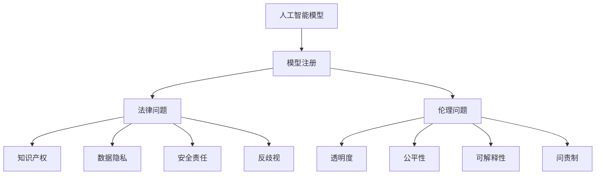

# 模型注册的法律与伦理问题

## 1. 背景介绍

### 1.1 人工智能模型的发展现状

人工智能技术的快速发展已经渗透到社会生活的方方面面。从自然语言处理、计算机视觉到自动驾驶等领域,智能模型正在发挥着越来越重要的作用。然而,随着AI模型的广泛应用,其背后潜在的法律和伦理问题也日益凸显。

### 1.2 模型注册的提出背景

为了规范AI模型的开发和应用,一些国家和组织提出了AI模型注册的概念。模型注册旨在对AI模型进行登记备案,明确模型的功能、训练数据、应用场景等关键信息,以加强监管,防范风险。这一举措引发了业界对AI治理的广泛讨论。

### 1.3 法律与伦理问题的重要性

AI模型注册涉及到技术创新、个人隐私、知识产权等多个法律和伦理维度。如何在鼓励创新和保护公众利益之间取得平衡,是一个亟待深入探讨的问题。本文将围绕模型注册展开分析,剖析其中的法律与伦理挑战,为AI治理提供参考。

## 2. 核心概念与联系

### 2.1 人工智能模型的定义

人工智能模型是指通过机器学习算法,基于大量数据训练得到的智能系统。它能够自主学习、识别模式、做出决策,在某些任务上甚至可以超越人类的表现。常见的AI模型包括神经网络、决策树、支持向量机等。

### 2.2 模型注册的内涵

模型注册是指对AI模型的基本信息进行登记备案的过程。通常需要提交模型的名称、类型、训练数据集、应用场景、开发者信息等内容。模型注册的目的是加强监管,提高AI应用的透明度和可追溯性。

### 2.3 法律问题涉及的主要方面

AI模型注册涉及的法律问题主要包括:
- 知识产权:模型的归属权、使用权限等
- 数据隐私:训练数据的合法性、用户隐私保护等  
- 安全责任:模型故障导致的损失如何认定
- 反歧视:模型是否存在偏见和歧视

### 2.4 伦理问题涉及的主要方面

AI模型注册涉及的伦理问题主要包括:
- 透明度:模型的工作原理能否被人理解
- 公平性:不同群体是否受到平等对待
- 可解释性:模型的决策依据是否可解释
- 问责制:如何追究模型决策的责任主体

### 2.5 法律与伦理问题的关联



法律和伦理问题环环相扣,共同构成了AI模型注册所面临的复杂局面。比如,数据隐私既是法律问题也关乎伦理;反歧视既需要法律规制也需要伦理引导。两大维度交叉影响,需要系统性地分析和应对。

## 3. 核心算法原理具体操作步骤

本节将以联邦学习为例,介绍一种在保护数据隐私前提下进行模型训练的技术路径,可为模型注册提供参考。

### 3.1 联邦学习的基本原理

联邦学习是一种分布式机器学习范式,允许多方在不共享原始数据的情况下共同训练模型。各方仅上传本地训练的模型参数,而不是原始数据,由中心服务器聚合更新,从而有效保护了数据隐私。

### 3.2 联邦学习的具体步骤

1. 各参与方在本地利用自己的数据训练模型,得到模型参数;
2. 各方将加密后的模型参数上传至中心服务器; 
3. 中心服务器对收到的模型参数进行解密、聚合,更新全局模型;
4. 中心服务器将更新后的全局模型参数下发给各参与方;
5. 各参与方用全局模型参数更新本地模型,开始新一轮迭代;
6. 重复步骤1-5,直至全局模型收敛或达到预设的迭代次数。

### 3.3 联邦学习的技术优势  

联邦学习在数据利用和隐私保护之间取得了较好的平衡。一方面,它使分散的数据得以"合力"训练模型,提升了模型性能;另一方面,由于原始数据不出本地,参与方的数据主权和隐私安全得到了保障。因此,联邦学习是一种符合伦理规范、具有现实意义的技术选择。

### 3.4 联邦学习的局限性

联邦学习也存在一些局限:
- 对参与方的算力、存储、通信等提出了较高要求;
- 聚合后的模型仍可能泄露个体隐私,需要采取差分隐私等附加措施;  
- 恶意参与方可能通过投毒攻击等手段破坏模型性能;
- 各方数据分布不一致时,可能影响模型的泛化能力。

因此,在采用联邦学习时,还需综合考虑技术成本和安全风险,并辅之以适当的伦理审查和监管措施。

## 4. 数学模型和公式详细讲解举例说明

为了形式化地描述联邦学习的过程,本节引入相关的数学符号和公式。考虑一个由$K$方参与的联邦学习任务,各参与方标记为$P_1, P_2, ..., P_K$。

### 4.1 本地目标函数

假设参与方$P_k$拥有本地数据集$D_k$,包含$N_k$个样本。记$x_i^k \in R^d$为第$k$方数据集中的第$i$个特征向量,$y_i^k$为对应的标签。各参与方的本地目标函数可表示为:

$$
\min_{w_k} F_k(w_k) = \frac{1}{N_k} \sum_{i=1}^{N_k} f_i(w_k; x_i^k, y_i^k) + \lambda R(w_k)
$$

其中$w_k \in R^d$为本地模型参数,$f_i$为样本损失函数,$R$为正则化项。

### 4.2 全局目标函数

联邦学习的全局目标函数可表示为各参与方目标函数的加权平均:

$$
\min_w F(w) = \sum_{k=1}^K \frac{N_k}{N} F_k(w)
$$

其中$N=\sum_{k=1}^K N_k$为总样本数。这里假设各参与方采用相同的模型结构,即$w_k=w, \forall k$。

### 4.3 FedAvg算法

FedAvg是一种经典的联邦平均算法,其核心思想是各参与方独立进行本地训练,然后将模型参数上传至服务器进行聚合平均,再将更新后的全局模型下发给各方。

记第$t$轮通信中第$k$方的本地模型参数为$w_k^t$。各参与方在本地进行$E$轮训练后,更新为$w_k^{t+1}$:

$$
w_k^{t+1} = w_k^t - \eta \nabla F_k(w_k^t), \quad k=1,2,...,K  
$$

其中$\eta$为学习率。随后,各参与方将$w_k^{t+1}$上传至服务器。服务器对收到的模型参数进行加权平均,得到新的全局模型$w^{t+1}$:

$$
w^{t+1} = \sum_{k=1}^K \frac{N_k}{N} w_k^{t+1}
$$

最后,服务器将$w^{t+1}$下发给各参与方,开始新一轮迭代。

### 4.4 举例说明

考虑一个简单的二分类任务,假设有3个参与方$P_1, P_2, P_3$,其本地样本数分别为$N_1=1000, N_2=2000, N_3=1500$。各方采用逻辑回归模型,损失函数为交叉熵,正则化项为L2范数。

在第$t$轮通信中,3个参与方独立利用本地数据进行训练,得到更新后的模型参数$w_1^{t+1}, w_2^{t+1}, w_3^{t+1}$。将它们上传至服务器后,服务器计算全局模型参数:

$$
w^{t+1} = \frac{1000}{4500} w_1^{t+1} + \frac{2000}{4500} w_2^{t+1} + \frac{1500}{4500} w_3^{t+1}
$$

更新后的全局模型被下发给3个参与方,用于新一轮本地训练。如此迭代,直至模型收敛。最终得到的模型在整个数据集上都能取得较好的分类性能,且整个过程中每个参与方的原始数据都没有离开本地,隐私得到了保护。

## 5. 项目实践：代码实例和详细解释说明

下面给出一个基于PyTorch和PySyft实现联邦学习的简要代码示例。考虑一个多分类任务,使用MNIST手写数字数据集。

```python
import torch
import torch.nn as nn
import torch.optim as optim
from torchvision import datasets, transforms
import syft as sy

# 定义简单的CNN模型
class Net(nn.Module):
    def __init__(self):
        super(Net, self).__init__()
        self.conv1 = nn.Conv2d(1, 20, 5, 1)
        self.conv2 = nn.Conv2d(20, 50, 5, 1)
        self.fc1 = nn.Linear(4*4*50, 500)
        self.fc2 = nn.Linear(500, 10)

    def forward(self, x):
        x = F.relu(self.conv1(x))
        x = F.max_pool2d(x, 2, 2)
        x = F.relu(self.conv2(x))
        x = F.max_pool2d(x, 2, 2)
        x = x.view(-1, 4*4*50)
        x = F.relu(self.fc1(x))
        x = self.fc2(x)
        return F.log_softmax(x, dim=1)
        
# 加载MNIST数据集 
train_loader = torch.utils.data.DataLoader(
    datasets.MNIST('./data', train=True, download=True,
                   transform=transforms.Compose([
                       transforms.ToTensor(),
                       transforms.Normalize((0.1307,), (0.3081,))
                   ])), batch_size=64, shuffle=True)

# 初始化参与方
hook = sy.TorchHook(torch)  
bob = sy.VirtualWorker(hook, id="bob")  
alice = sy.VirtualWorker(hook, id="alice") 
      
# 将数据集分割给参与方
federated_train_loader = sy.FederatedDataLoader(
            train_loader.federate((bob, alice)),
            batch_size=64, shuffle=True)

# 定义模型、损失函数和优化器
model = Net()
criterion = nn.NLLLoss()
optimizer = optim.SGD(model.parameters(), lr=0.01)

# 开始训练
for epoch in range(10):
    for batch_idx, (data, target) in enumerate(federated_train_loader): 
        # 将模型发送至数据所在的工作器
        model.send(data.location)
        
        # 在远程工作器上计算梯度并更新参数
        optimizer.zero_grad()
        output = model(data)
        loss = criterion(output, target)
        loss.backward()
        optimizer.step()
        
        # 将更新后的模型取回
        model.get()
        
        # 打印训练进度
        if batch_idx % 100 == 0:
            loss = loss.get() 
            print('Epoch: [{}/{}][{}/{}]\tLoss: {:.6f}'.format(
                epoch+1, 10, batch_idx, len(federated_train_loader), loss.item()))
```

代码说明:

1. 首先定义一个简单的CNN模型`Net`,包含两个卷积层和两个全连接层。
2. 然后加载MNIST数据集,并进行预处理。
3. 接着初始化两个虚拟工作器`bob`和`alice`,代表两个参与方。 
4. 使用`FederatedDataLoader`将数据集按batch进行切分,并分配给两个工作器。
5. 定义模型、损失函数和优化器。
6. 在训练循环中,将模型发送至