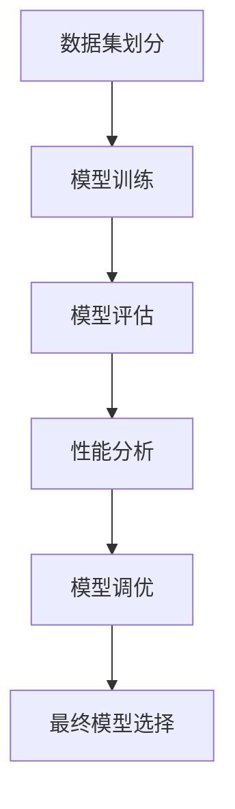

# 模型评估与性能度量原理与代码实战案例讲解

## 1.背景介绍

在机器学习和深度学习的领域中,模型评估和性能度量是至关重要的环节。它们提供了衡量模型质量和性能的标准,有助于选择最优模型、调整超参数,并确保模型能够很好地解决实际问题。随着人工智能技术的不断发展,模型评估和性能度量也在不断演进,以满足更复杂任务的需求。

本文将深入探讨模型评估和性能度量的原理,介绍常用的评估指标及其应用场景,并通过代码实战案例进行详细讲解。无论您是数据科学家、机器学习工程师,还是对该领域感兴趣的开发者,本文都将为您提供全面的理解和实践指导。

## 2.核心概念与联系

在开始之前,我们先来了解一些核心概念及它们之间的关系:

### 2.1 训练集、验证集和测试集

- **训练集(Training Set)**: 用于训练模型的数据集。
- **验证集(Validation Set)**: 在训练过程中,用于评估模型性能、调整超参数的数据集。
- **测试集(Test Set)**: 在模型训练完成后,用于评估模型在未知数据上的真实性能的数据集。

将数据集合理划分为这三个部分是模型评估的基础。通常,我们会在训练集上训练模型,在验证集上评估模型性能并进行调优,最后在测试集上获取模型的真实表现。

### 2.2 监督学习与非监督学习

- **监督学习(Supervised Learning)**: 输入数据和期望输出之间存在映射关系,模型的目标是学习这种映射关系。常见任务包括分类和回归。
- **非监督学习(Unsupervised Learning)**: 输入数据没有对应的期望输出,模型的目标是从数据中发现内在结构或模式。常见任务包括聚类和降维。

评估指标的选择与学习任务的类型密切相关。例如,对于分类任务,我们通常使用准确率、精确率、召回率等指标;对于聚类任务,则可能使用轮廓系数或 Calinski-Harabasz 指数等指标。

### 2.3 评估指标与损失函数

- **评估指标(Evaluation Metric)**: 用于衡量模型在特定任务上的性能表现。
- **损失函数(Loss Function)**: 用于度量模型预测与真实值之间的差异,是模型训练过程中优化的目标函数。

评估指标和损失函数虽然都用于衡量模型的性能,但它们的用途和计算方式不同。评估指标通常在验证集和测试集上计算,用于选择最优模型;而损失函数则在训练集上计算,用于指导模型参数的更新。

## 3.核心算法原理具体操作步骤

在介绍具体的评估指标之前,我们先来了解一下模型评估的一般流程:



1. **数据集划分**: 将原始数据集划分为训练集、验证集和测试集。
2. **模型训练**: 使用训练集训练模型,可能需要多次迭代。
3. **模型评估**: 在验证集上评估模型性能,计算评估指标。
4. **性能分析**: 分析评估指标,了解模型的优缺点。
5. **模型调优**: 根据性能分析结果,调整模型超参数或特征工程,重新训练模型。
6. **最终模型选择**: 在测试集上评估调优后的模型,选择性能最佳的模型作为最终模型。

需要注意的是,在整个过程中,测试集只用于最终模型的评估,不应参与任何训练或调优过程,以确保评估结果的客观性。

## 4.数学模型和公式详细讲解举例说明

接下来,我们将介绍一些常用的评估指标,并详细讲解它们的数学模型和公式。

### 4.1 分类任务评估指标

对于分类任务,我们通常使用以下指标进行评估:

#### 4.1.1 准确率(Accuracy)

准确率是最直观的评估指标,它表示模型预测正确的样本数占总样本数的比例。

$$Accuracy = \frac{TP + TN}{TP + TN + FP + FN}$$

其中:
- $TP$ (True Positive) 表示真正例,即正确预测为正类的样本数。
- $TN$ (True Negative) 表示真负例,即正确预测为负类的样本数。
- $FP$ (False Positive) 表示假正例,即错误预测为正类的样本数。
- $FN$ (False Negative) 表示假负例,即错误预测为负类的样本数。

准确率是一个直观的指标,但在类别分布不均衡的情况下,它可能会产生误导。例如,如果99%的样本都属于负类,一个始终预测负类的模型也会获得99%的准确率,但实际上它对正类样本的预测能力非常差。

#### 4.1.2 精确率(Precision)和召回率(Recall)

为了更全面地评估模型的性能,我们引入了精确率和召回率这两个指标。

$$Precision = \frac{TP}{TP + FP}$$

$$Recall = \frac{TP}{TP + FN}$$

- **精确率**表示被预测为正类的样本中,真正为正类的比例。
- **召回率**表示真正为正类的样本中,被正确预测为正类的比例。

通常,我们希望模型的精确率和召回率都较高。但在实际应用中,它们往往存在权衡关系,需要根据具体任务的需求进行平衡。例如,在垃圾邮件检测任务中,我们更希望提高精确率,以避免将正常邮件误判为垃圾邮件;而在疾病筛查任务中,我们更希望提高召回率,以减少漏诊的风险。

#### 4.1.3 F1分数(F1 Score)

F1分数是精确率和召回率的调和平均值,它综合考虑了两者,是一种常用的评估指标。

$$F1 = 2 \times \frac{Precision \times Recall}{Precision + Recall}$$

F1分数的取值范围为[0, 1],值越高,模型的性能越好。当精确率和召回率不平衡时,F1分数可以更好地反映模型的整体表现。

#### 4.1.4 ROC曲线和AUC

ROC (Receiver Operating Characteristic) 曲线是一种可视化工具,用于评估二分类模型在不同阈值下的性能。它绘制了真正例率(TPR)和假正例率(FPR)之间的关系曲线。

$$TPR = \frac{TP}{TP + FN}$$

$$FPR = \frac{FP}{FP + TN}$$

AUC (Area Under the Curve) 是ROC曲线下的面积,它综合考虑了不同阈值下的性能,是一种常用的评估指标。AUC的取值范围为[0, 1],值越接近1,模型的性能越好。

ROC曲线和AUC不仅适用于二分类任务,也可以推广到多分类任务。在多分类情况下,我们通常采用"一对其余"(One vs Rest)的策略,将多分类问题转化为多个二分类问题,然后计算每个二分类问题的ROC曲线和AUC,最后取平均值作为整体评估指标。

### 4.2 回归任务评估指标

对于回归任务,我们通常使用以下指标进行评估:

#### 4.2.1 均方误差(Mean Squared Error, MSE)

均方误差是一种常用的回归任务评估指标,它衡量预测值与真实值之间的平方差的均值。

$$MSE = \frac{1}{n} \sum_{i=1}^{n} (y_i - \hat{y}_i)^2$$

其中:
- $n$ 是样本数量。
- $y_i$ 是第 $i$ 个样本的真实值。
- $\hat{y}_i$ 是第 $i$ 个样本的预测值。

均方误差对异常值非常敏感,因为它对误差进行了平方处理。因此,在存在异常值的情况下,我们可能需要考虑其他评估指标。

#### 4.2.2 平均绝对误差(Mean Absolute Error, MAE)

平均绝对误差是另一种常用的回归任务评估指标,它衡量预测值与真实值之间的绝对差的均值。

$$MAE = \frac{1}{n} \sum_{i=1}^{n} |y_i - \hat{y}_i|$$

与均方误差相比,平均绝对误差对异常值的影响较小,因为它没有进行平方处理。在某些应用场景下,平均绝对误差可能更适合作为评估指标。

#### 4.2.3 决定系数(Coefficient of Determination, R^2)

决定系数是一种衡量模型拟合程度的指标,它表示模型预测值与真实值之间的差异占总体差异的比例。

$$R^2 = 1 - \frac{\sum_{i=1}^{n} (y_i - \hat{y}_i)^2}{\sum_{i=1}^{n} (y_i - \bar{y})^2}$$

其中:
- $\bar{y}$ 是真实值的均值。

决定系数的取值范围为[0, 1],值越接近1,表示模型拟合程度越好。需要注意的是,决定系数对异常值非常敏感,因此在存在异常值的情况下,它可能不是一个可靠的评估指标。

## 5.项目实践:代码实例和详细解释说明

理论知识有了一定的了解之后,我们来看一些代码实例,以加深对模型评估和性能度量的理解。我们将使用Python中的scikit-learn库进行代码演示。

### 5.1 分类任务评估示例

```python
from sklearn.datasets import make_classification
from sklearn.linear_model import LogisticRegression
from sklearn.model_selection import train_test_split
from sklearn.metrics import accuracy_score, precision_score, recall_score, f1_score, roc_auc_score

# 生成模拟数据
X, y = make_classification(n_samples=1000, n_features=10, n_informative=5, random_state=42)

# 划分训练集和测试集
X_train, X_test, y_train, y_test = train_test_split(X, y, test_size=0.2, random_state=42)

# 训练逻辑回归模型
model = LogisticRegression()
model.fit(X_train, y_train)

# 在测试集上进行预测
y_pred = model.predict(X_test)

# 计算评估指标
accuracy = accuracy_score(y_test, y_pred)
precision = precision_score(y_test, y_pred)
recall = recall_score(y_test, y_pred)
f1 = f1_score(y_test, y_pred)
auc = roc_auc_score(y_test, model.predict_proba(X_test)[:, 1])

print(f"Accuracy: {accuracy:.3f}")
print(f"Precision: {precision:.3f}")
print(f"Recall: {recall:.3f}")
print(f"F1 Score: {f1:.3f}")
print(f"AUC: {auc:.3f}")
```

在这个示例中,我们首先生成了一个模拟的二分类数据集。然后,我们将数据集划分为训练集和测试集,并使用逻辑回归模型进行训练。

接下来,我们在测试集上进行预测,并计算了准确率、精确率、召回率、F1分数和AUC等评估指标。最后,我们打印出这些指标的值。

通过这个示例,您可以了解如何使用scikit-learn库计算各种评估指标,并将其应用于实际的分类任务中。

### 5.2 回归任务评估示例

```python
from sklearn.datasets import make_regression
from sklearn.linear_model import LinearRegression
from sklearn.model_selection import train_test_split
from sklearn.metrics import mean_squared_error, mean_absolute_error, r2_score

# 生成模拟数据
X, y = make_regression(n_samples=1000, n_features=10, n_informative=5, random_state=42)

# 划分训练集和测试集
X_train, X_test, y_train, y_test = train_test_split(X, y, test_size=0.2, random_state=42)

# 训练线性回归模型
model = LinearRegression()
model.fit(X_train, y_train)

# 在测试集上进行预测
y_pred = model.predict(X_test)

# 计算评估指标
mse = mean_squared_error(y_test, y_pred)